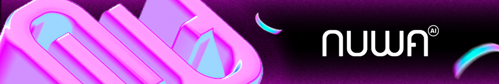

## 🧠 What is Nuwa?
Nuwa is an AI platform where users pay directly to the developers who contributes AI models and agents. Payments use cryptos secured by blockchain. User data and authentications are based on Decentralized Identity (DID).

Our goal is to offer less friction to users and enhance their daily AI life, as well as bring more reach and direct monetization for you and your AI dev fellas.

## 🚀 Why Nuwa?
Today’s internet is app-centric:
- **Fragmented**: Tasks span dozens of apps and interfaces. Nothing shares memory. Users juggle logins, permissions, and context — even across AI tools.
- **Repetitive**: The same intent must be re-entered across tools. Planning a trip? You’ll repeat yourself to calendars, search engines, emails, and maps — even if you’re using different AIs for each.
- **Inefficient**: Switching between interfaces, navigating UIs, and stitching together workflows burns time and attention. Even with today’s powerful AI, users are stuck managing multiple assistants with no shared state or coordination.

Nuwa flips the model: agent-first, protocol-powered, and user-aligned.
- **For users**: One client for all AI agents and models.
- **For developers**: Wrap your tools or service into a Cap, and earn directly from user — no intermediary.
- **For the ecosystem**: Open, interoperable, and trust-aligned.

## 🔧 Core Components

** 💻 Nuwa Client**
An AI Chat client that the user preserves all data and consume AI services with Decentralized Identity (DID) based authentication and cryptocurreny based payment.

** 🧰 Nuwa Kit**
A set of toolings for developers to build and launch AI models and agents into Caps (i.e. capabilities), a simple abstraction consisted of Model, Prompt and MCPs.

## 📂 Repository Structure

This repository is a monorepo containing various components of the Nuwa Protocol. Here's a brief overview of the key directories:

*   **`nips/`**: [Nuwa Improvement Proposals](nips/README.md). This is where the design and specification of the Nuwa protocol and its core components are discussed and documented.
*   **`contracts/`**: Contains information and potentially ABIs related to Nuwa smart contracts.
*   **`nuwa-client/`**: The Nuwa client agent implementation.
*   **`nuwa-kit/`**: [Development Kits](./nuwa-kit/README.md) for building applications and services on Nuwa. This includes client SDKs and service development frameworks for various languages (e.g., TypeScript, Python).
*   **`nuwa-services/`**: Reference implementations of key [Nuwa Services](./nuwa-services/README.md) (e.g., Custodian Service, LLM Proxy Service).
*   **`website/`**: Websites for Nuwa AI docs and landing page and stuff.
*   **`archives/`**: Some early experiments. Feel free to explore.

Please refer to the `README.md` file within each directory for more specific details.

## 🤝 How to Contribute

We warmly welcome contributions to the Nuwa Protocol! Whether you're interested in contributing to the core protocol, developing new Caps, improving SDKs, or helping with documentation, your input is valuable.

To get started, please read our **[Contributing Guidelines (CONTRIBUTING.md)](./CONTRIBUTING.md)**.

This document provides detailed information on:
- How to report bugs and suggest enhancements.
- The process for submitting pull requests.
- Development setup and coding guidelines.
- The Nuwa Improvement Proposal (NIP) process for significant changes.

You can find open issues suitable for new contributors by looking for the [good first issue](https://github.com/rooch-network/nuwa/labels/good%20first%20issue) or [help wanted](https://github.com/rooch-network/nuwa/labels/help%20wanted) labels in our GitHub issues.

## 🗣️ License
MIT — because open infrastructure should stay open.

