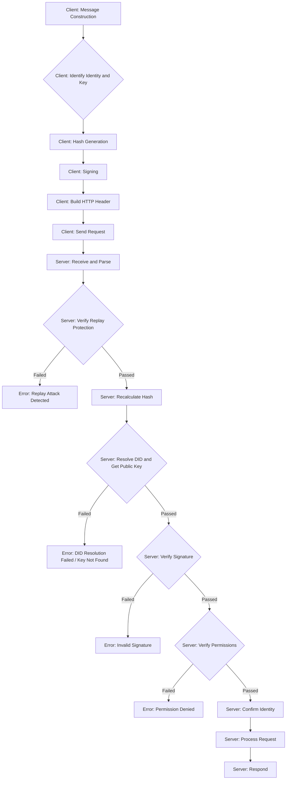

# NIP-2: DID-Based A2A Authentication


**Related:** NIP-1 (DID Key Model)

## Abstract

This specification defines a decentralized authentication protocol based on NIP-1 DIDs for A2A (Agent-to-Agent) communication. It leverages keys and verification relationships registered in the DID document to prove message origin and ensure integrity. Authentication information is conveyed via a custom HTTP header, associating the request directly with the originating Agent's DID and key, consistent with HTTP semantics for client authentication.

## Motivation

To align with the unified DID model proposed in NIP-1, where a DID and its associated keys represent the Agent instance itself, A2A communication requires a standardized authentication mechanism placed appropriately within the HTTP request structure. Placing DID-based authentication in the HTTP header aligns with standard practices for client authentication while ensuring message integrity for the A2A payload.

## Protocol Details

### HTTP Header for Authentication

A custom HTTP header named `X-DID-Signature` is used to convey the authentication credentials.

The value of the `X-DID-Signature` header **must** be the **Base64 Encoding** (using the URL and Filename Safe Alphabet, often referred to as "base64url") of a UTF-8 encoded JSON string. The decoded JSON string has the following structure:

```json
{
  "signer_did": "did:rooch:...",       // DID of the initiating Agent
  "key_id": "did:rooch:...#key-id", // Full key ID used for signing (verificationMethod id)
  "signature_value": "..."          // Signature (Base64 or Hex encoded)
}
```

### Signed Content

The `signature_value` within the `X-DID-Signature` header is calculated over the hash of the **entire JSON-RPC request body** relevant to the A2A message, specifically the `params` object of the `tasks/send` method (which contains the `message.parts`).

**Hashing Process:**
`hash = SHA256(domainSeparator + JSON.stringify(message.parts))`
*   `domainSeparator`: A string that clearly identifies this protocol and version, e.g., `"NUWA_A2A_AUTH_V1:"`.
*   `message.parts`: The JSON object containing the A2A message content, including `timestamp` and `nonce`, found within the JSON-RPC request body (e.g., `params.message.parts` for `tasks/send`).

## Authentication Flow




1.  **Message Construction (Client):** The requesting Agent (Client) constructs the A2A `message.parts` object. This object **must** include `timestamp` (Unix timestamp, seconds) and `nonce` (unique random string) to prevent replay attacks.
2.  **Identify Identity and Key (Client):** The Client determines its identity `signer_did` (e.g., `did:rooch:alice`) and the key `key_id` (e.g., `did:rooch:alice#device-key-1`) to be used for signing. This key must be registered in the `signer_did`'s DID document and possess appropriate permissions (e.g., `authentication` or `capabilityInvocation`).
3.  **Hash Generation (Client):** The Client calculates the hash of the `message.parts`: `hash = SHA256(domainSeparator + JSON.stringify(message.parts))`.
4.  **Signing (Client):** The Client signs the `hash` using the private key corresponding to `key_id` to generate the `signature_value`.
5.  **Build HTTP Header (Client):** The Client constructs the JSON object containing `signer_did`, `key_id`, and the `signature_value`. It then serializes this object to a UTF-8 JSON string and **encodes this string using Base64url** to get the final header value.
6.  **Send Request (Client):** The Client sends the HTTP POST request to the Server Agent's endpoint. The request includes:
    *   The `X-DID-Signature` header containing the Base64url encoded string.
    *   The JSON-RPC request body containing the method (e.g., `tasks/send`) and `params` (which includes the `message.parts` object).
7.  **Receive and Parse (Server):** The Server receives the HTTP request.
    *   It extracts the Base64url encoded string from the `X-DID-Signature` header.
    *   It **decodes the Base64url string** to get the UTF-8 JSON string.
    *   It **parses the JSON string** to get `signer_did`, `key_id`, `signature_value`.
    *   It parses the JSON-RPC request body to get the `message.parts` object.
8.  **Verify Replay Protection (Server):**
    *   Extract `timestamp` and `nonce` from the received `message.parts`.
    *   Verify that `timestamp` is within an acceptable time window.
    *   Verify that `nonce` has not been previously used by `signer_did` (requires stateful storage).
9.  **Recalculate Hash (Server):** Recalculate `hashToVerify = SHA256(domainSeparator + JSON.stringify(message.parts))` using the same `domainSeparator` and the received `message.parts`.
10. **Resolve DID and Get Public Key (Server):**
    *   Use a DID resolver to resolve `signer_did` and obtain its DID document.
    *   Find the entry in the `verificationMethod` list of the DID document where `id` matches `key_id`. If not found, verification fails.
    *   Extract the public key information (e.g., `publicKeyHex`, `publicKeyMultibase`) from the found `verificationMethod`.
11. **Verify Signature (Server):**
    *   Use the public key obtained from the DID document and the calculated `hashToVerify` to verify the `signature_value`. If the signature is invalid, verification fails.
12. **Verify Permissions (Server):**
    *   Check if `key_id` is present in the `authentication` verification relationship list within the `signer_did`'s DID document. For Agent-to-Agent communication where the key represents the agent, `authentication` is typically the correct relationship to check. If the `key_id` is not in the `authentication` list, verification fails.
13. **Confirm Identity (Server):** If all verification steps (replay protection, signature, permissions) pass, authentication is successful. The requesting Agent's identity is confirmed as `signer_did`, acting via `key_id`.
14. **Process Request (Server):** The Server processes the request in the JSON-RPC body based on the verified Agent identity (`signer_did`).
15. **Respond (Server):** The Server returns an HTTP response (containing the JSON-RPC response).


## Identity Representation

After successful verification, the identity confirmed by the Server is the `signer_did` (representing the Agent instance) declared in the `X-DID-Signature` header.

## Error Codes

Failures during the authentication steps (parsing header, replay check, DID resolution, signature/permission verification) should result in appropriate HTTP error responses (e.g., `401 Unauthorized` or `400 Bad Request`) potentially with a JSON body detailing the specific NIP-2 error.

*   **DID Resolution Failed**: Could not resolve `signer_did` or fetch the DID document.
*   **Key Not Found**: `key_id` not found in the DID document.
*   **Permission Denied**: `key_id` not present in the required verification relationship (`authentication`).
*   **Invalid Signature**: Signature verification failed.
*   **Replay Attack Detected**: `nonce` reused or invalid `timestamp`.
*   **Invalid Header Format**: `X-DID-Signature` header is missing, malformed, or fails Base64url decoding or subsequent JSON parsing.

## Security Considerations

*   **Inherited from NIP-1:** The security of this protocol heavily relies on the security of the DID method, master key management, device key registration/revocation, and DID document update processes defined in NIP-1.
*   **Replay Attacks:** Validation of `timestamp` and `nonce` within the signed `message.parts` is critical. Servers must maintain stateful nonce storage keyed by `signer_did`.
*   **Transport Security:** Communication **must** use TLS/HTTPS to protect the confidentiality and integrity of the request/response, including the header.
*   **DID Resolver Security:** Servers must use a trusted DID resolver.
*   **Verification Relationship Check:** Servers **must** check that the signing key (`key_id`) is present in the appropriate verification relationship (usually `authentication`).
*   **Domain Separator:** The `domainSeparator` prevents signatures from being misused.
*   **Header Integrity:** While TLS protects against eavesdropping, ensure server-side infrastructure (proxies, gateways) does not unintentionally modify or strip the `X-DID-Signature` header.
*   **Signature covers Body:** Clearly specify and enforce that the signature in the header covers the relevant parts of the message body. Mismatches lead to security failures.

## Protocol Identifier

Within the `authentication` field of an A2A message, the authentication scheme defined by this protocol should use the following identifier:

*   `did-auth-v1`: Indicates authentication using NIP-1 DIDs and associated keys.

## A2A AuthenticationInfo Structure

The `authentication` field in the A2A request has the following structure:

```json
{
  "schemes": ["did-auth-v1"],
  "credentials": "<json_string>"
}
```

Where `credentials` is a JSON string which, when parsed, results in:

```json
{
  "signer_did": "did:rooch:...",       // DID of the initiator
  "key_id": "did:rooch:...#key-id", // Full key ID used for signing (verificationMethod id)
  "signature_value": "..."          // Signature over the message hash (Base64 or Hex encoded)
}
```

## Identity Representation

After successful verification, the identity confirmed by the Server is the `signer_did` declared in the `credentials`.

## Error Codes

Standard JSON-RPC error codes are recommended, with specific errors defined:

*   `-32602 Invalid Params`: Request format error, missing fields, invalid `timestamp`/`nonce`, incorrect signature/public key format, etc.
*   `-32001 Invalid Credentials`:
    *   Signature verification failed.
    *   `key_id` not found in the DID document.
    *   `key_id` not present in the required verification relationship (`authentication` or `capabilityInvocation`).
*   `-32004 DID Resolution Failed`: Could not resolve `signer_did` or fetch the DID document.
*   `-32005 Replay Attack Detected`: `nonce` reused or invalid `timestamp`.
*   `-32002 Authentication Required`: Authentication information was not provided.
*   `-32003 Unsupported Scheme`: (Theoretically less common if only `did-auth-v1` is supported)

## Security Considerations

*   **Inherited from NIP-1:** The security of this protocol heavily relies on the security of the DID method, master key management, device key registration/revocation, and DID document update processes defined in NIP-1.
*   **Replay Attacks:** Validation of `timestamp` and `nonce` is critical. Servers must maintain stateful nonce storage.
*   **Transport Security:** The A2A communication channel should be protected using TLS/HTTPS.
*   **DID Resolver Security:** Servers must use a trusted DID resolver to obtain DID documents.
*   **Verification Relationship Check:** Servers **must** check that the signing key (`key_id`) is present in the appropriate verification relationship (usually `authentication`). Simply verifying the signature is insufficient. An incorrect or revoked key, even if it can successfully verify a signature, should not be accepted.
*   **Domain Separator:** The `domainSeparator` prevents signatures from being misused across different protocols or applications.

