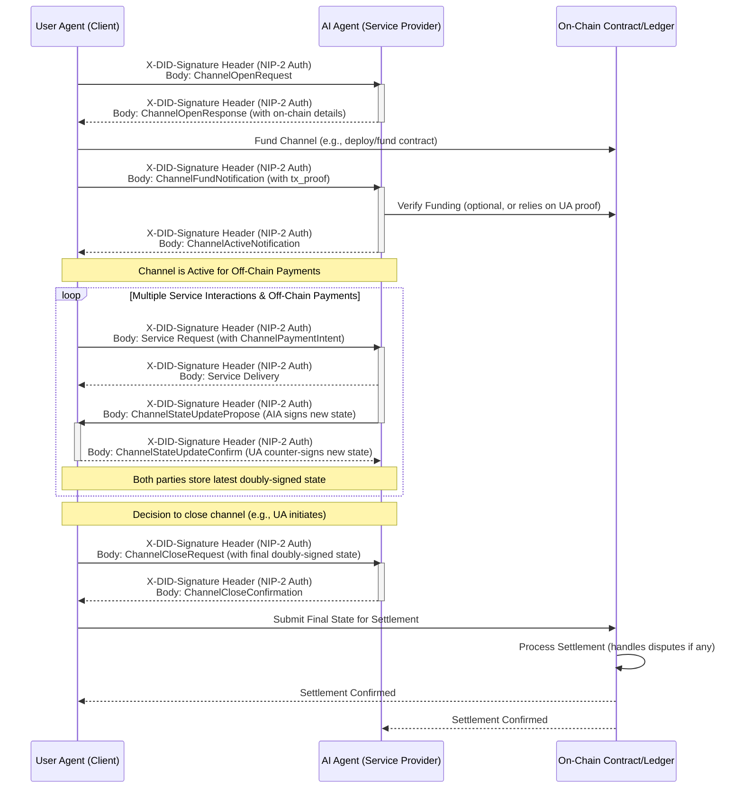

# NIP-3: A2A Agent Service Payment Protocol

## 📌 Abstract

This NIP defines a protocol for on-demand payment for services provided by AI Agents within the Nuwa ecosystem. It builds upon NIP-1 (DID Model) and NIP-2 (A2A Authentication) to enable secure and verifiable payment transactions between a User Agent (Client) and an AI Agent (Service Provider). This protocol outlines mechanisms for pre-payment per service and a state channel model for continuous/streaming payments, where the User Agent authorizes and confirms payment.

## Motivation

As AI Agents offer valuable computational services, a standardized payment mechanism is crucial for incentivizing service provision and enabling a sustainable Agent economy. This protocol aims to provide a secure, transparent, and DID-based method for User Agents to pay AI Agents for their services, ensuring that payments are tied to verifiable identities and communication is authenticated.

## 🔗 Dependencies

*   **NIP-1: Nuwa Agent Single DID Multi-Device Key Model**: Used for identifying User Agents and AI Agents, and for managing cryptographic keys involved in signing payment-related messages.
*   **NIP-2: DID-Based A2A Authentication**: Used for securing the communication channel during payment negotiation and service requests, ensuring message integrity and origin authentication.

## Protocol Details

### Roles

*   **User Agent (Client)**: The entity requesting and paying for the AI Agent's service.
*   **AI Agent (Service Provider)**: The entity providing the service and receiving payment.

### Skill Advertisement and Discovery

AI Agents offering services for payment via this NIP-3 protocol should advertise their available skills in the `skills` array of their A2A Agent Card. As per the A2A specification, each element in this array is an `AgentSkill` object. The `skill_id` used in NIP-3 messages (e.g., `ServiceQuotationRequest`) **must** correspond to the `id` field of one of the `AgentSkill` objects listed in the AI Agent's A2A Agent Card.

User Agents should fetch and inspect an AI Agent's Agent Card to discover the available skills. For each skill, the User Agent will find an `AgentSkill` object, and the value of its `id` field is what should be used as the `skill_id` in NIP-3 payment protocol messages.

For example, an AI Agent's A2A Agent Card might include a `skills` array like this:

```json
{
  // ... other standard Agent Card fields (id, name, description, capabilities, endpoints, etc.)
  "skills": [
    {
      "id": "text-generation-xl",
      "name": "Text Generation (XL Model)",
      "description": "Generates text using an extra-large language model.",
      "tags": ["text", "llm", "generation"],
      "examples": ["Write a poem about a robot learning to paint."]
    },
    {
      "id": "image-analysis-v2",
      "name": "Image Analysis Service v2",
      "description": "Analyzes images to identify objects and scenes.",
      "tags": ["image", "vision", "ai"],
      "examples": ["What objects are in this picture? {image_url_or_data}"]
    }
    // ... other AgentSkill objects
  ]
  // ...
}
```
A User Agent wishing to pay for the text generation service would use `"text-generation-xl"` as the `skill_id` in its `ServiceQuotationRequest`.

### Payment Flow Overview

The protocol supports two primary payment models:

#### 1. Pre-payment Model (Per Service)

This is the default model:

1.  **Service Discovery & Quotation Request**: User Agent discovers an AI Agent (e.g., by resolving its DID and fetching its Agent Card), identifies a desired `skill_id` from the agent's advertised skills, and requests a quotation for that specific skill.
2.  **Quotation Response**: AI Agent provides a signed quotation, including service details, price, and payment instructions.
3.  **Payment Execution & Confirmation**: User Agent executes the payment and sends a signed payment confirmation (including proof of payment) to the AI Agent.
4.  **Service Delivery**: AI Agent verifies the payment and delivers the requested service.
5.  **Receipt (Optional)**: AI Agent issues a signed receipt for the service rendered and payment received.

#### 2. State Channel Payment Model

This model is suited for frequent, low-value interactions, minimizing on-chain transactions by conducting most payment updates off-chain.

1.  **Channel Negotiation & Opening**:
    *   User Agent requests to open a payment channel via `ChannelOpenRequest`.
    *   AI Agent responds with `ChannelOpenResponse`, agreeing to terms or proposing alternatives. This includes on-chain channel contract details or multi-sig setup.
2.  **Channel Funding**:
    *   User Agent (payer) funds the channel by interacting with the agreed on-chain mechanism (e.g., deploying/funding a smart contract).
    *   User Agent sends `ChannelFundNotification` with proof of funding.
    *   AI Agent verifies funding and sends `ChannelActiveNotification` to confirm the channel is ready for off-chain transactions.
3.  **Service Consumption & Off-Chain Micro-payments**:
    *   User Agent requests a service using a standard service request, but includes a `ChannelPaymentIntent` indicating the payment will be via the channel.
    *   AI Agent delivers the service.
    *   AI Agent proposes an off-chain state update (e.g., new balances, sequence number) reflecting the payment for the service, signed by itself, via a `ChannelStateUpdatePropose` message.
    *   User Agent verifies the `ChannelStateUpdatePropose`, counter-signs it, and sends it back via `ChannelStateUpdateConfirm`. This doubly-signed state is the off-chain micro-payment. Both parties retain this latest agreed state.
4.  **Channel Top-up (Optional)**:
    *   If funds are low, the User Agent can add more funds on-chain and notify the AI Agent similarly to the initial funding.
5.  **Channel Closure & Final Settlement**:
    *   Either party can initiate closure by sending a `ChannelCloseRequest` containing the latest mutually signed channel state.
    *   The other party acknowledges with `ChannelCloseConfirmation`.
    *   The party initiating closure (or a pre-agreed party) submits the final mutually signed state to the on-chain channel contract for settlement. Dispute mechanisms (e.g., challenge periods) apply if there are disagreements or non-cooperation, relying on the on-chain contract logic.

All messages exchanged within this protocol **must** be authenticated using the A2A authentication mechanism defined in NIP-2, where the `message.parts` would contain the specific payment protocol messages defined below.

### Message Types

#### 1. `ServiceQuotationRequest` (User Agent -> AI Agent)

*   **Purpose**: To request a price quotation for a specific skill.
*   **Structure** (`message.parts` content):
    ```json
    {
      "type": "ServiceQuotationRequest",
      "skill_id": "unique_identifier_for_the_skill", // E.g., "text-generation-xl", "image-analysis-v2", corresponding to an entry in the Agent's A2A Agent Card skills array
      "request_details": { ... } // Specific parameters for the skill
    }
    ```

#### 2. `ServiceQuotationResponse` (AI Agent -> User Agent)

*   **Purpose**: To provide a quotation for the requested skill. This message **must** be signed by the AI Agent's DID key.
*   **Structure** (`message.parts` content):
    ```json
    {
      "type": "ServiceQuotationResponse",
      "skill_id": "unique_identifier_for_the_skill",
      "quotation_id": "unique_identifier_for_this_quotation", // Generated by AI Agent
      "price": {
        "amount": "100", // Amount as a string to avoid precision issues
        "currency": "0x3::gas_coin::RGas" // Or other supported currency/token identifier
      },
      "payment_instructions": {
        "method": "on_chain_transfer", // e.g., "on_chain_transfer", "lightning_invoice"
        "address": "rooch_address_of_ai_agent", // If applicable
        "network_id": "rooch_mainnet", // If applicable
        "memo_required": false // Optional: if a memo is needed for the transaction
      },
      "expires_at": "timestamp_unix_epoch", // Quotation validity
      "state_channel_terms": { // Optional: If state channel payment is supported
        "supported": true,
        "supported_currencies": ["0x3::gas_coin::RGas"],
        "min_initial_funding": {"amount": "500", "currency": "0x3::gas_coin::RGas"},
        "on_chain_settlement_system": "RoochFrameworkChannelV1", // Identifier for the type of on-chain contract/system
        "challenge_period_duration": "PT1H" // ISO 8601 duration, e.g., 1 hour for disputes
      }
    }
    ```

#### 3. `PaymentConfirmation` (User Agent -> AI Agent)

*   **Purpose**: To confirm that payment has been made. This message **must** be signed by the User Agent's DID key.
*   **Structure** (`message.parts` content):
    ```json
    {
      "type": "PaymentConfirmation",
      "quotation_id": "unique_identifier_for_this_quotation", // For single pre-payment
      "payment_proof": {
        "transaction_hash": "0x...", // For on-chain payments
        "proof_details": { ... } // Other forms of proof if applicable
      }
    }
    ```

#### 4. `ServiceDeliveryNotification` (AI Agent -> User Agent)

*   **Purpose**: To notify the User Agent that the service is being delivered or to include the service output directly if small. This message **must** be signed by the AI Agent's DID key.
*   **Structure** (`message.parts` content):
    ```json
    {
      "type": "ServiceDeliveryNotification",
      "quotation_id": "unique_identifier_for_this_quotation",
      "status": "success", // or "failure" with an error message
      "service_output": { ... } // Actual service output or a reference to it
    }
    ```

#### 5. `PaymentReceipt` (AI Agent -> User Agent, Optional)

*   **Purpose**: To provide a formal receipt for the payment and service. This message **must** be signed by the AI Agent's DID key.
*   **Structure** (`message.parts` content):
    ```json
    {
      "type": "PaymentReceipt",
      "quotation_id": "unique_identifier_for_this_quotation", // If for single pre-payment
      "payer_did": "did:rooch:user_agent_did",
      "payee_did": "did:rooch:ai_agent_did",
      "amount_paid": {
        "amount": "100",
        "currency": "0x3::gas_coin::RGas"
      },
      "service_description": "Description of single service rendered",
      "transaction_date": "timestamp_unix_epoch"
    }
    ```

#### 6. `ChannelOpenRequest` (User Agent -> AI Agent, for State Channel Model)

*   **Purpose**: User Agent proposes to open a payment channel.
*   **Structure** (`message.parts` content):
    ```json
    {
      "type": "ChannelOpenRequest",
      "proposed_channel_id": "unique_proposed_id_by_ua", // Temporary ID for negotiation
      "payer_did": "did:rooch:user_agent_did",
      "payee_did": "did:rooch:ai_agent_did",
      "initial_funding_amount": { "amount": "1000", "currency": "0x3::gas_coin::RGas" },
      "requested_on_chain_system": "RoochFrameworkChannelV1" // Optional: UA preference
    }
    ```

#### 7. `ChannelOpenResponse` (AI Agent -> User Agent, for State Channel Model)

*   **Purpose**: AI Agent responds to the channel open request.
*   **Structure** (`message.parts` content):
    ```json
    {
      "type": "ChannelOpenResponse",
      "proposed_channel_id": "unique_proposed_id_by_ua", // From request
      "channel_id": "confirmed_channel_id_by_aia", // AIA confirms or assigns a new persistent ID
      "status": "accepted" | "rejected" | "alternative_proposed",
      "payer_did": "did:rooch:user_agent_did",
      "payee_did": "did:rooch:ai_agent_did",
      "agreed_funding_amount": { "amount": "1000", "currency": "0x3::gas_coin::RGas" }, // Can be different if negotiated
      "on_chain_details": { // Details for on-chain interaction
        "system_type": "RoochFrameworkChannelV1",
        "contract_address": "0x_channel_contract_address_or_template", // Address of the specific channel contract or factory
        "payee_on_chain_address": "rooch_address_for_aia_in_channel"
      },
      "rejection_reason": "...", // If rejected
      "alternative_terms": { ... } // If alternative proposed
    }
    ```

#### 8. `ChannelFundNotification` (User Agent -> AI Agent, for State Channel Model)

*   **Purpose**: User Agent notifies that it has funded its side of the channel.
*   **Structure** (`message.parts` content):
    ```json
    {
      "type": "ChannelFundNotification",
      "channel_id": "confirmed_channel_id_by_aia",
      "funding_transaction_proof": {
        "transaction_hash": "0x_funding_tx_hash",
        "network_id": "rooch_mainnet"
      },
      "funded_amount": { "amount": "1000", "currency": "0x3::gas_coin::RGas" }
    }
    ```

#### 9. `ChannelActiveNotification` (AI Agent -> User Agent, for State Channel Model)

*   **Purpose**: AI Agent confirms channel funding verification and channel activation.
*   **Structure** (`message.parts` content):
    ```json
    {
      "type": "ChannelActiveNotification",
      "channel_id": "confirmed_channel_id_by_aia",
      "status": "active" | "funding_issue",
      "message": "Channel is now active." // Or error message
    }
    ```
#### 10. `ChannelPaymentIntent` (Embedded in User Agent's service request)

*   **Purpose**: To indicate that the payment for this service request will be handled via an existing state channel. This is not a standalone message but part of the service request payload sent to the AI agent.
*   **Structure** (example, actual structure depends on the agent's service API):
    ```json
    // Inside the AI Agent's specific service request's params:
    "payment_method_preference": {
      "type": "state_channel",
      "channel_id": "confirmed_channel_id_by_aia"
    }
    ```

#### 11. `ChannelStateUpdatePropose` (AI Agent -> User Agent, for State Channel Model)

*   **Purpose**: AI Agent proposes an off-chain state update after service delivery.
*   **Structure** (`message.parts` content):
    ```json
    {
      "type": "ChannelStateUpdatePropose",
      "channel_id": "confirmed_channel_id_by_aia",
      "sequence_number": 123, // Monotonically increasing
      "balances": {
        "user_agent_balance": "990", // Remaining balance for UA
        "ai_agent_earned": "10"      // Amount earned by AIA in this update
      },
      "skill_reference_id": "id_of_skill_just_rendered", // Optional: references the skill_id or a more specific instance
      "signature_aia": "signature_of_hash(channel_id, sequence_number, balances)_by_aia"
    }
    ```

#### 12. `ChannelStateUpdateConfirm` (User Agent -> AI Agent, for State Channel Model)

*   **Purpose**: User Agent confirms and counter-signs the state update.
*   **Structure** (`message.parts` content):
    ```json
    {
      "type": "ChannelStateUpdateConfirm",
      "channel_id": "confirmed_channel_id_by_aia",
      "sequence_number": 123, // Must match proposal
      "balances": { // Must match proposal
        "user_agent_balance": "990",
        "ai_agent_earned": "10"
      },
      "signature_ua": "signature_of_hash(channel_id, sequence_number, balances)_by_ua"
      // The AI Agent now has a doubly-signed state (its own from proposal + this one)
    }
    ```

#### 13. `ChannelCloseRequest` (Either Agent -> Other Agent, for State Channel Model)

*   **Purpose**: To initiate the closure of the payment channel.
*   **Structure** (`message.parts` content):
    ```json
    {
      "type": "ChannelCloseRequest",
      "channel_id": "confirmed_channel_id_by_aia",
      "final_signed_state": { // The latest mutually agreed and signed state
        "sequence_number": 150,
        "balances": {
          "user_agent_balance": "850",
          "ai_agent_earned": "150"
        },
        "signature_ua": "...",
        "signature_aia": "..."
      },
      "reason": "User request" // Optional
    }
    ```

#### 14. `ChannelCloseConfirmation` (Other Agent -> Initiator, for State Channel Model)

*   **Purpose**: To acknowledge the channel close request.
*   **Structure** (`message.parts` content):
    ```json
    {
      "type": "ChannelCloseConfirmation",
      "channel_id": "confirmed_channel_id_by_aia",
      "status": "acknowledged" | "disputed",
      "message": "Acknowledged. Proceeding with on-chain settlement." // Or dispute reason
    }
    ```

### Detailed Flow with A2A Authentication

#### Pre-payment Model Flow


#### State Channel Payment Model Flow


### Security Considerations

*   **Authentication**: All payment protocol messages are wrapped within the A2A communication framework (NIP-2), ensuring that both the User Agent and AI Agent can verify the authenticity and integrity of messages.
*   **Replay Attacks**: The `nonce` and `timestamp` mechanisms in NIP-2 protect against replay attacks for the payment messages themselves. Quotation IDs should be unique to prevent replay of old quotations. Payment confirmations should reference unique quotation IDs.
*   **Payment Verification**: AI Agents are responsible for robustly verifying the `payment_proof` (e.g., confirming transaction finality on the blockchain) before delivering the service.
*   **Dispute Resolution**: This initial version does not define a formal dispute resolution mechanism. Future versions may incorporate escrow mechanisms or integration with reputation systems.
*   **Price Fluctuation**: For volatile cryptocurrencies, the `expires_at` field in `ServiceQuotationResponse` is crucial.
*   **State Channel Security**:
    *   **Liveness**: Participants must be online to process state updates and respond to closure requests. On-chain mechanisms are needed to handle unresponsive parties (e.g., allowing unilateral closure with the latest signed state after a challenge period).
    *   **Funding & Settlement Security**: Relies on the security of the underlying blockchain and the correctness of the channel smart contract.

### Payment Methods

This protocol is designed to be extensible to various payment methods. The initial focus is on on-chain transactions (e.g., Rooch Network tokens). Other methods like Layer-2 payments (Lightning Network) or even traditional payment gateways (with appropriate tokenization of proof) could be integrated by defining new `payment_instructions` and `payment_proof` structures.

## 🚀 Future Considerations

*   **Atomic Swaps/Escrow**: For more trustless interactions, integrating atomic swaps or smart contract-based escrow mechanisms could ensure that payment is only released upon successful service delivery.
*   **Subscription Models**: Extending the protocol to support recurring payments for ongoing services.
*   **Usage-Based Billing**: More granular billing based on actual resource consumption (e.g., tokens processed, CPU time).
*   **Decentralized Payment Processors**: Integration with decentralized payment processing services.
*   **Reputation System**: Linking payment success/failure and service quality to a decentralized reputation system for Agents.

This NIP provides a foundational layer for A2A payments. Further enhancements and specific payment method integrations can be proposed in subsequent NIPs or extensions.
