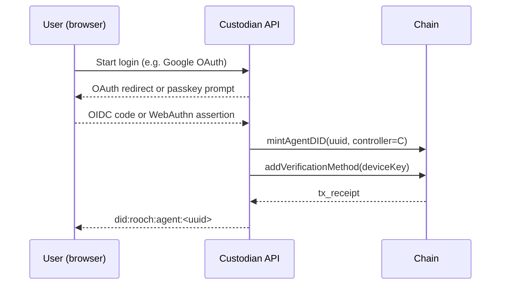

# 0 Summary

*NIP-9* specifies a **Custodian Registry** smart-contract interface and an off-chain **Delegated-Control Protocol** that allow Web2 users to create Nuwa Agent DIDs without holding a wallet. A *Custodian* is an on-chain-registered service that temporarily controls the `controller` field of a freshly minted Agent DID and offers one or more Web2 authentication methods (e.g. Google OAuth, Passkey).  
Users may later replace the custodian with another service or with their own wallet via a single DID-document update.

---

# 1 Motivation

| Pain point | Effect | Solution offered by NIP-9 |
|------------|--------|---------------------------|
| Web2 users have **no crypto wallet** | Cannot sign the on-chain DID-creation tx | Custodian does it on their behalf |
| Ecosystem needs **multiple custodians** | Avoid vendor lock-in | Registry contract lists and ranks custodians |
| Users need to **migrate** later | Maintain DID continuity | `controller` field can be switched in one tx |

---

# 2 Custodian Registry (on-chain)

## 2.1 Data structure

```move
struct CustodianMeta has key {
    id:              u64,
    name:            vector<u8>,
    url:             vector<u8>,      // HTTPS base URL
    public_key:      vector<u8>,      // Controller pub-key fingerprint
    auth_methods:    vector<u16>,     // Web2 login codes (see § 2.4)
    active:          bool,
    deposit:         u64              // Stake in native token
}
```

### 2.2 Core entry-points

| Function                                   | Description                                       |
| ------------------------------------------ | ------------------------------------------------- |
| `register(name, url, pubkey, auth_codes)`  | Stake ≥ `MIN_DEPOSIT`, emit `CustodianRegistered` |
| `update_meta(id, new_url, new_auth_codes)` | Only callable by custodian                        |
| `deactivate(id)`                           | Voluntary quit (timelock)                         |
| `info(id)`                                 | Read-only getters                                 |

> **Gas & stake amounts** are implementation-specific and *out of scope* of this draft.

### 2.3 Events

| Event                 | Payload                     |
| --------------------- | --------------------------- |
| `CustodianRegistered` | `(id, name, auth_codes)`    |
| `CustodianUpdated`    | `(id, new_url, auth_codes)` |
| `CustodianStatus`     | `(id, active)`              |

### 2.4 `auth_methods` enumeration

| Code  | Login method     | Protocol reference |
| ----- | ---------------- | ------------------ |
| `1`   | Google OAuth     | OIDC               |
| `2`   | Twitter OAuth    | OAuth 2            |
| `3`   | Apple Sign-In    | JWT                |
| `4`   | GitHub OAuth     | OAuth 2            |
| `5`   | Email OTP        | RFC 6120           |
| `6`   | SMS OTP          | —                  |
| `7`   | WebAuthn Passkey | FIDO2              |
| `8`   | WeChat QR        | OAuth 2            |
| `9`   | Discord OAuth    | OAuth 2            |
| `10+` | *Reserved*       | Added in future versions |

---

# 3 Delegated-Control Protocol (off-chain)

## 3.1 Create Agent DID



* `deviceKey` is generated locally by the browser/SDK and **never leaves the device**.
* Custodian only holds the `controller` key.

## 3.2 Switch controller (migrate)

1. User chooses *“Self-custody”* or another custodian `C₂`.
2. Device signs migration intent `M` (`did`, new controller pubkey).
3. New custodian (or user wallet) submits `updateController(did, new_controller_pubkey)` on-chain.
4. Front-ends refresh DID cache after `ControllerChanged` event.

---

# 4 Security Considerations

* **Minimal trust** Custodian controls *only* `controller` key; every A2A message is still signed by user device keys (NIP-2).
* **Key rotation & exit** Custodian must allow user-initiated controller switch at any time.
* **Sybil / spam** Registry demands deposit; malicious or abandoned custodians can be de-activated by governance and forfeit stake.
* **Privacy** Auth method disclosure on-chain is limited to numeric codes; no PII stored.

---

# 5 Backward Compatibility

* NIP-2 (DID-Based A2A Auth) continues to resolve the signer DID and verificationMethod exactly as before.
* Existing self-custody agents remain valid; their `controller` field is empty or self-referential.

---

# 6 References

1. **DID Core 1.0**, W3C Recommendation
2. **OpenID Connect Core 1.0**
3. **WebAuthn Level 2**, W3C Recommendation

> *This draft purposefully omits gas-relay, fee, and SLA mechanics to keep the minimal viable protocol focused on **custodian discovery and Web2 authentication capability declaration**. Such extensions can be proposed in follow-up NIPs.*