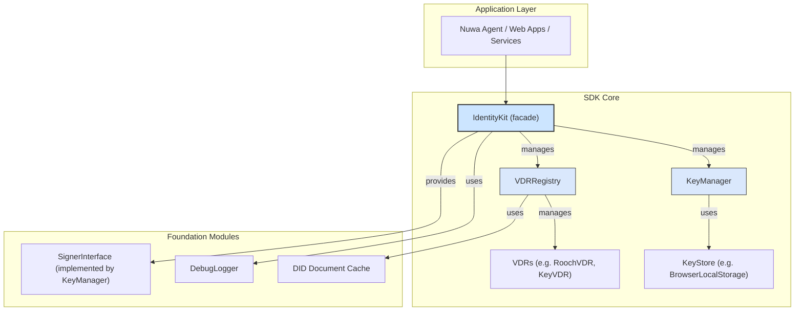

# Identity Kit: Design & Development Guide

> **Target Audience**: Future contributors and maintainers of `identity-kit`.
> **Purpose**: This document explains the core design philosophy, architecture, key modules, and the integration points with the Nuwa protocol (notably NIP-1 and NIP-2) for `@nuwa-ai/identity-kit`.

---

## 1. Core Design Philosophy

`identity-kit` is the canonical identity layer implementation of the Nuwa protocol for TypeScript runtimes. Its primary goal is to deliver a complete, developer-friendly, and secure decentralized identity (DID) management & authentication toolkit for upper-layer applications such as Nuwa Agent, web front-ends, and backend services.

Design principles:

* **NIP-1 Compliance** – Fully aligned with [NIP-1: Agent Single DID / Multi-Key Model](https://github.com/nuwa-protocol/NIPs/blob/main/nips/nip-1.md). Core features (master key, operational keys, DID Document construction & parsing) revolve around the concepts defined in NIP-1.
* **NIP-2 Enablement** – Provides the cryptographic building blocks required by [NIP-2: DID-based Authentication Protocol](https://github.com/nuwa-protocol/NIPs/blob/main/nips/nip-2.md). The SDK does **not** enforce any specific authentication flow, but ships signature / verification utilities developers can freely compose.
* **Out of the Box** – A single `IdentityKit.bootstrap()` or `IdentityEnvBuilder` call assembles all dependencies (KeyStore, Signer, VDR, …) so developers can focus on business logic.
* **Modular & Extensible** – Core components (`VDR`, `KeyStore`, …) are pluggable interfaces. The community can add new DID methods or storage back-ends without touching core logic.
* **Secure by Default** – APIs favor security. For example, chain-specific parameters are grouped under an `advanced` option to reduce accidental misuse.

## 2. System Architecture

The architecture is layered from bottom to top:



**Component Glossary**

* **`IdentityKit`** – Facade & primary entry-point. Combines `KeyManager` and `VDRRegistry`, exposing a concise API (`createDID()`, `sign()`, `resolveDID()`, …).
* **`KeyManager`** – Lifecycle manager for keys (generation, storage, retrieval, usage). Implements `SignerInterface` and delegates persistence to `KeyStore`.
* **`KeyStore`** – Persistence abstraction. The SDK ships a `BrowserLocalStorageKeyStore` for browsers; additional back-ends (in-memory, encrypted file, HSM, …) can be plugged in.
* **`VDRRegistry`** – Registry of DID resolvers. Automatically selects the correct `VDR` (e.g. `RoochVDR`) when resolving `did:rooch:*`.
* **`AbstractVDR`** – Base class all VDRs must extend, defining `resolve()` / `update()` contracts. Concrete implementations include `RoochVDR`, `KeyVDR`, and `WebVDR`.
* **`SignerInterface`** – Abstract signer contract implemented by `KeyManager`. Decouples signing logic from key storage.
* **DID Document Cache** – In-memory LRU cache (`InMemoryLRUDIDDocumentCache`) enabled by default inside `VDRRegistry` to reduce network requests.
* **`DebugLogger`** – Lightweight logger with build-time tree-shaking to keep production bundle size small.

## 3. Core Workflow Implementation

### 3.1 Environment Bootstrap (`IdentityKit.bootstrap` / `IdentityEnvBuilder`)

`identity-kit` follows a two-step workflow: **assemble environment ➜ bind DID**.

**Quick start – `bootstrap()`**

```ts
const env = await IdentityKit.bootstrap({
  method: 'rooch',              // Auto-register RoochVDR
  vdrOptions: { rpcUrl: '...' } // Additional VDR init params
});

// Load or create a DID
const kit = await env.loadDid(did);
```

**Advanced – `IdentityEnvBuilder`**

```ts
const env = await new IdentityEnvBuilder()
  .useVDR('rooch', { rpcUrl: '...' })
  .useKeyStore(customStore)
  .init();
```

Internal steps:
1. Builder/bootstrap registers required VDRs into the global `VDRRegistry`.
2. Creates a `KeyStore` (defaults to LocalStorage / Memory).
3. Instantiates `KeyManager` and binds it to the `KeyStore`.
4. Returns an `IdentityEnv` instance containing the `registry` & `keyManager` for subsequent `loadDid` / `createDid` operations.

### 3.2 Signing & Verification (`SignerInterface` & `auth/v1`)

This section outlines how the SDK performs signing & verification across different layers and provides common usage patterns.

#### 3.2.1 `SignerInterface` – Low-level Signing Abstraction

* **Location**: `src/signers/types.ts`. Implemented by `KeyManager`, but external wallets / HSMs can also implement it.
* **Key APIs**
  * `listKeyIds()` – list all available `keyId`s.
  * `signWithKeyId(data, keyId)` – sign a byte array with the specified key.
  * `canSignWithKeyId(keyId)` – check if a key is usable.
  * `getKeyInfo(keyId)` – return key type & public key.
* **Example**

```ts
import { Bytes } from '@nuwa-ai/identity-kit';

const payload = Bytes.stringToBytes('hello world');
const signer = kit.getSigner();              // KeyManager ⇢ SignerInterface
const keyId = (await kit.getAvailableKeyIds()).authentication?.[0];
if (!keyId) throw new Error('No auth key');
const signature = await signer.signWithKeyId(payload, keyId);
```

> **⚠️ Note** – The signature algorithm is determined by `VerificationMethod.type` referenced by `keyId`. The SDK automatically maps **algorithm → KeyType** via `algorithmToKeyType()`, no manual bookkeeping required.

#### 3.2.2 DIDAuth v1 – High-level NIP-2 Compatible Signatures

To simplify DID-based HTTP authentication ([NIP-2]), the SDK ships the `auth/v1` module encapsulating DIDAuth v1:

* `createSignature()` – Generate a signed object containing `nonce` & `timestamp`.
* `toAuthorizationHeader()` – Encode the signed object as an HTTP `Authorization` header.
* `verifySignature()` – Server-side signature validation.
* `verifyAuthHeader()` – Directly validate an `Authorization` header with replay-attack protection.

```ts
import { DIDAuth } from '@nuwa-ai/identity-kit';

// 1) Create a signature
const signed = await DIDAuth.v1.createSignature(
  { operation: 'transfer', params: { amount: 100 } }, // Custom payload
  env.keyManager,                                     // SignerInterface
  keyId                                               // Selected keyId
);

// 2) Convert to HTTP Authorization header
const authHeader = DIDAuth.v1.toAuthorizationHeader(signed);

// 3) Server-side validation
const ok = await DIDAuth.v1.verifySignature(signed, env.registry);
```

**Implementation Highlights**
1. Deterministic JSON serialisation via `canonicalize()`.
2. `nonce` + `timestamp` prevent replay attacks (±300 s clock skew by default).
3. Default **domain separator** is `"DIDAuthV1:"` to avoid cross-protocol signature reuse.

#### 3.2.3 Supported Signature Algorithms

| `VerificationMethod.type` | Inferred `KeyType` | Notes |
|---------------------------|--------------------|-------|
| `Ed25519VerificationKey2020` | `ED25519` | Default, high-performance, compact signatures |
| `EcdsaSecp256k1VerificationKey2019` | `ECDSA_SECP256K1` | Compatible with EVM / BTC ecosystems |
| `RoochSecp256r1` | `ECDSA_P256R1` | Built-in Rooch chain scheme |

To add a new algorithm:
1. Implement `sign()` / `verify()` in `crypto/providers/`.
2. Register the mapping inside `algorithmToKeyType()`.

--- 