# Payment Kit 设计方案

> **Target Audience**: 开发者、维护者和架构师
> **Purpose**: 详细说明 `@nuwa-ai/payment-kit` 的核心设计理念、架构、关键模块以及与 Nuwa 协议的集成点

---

## 1. 设计理念

`@nuwa-ai/payment-kit` 是 Nuwa 协议中支付通道层的 TypeScript 实现。它的主要目标是为开发者提供一个完整、安全且易于使用的去中心化支付通道工具包，用于构建上层应用程序如 Nuwa Agent、Web 前端和后端服务。

### 设计原则

- **NIP-4 合规性** – 完全遵循 [NIP-4: Unidirectional Payment Channel Core](../../nips/nip-4.md) 规范
- **链抽象化** – 提供统一的 API，当前支持 Rooch，未来可扩展到其他区块链
- **开箱即用** – 单一 API 调用即可完成通道管理和支付操作
- **模块化与可扩展** – 核心组件（Protocol、Contract、Client）采用可插拔接口设计
- **默认安全** – API 优先考虑安全性，高级选项放在 `advanced` 参数中

---

## 2. 系统架构

架构分为自下而上的三层：


**组件说明**

- **`PaymentChannelClient`** – 主要入口和门面类，结合 `SubRAVManager` 和 `ContractManager`，提供简洁的 API
- **`SubRAVManager`** – 管理 SubRAV 的生成、签名、验证和序列化
- **`ContractManager`** – 处理与区块链合约的交互，包括状态缓存
- **`RoochPaymentChannelContract`** – Rooch Move 合约的底层调用封装
- **`SubRAVCodec`** – BCS 序列化/反序列化实现
- **`SubRAVSigner`** – 与 `identity-kit` 集成的签名和验证
- **`HttpHeaderCodec`** – HTTP Gateway Profile 的编解码实现
- **`ChannelStateCache`** – 本地通道状态缓存（nonce、accumulated amount 等）

---

## 3. 核心工作流实现

### 3.1 通道生命周期管理

```ts
// 1. 开通道
const channelMeta = await client.openChannel({
  payeeDid: 'did:rooch:0xdef...',
  asset: { assetId: '0x3::gas_coin::RGas', symbol: 'RGAS' },
  collateral: BigInt('1000000000000000000')
});

// 2. 授权子通道（多设备支持）
await client.authorizeSubChannel({
  vmIdFragment: 'laptop-key'  // 对应 DID 验证方法片段
});

// 3. 生成支付
const subRAV = await client.nextSubRAV(BigInt('5000000000000000'));

// 4. 关闭通道
await client.closeChannel(true); // cooperative=true
```

### 3.2 SubRAV 生成与验证流程

**生成流程（Payer 端）**
1. `SubRAVManager.nextSubRAV()` 从缓存获取当前 `nonce` 和 `accumulatedAmount`
2. 增加金额，递增 `nonce`
3. 构造 `SubRAV` 对象
4. 通过 `SubRAVCodec.encode()` 进行 BCS 序列化
5. 使用 `SubRAVSigner.sign()` 生成签名
6. 返回 `SignedSubRAV`

**验证流程（Payee 端）**
1. 接收 `SignedSubRAV`
2. 使用 `SubRAVCodec.encode()` 重新序列化 payload
3. 通过 `SubRAVSigner.verify()` 验证签名
4. 检查 `nonce` 单调性和 `accumulatedAmount` 非递减性
5. 可选择提交到链上进行 claim

### 3.3 HTTP Gateway 集成

```ts
// 客户端构建请求头
const header = HttpHeaderCodec.buildRequestHeader({
  channelId: '0x1234...',
  signedSubRav: latestSubRAV,
  maxAmount: BigInt('10000000000000000'),
  clientTxRef: 'client-req-001'
});

// 服务端解析和响应
const request = HttpHeaderCodec.parseRequestHeader(headerValue);
// 验证 SubRAV...
const response = HttpHeaderCodec.buildResponseHeader({
  signedSubRav: updatedSubRAV,
  amountDebited: BigInt('5000000000000000'),
  serviceTxRef: 'srv-resp-001'
});
```

---

## 4. 关键模块设计

### 4.1 核心类型定义 (`core/types.ts`)

```ts
export interface SubRAV {
  version: number;          // Protocol version, default 1
  chainId: bigint;          // 区块链标识符
  channelId: string;        // 通道 ID (32-byte hex)
  channelEpoch: bigint;     // 通道纪元，防止重放攻击
  vmIdFragment: string;     // 验证方法片段
  accumulatedAmount: bigint; // 累积金额
  nonce: bigint;           // 单调递增的随机数
}

export interface SignedSubRAV {
  subRav: SubRAV;
  signature: Uint8Array;
}

export interface ChannelMetadata {
  channelId: string;
  payerDid: string;
  payeeDid: string;
  asset: AssetInfo;
  totalCollateral: bigint;
  epoch: bigint;
  status: 'active' | 'closing' | 'closed';
}

export interface AssetInfo {
  assetId: string;     // e.g., '0x3::gas_coin::RGas' or ObjectID
  symbol?: string;     // e.g., 'RGAS' (optional, for display)
}
```

### 4.2 SubRAV 编解码器 (`core/subrav.ts`)

```ts
// BCS Schema 与 Move `SubRAV` 结构保持一致
export const SubRAVSchema = bcs.struct('SubRAV', {
  version: bcs.u8(),
  chain_id: bcs.u64(),
  channel_id: bcs.ObjectId,
  channel_epoch: bcs.u64(),
  vm_id_fragment: bcs.string(),
  accumulated_amount: bcs.u256(),
  nonce: bcs.u64(),
});

export class SubRAVCodec {
  static encode(rav: SubRAV): Uint8Array {
    // 大整数字段转字符串以兼容 BCS
    return SubRAVSchema.serialize({
      ...rav,
      chain_id: rav.chainId.toString(),
      channel_epoch: rav.channelEpoch.toString(),
      accumulated_amount: rav.accumulatedAmount.toString(),
      nonce: rav.nonce.toString(),
    }).toBytes();
  }

  static decode(bytes: Uint8Array): SubRAV {
    const r = SubRAVSchema.parse(bytes);
    return {
      ...r,
      chainId: BigInt(r.chain_id),
      channelEpoch: BigInt(r.channel_epoch),
      accumulatedAmount: BigInt(r.accumulated_amount),
      nonce: BigInt(r.nonce),
    };
  }
}
```

### 4.3 CloseProofs 编解码器 (`rooch/contract.ts`)

```ts
// CloseProof -> Move `payment_channel::CloseProof`
const CloseProofSchema = bcs.struct('CloseProof', {
  vm_id_fragment: bcs.string(),
  accumulated_amount: bcs.u256(),
  nonce: bcs.u64(),
  sender_signature: bcs.vector(bcs.u8()),
});

// CloseProofs -> vector<CloseProof>
export const CloseProofsSchema = bcs.struct('CloseProofs', {
  proofs: bcs.vector(CloseProofSchema),
});

// 在 encodeCloseProofs 中使用
return CloseProofsSchema.serialize({ proofs }).toBytes();
```

### 4.3 Rooch 合约接口 (`rooch/contract.ts`)

```ts
export interface RoochContractOptions {
  rpcUrl: string;
  contractAddress?: string;  // 默认使用已知的支付通道合约地址
  debug?: boolean;
}

export class RoochPaymentChannelContract {
  private client: RoochClient;
  private contractAddress: string;

  constructor(options: RoochContractOptions) {
    this.client = new RoochClient({ url: options.rpcUrl });
    this.contractAddress = options.contractAddress || DEFAULT_CONTRACT_ADDRESS;
  }

      async openChannel(params: {
      payerDid: string;
      payeeDid: string;
      asset: AssetInfo;
      collateral: bigint;
      signer: Signer;
    }): Promise<{ channelId: string; txHash: string }> {
      const tx = new Transaction();
      tx.callFunction({
        target: `${this.contractAddress}::payment_channel::open_channel`,
        args: [
          Args.string(params.payerDid),
          Args.string(params.payeeDid),
          Args.string(params.asset.assetId),
          Args.u256(params.collateral.toString())
      ]
    });

    const result = await this.client.signAndExecuteTransaction({
      transaction: tx,
      signer: params.signer
    });

    // 解析事件获取 channelId
    const channelId = this.parseChannelIdFromEvents(result.events);
    return { channelId, txHash: result.digest };
  }

  async authorizeSubChannel(params: {
    channelId: string;
    vmIdFragment: string;
    publicKey: string;
    methodType: string;
    signer: Signer;
  }): Promise<{ txHash: string }> {
    // 类似实现...
  }

  async claimFromChannel(params: {
    signedSubRAV: SignedSubRAV;
    signer: Signer;
  }): Promise<{ txHash: string; claimedAmount: bigint }> {
    // 提交 SubRAV 到链上进行资金提取
  }
}
```

### 4.4 高级客户端 (`rooch/client.ts`)

```ts
export interface PaymentChannelClientOptions {
  rpcUrl: string;
  signer: SignerInterface;
  keyId?: string;                    // 默认签名 key
  contractAddress?: string;
  cacheOptions?: CacheOptions;
}

export class RoochPaymentChannelClient {
  private contract: RoochPaymentChannelContract;
  private subravManager: SubRAVManager;
  private stateCache: ChannelStateCache;
  private signer: SignerInterface;
  private defaultKeyId?: string;

  constructor(options: PaymentChannelClientOptions) {
    this.contract = new RoochPaymentChannelContract(options);
    this.subravManager = new SubRAVManager();
    this.stateCache = new ChannelStateCache(options.cacheOptions);
    this.signer = options.signer;
    this.defaultKeyId = options.keyId;
  }

  async openChannel(params: {
    payeeDid: string;
    asset: AssetInfo;
    collateral: bigint;
  }): Promise<ChannelMetadata> {
    const payerDid = await this.signer.getDid();
    
    // 转换 SignerInterface 为 Rooch Signer
    const roochSigner = await this.convertToRoochSigner();
    
    const result = await this.contract.openChannel({
      payerDid,
      payeeDid: params.payeeDid,
      asset: params.asset,
      collateral: params.collateral,
      signer: roochSigner
    });

    const metadata: ChannelMetadata = {
      channelId: result.channelId,
      payerDid,
      payeeDid: params.payeeDid,
      asset: params.asset,
      totalCollateral: params.collateral,
      epoch: BigInt(0),
      status: 'active'
    };

    // 缓存通道状态
    await this.stateCache.setChannelMetadata(result.channelId, metadata);
    
    return metadata;
  }

  async nextSubRAV(deltaAmount: bigint): Promise<SignedSubRAV> {
    if (!this.defaultKeyId) {
      throw new Error('No default keyId set');
    }

    // 从缓存获取当前状态
    const state = await this.stateCache.getSubChannelState(this.defaultKeyId);
    
    const subRav: SubRAV = {
      chainId: BigInt(4), // Rooch testnet
      channelId: state.channelId,
      channelEpoch: state.epoch,
      vmIdFragment: this.extractFragment(this.defaultKeyId),
      accumulatedAmount: state.accumulatedAmount + deltaAmount,
      nonce: state.nonce + BigInt(1)
    };

    const signed = await this.subravManager.sign(subRav, this.signer, this.defaultKeyId);
    
    // 更新缓存
    await this.stateCache.updateSubChannelState(this.defaultKeyId, {
      accumulatedAmount: subRav.accumulatedAmount,
      nonce: subRav.nonce
    });

    return signed;
  }

  async submitClaim(signedSubRAV: SignedSubRAV): Promise<TransactionResult> {
    const roochSigner = await this.convertToRoochSigner();
    return this.contract.claimFromChannel({
      signedSubRAV,
      signer: roochSigner
    });
  }

  private async convertToRoochSigner(): Promise<Signer> {
    // 将 SignerInterface 转换为 Rooch SDK 的 Signer
    // 可能需要使用 DidAccountSigner (identity-kit 中的实现)
  }
}
```

### 4.5 收款方工作流与存储层设计

> ⚠️ 以下方案主要针对 **Payee / 服务端** 场景（例如 HTTP Gateway 或后台守护进程）。浏览器端 DApp 也可采用 IndexedDB 适配器实现相同接口。

#### 核心组件

| 组件 | 说明 |
| ---- | ---- |
| `RAVStore` | 统一的 RAV 持久化接口，负责保存、检索、去重 `SignedSubRAV`。支持多种后端（内存 / IndexedDB / SQLite / Postgres）。 |
| `ClaimScheduler` | 周期性检查待结算的 RAV，按策略批量调用 `claim_from_channel`，减少链上交易次数。 |
| `PayeeClient` | 封装验证 → 存储 → 定时 claim 全流程，对 `PaymentChannelClient` 做按需裁剪，仅保留收款相关 API。 |

#### RAVStore 接口
```ts
export interface RAVStore {
  /** 保存一个新的 RAV（幂等） */
  save(rav: SignedSubRAV): Promise<void>;

  /** 获取指定子通道最新的 RAV，用于增量校验 */
  getLatest(channelId: string, vmIdFragment: string): Promise<SignedSubRAV | null>;

  /** 列出指定通道所有 RAV（可分页） */
  list(channelId: string): AsyncIterable<SignedSubRAV>;
}
```
> 默认实现：`MemoryRAVStore`（测试） + `IndexedDBRAVStore`（浏览器） + `SqlRAVStore`（Node.js / 服务端）。

#### SqlRAVStore（PostgreSQL / Supabase 实现）

> **目标**：在不引入额外基础设施的前提下，提供一个生产可用的服务端持久化实现。
>
> 初期仅支持 **PostgreSQL** 协议，部署到自管 Postgres 或 Supabase（本质也是 Postgres）。后续可抽象 `DatabaseDriver` 以支持 MySQL、SQLite 等。

```ts
export class SqlRAVStore implements RAVStore {
  constructor(private pool: Pool) {}

  async save(rav: SignedSubRAV): Promise<void> {
    await this.pool.query(
      `INSERT INTO ravs(channel_id, vm_id_fragment, nonce, accumulated_amount, rav_data)
       VALUES ($1, $2, $3, $4, $5)
       ON CONFLICT (channel_id, vm_id_fragment, nonce) DO NOTHING`,
      [
        rav.subRav.channelId,
        rav.subRav.vmIdFragment,
        rav.subRav.nonce.toString(),
        rav.subRav.accumulatedAmount.toString(),
        Buffer.from(MultibaseCodec.encodeBase64url(JSON.stringify(rav))),
      ],
    );
  }

  async getLatest(channelId: string, vmIdFragment: string) {
    const { rows } = await this.pool.query(
      `SELECT rav_data FROM ravs
       WHERE channel_id = $1 AND vm_id_fragment = $2
       ORDER BY nonce DESC LIMIT 1`,
      [channelId, vmIdFragment],
    );
    return rows[0] ? JSON.parse(MultibaseCodec.decodeBase64url(rows[0].rav_data)) : null;
  }

  async *list(channelId: string) {
    const cursor = await this.pool.query(
      `SELECT rav_data FROM ravs WHERE channel_id = $1 ORDER BY nonce`,
      [channelId],
    );
    for (const row of cursor.rows) {
      yield JSON.parse(MultibaseCodec.decodeBase64url(row.rav_data));
    }
  }
}
```

**表结构（DDL）**
```sql
CREATE TABLE IF NOT EXISTS ravs (
  id                SERIAL PRIMARY KEY,
  channel_id        TEXT NOT NULL,
  vm_id_fragment    TEXT NOT NULL,
  nonce             NUMERIC(78,0) NOT NULL,
  accumulated_amount NUMERIC(78,0) NOT NULL,
  rav_data          BYTEA NOT NULL,
  UNIQUE(channel_id, vm_id_fragment, nonce)
);
CREATE INDEX IF NOT EXISTS idx_ravs_channel ON ravs(channel_id);
```

- 使用 `NUMERIC(78,0)` 存储大整数，兼容 JS `BigInt`。
- `rav_data` 保存完整 JSON，经 base64url 编码保证二进制安全。
- 与 Supabase 集成时，只需提供数据库 URL 和服务端密钥；SQL 语法保持一致。

> **依赖**：`pg` 或 `@supabase/postgrest-js`。推荐直接使用 `pg`，Supabase 连接串也兼容。

---

#### ClaimScheduler 流程

```mermaid
sequenceDiagram
    autonumber
    participant S as ClaimScheduler
    participant RS as RAVStore
    participant C as RoochPaymentChannelContract

    S->>RS: poll latest RAVs (by channel)
    alt 有增量金额 or 超时
        S->>C: claim_from_channel(finalRav)
        C-->>S: txHash / events
        S->>RS: mark RAVs as claimed
    else 无操作
        Note over S: skip
    end
```


- **触发策略**
  1. **金额阈值**：累计可提取金额 ≥ `minClaimAmount` 即触发
  2. **时间阈值**：距离上次 claim 超过 `maxIntervalMs`
  3. **手动触发**：运维 API / CLI

- **并发控制**：同一通道同一时间只允许一个 claim 任务在跑，避免 nonce 冲突。

#### PayeeClient 快速示例
```ts
const payee = await createPayeeClient({
  rpcUrl: 'https://test-seed.rooch.network',
  signer: receiverSigner,
  store: new SqlRAVStore(db),
  claimOptions: {
    minClaimAmount: BigInt('10000000000000000'), // 0.01 RGAS
    maxIntervalMs: 5 * 60_000,                  // 5 分钟
  }
});

// 当收到 HTTP 请求头中的 RAV 时：
await payee.handleIncomingRAV(requestHeader);
// 1) verify ➜ 2) save ➜ 3) 触发 Scheduler
```

---

## 5. 扩展性设计

### 5.1 多链支持

```ts
// 抽象基类
export abstract class AbstractPaymentChannelContract {
  abstract openChannel(params: OpenChannelParams): Promise<ChannelResult>;
  abstract authorizeSubChannel(params: AuthorizeParams): Promise<void>;
  abstract claimFromChannel(params: ClaimParams): Promise<TransactionResult>;
}

// Rooch 实现
export class RoochPaymentChannelContract extends AbstractPaymentChannelContract {
  // 具体实现...
}

// 未来的 EVM 实现
export class EVMPaymentChannelContract extends AbstractPaymentChannelContract {
  // EVM 智能合约调用...
}
```

### 5.2 可插拔缓存

```ts
export interface ChannelStateCache {
  getChannelMetadata(channelId: string): Promise<ChannelMetadata | null>;
  setChannelMetadata(channelId: string, metadata: ChannelMetadata): Promise<void>;
  getSubChannelState(keyId: string): Promise<SubChannelState>;
  updateSubChannelState(keyId: string, updates: Partial<SubChannelState>): Promise<void>;
}

// 默认内存实现
export class MemoryChannelStateCache implements ChannelStateCache { /* ... */ }

// 可选的持久化实现
export class IndexedDBChannelStateCache implements ChannelStateCache { /* ... */ }
```

---

## 6. 安全考量

### 6.1 防重放攻击

- **Epoch 机制**: 每次通道重置时递增 `channelEpoch`，防止旧 SubRAV 被重用
- **Nonce 单调性**: 每个子通道的 `nonce` 严格递增
- **金额非递减**: `accumulatedAmount` 只能增加，不能减少

### 6.2 签名验证

- **BCS 序列化**: 确保跨平台的一致性
- **DID 验证**: 通过 `identity-kit` 验证签名者身份
- **公钥绑定**: SubRAV 中的 `vmIdFragment` 必须对应有效的验证方法

### 6.3 状态一致性

- **原子操作**: 状态更新与链上交易原子化
- **缓存同步**: 本地缓存与链上状态的一致性检查
- **错误恢复**: 网络故障时的状态恢复机制

---

## 7. 渐进式开发里程碑（更新）

### M1 - 核心协议层 (已完成)
- [x] `core/types.ts` - 核心数据结构
- [x] `core/subrav.ts` - SubRAV 编解码 & 签名验证
- [x] BCS 序列化集成（直接使用 `@roochnetwork/rooch-sdk` 提供的 `bcs`）
- [x] 单元测试覆盖关键路径（SubRAV & CloseProofs）

### M2 - Rooch 合约封装（进行中）
- [x] `rooch/contract.ts` - 基础通道操作（open / claim / close）
- [x] CloseProofs BCS 序列化实现 ✅
- [ ] 与 Rooch testnet 的集成测试 & 事件解析

### M3 - 高级客户端 & Payee 支持（进行中）
- [ ] `rooch/client.ts` - Signer 转换、状态缓存等剩余 TODO
- [ ] **PayeeClient / RAVStore / ClaimScheduler 设计与实现** ⬅️ 新增
- [ ] 端到端测试场景

### M4 - HTTP Gateway
- [x] `core/http-header.ts` - HTTP Profile 实现
- [ ] 示例 HTTP 服务器和客户端

### M5 - 文档和发布
- [ ] README / API 文档补充
- [ ] 示例应用 / Changeset 发布

---

## 8. 依赖和工具链

### 外部依赖
- `@nuwa-ai/identity-kit` - DID 和签名
- `@roochnetwork/rooch-sdk` - Rooch 区块链交互
- `@roochnetwork/bcs` - 序列化支持

### 开发工具
- **TypeScript 5.x** - 类型安全
- **Jest** - 单元和集成测试
- **tsup** - 构建工具 (ESM + CJS)
- **changesets** - 版本管理

### 测试基础设施
- **本地 Rooch 节点** - 集成测试
- **Docker Compose** - 测试环境隔离
- **GitHub Actions** - CI/CD 流水线

---

这个设计方案提供了完整的架构指导，涵盖了从核心协议实现到高级 API 封装的所有层面。每个模块都有明确的职责边界和接口定义，确保代码的可维护性和可扩展性。 

## 9. Chain-Agnostic Refactor (✅ COMPLETED)

> 链无关抽象重构已完成，实现了真正的多链支持和清晰的职责划分。

### 已实现的改进

1. **✅ 链无关抽象 – `IPaymentChannelContract`**  
   - ✅ 创建了统一的 `IPaymentChannelContract` 接口，包含所有通道操作
   - ✅ 实现了 `getAssetInfo` 和 `getAssetPrice` 方法，价格统一返回 pUSD (微美元)
   - ✅ `RoochPaymentChannelContract` 实现了新接口
   - ✅ 为未来扩展做好准备 (`EVMPaymentChannelContract`, `SolanaPaymentChannelContract` 等)

2. **✅ 客户端重构 – `PaymentChannelClient`**  
   - ✅ 创建了链无关的 `PaymentChannelClient`，构造函数接收 `IPaymentChannelContract` 实例
   - ✅ 移除了 Rooch 特定的依赖，实现真正的链抽象
   - ✅ 保持了相同的高级 API，向下兼容

3. **✅ Factory Pattern – `PaymentChannelFactory`**  
   - ✅ 实现了工厂模式，支持根据配置动态创建不同链的合约实例
   - ✅ 提供便捷的 `createRoochPaymentChannelClient` 函数
   - ✅ 支持链配置的类型安全

4. **✅ 缓存抽象 – `ChannelStateCache`**  
   - ✅ 定义了统一的缓存接口，支持多种存储后端
   - ✅ 实现了 `MemoryChannelStateCache` 作为默认实现
   - ✅ 为未来的 IndexedDB、SQL 等实现做好准备

5. **✅ 统一定价 – pUSD 标准**  
   - ✅ 所有价格 API 统一返回 pUSD (1 USD = 1,000,000 pUSD)
   - ✅ 便于跨链计费和价格比较
   - ✅ 为链下计费系统提供统一的价格单位

### 架构优势

- **🔧 链抽象化**: 同一套 API 可以在不同区块链上工作
- **🚀 扩展性**: 添加新链不会破坏现有代码
- **💰 统一计费**: pUSD 标准化价格，便于跨链计费
- **🏭 工厂模式**: 简化客户端创建，支持配置驱动
- **🔒 类型安全**: 完整的 TypeScript 接口定义

### 使用示例

```ts
// 链无关的客户端创建
const client = createRoochPaymentChannelClient({
  signer: yourSigner,
  rpcUrl: 'https://test-seed.rooch.network'
});

// 统一的价格查询 (返回 pUSD)
const price = await client.getAssetPrice('0x3::gas_coin::RGas');

// 未来添加新链时，API 保持一致
const evmClient = createEVMPaymentChannelClient({ ... }); // 未来实现
```

详细的 API 使用说明请参考 [EXAMPLE.md](./EXAMPLE.md)。 

---

## 4.6 Cache 层与 Storage 层职责分工澄清

> **问题识别**：当前架构中 Cache 层和 Storage 层的职责边界模糊，IndexedDB "Cache" 实际上承担了 Storage 职责。

### 4.6.1 重新定义层次结构


### 4.6.2 明确职责分工

#### Cache 层 (缓存层)
- **目的**：提升性能，减少 I/O 操作
- **特性**：临时性、可丢失、有 TTL
- **实现**：内存、Redis、LRU Cache
- **职责**：
  - 缓存频繁访问的数据
  - 提供快速读取
  - 支持 TTL 和 LRU 淘汰
  - **不提供管理 API**（如删除、列表等）

```ts
interface Cache<K, V> {
  get(key: K): Promise<V | null>;
  set(key: K, value: V, ttl?: number): Promise<void>;
  clear(): Promise<void>;
  // 不提供 delete, list 等管理操作
}
```

#### Storage 层 (存储层)
- **目的**：持久化数据，提供可靠存储
- **特性**：持久性、事务性、查询能力
- **实现**：IndexedDB、SQLite、PostgreSQL、内存（测试用）
- **职责**：
  - 持久化保存数据
  - 提供 CRUD 操作
  - 支持查询和事务
  - **提供完整管理 API**

```ts
interface Storage<T> {
  save(id: string, data: T): Promise<void>;
  get(id: string): Promise<T | null>;
  list(filter?: FilterOptions): Promise<T[]>;
  remove(id: string): Promise<void>;
  clear(): Promise<void>;
}
```

### 4.6.3 重构建议

#### 方案 A：重命名现有实现
```ts
// 原来的 ChannelStateCache -> ChannelStateStorage  
export interface ChannelStateStorage {
  getChannelMetadata(channelId: string): Promise<ChannelMetadata | null>;
  setChannelMetadata(channelId: string, metadata: ChannelMetadata): Promise<void>;
  listChannelMetadata(): Promise<ChannelMetadata[]>;        // 管理 API
  removeChannelMetadata(channelId: string): Promise<void>;  // 管理 API
  // ... 其他 CRUD 操作
}

// 新增真正的 Cache 层
export interface ChannelStateCache {
  get(key: string): Promise<any>;
  set(key: string, value: any, ttl?: number): Promise<void>;
  clear(): Promise<void>;
}
```

#### 方案 B：组合模式
```ts
export class PaymentChannelClient {
  private storage: ChannelStateStorage;    // 持久化存储
  private cache: ChannelStateCache;        // 临时缓存
  
  constructor(options: {
    storage: ChannelStateStorage;
    cache?: ChannelStateCache;  // 可选缓存层
  }) {
    this.storage = options.storage;
    this.cache = options.cache || new NoOpCache();
  }
  
  async getChannelMetadata(channelId: string): Promise<ChannelMetadata | null> {
    // 1. 先查缓存
    let metadata = await this.cache.get(`channel:${channelId}`);
    if (metadata) return metadata;
    
    // 2. 缓存未命中，查存储
    metadata = await this.storage.getChannelMetadata(channelId);
    if (metadata) {
      // 3. 写入缓存
      await this.cache.set(`channel:${channelId}`, metadata, 5 * 60 * 1000); // 5分钟TTL
    }
    
    return metadata;
  }
}
```

### 4.6.4 现实应用场景

#### Browser 端
```ts
const client = new PaymentChannelClient({
  storage: new IndexedDBChannelStateStorage(),  // 持久化到 IndexedDB
  cache: new MemoryChannelStateCache()          // 内存缓存提升性能
});
```

#### Node.js 服务端
```ts
const client = new PaymentChannelClient({
  storage: new SQLChannelStateStorage(dbPool),   // 持久化到 PostgreSQL
  cache: new RedisChannelStateCache(redisClient) // Redis 缓存
});
```

#### 测试环境
```ts
const client = new PaymentChannelClient({
  storage: new MemoryChannelStateStorage(),    // 内存存储，便于测试
  cache: new NoOpCache()                       // 禁用缓存，便于调试
});
```

### 4.6.5 迁移路径

1. **Phase 1**: 重命名现有 `ChannelStateCache` → `ChannelStateStorage`
2. **Phase 2**: 引入真正的 Cache 接口和实现
3. **Phase 3**: 更新 `PaymentChannelClient` 支持 Storage + Cache 组合
4. **Phase 4**: 提供向后兼容的适配器

这样的设计更符合软件架构的分层原则，职责清晰，便于扩展和测试。 