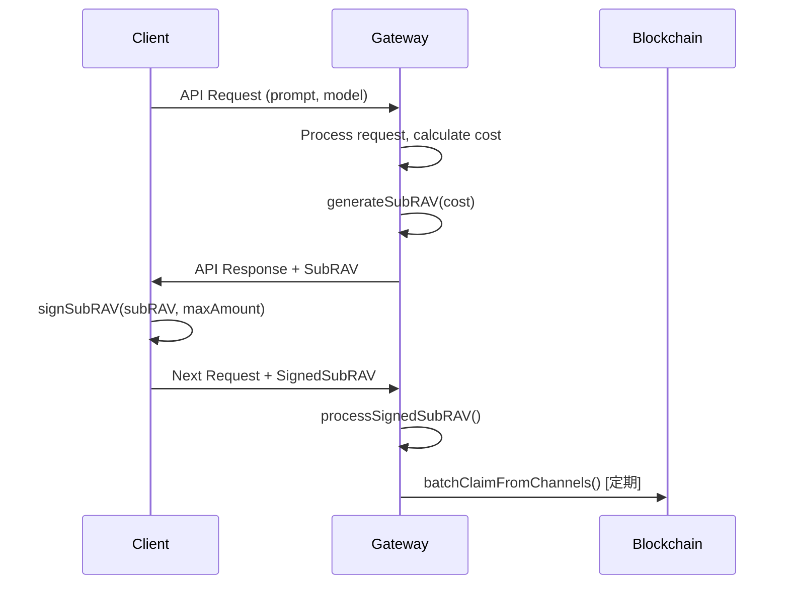

# PaymentChannelClient 设计与评估

> 最近修改日期：2024-12-20

本文档基于当前重构后的 `PaymentChannelPayerClient` 和 `PaymentChannelPayeeClient` 源码，梳理其设计思路、现有特征，并从 **API Gateway 支付模式** 出发进行合理性评估，最后给出架构优势总结。

---

## 1. 功能定位重构

### 1.1 PaymentChannelPayerClient（客户端侧）

核心职责：

1. **链上通道生命周期管理**  
   `openChannel` / `openChannelWithSubChannel` / `authorizeSubChannel` / `closeChannel`
2. **本地状态持久化**  
   - `ChannelMetadata`（通道级静态信息）  
   - `SubChannelState`（子通道 `nonce/amount` 追踪）
3. **SubRAV 签名验证**  
   `signSubRAV()` 负责验证并签名服务端生成的 SubRAV
4. **多通道支持**  
   支持显式指定 `channelId` 或通过 `setActiveChannel()` 设置默认通道

### 1.2 PaymentChannelPayeeClient（服务端侧）

核心职责：

1. **SubRAV 生成与管理**  
   `generateSubRAV()` 根据实际消费量生成待签名 RAV
2. **SubRAV 验证与处理**  
   `verifySubRAV()` / `processSignedSubRAV()` 验证客户端返回的签名
3. **链上索赔管理**  
   `claimFromChannel()` / `batchClaimFromChannels()` 批量提款到区块链
4. **通道状态监控**  
   `listActiveChannels()` / `syncChannelState()` 监控和同步通道状态

**重要安全要求**：
- `didResolver` 是必需参数，用于验证 SubRAV 签名
- 所有接收到的 SignedSubRAV 都必须进行签名验证，确保支付授权的真实性

**性能优化**：
- 使用 `ChannelStateStorage` 直接缓存 `ChannelInfo`，避免重复链调用
- `getChannelInfoCached()` 优先使用本地缓存，失败时回退到链查询
- `syncChannelState()` 强制刷新缓存，确保状态同步

**类型设计简化**：
- 统一使用 `ChannelInfo` 类型，移除了冗余的 `ChannelMetadata`
- 在当前支付模式中，资产不锁定在通道内，因此移除了 `totalCollateral` 字段
- 简化了存储接口，直接使用 `ChannelInfo` 作为缓存对象

---

## 2. API Gateway 支付模式

### 2.1 工作流程



### 2.2 关键特性

| 特性 | 说明 |
| ---- | ---- |
| **成本后计算** | Gateway 根据实际 token 消费量动态生成 SubRAV |
| **客户端保护** | `signSubRAV()` 支持 `maxAmount` 限制，防止恶意收费 |
| **状态同步** | 双端正确维护 nonce 和累积金额的一致性 |
| **批量索赔** | Gateway 定期批量提交 claim，降低链上交易成本 |
| **流式支持** | 支持长会话的渐进式微支付模式 |

### 2.3 API 示例

#### Gateway 端（Payee）
```ts
// 初始化 PayeeClient（必须提供 DID 解析器）
const payeeClient = new PaymentChannelPayeeClient({
  contract: roochContract,
  signer: payeeSigner,
  didResolver: didResolver, // 必需：用于验证支付签名
});

// 1. 处理 API 请求并生成 SubRAV
const result = await gateway.processAPIRequest({
  channelId: 'channel-123',
  payerKeyId: 'did:example:client#key1',
  request: { prompt: 'Explain AI', model: 'gpt-4' },
});

// 2. 返回 { response, subRAV, totalCost }
```

#### Client 端（Payer）
```ts
// 1. 签名 Gateway 返回的 SubRAV
const signedSubRAV = await client.signSubRAV(apiResponse.subRAV, {
  validateBeforeSigning: true,
  maxAmount: BigInt(100000), // 最大接受金额
});

// 2. 在后续请求中携带签名凭证
```

---

## 3. 当前实现特征

| 维度 | PaymentChannelPayerClient | PaymentChannelPayeeClient |
| ---- | ---- | ---- |
| **通道管理** | 开通道、授权子通道、关闭通道 | 监控通道状态、同步状态 |
| **RAV 处理** | 验证并签名服务端 RAV | 生成 RAV、验证签名 RAV |
| **状态存储** | 本地状态缓存与同步 | 服务端状态管理与持久化 |
| **链上操作** | 通道生命周期操作 | 批量索赔与资金提取 |
| **多通道支持** | 支持（显式指定或默认通道） | 支持（按 payeeDid 过滤） |

---

## 4. 场景-角色评估

### 4.1 Payer-Client 视角

✅ **职责明确**：专注通道管理和签名验证，不再生成 RAV

✅ **客户端保护**：`signSubRAV()` 内置业务逻辑验证，支持金额上限

✅ **多通道灵活性**：支持 `setActiveChannel()` 和显式 `channelId` 指定

✅ **向后兼容**：保留通道管理 API，便于直接支付场景

### 4.2 Payee-Server 视角

✅ **成本驱动**：`generateSubRAV()` 基于实际消费量生成 RAV，符合 API 计费模式

✅ **批量优化**：`batchClaimFromChannels()` 降低链上交易频率和成本

✅ **状态管理**：完整的 RAV 验证、存储和索赔流程

✅ **可扩展性**：支持未来集成 `ClaimScheduler` 和 `RAVStore` 等高级功能

---

## 5. 架构优势

| # | 优势 | 价值 |
| - | ---- | ---- |
| 1 | **职责清晰分离** | Payer 专注签名验证，Payee 专注成本计算和索赔 |
| 2 | **API 场景适配** | 完美契合 LLM Gateway、MCP 等后付费 API 服务 |
| 3 | **客户端安全** | 内置金额验证、nonce 检查等防护机制 |
| 4 | **服务端效率** | 批量索赔、状态缓存等优化链上交互成本 |
| 5 | **多通道灵活性** | 支持单通道简单模式和多通道高级模式 |
| 6 | **向后兼容** | 保留原有 API，渐进式迁移 |

---

## 6. 角色拆分重构方案（已实现）

### 6.1 拆分动机（已验证）
1. **角色边界清晰**：Payer 负责签名验证；Payee 负责成本计算、索赔。
2. **API 场景适配**：服务端更了解实际消费成本，客户端验证并授权支付。
3. **扩展性预留**：为 `ClaimScheduler`、`RAVStore` 等高级功能预留接口。

### 6.2 已实现目录结构
```text
packages/payment-kit/
  src/
    client/
      PaymentChannelPayerClient.ts   # Payer 侧，专注签名验证
      PaymentChannelPayeeClient.ts   # Payee 侧，专注 RAV 生成和索赔
    examples/
      llm-gateway-workflow.ts        # 完整 API Gateway 工作流程示例
```

### 6.3 PaymentChannelPayerClient 核心变化
- ✅ **新增：`signSubRAV()`** - 验证并签名服务端生成的 RAV
- ✅ **增强：多通道支持** - `setActiveChannel()` 和显式 `channelId` 参数
- ❌ **移除：`nextSubRAV()`** - 不再适用于 API 场景（已删除）

### 6.4 PaymentChannelPayeeClient 核心 API
```ts
// RAV 生成
generateSubRAV(params: { channelId, payerKeyId, amount, description? }): Promise<SubRAV>

// RAV 处理
processSignedSubRAV(signedSubRAV: SignedSubRAV): Promise<void>

// 批量索赔
batchClaimFromChannels(signedSubRAVs: SignedSubRAV[]): Promise<ClaimResult[]>

// 状态管理
listActiveChannels(options?: ListChannelsOptions): Promise<ChannelInfo[]>
```

---

## 7. 多通道支持策略（Payer）

- **默认简单**：单通道场景下，SDK 自动选择首条 `active` 通道，使用体验与单通道无异。
- **显式切换**：
  - `signSubRAV(subRAV, { channelId })` 可按需指定目标通道。
  - 或调用 `setActiveChannel(channelId)` 设定默认通道（语义糖）。
- **内部实现已兼容**：`ChannelMetadata` / `SubChannelState` 采用 `channelId:keyId` 复合键隔离，多通道不会增加实现复杂度或明显性能开销。
- **为何不做「一实例一通道」**：
  1. 业务常见多资产、多桶余额需求；若由上层维护多个实例，反而增加路由与状态同步成本。
  2. 多实例可能导致本地缓存不一致、持久化存储锁冲突等隐患。
  3. 内存占用可忽略，十余条通道的 signer 与缓存不会造成显著负担。
- **极简场景适配**：如确实只关注单通道，可在应用侧包装一个 `SingleChannelPayer` 适配器，将 `channelId` 固定后代理底层 `PaymentChannelPayerClient` 的所有方法。

该策略兼顾了「开箱即用」与「高级灵活性」，建议作为默认实现。

---

## 8. 结论

重构后的架构完美适配了 **LLM Gateway / MCP API** 等后付费场景：

- **Payee 生成 RAV**：基于实际消费量动态计费
- **Payer 签名验证**：内置安全检查，防止恶意收费  
- **批量索赔优化**：降低链上交易成本
- **职责清晰分离**：便于维护和扩展

这个新架构既保持了向后兼容性，又为未来的高级功能（如 `ClaimScheduler`、流式支付等）预留了扩展空间。

---

> 如需进一步讨论或修改，请在 PR 中评论或通过 Issue 提出。
