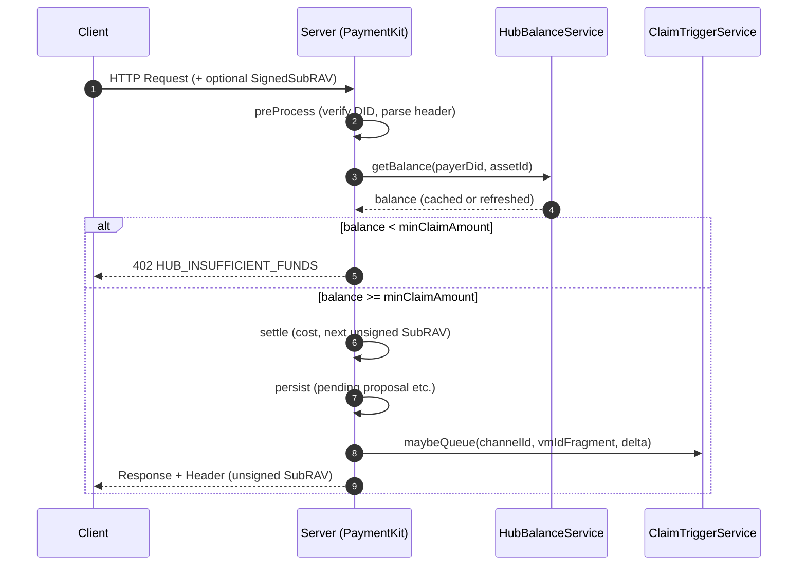

# PaymentKit 设计：基于 DID 的 PaymentHub 余额缓存与事件驱动 Claim（最终版）

> 目标读者：PaymentKit 维护者与集成方
>
> 本文是“基于 DID 的 PaymentHub 余额检查 + 事件驱动式 Claim”的最终方案，替代旧文档。重点修复“payer Hub 无余额仍可用，最终 claim 失败”的问题，并将 Claim 从轮询改为事件驱动，显著降低数据库与链上压力。

---

## 1. 目标与问题修复

- 余额前置：在请求进入计费前检查 **payer** 的 PaymentHub 余额，余额不足直接 402，避免不可结算债务累积。
- 事件驱动：去轮询化。达到阈值由请求触发 claim 排队，活跃用户自然覆盖，无需全量扫描。
- 一致性：所有决策基于“分源缓存 + 实时推导”的新鲜数据；claim 成功后推进本地 SubChannel 状态。
- 可观测：暴露缓存命中率、claim 队列状态、错误码计数等指标。

---

## 2. 核心原则

- 检查对象为 **payerDid** 的 Hub 余额（claim 时从 payer Hub 扣款转给 payee）。
- 不维护“单一余额”本地真值；采用“分源缓存（短 TTL/SWR）+ 实时推导”保证新鲜度与正确性。
- 余额不足严格 402（即使当前请求金额很小），因为达到阈值时 claim 必然失败。
- 并发可控：同一 sub-channel 串行 claim，失败退避重试。

---

## 3. 组件与职责

- **HubBalanceService（新）**

  - `getBalance(ownerDid, assetId)`: 读缓存（短 TTL/SWR），必要时回链刷新
  - `refresh(ownerDid, assetId)`: 强制刷新
  - 不提供 adjust 接口（避免本地真值漂移）

- **ChannelRepository（既有）**

  - 作为 SubChannelInfo 的唯一缓存载体（memory/indexeddb/sql 实现）
  - claim 成功后推进 `lastClaimedAmount` / `lastConfirmedNonce` / `lastUpdated`

- **PendingSubRAVRepository / RAVRepository（既有）**

  - 最新 pending/signed SubRAV 的权威来源（无 TTL）

- **ClaimTriggerService（新或重构）**

  - `maybeQueue(channelId, vmIdFragment, delta)`
  - 并发控制（`activeClaims`）+ 重试退避

- **PaymentProcessor（既有，扩展）**
  - preProcess：DID 校验、解析上下文、发现 basePath、读取 Channel/SubInfo、读取最新 RAV（存入 `ctx.state`）
  - persist：出账 & 持久化后计算 delta，调用 `ClaimTriggerService.maybeQueue`

---

## 4. 分源缓存策略（Key）

- **链上余额（payer Hub）**

  - 缓存层：HubBalanceService
  - TTL：2–5s；负缓存 TTL：1–2s；SWR：过期可用，后台刷新
  - 触发强刷：
    - 连续 402
    - 用户充值提示（可用管理端或显式刷新）
    - 即将触发 claim 且余额临界

- **SubChannelInfo（lastClaimedAmount/lastConfirmedNonce）**

  - 缓存层：仅 `ChannelRepository` 内置缓存，不再单独引入新缓存服务
  - 推进方式：claim 成功后服务端主动更新本地缓存，避免长时间滞后

- **最新 SubRAV（latest pending/signed proposal）**
  - 来源：`PendingSubRAVRepository`/`RAVRepository`（无 TTL，视为权威）
  - 若缺失：授权累计额退化为 `lastClaimedAmount`

---

## 5. 请求流程（端到端）



---

## 6. Delta 计算（位置与来源）

- 计算位置：`PaymentProcessor.persist` 阶段（上下文齐备，I/O 已完成）
- 数据来源（已在 preProcess/persist 缓存到 `ctx.state`，缺失时懒加载）：
  - SubChannelInfo：`payeeClient.getSubChannelState(channelId, vmIdFragment)`（优先 ChannelRepo，必要时回链）
  - 最新 SignedSubRAV：优先 `ravRepo.getLatest(channelId, vmIdFragment)`
  - HubBalance(payer)：`hubBalanceService.getBalance(payerDid, assetId)`（仅用于门槛判断，不参与 delta 计算）
- 公式：
  - `delta = max(0, latestSigned.subRav.accumulatedAmount - subInfo.lastClaimedAmount)`
- PayerDid 来源：直接使用 `channelInfo.payerDid`（已在 preProcess 阶段获取）
- 触发条件：
  - 若 `hubBalance < minClaimAmount` → 402
  - 若 `delta ≥ minClaimAmount` 且 `hubBalance ≥ minClaimAmount` 且 `hubBalance ≥ delta` → `ClaimTriggerService.maybeQueue(...)`

---

## 7. Claim 执行后的状态推进

- 在 `ClaimTriggerService.executeClaim(...)` 成功后：
  - `channelRepo.updateSubChannelState(channelId, vmIdFragment, { lastClaimedAmount: rav.subRav.accumulatedAmount, lastConfirmedNonce: rav.subRav.nonce, lastUpdated: Date.now() })`
  - `ravRepo.markAsClaimed(channelId, vmIdFragment, rav.subRav.nonce)`
  - 不再对 Hub 余额做本地 adjust（最终判断交给 `getBalance` 的短 TTL/SWR）

---

## 8. 并发与幂等

- 并发控制：
  - `activeClaims: Set<string>`（key = `${channelId}:${vmIdFragment}`）防止同一 sub-channel 重复 claim
  - 全局并发限制：`policy.maxConcurrentClaims`
- 失败退避：
  - `failedAttempts` 记录 `attempt` 与 `nextRetryAt`
- 兜底：
  - 如 persist 路径未写入 delta，可在 `maybeQueue` 内懒加载 subInfo 与 latestSigned 再计算（保证健壮性）

---

## 9. 配置扩展（ExpressPaymentKitOptions）

```ts
export interface ExpressPaymentKitOptions {
  // ... existing fields

  hubBalance?: {
    ttlMs?: number; // default: 5000（5秒）
    negativeTtlMs?: number; // default: 2000（2秒）
    staleWhileRevalidateMs?: number; // default: 30000（30秒）
    maxEntries?: number; // default: 10000
    owner?: 'payer' | 'payee'; // 默认 'payer'：检查付款方 hub 余额（claim 扣款来源）
  };

  claim?: {
    mode?: 'reactive' | 'polling' | 'hybrid'; // default: 'reactive'
    policy?: Partial<ClaimPolicy> & { minClaimAmount?: bigint | string };
    requireHubBalance?: boolean; // default: true
    maxConcurrentClaims?: number; // default: 10 (reactive), 5 (polling)
    maxRetries?: number; // default: 3
    retryDelayMs?: number; // default: 60_000
  };
}
```

- 默认开启 hub 余额缓存 + `claim.mode='reactive'`；保留 `polling` 作为后备选项（默认关闭）。

---

## 10. 错误码

- `HUB_INSUFFICIENT_FUNDS`（402）
- `HUB_BALANCE_FETCH_FAILED`（502/500）

---

## 11. 监控与管理端点

- 统计：
  - HubBalance：hits/misses/staleHits/size（可选）
  - ClaimTrigger：queued/active/success/failed/retries、backoff 中条目数、平均耗时
- 管理端点：沿用 `/payment-channel/admin/claims`、`/payment-channel/admin/claim-trigger`

---

## 12. 测试计划

- 单元：
  - HubBalanceService：TTL/SWR/负缓存、强刷触发条件
  - Delta 计算：多来源组合、缺失兜底
  - ClaimTriggerService：并发限制、退避重试、幂等
- 集成：
  - 余额不足 → 402；充值后短周期内 → 放行
  - 多请求累积至阈值 → 触发 claim → 本地 SubChannel 状态推进
- E2E：
  - 混合流量下的稳定性（无轮询）与资源占用下降

---

## 13. 迁移与发布

- Phase 1：
  - 引入 HubBalanceService 与短 TTL/SWR；PaymentProcessor.preProcess 前置余额检查
  - 发版时默认仍可 `claim.mode='hybrid'`（reactive + 低频 polling）
- Phase 2：
  - 默认切到 `reactive`；关闭 polling；admin 端点切换到新状态数据源
- Phase 3：
  - 标记旧 `ClaimScheduler` 为后备路径；统一失败/并发逻辑与指标

---

## 14. 参考接口骨架（伪代码）

```ts
// HubBalanceService - no adjust
export interface HubBalanceServiceOptions {
  ttlMs?: number;
  negativeTtlMs?: number;
  staleWhileRevalidateMs?: number;
  maxEntries?: number;
  contract: IPaymentChannelContract;
  defaultAssetId: string;
}

export class HubBalanceService {
  constructor(private readonly opts: HubBalanceServiceOptions) {}
  async getBalance(ownerDid: string, assetId?: string): Promise<bigint> {
    /* cache + swr */
  }
  async refresh(ownerDid: string, assetId: string): Promise<bigint> {
    /* force fetch */
  }
}

// ClaimTriggerService - reactive
export interface ClaimTriggerOptions {
  policy: {
    minClaimAmount: bigint;
    maxConcurrentClaims?: number;
    maxRetries?: number;
    retryDelayMs?: number;
  };
  contract: IPaymentChannelContract;
  ravRepo: RAVRepository;
}

export class ClaimTriggerService {
  private activeClaims = new Set<string>();
  async maybeQueue(channelId: string, vmIdFragment: string, delta: bigint): Promise<void> {
    /* ... */
  }
}

// PaymentProcessor - delta at persist stage
class PaymentProcessor {
  async persist(ctx: BillingContext): Promise<void> {
    const subInfo = ctx.state!.subChannelInfo!;
    const latest = ctx.state!.latestSignedSubRav!; // or load lazily
    const delta = latest.subRav.accumulatedAmount - subInfo.lastClaimedAmount;
    if (delta >= ctx.state!.policy.minClaimAmount) {
      await claimTrigger.maybeQueue(latest.subRav.channelId, latest.subRav.vmIdFragment, delta);
    }
  }
}
```

---

本方案采用“分源缓存 + 实时推导 + 事件驱动”的思路，确保正确性与性能，同时简化一致性管理与实现复杂度。建议优先落地 HubBalanceService 与 PaymentProcessor 的前置余额检查与 persist 阶段 delta 计算，随后替换轮询为 reactive claim。
