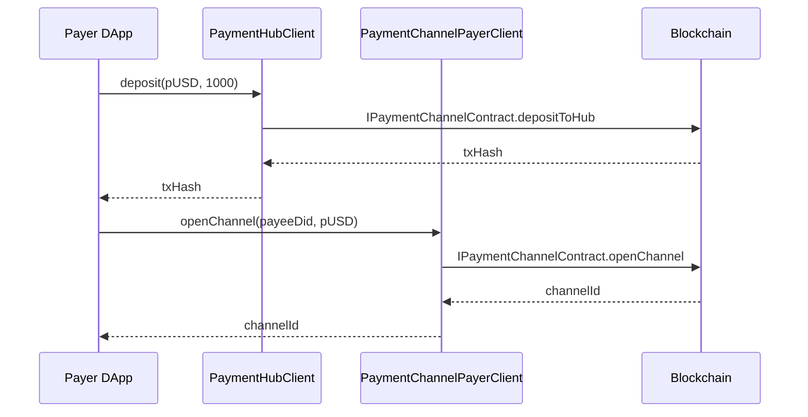

# PaymentHub 设计方案（更新版）

> 适用范围：`payment-kit` 链无关实现

---

## 1. 背景

当前 `PaymentChannel` 的实现假定 **每个 DID 对应一个独立的 PaymentHub**。多个通道共享该 Hub 中的资产。

* 在 `PaymentChannelPayerClient` 中已有 `depositToHub` 方法，`withdraw` 尚未补齐；
* `openChannel` 的 `channelCollateral` 参数在此模型下不会生效；

导致的问题：

1. **聚合不足**：Deposit / Withdraw 逻辑散落在各 Client，重复实现；
2. **职责不清**：Channel Client 既处理通道，又管理 Hub；
3. **接口冗余**：无用的 `channelCollateral` 让 API 更复杂。

---

## 2. 设计目标

1. **关注点分离**：Channel 只处理支付流程；Hub 只管理余额；
2. **单一合约实例**：链上 Move 模块 `payment_channel.move` 已同时负责两者；SDK 层保持同一 `contract` 实例；
3. **向后兼容**：保留旧接口（标记 `@deprecated`），逐步迁移；
4. **调用方易用**：Payer / Payee Client 暴露 `getHubClient()` 以复用内部依赖。

---

## 3. 模块与接口

### 3.1 扩展 `IPaymentChannelContract`（聚合 Hub 能力）

```typescript
export interface DepositParams {
  ownerDid: string;        // 资金拥有者（Hub 与之绑定）
  assetId: string;         // 资产，如 "pUSD"
  amount: bigint;
  signer: SignerInterface;
}

export interface WithdrawParams {
  ownerDid: string;
  assetId: string;
  amount: bigint;          // 0 = 全部
  recipient?: string;      // 可选：提到其他地址 / DID
  signer: SignerInterface;
}

export interface IPaymentChannelContract {
  /* -------- Channel 相关方法（已存在） -------- */
  openChannel(...): Promise<OpenChannelResult>;
  claimFromChannel(...): Promise<ClaimResult>;
  // ... 省略若干

  /* -------- Hub 相关新增方法 -------- */
  depositToHub(params: DepositParams): Promise<{ txHash: string }>;
  withdrawFromHub(params: WithdrawParams): Promise<{ txHash: string }>;
  getHubBalance(ownerDid: string, assetId: string): Promise<bigint>;
}

// 如果仍需单独类型别名：
export type IPaymentHubContract = Pick<
  IPaymentChannelContract,
  'depositToHub' | 'withdrawFromHub' | 'getHubBalance'
>;
```

> **说明**：链适配层（如 `RoochPaymentContract`）只实现一份接口，即可同时服务 Channel 与 Hub。

### 3.2 `PaymentHubClient`

```typescript
export interface PaymentHubClientOptions {
  contract: IPaymentChannelContract;  // 复用同一实例
  signer: SignerInterface;
}

export class PaymentHubClient {
  constructor(opts: PaymentHubClientOptions);

  deposit(assetId: string, amount: bigint): Promise<{ txHash: string }>;
  withdraw(assetId: string, amount: bigint, recipient?: string): Promise<{ txHash: string }>;
  getBalance(assetId: string): Promise<bigint>;
}
```

### 3.3 现有 Client 的改动

| 模块 | 变更 |
|------|------|
| `PaymentChannelPayerClient` | 1) `depositToHub` 标记 `@deprecated`；2) 新增 `getHubClient()` 快捷方法。|
| `PaymentChannelPayeeClient` | 新增 `getHubClient()`（主要用于余额查询或协助提现）。|
| `openChannel` 合约/方法 | 移除 `channelCollateral` 参数。|

---

## 4. 调用时序



> SubRAV / Claim 流程与原方案一致，资金仍从 Hub 扣减。

---

## 5. 迁移路线

1. **阶段 1（当前）**
   * 为 `IPaymentChannelContract` 增加 Hub 方法；
   * `PaymentHubClient` 实现落地，并在两侧 Client 提供 `getHubClient()`；
   * `depositToHub` 在 PayerClient 中改为：
     ```ts
     /** @deprecated 请使用 getHubClient().deposit */
     depositToHub(...) { return this.getHubClient().deposit(...); }
     ```
2. **阶段 2（两个 Minor 版本后）**
   * 编译期废弃 `depositToHub`；
   * `openChannel` 移除 `channelCollateral` 参数。
3. **阶段 3（下一个 Major）**
   * 删除所有废弃接口。

---

## 6. 示例代码

```typescript
// 初始化 Channel 合约实例 & PayerClient
const contract = new RoochPaymentContract(...);
const payerClient = new PaymentChannelPayerClient({ contract, signer });

// 通过 PayerClient 获取 HubClient 复用同一合约实例
const hub = payerClient.getHubClient();
await hub.deposit('pUSD', 1_000_000n);

// 打开通道（不再需要 collateral）
await payerClient.openChannel({
  payeeDid: 'did:example:service',
  assetId: 'pUSD',
});
```

---

## 7. 潜在扩展

* **多资产 Hub**：单 DID 多币种余额；
* **策略插件**：最小余额、自动补仓等；
* **授权提取**：DID 授权第三方操作 Hub 余额。

---

## 8. 总结

通过将 Hub 资金管理能力 **聚合到现有 `IPaymentChannelContract`**，并在 Client 层提供 `getHubClient()` 视图，我们实现了：

* 单合约实例，零重复实现；
* Channel 与 Hub 责任边界清晰；
* 平滑迁移旧接口；
* 更易于未来功能扩展。
