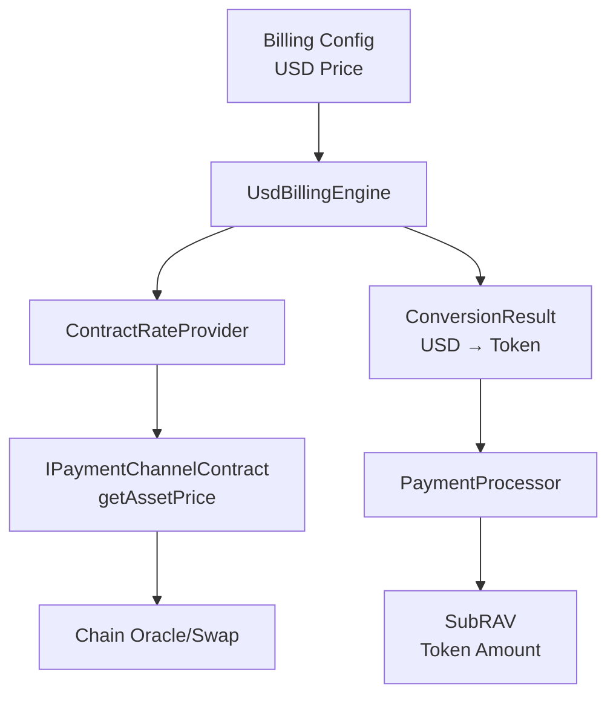

# USD 计价与 Token 结算指南

## 概述

Payment Kit 现在支持 **USD 计价，Token 结算** 的灵活计费模式：

- 💰 **计费配置**：以美元 (USD) 为单位定价，便于理解和标准化
- 🔗 **实时汇率**：通过链上 oracle/swap 获取准确的资产价格
- 💎 **Token 结算**：最终以区块链原生 Token 完成支付
- 📊 **审计追踪**：完整记录汇率转换过程，支持财务审计

## 架构概览



## 核心组件

### 1. UsdBillingEngine

负责 USD 到 Token 的转换计算：

```typescript
import { UsdBillingEngine, ContractRateProvider } from '@nuwa-ai/payment-kit/billing';

const rateProvider = new ContractRateProvider(contract);
const engine = new UsdBillingEngine(configLoader, rateProvider);

// 计算成本（返回 Token 数量）
const cost = await engine.calcCost(context);

// 计算成本（包含汇率审计信息）
const details = await engine.calcCostWithDetails(context);
console.log('USD Cost:', details.usdCost);
console.log('Token Cost:', details.assetCost);
console.log('Exchange Rate:', details.priceUsed);
```

### 2. ContractRateProvider

从链上获取实时汇率：

```typescript
import { ContractRateProvider } from '@nuwa-ai/payment-kit/billing/rate';

const rateProvider = new ContractRateProvider(
  contract,
  30_000 // 30 秒缓存
);

// 获取价格（picoUSD 每最小单位）
const price = await rateProvider.getPricePicoUSD('0x3::gas_coin::RGas');

// 获取资产信息
const assetInfo = await rateProvider.getAssetInfo('0x3::gas_coin::RGas');
```

### 3. 计费配置

YAML 配置中使用 **picoUSD** 单位 (1 USD = 1,000,000,000,000 picoUSD)：

```yaml
version: 1
serviceId: my-service
rules:
  - id: api-call
    when:
      path: "/v1/chat/completions"
      method: "POST"
    strategy:
      type: PerRequest
      price: "1000000000"  # 0.001 USD
  
  - id: expensive-operation
    when:
      path: "/v1/process"
    strategy:
      type: PerRequest
      price: "10000000000"  # 0.01 USD
      
  - id: default-pricing
    default: true
    strategy:
      type: PerRequest
      price: "500000000"   # 0.0005 USD
```

## 示例：完整工作流程

### 1. 初始化

```typescript
import { 
  UsdBillingEngine, 
  ContractRateProvider,
  FileConfigLoader 
} from '@nuwa-ai/payment-kit/billing';
import { PaymentChannelPayeeClient } from '@nuwa-ai/payment-kit/client';

// 获取合约实例
const contract = payeeClient.contract;

// 创建汇率提供者
const rateProvider = new ContractRateProvider(contract, 30_000);

// 创建 USD 计费引擎
const configLoader = new FileConfigLoader('./config/billing');
const billingEngine = new UsdBillingEngine(
  configLoader,
  rateProvider,
  {
    '0x3::gas_coin::RGas': { decimals: 8 }
  }
);
```

### 2. 计费计算

```typescript
const context = {
  serviceId: 'llm-service',
  operation: 'post:/v1/chat/completions',
  assetId: '0x3::gas_coin::RGas',
  meta: {
    model: 'gpt-4',
    tokens: 1000
  }
};

// 计算成本（包含汇率转换）
const result = await billingEngine.calcCostWithDetails(context);

console.log('Billing Details:');
console.log('- USD Cost:', result.usdCost / 1_000_000_000_000n, 'USD');
console.log('- Token Cost:', result.assetCost, 'RGAS units');
console.log('- Exchange Rate:', result.priceUsed, 'picoUSD per unit');
console.log('- Rate Provider:', result.rateProvider);
console.log('- Timestamp:', new Date(result.priceTimestamp));
```

### 3. HTTP 中间件集成

```typescript
import { HttpBillingMiddleware } from '@nuwa-ai/payment-kit/middlewares';

const middleware = new HttpBillingMiddleware({
  payeeClient,
  billingEngine, // 使用 UsdBillingEngine
  serviceId: 'api-gateway',
  defaultAssetId: '0x3::gas_coin::RGas',
  debug: true
});

app.use(middleware.createExpressMiddleware());
```

## 价格转换机制

### 汇率计算公式

1. **获取链上价格**：`contract.getAssetPrice(assetId)` 返回 picoUSD/最小单位
2. **USD 成本**：从计费配置获取，单位为 picoUSD
3. **Token 成本计算**：
   ```
   tokenCost = ceil(usdCost * decimals / exchangeRate)
   ```
   使用向上取整避免收费不足

### 示例计算

假设：
- RGAS 价格：100 picoUSD 每最小单位
- RGAS 精度：8 位小数
- API 调用成本：0.001 USD (1,000,000,000 picoUSD)

计算过程：
```
tokenCost = ceil(1,000,000,000 * 10^8 / 100)
         = ceil(1,000,000,000 * 100,000,000 / 100)
         = ceil(1,000,000,000,000,000 / 100)
         = ceil(10,000,000,000,000)
         = 10,000,000 RGAS units (0.1 RGAS)
```

## 支持的资产

### Rooch 网络

- **RGAS** (`0x3::gas_coin::RGas`)：8 位小数
- 通过合约 `getAssetPrice()` 获取实时价格

### 扩展支持

要支持新的区块链和资产：

1. **实现合约接口**：
   ```typescript
   class CustomPaymentChannelContract implements IPaymentChannelContract {
     async getAssetPrice(assetId: string): Promise<bigint> {
       // 返回 picoUSD 每最小单位的价格
     }
   }
   ```

2. **配置资产信息**：
   ```typescript
   const assetConfigs = {
     'your-asset-id': { decimals: 18 }
   };
   ```

## 最佳实践

### 1. 缓存策略

- **链上价格**：30 秒缓存（实时性重要）
- **资产信息**：更长缓存（相对静态）

### 2. 错误处理

```typescript
try {
  const result = await billingEngine.calcCostWithDetails(context);
} catch (error) {
  if (error instanceof RateProviderError) {
    // 汇率获取失败
    console.error('Rate fetch failed:', error.message);
  } else {
    // 其他计费错误
    console.error('Billing error:', error);
  }
}
```

### 3. 监控和审计

```typescript
// 记录汇率转换详情
const logConversion = (result: ConversionResult) => {
  console.log(`Conversion: ${result.usdCost} pUSD → ${result.assetCost} ${result.assetId}`);
  console.log(`Rate: ${result.priceUsed} pUSD/unit @ ${new Date(result.priceTimestamp)}`);
};
```

### 4. 测试策略

```typescript
// 模拟固定汇率进行测试
class MockContract implements IPaymentChannelContract {
  async getAssetPrice(assetId: string): Promise<bigint> {
    return BigInt(100); // 固定价格用于测试
  }
}
```

## 迁移指南

### 从 Token 计价迁移到 USD 计价

1. **更新配置文件**：
   ```yaml
   # 旧配置（Token 单位）
   price: "1000000"  # 0.01 RGAS
   
   # 新配置（USD 单位）
   price: "1000000000"  # 0.001 USD
   ```

2. **替换计费引擎**：
   ```typescript
   // 旧方式
   const engine = new BillingEngine(configLoader);
   
   // 新方式
   const engine = new UsdBillingEngine(configLoader, rateProvider);
   ```

3. **更新测试期望值**：
   - 成本现在是 USD→Token 转换后的结果
   - 需要根据汇率调整断言

## 故障排除

### 常见问题

1. **汇率获取失败**
   - 检查合约 `getAssetPrice()` 实现
   - 确认链上 oracle 正常工作

2. **价格计算异常**
   - 验证资产精度配置
   - 检查 picoUSD 单位使用

3. **缓存问题**
   - 使用 `refreshPrice()` 强制更新
   - 调整缓存超时时间

### 调试技巧

```typescript
// 启用详细日志
const rateProvider = new ContractRateProvider(contract, 30_000);
rateProvider.debug = true;

// 检查实际汇率
const price = await rateProvider.getPricePicoUSD(assetId);
console.log(`Current rate: ${price} picoUSD per unit`);
```

---

通过这套 USD 计价和 Token 结算机制，Payment Kit 为去中心化应用提供了灵活、透明且易于审计的计费解决方案。 