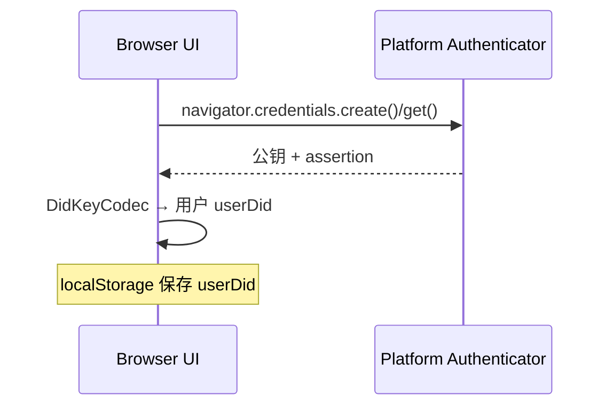

# cadop-web WebAuthn 重构方案

> 更新时间：2025-06-11

## 1. 背景与目标

cadop-web 目前的登录、Agent DID 创建与后端 `cadop-api` 耦合度较高，需要维护 Session、Cookie 等状态，导致：

* 首屏加载速度受限，需要等待接口返回。
* Agent DID 创建链路冗长，难以在多终端 / 离线场景使用。
* Custodian / Mint 等下游服务必须依赖会话，难以横向扩展。

本轮重构旨在 **彻底解耦前后端登录与授权逻辑**，实现「本地登录 + 无状态授权」的新模式。

## 2. 新流程概览

### 2.1 用户登录（纯前端）

1. 检查 `localStorage.userDid` 是否存在；存在即视为已登录。
2. 若不存在则调用 `navigator.credentials.create()` 走 Passkey 流程，流程细节：
   * 生成一个 **UUID v4**（16 bytes）并写入 `options.user.id`；该值记为 `userUuid`。
   * 调用 WebAuthn API，拿到公钥 → 使用 `DidKeyCodec.generateDidKey()` 产出 **User DID**。
   * 持久化三元组 `{ credentialId, userUuid, userDid }` 至本地映射表 `passkeyMap`。
   * 同时把 `userDid` 写入 `localStorage.userDid` 作为登录态标识。
3. 整个流程**不与服务器交互**，可离线完成。



### 2.2 Agent DID 创建（一次性挑战-签名）

| 步骤 | Client | Server |
|------|--------|--------|
|1|`GET /agent/challenge`|生成 `nonce`，返回|
|2|使用 Passkey 对 `nonce`+`rpId` 组合做 `navigator.credentials.get()` 签名|–|
|3|`POST /agent/verify {assertion, nonce}`|验证签名 & `nonce`，颁发 `idToken`（JWT）与 **Agent DID**|
|4|本地保存 `agentIdToken`、`agentDid`|–|

`idToken` 建议字段：

```json
{
  "sub": "<userDid>",
  "agent": "<agentDid>",
  "iat": 1710000000,
  "exp": 1710003600
}
```

### 2.3 Custodian / Mint 调用

客户端在请求头加入 `Authorization: Bearer <idToken>`。
后端微服务只需验证 JWT 签名与 `exp`，无需 Session。

## 3. 本地存储结构

| Key | 说明 |
|-----|------|
|`userDid`|用户基于 Passkey 生成的 DID，标志登录态|
|`passkeyMap`|JSON 映射表：`{ [credentialId]: { userUuid, userDid } }`|
|`agentIdToken`|服务器颁发的 JWT，用于受管资产操作|
|`agentDid`|与 `agentIdToken` 绑定的代理 DID|

## 4. 代码拆分建议

* `PasskeyService` – 负责本地注册 / 认证、User DID 生成与存储。
* `AgentService`   – 封装挑战获取、签名、`idToken` 缓存刷新。
* 统一 API Hook – 自动附带 `Authorization` 头，并在 401 时尝试刷新 Token。

```text
src/lib/
  ├─ passkey/PasskeyService.ts    // 纯前端，无网络请求
  └─ agent/AgentService.ts        // 需要 cadop-api
```

## 5. 新后端接口设计

接口按照 **IdP (CadopIdPService)** 与 **Custodian (CadopCustodianService)** 职责拆分。

### 5.1 IdP (CadopIdPService) – 与 AgentService 对接

| Method | Path | Header / Query | Request JSON | Response JSON | 说明 |
|--------|------|----------------|--------------|---------------|------|
|GET|`/idp/challenge`|—|—|`{ nonce, rpId }`|生成一次性 `nonce`（Base64URL）、`rpId`。TTL ≤60 s，无鉴权。|
|POST|`/idp/verify`|`Content-Type: application/json`|`{ assertion, nonce, userDid }`|`{ idToken, isNewUser }`|校验 Passkey 签名 (`assertion` 为 WebAuthn JSON)、匹配 `nonce`，签发 **短 TTL (≤5 min) ES256 JWT**，载荷见下。`isNewUser` 供前端提示。|

`idToken` JWT Claims：

```json
{
  "iss": "did:example:idp",
  "sub": "<userDid>",
  "aud": "did:example:custodian",
  "exp": 1710003600,
  "iat": 1710000000,
  "jti": "uuid",
  "nonce": "<nonce>",
  "pub_jwk": { /* initial key in JWK */ },
  "sybil_level": 1
}
```

> IdP 还需暴露 OIDC Discovery (`/.well-known/openid-configuration`) 与 `jwks_uri`，详见 NIP-3。

### 5.2 Custodian (CadopCustodianService)

| Method | Path | Auth | Request JSON / Params | Response | 说明 |
|--------|------|------|-----------------------|----------|------|
|POST|`/custodian/mint`|—|`{ userDid, idToken }`|`{ id, status, agentDid? }`|消费 `idToken`，按 NIP-3 验证后创建 Agent DID，异步返回记录 ID。|
|GET|`/custodian/status/:recordId`|—|—|`{ status, agentDid? }`|轮询创建进度。|
|GET|`/custodian/user/:userDid/dids`|—|—|`{ dids: string[] }`|查询某用户所有 Agent DID。|
|GET|`/custodian/resolve/:agentDid`|—|—|DID Document|解析 Agent DID。|

> Custodian 现有路由基本满足，`/custodian/mint` 仅需确认必带 `idToken` 与 `userDid` 字段。

### 5.3 交互流程回顾

1. **Passkey 登录**：前端 `PasskeyService.ensureUser()` → 本地获得 `userDid`。
2. **获取 idToken**：`AgentService.getIdToken()`
   1. `GET /idp/challenge` → `{ nonce, rpId }`
   2. WebAuthn 签名 → `assertion`
   3. `POST /idp/verify` → `{ idToken }`（缓存至 `localStorage.agentIdToken`）。
3. **Mint Agent DID**：`POST /custodian/mint` 携带 `idToken`，Custodian 完成验证 & 链上注册。

*所有接口均为 **无状态**，使用 HTTPS，IdP / Custodian 通过各自 DID 文档声明 `serviceEndpoint`。

## 6. 风险与对策

| 风险 | 对策 |
|------|------|
|Replay Attack|`nonce` 单次使用 + 60s 有效期 + 在 JWT 中记录 `nonce` 哈希|
|Token 泄露|短 TTL（≤1h）+ HTTPS + `kid` 轮换策略|
|旧浏览器不支持 Passkey|`PasskeyService.isSupported()` 提前提示并引导传统登录（后续可上邮箱登录等）|
|多设备同账户|允许多个 Agent DID，后端以 `sub`+`agent` 维度做授权|

## 7. 实施步骤

1. **后端**
   1.1 新增 `/agent/challenge`、`/agent/verify`；引入 JWT 库。  
   1.2 Custodian / Mint 中间件改为 JWT 校验。
2. **前端**
   2.1 抽取 `PasskeyService`，替换现有 `WebAuthnClientService.authenticate()` 登录逻辑。  
   2.2 实现 `AgentService.getIdToken()`；封装重试。  
   2.3 全局 API Hook 注入 `Authorization`。  
   2.4 页面根据 `userDid`、`agentIdToken` 状态切换 UI。
3. **灰度上线**：Feature Flag 并行跑旧 Session 流程，确认稳定后下线旧接口。
4. **后续优化**：Token Refresh、批量上链等。

## 8. 结论

该方案保证：

* **登录首屏无网络**，极大提升体验；
* **后端完全无状态**，易于水平扩容；
* 安全模型简洁，可使用 WebAuthn + JWT 社区最佳实践。

> 若在实施中发现问题，请在本文档继续补充调整记录。
