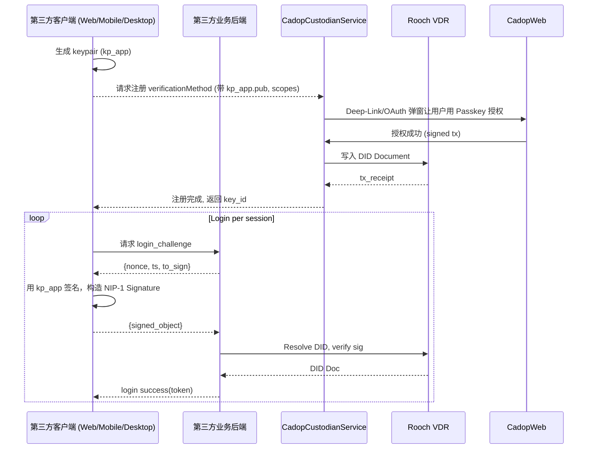
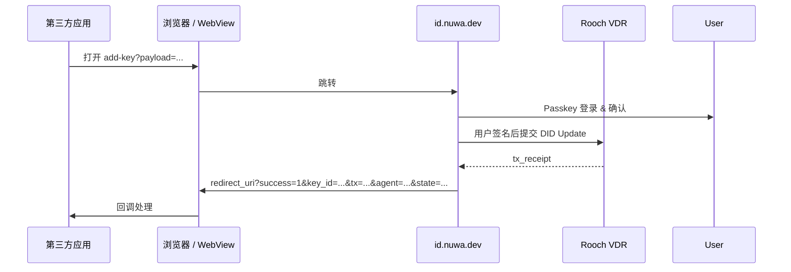

# 第三方应用接入 Nuwa Agent DID 登录设计文档

> 版本：v0.1 – 2025-06-18

本文件为 **CADOP Custodian Service** & **Nuwa Identity 生态** 提供的第三方应用登录集成指南。目标是让外部应用（桌面 / 移动 / Web）能够：

1. 在本地安全地产生一把新的 **Operational Key**；
2. 将该密钥以 `verificationMethod` 形式写入用户的 **Agent DID**（满足 `authentication` 验证关系）；
3. 使用此密钥按 **NIP-1 Signature** 规范完成登录挑战签名，从而访问 Nuwa 协议生态（如 LLM Gateway、Storage Service 等）。

---

## 目录

1. 名词解释
2. 角色与组件
3. 总体验流程
4. 接入前置条件
5. `verificationMethod` 注册方案
6. NIP-2 DIDAuth 认证协议（Stateless）
7. 各终端实现建议
8. SDK & 代码示例
9. 安全与 UX 建议
10. FAQ / 常见问题

---

## 1. 名词解释

| 术语 | 说明 |
| ---- | ---- |
| **User DID** | 由 Passkey 产生的 `did:key`，在 CADOP On-boarding 期间作为 Controller 写入 Agent DID，并拥有 `capabilityDelegation` 权限。 |
| **Agent DID** | 运行在 Rooch 链（`did:rooch:<addr>`）的去中心化身份，后续调用链上合约、LLM Gateway 等都以 Agent DID 为主体。 |
| **Operational Key** | 针对单一应用 / 设备生成的子密钥。注册到 Agent DID 的 `verificationMethod`，通常列入 `authentication` 关系；如业务需要更广权限，可再加入 `capabilityInvocation` 或 `capabilityDelegation`（需谨慎）。 |
| **CADOP Web** | https://id.nuwa.dev – 提供 Passkey 登录、Agent DID 管理、权限授权 UI。 |
| **NIP-1 Signature** | <nip-1.md> 定义的签名结构：`{signed_data, signature{signer_did, key_id, value}}`。 |

---

## 2. 角色与组件图



---

## 3. 总体验流程

1. **用户首次安装 / 打开第三方应用**
   * 检测本地是否已保存 `kp_app`&`key_id`。
   * 若无，则执行 **密钥注册流程**（见 §5）。
2. **后续登录**
   * 直接使用保存的 `kp_app` 对服务端挑战签名即可。

> ⚠️ 若用户在另一设备登录同一应用，可重复 §5 生成新子密钥，同一 Agent DID 可以挂载多把 `authentication` key。

---

## 4. 接入前置条件

| 条目 | 说明 |
| --- | --- |
| 用户 | 已拥有 Agent DID（通过 CADOP Web 创建）。Passkey 能够完成 `capabilityDelegation` 操作。 |
| 第三方应用 | 实现了本地安全存储（Keychain / Secure Storage / IndexedDB）与 Crypto 算法 (Ed25519 / ECDSA-P256)。 |
| 后端 | 能够解析 NIP-1 Signature，并通过 Rooch RPC 或 Custodian API 获取 DID Document。 |

---

## 5. `verificationMethod` 注册方案

### 5.1 核心原则

* **DID 文档更新必须由拥有 `capabilityDelegation` 权限的密钥签名** — 默认即为用户的 Passkey。Custodian **不会**、也**无法**代签。
* Custodian 仅扮演 **事务打包 / 广播 relayer**，确保用户签名后的 DID Update 被提交到 Rooch 链。

### 5.2 Deep-Link（纯 URL 模式）

在不依赖任何 Custodian API 的场景，可直接把所需指令打包为 **Base64URL(JSON)** 的 `payload` 参数，拼到 `id.nuwa.dev/add-key` URL：

```
https://id.nuwa.dev/add-key?payload=<BASE64URL>
```

#### 5.2.1  Payload JSON 结构

| 字段 | 必须 | 说明 |
| ---- | ---- | ---- |
| `version` | Y | 协议版本号，例如 `1` |
| `agentDid` | 可选 | 目标 Agent DID；若省略则让用户在 CADOP Web 登录后自行选择 |
| `verificationMethod` | Y | 新增的 `verificationMethod` 对象，字段与 DID Document 相同：<br> • `type`<br> • `publicKeyMultibase` **或** `publicKeyJwk`<br> • `idFragment`<br> • `verificationRelationships` |
| `verificationRelationships` | Y | 要添加到的验证关系数组。值应为 DID Core 中的字段名，如 `["authentication"]`、`["authentication","capabilityInvocation"]`。 |
| `idFragment` | N | `verificationMethod.id` 中 `#fragment`。如不填则由 Cadop Web 生成（形如 `key-<timestamp>`）。可用于在 UI 中展示，也便于用户识别。 |
| `redirectUri` | Y | 完成后回跳地址（自定义 Scheme / HTTPS） |
| `state` | Y | 调用方生成的随机串，用于防 CSRF 并在回调校验 |

示例（未编码前）：

```jsonc
{
  "version": 1,
  "agentDid": "did:rooch:0xabc...",
  "verificationMethod": {
    "type": "Ed25519VerificationKey2020",
    "publicKeyMultibase": "z6Mki..."
  },
  "verificationRelationships": ["authentication", "capabilityInvocation"],
  "idFragment": "LlamaChat-Mac",
  "redirectUri": "llamachat://nuwa/callback",
  "state": "4c2ec6ee01"
}
```

Base64URL 后放入 `payload=` 即可。

#### 5.2.2  流程



回调参数：

| 名称 | 描述 |
| ---- | ---- |
| `success` | `1` / `0` |
| `key_id` | 新 `verificationMethod.id` (成功时) |
| `tx` | 链上交易哈希 (成功时) |
| `agent` | 实际写入的 Agent DID |
| `error` | 失败原因 (失败时) |
| `state` | 调用方原样返回 |

对于 Web SPA，可把 `redirect_uri` 设为同源空白页，CADOP Web 会

```js
window.opener.postMessage({ success:1, key_id, tx, agent, state }, origin);
window.close();
```

#### 5.2.3  用户输入需求

* 若 `agentDid` 省略，CADOP Web 会在 Passkey 登录后列出用户名下所有 Agent DID 供选择；否则无需用户手输。  
* **idFragment** 仅决定 DID 文档中 `#fragment`，如留空 Cadop Web 将自动生成；同一个 DID 内必须唯一。
* **User DID** 不需输入，CADOP Web 使用现有 Passkey 自动签名。

#### 5.2.4  安全注意

1. `payload` 中包含公钥等信息，但仅为公钥，不泄露私钥。  
2. 建议在打开 URL 之前先将 `payload` 长度控制在合理范围（浏览器 URL 限制）。  
3. 前端应在回调时校验 `state` 防止 CSRF。

### 5.3 In-app NIP-1 直签（高级模式）

若 **App** 自身能调用 Passkey（例如在 Web 环境直接使用 WebAuthn），可完全跳过 Deep-Link：

```ts
const signer = new WebAuthnSigner(userDid, { didDocument, credentialId });
const kit = await NuwaIdentityKit.fromExistingDID(agentDid, signer);

await kit.addVerificationMethod(
  {
    type: 'Ed25519VerificationKey2020',
    publicKeyMaterial: kp_app.publicKey,
  },
  ['authentication']
);
```

#### 5.3.1  前置条件 & 用户输入

1. **是否需要用户输入 `userDid`？**  
   * **首次** 使用直签模式时，App 需要知道：`agentDid`、`userDid`、`credentialId`（Passkey ID）。通常这些信息可在之前的 Deep-Link 流程中由 CADOP Web 通过回调或 `postMessage` 返回一次，App 持久化即可；因此无须用户手工输入。  
   * 若 App 从未记录过这些信息，可让用户扫描 **Agent DID QR**（内含 `agentDid` + `userDid`) 或再走一次 Deep-Link 注册流程获取。

2. **多 Agent / 多 Passkey 情形**  
   如果用户在一个浏览器里注册了多把 Passkey（多账户），CADOP Web 在 Bridge（见下文）阶段会弹出 Passkey 选择器，用户可选定想要用的凭据，因此不需要在 App 手动选择 `userDid`。

#### 5.3.2  突破 Passkey `rpId` 约束

WebAuthn 规定：调用 `navigator.credentials.get()` 时浏览器会把请求的 `rpId` 强制设置为当前页面的有效顶级域。用户最初创建的 Passkey 绑定在 `id.nuwa.dev`，所以**第三方应用的域** (如 `chat.example.com`) 直接调用 WebAuthn 会因 `rpId` 不匹配而拿不到该 Passkey。

解决方案：在 **相同域 (id.nuwa.dev)** 的上下文中完成签名，然后通过安全通道把结果回传给第三方应用。

| 终端 | 推荐做法 | 说明 |
| ---- | -------- | ---- |
| **Web (不同域)** | 通过隐藏 `<iframe src="https://id.nuwa.dev/webauthn-bridge.html">` 或 `window.open` 弹窗调用。<br>• 主站用 `postMessage` 把 `{challenge, keyId}` 传给 Bridge。<br>• Bridge 在同源环境下执行 `navigator.credentials.get()` 签名，然后 `postMessage` 把 `{signature, userDid}` 回传。 | Bridge 页只暴露固定 origin；App 必须校验 `event.origin==='https://id.nuwa.dev'`。 |
| **Electron** | `BrowserWindow` + 同上 `<iframe>`。 | renderer 与主进程间继续用 IPC 转发签名。 |
| **iOS / Android 原生** | 调起 **Custom Tab / SFSafariView / WebAuthn Bridge Activity** 指向 `https://id.nuwa.dev/webauthn-bridge.html?payload=...`。完成后通过 `deep-link` 或 `postMessage` (`javascript:` bridge) 把结果带回。 | 如同 Google / Apple OAuth 的 App 内浏览器流程。 |
| **Desktop Native** | 同移动：调用系统浏览器访问 Bridge，再走 Deep-Link 回调。 |

> **关于 AppID Extension**：旧版 U2F / FIDO AppID 扩展允许不同域共用 Credential，但 Passkey (FIDO2) 已不再推荐使用该扩展且浏览器支持有限，因此不作为主流方案。

#### 5.3.3  签名流程示例（Web, iframe Bridge）

```mermaid
sequenceDiagram
    participant SPA as chat.example.com
    participant Frame as id.nuwa.dev/webauthn-bridge

    SPA->>Frame: postMessage({ type:'sign', challenge, keyId })
    Frame->>Browser: navigator.credentials.get({
        allowCredentials:[{id:keyId,type:'public-key'}],
        challenge,
        timeout:60000
    })
    Browser-->>Frame: assertion
    Frame->>SPA: postMessage({ type:'signed', signature, userDid })
    SPA->>SPA: 继续构造 NIP-1 Signature
```

Bridge 页逻辑（简化）：
```html
<script>
window.addEventListener('message', async evt => {
  if (evt.origin !== 'https://chat.example.com') return; // 可配置白名单
  const { type, challenge, keyId } = evt.data || {};
  if (type !== 'sign') return;
  const assertion = await navigator.credentials.get({
    publicKey: {
      allowCredentials: [{ id: Uint8Array.from(atob(keyId), c=>c.charCodeAt(0)), type:'public-key' }],
      challenge: Uint8Array.from(atob(challenge), c=>c.charCodeAt(0))
    }
  });
  // 将 WebAuthn Assertion 转为 Rooch 签名格式...
  evt.source.postMessage({ type:'signed', signature, userDid }, evt.origin);
});
</script>
```

#### 5.3.4  小结

* **用户无需额外输入**：Agent DID / userDid / credentialId App 持久化即可。  
* **Passkey 签名仍在 id.nuwa.dev 域中执行** → 保持安全模型不变。  
* App 与 Bridge 之间只传递挑战与签名结构，不暴露私钥。

#### 5.3.5  本地存储隔离问题 & 解决方案

浏览器的 **Storage Partitioning / 第三方 Cookie 保护** 会导致：
1. 当 `id.nuwa.dev` 以 *第三方 iframe* 方式加载时，`localStorage`、`indexedDB`、Cookie 可能被隔离（Safari ITP、Firefox ETP 默认开启，Chrome 也在逐步推出）。
2. 因而 Bridge 页可能读取不到此前用户在顶级 `id.nuwa.dev` 会话中存下的 `nuwa:v1` 数据（`userDid`、`credentialId` 等）。

应对策略：

| 方案 | 交互 | 兼容性 | 说明 |
| --- | --- | --- | --- |
| **A. 顶级弹窗 / 新标签页** | Bridge 以 `window.open('https://id.nuwa.dev/webauthn-bridge?...')` 方式打开；用户完成签名后 `postMessage` / `BroadcastChannel` 回传 | ✔ 所有主流浏览器 | 顶级上下文视角下 `id.nuwa.dev` 是 *第一方*，可访问既有本地存储；也不会触发 ITP/ETP 限制。 |
| **B. iframe + Passkey Silent Login** | 在 iframe 内调用 `navigator.credentials.get({mediation:'silent'})`；若浏览器允许第三方 WebAuthn silent mode，则无需存储 | ⚠ 受限（Safari 拒绝、Firefox 需用户交互） | 如果 silent 失败则回退到显式 Passkey 选择器；用户多点一次「选择账户」即可；完成后 Bridge 再写入 *partitioned storage*，后续同一 iframe session 可复用。 |
| **C. Storage Access API** | iframe 调用 `document.requestStorageAccess()` 请求访问第一方存储 | 仅 Safari / Firefox 支持，且需用户手点 | 可做渐进增强，但不是主路径。 |

实践建议：
* **Web SPA**：优先使用方案 **A**（弹窗），兼容 100%。如需无弹窗体验，可检测 `window.hasStorageAccess` 并尝试 silent + SAA。
* **原生 / Electron**：自带浏览器控件打开顶级 `id.nuwa.dev` 页（Custom Tab / SFSafariView / BrowserWindow）→ 完成后 Deep-Link or IPC 回传。

这样即可在所有环境下确保 Bridge 能拿到所需数据或重新让用户用 Passkey 授权一次。

---

链上广播可以：
* 直接由 App 调 Rooch RPC；**或**
* 把签名的 tx 交给 Custodian `POST /cadop/relay`，由其支付 gas 并广播。

### 5.4 安全要点

1. Custodian API **永不保存用户私钥**，只接收 _用户签名后的_ Update 事务。
2. Deep-Link Flow 中，Passkey 签名发生在 CADOP Web（受同源策略保护）。
3. 若 `verificationRelationships` 中包含 `capabilityDelegation`，务必在 UI **高亮**风险：该密钥拥有管理其他密钥与修改 DID 文档的最高权限；应仅颁发给高度可信的设备/环境。

## 6. NIP-2 DIDAuth 认证协议（Stateless）

> 本节旨在描述 **基于 NIP-1 签名的无会话认证**。客户端每次请求都携带一份独立签名，服务器只需验证签名 + 重放保护（`nonce`/`timestamp`），无需建立服务器端会话状态。

### 6.1 基本思路

1. **客户端生成随机 `nonce`**（128bit Base64url）。
2. 构造待签名 payload：

```jsonc
{
  "operation": "http_request",            // 或业务自定义
  "method": "POST",                      // 可选：请求方法
  "path": "/v1/llm/completions",         // 可选：URL Path
  "bodyHash": "SHA256(base64url(body))", // 可选：大请求避免全量签名
  "nonce": "m23N…",
  "timestamp": 1718750000
}
```

3. 使用 **Operational Key** (`key_id`) 调 `NuwaIdentityKit.createNIP1Signature()` —— 该方法生成的结构字段 (`signed_data`, `signature`) 与 [NIP-2](../nips/nip-2.md) 中 **Core Authentication Data Structure** 完全兼容。  
4. 把 `NIP2AuthData`（即上一步生成结果的 Base64url/JSON） 放入请求头或请求体：

```http
POST /v1/llm/completions
NIP2-Auth: <Base64URL(JSON)>
Content-Type: application/json

+{ …body… }
```

### 6.2 服务器验证流程

1. `timestamp` 与服务器当前时间差不超过 300s。
2. `nonce` 在 `(signer_did,key_id)` 维度内未出现过；存入 Redis/DB 做 5~10 分钟窗口去重即可。
3. 解析 `signer_did` → 解析其 DID Document → 找到 `key_id`。
4. 验证公钥类型 & `verificationRelationships` 包含 `authentication`（或业务要求的其他），符合 NIP-2 第 3 步"Verify Key Permissions"。
5. 根据 `bodyHash` / `path` / `method` 重建 canonical data，调用 `CryptoUtils.verify()`。
6. 验证通过后直接执行业务逻辑，无需创建 session / JWT。

### 6.3 与传统 Session 的对比

| 特性 | 无会话签名 | Session Token (JWT/HTTP Cookie) |
| ---- | ---------- | ------------------------------ |
| 状态持久化 | 无 | Redis/DB 或内存存 sessionId → user |
| 重放保护 | `nonce + timestamp` | Token `exp` + HTTPS/TLS |
| 服务端横向扩展 | 易 | 需共享会话或采用 JWT |
| 客户端复杂度 | 签名每请求 | 只在登录时签名一次 |
| 离线可验证 | ✔（第三方可独立验证） | ✘ |

> 建议：
> * **公链/去中心化服务**（如 LLM Gateway 公共 API）——使用无会话签名，更符合开放性。  
> * **需要长连接或高频调用** 的场景，可在首次签名后换发短 TTL Bearer Token，二者共存。

---

## 7. 各终端实现建议

| 终端 | Key 生成 & 存储 | Deep Link 回调 |
| ---- | -------------- | -------------- |
| **Web (SPA/PWA)** | `crypto.subtle.generateKey()` + IndexedDB；或 WebAuthn Passkey（未来）| `postMessage` + `window.addEventListener('message')` |
| **iOS / Android 原生** | Secure Enclave / Keystore (`SecKeyGeneratePair` / `KeyPairGenerator`) | 自定义 URL Scheme `didconnect://` +  Universal Link |
| **Desktop (Electron)** | `node:crypto` + OS Keychain；或者调用 系统 Passkey（macOS 14+） | `deep-link` 模块，注册 URL Scheme |

> **公钥格式**：推荐使用 **Ed25519**（`Ed25519VerificationKey2020`），移动端若仅支持 P-256，可使用 `EcdsaSecp256r1VerificationKey2019`。

---

## 8. SDK & 代码示例

提供官方 TypeScript SDK（`@nuwa-ai/identity-kit` ≥ **0.1.0-beta.6**）。其他语言计划：

* **Swift Package** (Q3 2025)
* **Kotlin Multiplatform** (Q3 2025)
* **Rust crate** (Q4 2025 – 方便 WASM)

### 8.1 生成 & 保存密钥 (TS 示例)

```ts
import { CryptoUtils } from '@nuwa-ai/identity-kit';

const { publicKey, privateKey } = await CryptoUtils.generateEd25519KeyPair();
window.localStorage.setItem('nuwa:kp_app_priv', Buffer.from(privateKey).toString('base64')); // 勿忘加密存储！
```

### 8.2 注册 verificationMethod

```ts
import { NuwaIdentityKit } from '@nuwa-ai/identity-kit';
import { CustodianAPI } from './sdk';

const kit = await NuwaIdentityKit.fromExistingDID(agentDid, signer /* Passkey */);
const keyId = await kit.addVerificationMethod({
  type: 'Ed25519VerificationKey2020',
  publicKeyMaterial: publicKey,
}, ['authentication']);

await CustodianAPI.notifyKeyAdded(agentDid, keyId);
```

### 8.3 登录签名

```ts
const signed = await kit.createNIP1Signature({ operation: 'auth' }, keyId);
await fetch('/auth/verify', { method: 'POST', body: JSON.stringify({ signed_object: signed }) });
```

---

## 9. 安全与 UX 建议

* **私钥加密存储**：移动端使用 Keychain / Keystore；Web 使用 Crypto-derived AES-GCM & IndexedDB。
* **多设备管理**：App 内提供 *"管理已授权设备"* 列表，可远程吊销旧 `key_id`（调用 Custodian API `removeVerificationMethod` 或自己签名调用）。
* **备份提醒**：提示用户备份 Passkey（控制权），否则无法再添加 / 移除子密钥。
* **Scope 最小化**：默认只为子密钥赋予 `authentication`，如需链上操作再追加 `capabilityInvocation`。

---

## 10. FAQ

1. **如何判断用户是否拥有 Agent DID？**  
   通过 Custodian API `GET /agents?userDid=...` 查询，无则引导用户访问 CADOP Web 创建。

2. **用户丢失设备怎么办？**  
   让用户在 CADOP Web 通过 Passkey 登录后删除旧 `key_id` 并重新添加新设备密钥。

3. **是否支持离线登录？**  
   后端可提前下发离线 Token (短 TTL)；但首次仍需在线验证 DID Document。

---

> 如有问题请在 GitHub `nuwa-network/nuwa` issues 区提交反馈，或加入 Telegram 群 @nuwa-dev。