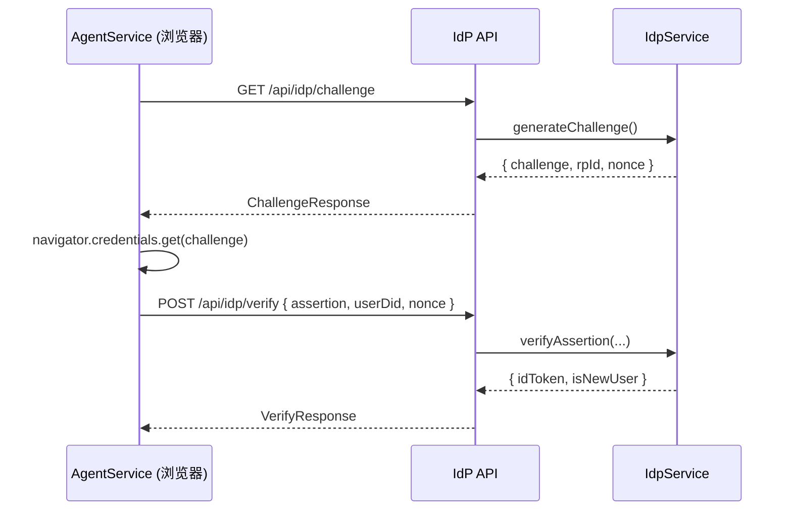

# Passkey 验证集成方案

> 适用范围：`cadop-service`（IdP）与 `cadop-web`（客户端）之间基于 WebAuthn 的身份验证。
>
> 目标：在保持去中心化 `did:key` 自生成的前提下，引入基于 Passkey 的真实断言验签，替换当前仅校验 nonce 的简化逻辑。

---

## 1. 时序概览



- `challenge` ：≥128 bit 随机字节，base64url 编码
- `nonce` ：与 `challenge` 一一映射，最终写入 `idToken` 用于防重放
- `assertion` ：`PublicKeyCredential` 序列化 JSON

---

## 2. 接口约定

### 2.1 ChallengeResponse `GET /api/idp/challenge`

```ts
interface ChallengeResponse {
  challenge: string; // base64url
  rpId: string; // 由服务端配置
  nonce: string; // uuid
}
```

### 2.2 VerifyRequest `POST /api/idp/verify`

```ts
interface VerifyRequest {
  assertion: PublicKeyCredentialJSON;
  userDid: string;
  nonce: string;
}
```

### 2.3 VerifyResponse（保持不变）

```ts
interface VerifyResponse {
  idToken: string;
  isNewUser: boolean;
}
```

---

## 3. 服务端实现

### 3.1 依赖

```bash
pnpm add @simplewebauthn/server @simplewebauthn/types
```

Node ⩾ 20 可原生验证 Ed25519；如需兼容旧版 Node，可在注册阶段排除 `-8`（Ed25519）算法，仅允许 `ES256`（-7）。

### 3.2 IdpService 更新

1. **generateChallenge()**
   - `randomBytes(32)` → base64url 生成 `challenge`
   - 生成 `nonce` (uuid)
   - `Map<challenge, { nonce, ts }>` 持久 5 min，用于后续验签
2. **verifyAssertion(assertion, userDid, nonce)**
   1. 解析 `clientDataJSON.challenge`，匹配缓存并比对 nonce
   2. 根据 `DidKeyCodec.parseDidKey(userDid)` 得到公钥；转 `COSE` 格式
   3. 调用 `verifyAuthenticationResponse({ ... })`
   4. `verified === true` 时删除缓存并签发 `idToken`

### 3.3 路由调整

```text
GET  /api/idp/challenge   -> IdpService.generateChallenge()
POST /api/idp/verify      -> IdpService.verifyAssertion()
```

---

## 4. 浏览器端实现

### 4.1 PasskeyService

新增 `authenticateWithChallenge(options: PublicKeyCredentialRequestOptionsJSON)`：

- 调用 `navigator.credentials.get()` 获得断言
- 返回 `{ assertionJSON, userDid }`

### 4.2 AgentService

`getIdToken()` 流程调整：

1. `GET /api/idp/challenge`
2. `passkeyService.authenticateWithChallenge(challenge)`
3. `POST /api/idp/verify` 取得 `idToken`

---

## 5. 安全注意事项

- **Origin / RP ID 校验**：`expectedOrigin` 必须严格匹配当前站点 `https://<hostname>`；`expectedRPID` = `rpId`。
- **挑战过期**：后台定时清理 `Map`，防止内存膨胀 & 重放。
- **算法兼容**：若浏览器或 Node 版本不支持 Ed25519，需在 Passkey 注册阶段排除 `-8`。
- **生产环境存储**：`Map` 仅示例，可替换 Redis 等带 TTL 的持久存储。

---

## 6. 任务拆分 Checklist

- [ ] cadop-api 安装依赖 & 实现 `IdpService.generateChallenge`
- [ ] cadop-api 实现 `IdpService.verifyAssertion`（使用 simplewebauthn）
- [ ] 更新 Express 路由 `/challenge` & `/verify`
- [ ] cadop-web: `PasskeyService.authenticateWithChallenge`
- [ ] cadop-web: `AgentService.getIdToken` 调整
- [ ] 单元测试：
  - 挑战过期、重放
  - 验签失败场景
  - 多算法覆盖

---

> 完成以上步骤后，即可在前后端均使用真实 Passkey 断言完成基于 DID 的 JWT 身份验证。
