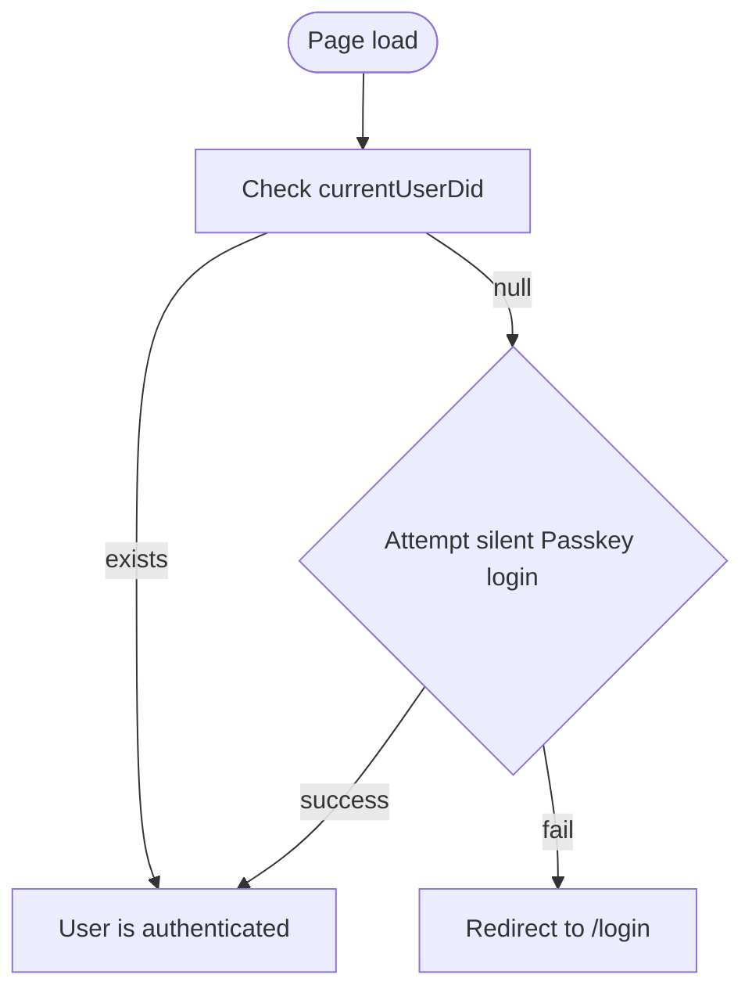

# Cadop Web Authentication Flow (v1)

This document describes how the front-end determines login state, restores a session, and guides the user through signing in or creating a new identity.  It complements `local-storage-design.md`, which focuses on **data shape** and **storage APIs**.

---

## 1  Login State Definition

* A user is considered **authenticated** when
  `AuthStore.getCurrentUserDid()` returns a non-null DID string.
* All components that need auth context should rely on `AuthStore` (or the React `AuthContext` wrapper) rather than touching storage directly.

---

## 2  App Bootstrap Flow

Steps in words:
1. On app start, `AuthProvider` calls `AuthStore.getCurrentUserDid()`.
2. If a DID exists ⇒ user stays signed in.
3. If missing, `PasskeyService.login()` is invoked with `{ mediation: 'silent' }`.
   * Success ⇒ DID found via `UserStore.findUserByCredential()` → `AuthStore.setCurrentUserDid()`.
   * Failure ⇒ redirect to **LoginPage**.

---

## 3  Login Page (`/login`) Flows

Initial release implements two buttons; a third option is stubbed for future work.

| Option | Action | API Calls |
|--------|--------|-----------|
| A. **Sign in with Passkey** | Runs `PasskeyService.login()` (user gesture) | `navigator.credentials.get` → `AuthStore.setCurrentUserDid()` |
| B. **Create new DID** | Runs `PasskeyService.ensureUser()` which triggers registration | `navigator.credentials.create` → `UserStore.addCredential()` → `AuthStore.setCurrentUserDid()` |
| C. *Enter DID manually* (future) | For read-only exploration; sets `AuthStore.setCurrentUserDid(did)` if syntactically valid | – |

Notes:
* Button A relies on the platform authenticator to pick an existing Passkey.
* If the credential chosen by the user does **not** exist in `UserStore`, the call fails with "Credential not found in local storage" – the UI must surface this error.
* Option C is not implemented in v1 but the layout leaves space so it can be added without redesign.

---

## 4  AuthContext Responsibilities

`AuthContext.tsx` will wrap the storage APIs:

* `state.isAuthenticated` ⇒ `!!AuthStore.getCurrentUserDid()`
* `signInWithDid(did)` ⇒ `AuthStore.setCurrentUserDid(did)`
* `signOut()` ⇒ `AuthStore.clearCurrentUser()`
* On mount, run the bootstrap flow described in §2.

No direct `localStorage` access should remain inside React components.

---

## 5  Extension Points

1. **Manual DID input / read-only mode** – when implemented, the UI must warn that signing transactions is impossible without a Passkey.
2. **Multiple Passkeys / multiple DIDs** – later versions can list `UserStore.getAllUsers()` so users can switch identity explicitly.
3. **Backup & Restore** – once export/import of `nuwa:v1` JSON is available, the login page can offer an *Import backup* button.

---

## 6  Relationship to Storage APIs

* Authentication mutates **only** the `currentUserDid` field (via `AuthStore`).
* Registration adds a credential & DID via `UserStore.addCredential()`.
* Agent minting adds an Agent DID via `UserStore.addAgent()` (see `AgentService`).

Refer to `local-storage-design.md` for the underlying data schema. 