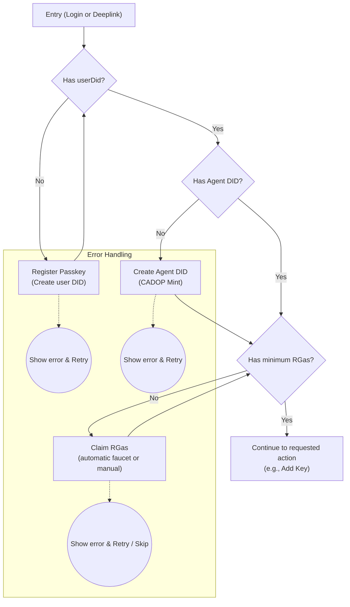

# Cadop Web Onboarding Flow (v1)

> 本文档描述了 _cadop-web_ 前端在**登录页**以及任何带 deeplink（例如 `/add-key`）直接进入应用时的统一引导流程。目标是确保用户始终满足以下前置条件后再继续其原始操作：
>
> 1. 已创建 user DID（即已注册 Passkey）
> 2. 至少存在一个 Agent DID
> 3. Agent DID 拥有最小 RGas 余额（可配置，例如 `0.1 RGAS`）

---

## 1. 设计目标

- **单一主线** —— 用一个守卫组件 `OnboardingGuard` 串起全部检查与创建逻辑，避免各页重复判断。
- **可中断可恢复** —— 每一步的进度持久化到 `localStorage / sessionStorage`，刷新或网络问题后可继续。
- **错误友好** —— 任何链上或网络错误均提示原因并允许重试或返回上一步。
- **入口统一** —— 普通登录、deeplink（如 `/add-key`）全部通过 `OnboardingGuard`，逻辑集中。

---

## 2. 流程总览



---

## 3. 关键步骤说明

| 步骤            | 说明                                                                 | 失败处理                          |
| --------------- | -------------------------------------------------------------------- | --------------------------------- |
| **AuthCheck**   | 读取 `NuwaStore.currentUserDid`，判断是否已有 user DID               | 无 user DID ⇒ 跳转 **PasskeyReg** |
| **PasskeyReg**  | 调用 `PasskeyService.register()` 创建 Passkey 并生成 DID             | 显示错误 →「重试」                |
| **AgentCheck**  | `UserStore.listAgents(userDid)` 数组为空则继续 **AgentCreate**       | –                                 |
| **AgentCreate** | 使用 `AgentService.createAgent()` 触发 CADOP 链上 mint，轮询 tx 状态 | 错误/超时 →「重试」               |
| **GasCheck**    | 通过 Rooch SDK 获取余额，低于阈值则到 **ClaimGas**                   | –                                 |
| **ClaimGas**    | 调用 faucet API 或指引手动领取，成功后回到 **GasCheck**              | 领取失败 →「重试」或「跳过」      |

---

## 4. 组件设计

### 4.1 FlowContext

```ts
interface FlowState {
  step: 'auth' | 'passkey' | 'agent' | 'gas' | 'done';
  recordId?: string; // Agent 创建记录 ID
  error?: string;
}
```

- 写入 `sessionStorage`，中断后恢复。

### 4.2 OnboardingGuard

```tsx
function OnboardingGuard({ children }: { children: React.ReactNode }) {
  // 1. 检查 FlowState / NuwaStore，决定渲染哪一步
  // 2. 步骤全部完成后 => return <>{children}</>;
}
```

- 在 `routes` 中包裹需要前置条件的页面：

```tsx
<Route
  path="/add-key"
  element={
    <OnboardingGuard>
      <AddKeyPage />
    </OnboardingGuard>
  }
/>
```

### 4.3 Step 页面

| 组件                | 职责                                                                                  |
| ------------------- | ------------------------------------------------------------------------------------- |
| `CreatePasskeyStep` | 使用现有 `PasskeyService.register()` UI，成功后写 FlowState.step = 'agent'            |
| `CreateAgentStep`   | 展示进度条、轮询 `custodianClient.getStatus(recordId)`，成功写 FlowState.step = 'gas' |
| `ClaimGasStep`      | 自动请求 faucet，或手动按钮；成功写 FlowState.step = 'done'                           |

---

## 5. 错误与重试

- 每个 Step 捕获异常后将 `error` 写入 FlowState，并在 UI 上方展示 `ErrorBanner`。
- 用户点击「重试」时保留上一次有效参数（如 `recordId`）。
- 多次失败后允许「返回首页」终止流程。

---

## 6. deeplink 集成

1. 网关／外部页面在打开 cadop-web 时附带 `target` 查询串，例如：
   ```
   https://test-id.nuwa.dev/add-key?did=<agentDid>
   ```
2. 根路由解析 `target`，放入 `FlowContext.targetPath`。
3. `OnboardingGuard` 最后一步完成后 `navigate(targetPath)`。

---

## 7. 扩展方向

1. **多 Agent 支持**：在 `AgentCheck` 提供选择现有 Agent 或新建。
2. **余额提醒**：`GasCheck` 显示当前 RGas 并可手动刷新。
3. **Progressive Profiling**：后续可插入身份验证（Sybil 等级提升）作为额外 Step。

> 更新本流程时，请同步修改本文件及相关实现。
