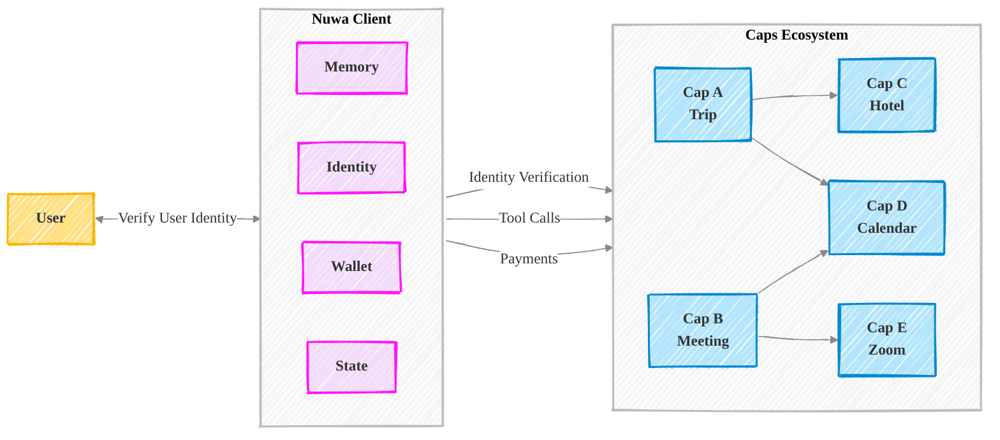

Nuwa introduces a unified infrastructure for building both the client AI agent with **Nuwa Client**, and the Caps, based on **Agent Cappability Protocol**.

## Fundemental Concepts

Learn more about the concepts behind Nuwa AI.

import { Cards } from 'nextra/components'
import { MdExtension, MdBuild } from "react-icons/md";
import { FaMoneyBillWave, FaRobot } from "react-icons/fa";
import { FaBrain, FaIdCard, FaWallet } from "react-icons/fa6";
import { MdOutlineSdStorage } from "react-icons/md";

<Cards num={2}>
  <Cards.Card icon={<MdExtension />} title="Cap" href="/docs/cap" />
  <Cards.Card icon={<FaMoneyBillWave />} title="Payment" href="/docs/payment" />
  <Cards.Card
    icon={<MdBuild />}
    title="MCP Compatibility"
    href="/docs/mcp-compatibility"
  />
  <Cards.Card
    icon={<FaRobot />}
    title="A2A Compatibility"
    href="/docs/a2a-compatibility"
  />
    <Cards.Card icon={<FaIdCard />} title="Identity" href="/docs/identity" />
  <Cards.Card icon={<FaWallet />} title="Wallet" href="/docs/wallet" />
  <Cards.Card
    icon={<MdOutlineSdStorage />}
    title="Agent State"
    href="/docs/agent-state"
  />
    <Cards.Card
    icon={<FaBrain />}
    title="Memory"
    href="/docs/agent-state#memory"
  />
</Cards>
