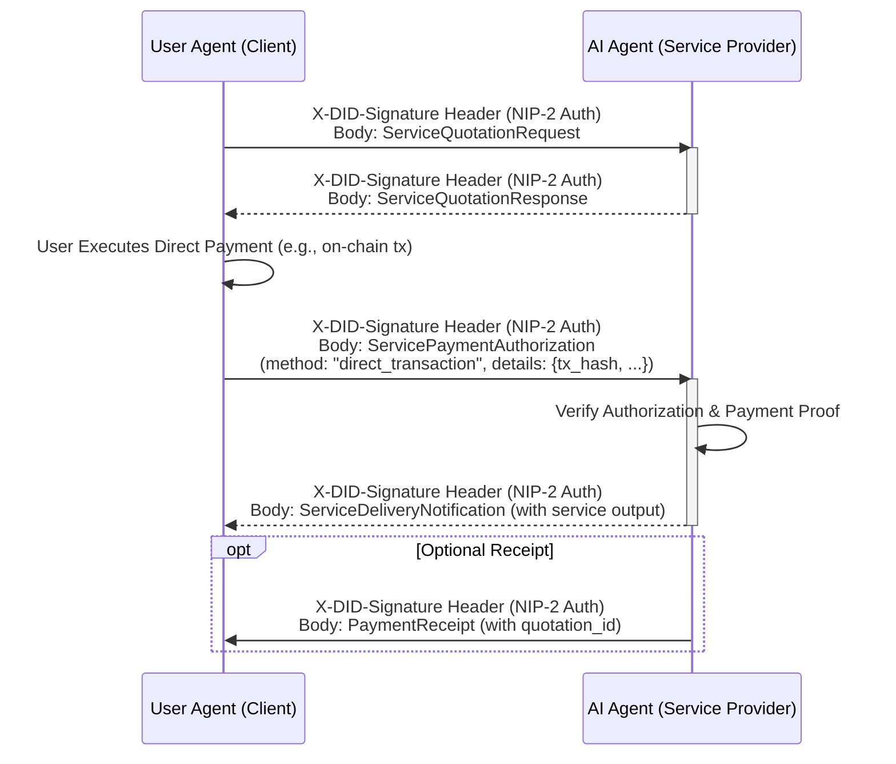
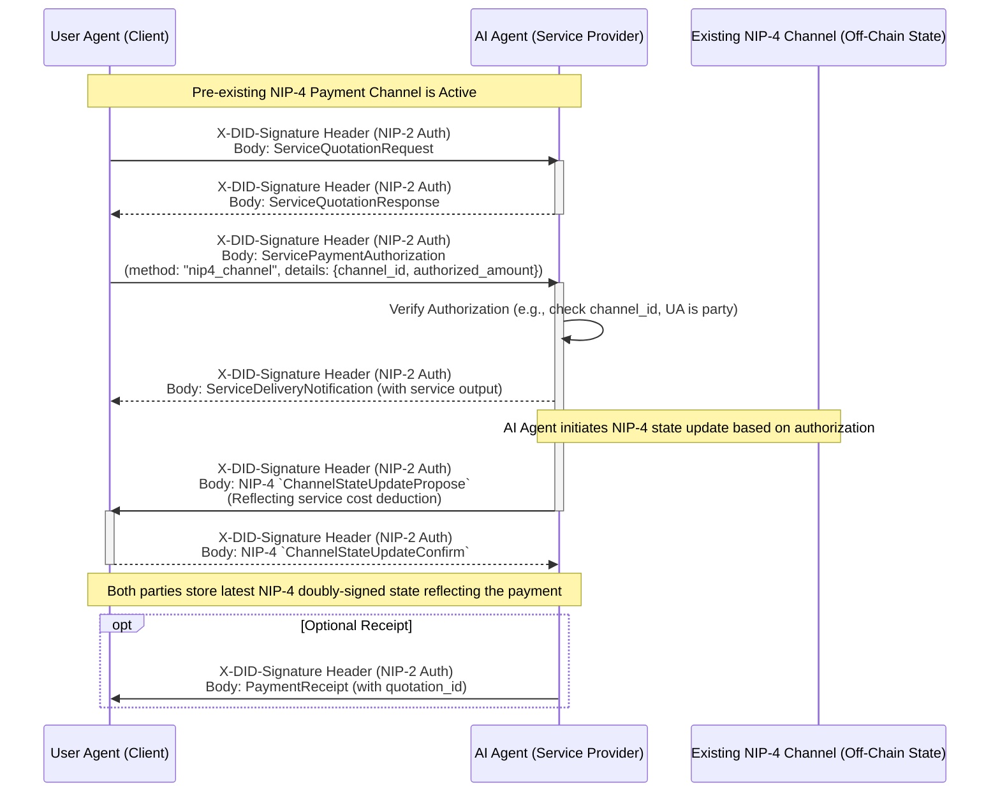

## Abstract

This NIP defines a protocol for on-demand payment for application-level services provided by AI Agents to User Agents (or other agents acting as clients) within the Nuwa ecosystem. It builds upon NIP-1 (DID Model) and NIP-2 (A2A Authentication) to enable secure and verifiable payment transactions. This protocol outlines mechanisms for User Agents to authorize payments for services, which can be settled either via direct pre-payment (e.g., an on-chain transaction) or by utilizing an existing NIP-4 payment channel. All service payments require explicit user authorization.

## Motivation

As AI Agents offer valuable computational or informational services, a standardized payment mechanism is crucial for incentivizing service provision and enabling a sustainable Agent economy. This protocol aims to provide a secure, transparent, and DID-based method for User Agents to pay AI Agents for their specific skills and services, ensuring that payments are tied to verifiable identities and communication is authenticated. This facilitates a clear economic model for application-level interactions.

## Specification

### Scope of this NIP

This NIP specifically addresses the payment mechanisms for **application-level services or skills rendered by an AI Agent (Service Provider) to a User Agent (Client)**. Examples include an AI Agent performing a computation, providing information, generating content, or executing a task on behalf of the User Agent.

Payments related to the underlying A2A communication protocol itself (e.g., fees for message relay, network participation, or NIP-4 payment channel usage for protocol fees) are considered distinct from the service-level payments defined herein and are out of scope for NIP-11.

NIP-11 focuses on the direct value exchange for the application-level service provided, based on explicit user authorization.

This protocol relies on:
*   **NIP-1: Agent Single DID Multi-Key Model**: Used for identifying User Agents and AI Agents, and for managing cryptographic keys involved in signing payment-related messages.
*   **NIP-2: DID-Based A2A Authentication**: Used for securing the communication channel during payment negotiation and service requests, ensuring message integrity and origin authentication.
*   **NIP-4: A2A Payment Channel Protocol**: If an existing NIP-4 channel is used for payment, NIP-11 relies on NIP-4 for the channel's operational mechanics.

All messages exchanged within this payment protocol **must** be authenticated using the A2A authentication mechanism defined in NIP-2, where the `message.parts` of the A2A message would contain the specific NIP-11 payment protocol messages defined below.

### Relationship to NIP-4

NIP-4 defines a general-purpose A2A Payment Channel protocol. NIP-11 allows for service payments to be made using such a pre-existing NIP-4 payment channel if one is established between the User Agent and the AI Agent, and if the User Agent explicitly authorizes this payment method for a given service via the `ServicePaymentAuthorization` message.

If an NIP-4 channel is used:
*   The User Agent, through the `ServicePaymentAuthorization` message, authorizes the AI Agent to consider a specific service fee as paid from the balance of a specified NIP-4 channel.
*   The subsequent update of the NIP-4 channel state (e.g., via NIP-4's `ChannelStateUpdatePropose` and `ChannelStateUpdateConfirm` messages) to reflect this payment is governed by NIP-4's standard mechanisms.

This approach allows NIP-11 to focus on the application-level agreement and authorization for service payment, while leveraging the generic capabilities of NIP-4 for channel-based settlement without imposing NIP-11-specific constraints on NIP-4 channel operations.

### Roles

*   **User Agent (Client)**: The entity requesting and paying for the AI Agent's service.
*   **AI Agent (Service Provider)**: The entity providing the service and receiving payment.

### Skill Advertisement and Discovery

AI Agents offering services for payment via this protocol should advertise their available skills in the `skills` array of their A2A Agent Card. As per the A2A specification, each element in this array is an `AgentSkill` object. The `skill_id` used in NIP-11 payment protocol messages (e.g., `ServiceQuotationRequest`) **must** correspond to the `id` field of one of the `AgentSkill` objects listed in the AI Agent's A2A Agent Card.

User Agents should fetch and inspect an AI Agent's Agent Card to discover the available skills. For each skill, the User Agent will find an `AgentSkill` object, and the value of its `id` field is what should be used as the `skill_id` in payment protocol messages.

For example, an AI Agent's A2A Agent Card might include a `skills` array like this:

```json
{
  // ... other standard Agent Card fields (id, name, description, capabilities, endpoints, etc.)
  "skills": [
    {
      "id": "text-generation-xl",
      "name": "Text Generation (XL Model)",
      "description": "Generates text using an extra-large language model.",
      "tags": ["text", "llm", "generation"],
      "examples": ["Write a poem about a robot learning to paint."]
    },
    {
      "id": "image-analysis-v2",
      "name": "Image Analysis Service v2",
      "description": "Analyzes images to identify objects and scenes.",
      "tags": ["image", "vision", "ai"],
      "examples": ["What objects are in this picture? {image_url_or_data}"]
    }
    // ... other AgentSkill objects
  ]
  // ...
}
```
A User Agent wishing to pay for the text generation service would use `"text-generation-xl"` as the `skill_id` in its `ServiceQuotationRequest`.

### Payment Flow Overview

The protocol supports two primary approaches for service payment, both requiring explicit authorization from the User Agent via the `ServicePaymentAuthorization` message:

#### 1. Direct Service Payment Model

This model involves a direct payment for a single service instance:
1.  **Service Discovery & Quotation Request**: User Agent discovers an AI Agent (e.g., by resolving its DID and fetching its Agent Card), identifies a desired `skill_id` from the agent's advertised skills, and requests a quotation for that specific skill.
2.  **Quotation Response**: AI Agent provides a signed quotation, including service details, price, and payment instructions for direct payment.
3.  **Payment Authorization & Execution**: User Agent executes the direct payment (e.g., an on-chain transaction) and then sends a `ServicePaymentAuthorization` message to the AI Agent. This message indicates the "direct_transaction" method and includes proof of payment (e.g., transaction hash).
4.  **Service Delivery**: AI Agent verifies the `ServicePaymentAuthorization` and the payment proof, then delivers the requested service.
5.  **Receipt (Optional)**: AI Agent issues a signed receipt for the service rendered and payment received.

#### 2. Service Payment using an Existing NIP-4 Channel

This model allows leveraging an existing NIP-4 payment channel for service payments, if one is already established between the User Agent and AI Agent:
1.  **Service Discovery & Quotation Request**: User Agent discovers an AI Agent, identifies a `skill_id`, and requests a quotation. (It is assumed an NIP-4 channel already exists or is established independently via NIP-4 procedures if this payment method is contemplated).
2.  **Quotation Response**: AI Agent provides a signed quotation.
3.  **Payment Authorization**: User Agent sends a `ServicePaymentAuthorization` message to the AI Agent. This message indicates the "nip4_channel" method, specifies the `channel_id` of the existing NIP-4 channel, and confirms the `authorized_amount` (from the quotation) to be debited.
4.  **Service Delivery**: AI Agent verifies the `ServicePaymentAuthorization` (e.g., confirms the channel exists and the UA is a party) and then delivers the requested service.
5.  **NIP-4 Channel Update**: Subsequent to service delivery, the AI Agent, based on the User Agent's authorization, initiates a standard NIP-4 channel state update (e.g., NIP-4 `ChannelStateUpdatePropose`) to debit the authorized amount from the channel. The User Agent confirms this with a NIP-4 `ChannelStateUpdateConfirm`. This step strictly follows NIP-4 procedures.
6.  **Receipt (Optional)**: AI Agent issues a signed receipt.

The key NIP-11 step in both models is the `ServicePaymentAuthorization`. If an NIP-4 channel is used, the subsequent interactions for channel state update are standard NIP-4 operations triggered by this NIP-11 authorization.

### Message Types

#### 1. `ServiceQuotationRequest` (User Agent -> AI Agent)

*   **Purpose**: To request a price quotation for a specific skill.
*   **Structure** (`message.parts` content):
    ```json
    {
      "type": "ServiceQuotationRequest",
      "skill_id": "unique_identifier_for_the_skill", // E.g., "text-generation-xl", "image-analysis-v2", corresponding to an entry in the Agent's A2A Agent Card skills array
      "request_details": { ... } // Specific parameters for the skill
    }
    ```

#### 2. `ServiceQuotationResponse` (AI Agent -> User Agent)

*   **Purpose**: To provide a quotation for the requested skill. This message **must** be signed by the AI Agent's DID key.
*   **Structure** (`message.parts` content):
    ```json
    {
      "type": "ServiceQuotationResponse",
      "skill_id": "unique_identifier_for_the_skill",
      "quotation_id": "unique_identifier_for_this_quotation", // Generated by AI Agent
      "price": {
        "amount": "100", // Amount as a string to avoid precision issues
        "currency": "USD" // Or other supported currency/token identifier like "USD"
      },
      "payment_instructions": { // Primarily for direct payment
        "method": "on_chain_transfer", // e.g., "on_chain_transfer", "lightning_invoice"
        "memo_required": false // Optional: if a memo is needed for the transaction
      },
      "expires_at": "timestamp_unix_epoch" // Quotation validity
    }
    ```

#### 3. `ServicePaymentAuthorization` (User Agent -> AI Agent)

*   **Purpose**: To convey the end-user\'s explicit authorization, obtained via the User Agent\'s interface, for payment of a quoted service. It also specifies the chosen payment method and provides necessary details. This message **must** be signed by the User Agent\'s DID key, representing the user\'s consent.
*   **Structure** (`message.parts` content):
    ```json
    {
      "type": "ServicePaymentAuthorization",
      "quotation_id": "unique_identifier_for_this_quotation",
      "payment_method": "on_chain_transfer" | "lightning_invoice" | "nip4_channel", // Specific chosen payment method. Extensible for other direct payment types.
      "payment_details": { 
        // Conditional structure based on payment_method
        // Example for "on_chain_transfer":
        // "transaction_hash": "0x...", 
        // "network_id": "rooch_mainnet", // Optional: if specified in quotation or contextually clear
        // "proof_details": { ... } 

        // Example for "lightning_invoice":
        // "payment_hash": "sha256_hash_of_preimage",
        // "preimage": "secret_preimage_if_required_for_proof", // Optional
        // "invoice_id": "lnbc..." // Optional, for reconciliation

        // Example for "nip4_channel":
        // "channel_id": "existing_nip4_channel_id_from_NIP-4_flow",
        // "authorized_amount": { "amount": "100", "currency": "USD" } // Should match quotation price
      }
    }
    ```
    *   **If `payment_method` is `"on_chain_transfer"`**: `payment_details` **must** include `transaction_hash` (string). Optionally, `network_id` (string) if needed for disambiguation (especially if not uniquely defined in the quotation), and `proof_details` (object) for any additional verification data.
    *   **If `payment_method` is `"lightning_invoice"`**: `payment_details` **must** include fields relevant for Lightning payment proof, such as `payment_hash` (string). Optionally, `preimage` (string) if its revelation is part of the agreed proof mechanism, and `invoice_id` (string) for easier reconciliation by the AI Agent.
    *   **If `payment_method` is `"nip4_channel"`**: `payment_details` **must** include `channel_id` (string, the ID of the existing NIP-4 channel to be used) and `authorized_amount` (object, confirming the amount and currency from the quotation to be debited from the channel, e.g., `{"amount": "100", "currency": "USD"}`).

#### 4. `ServiceDeliveryNotification` (AI Agent -> User Agent)

*   **Purpose**: To notify the User Agent that the service is being delivered or to include the service output directly if small. This message **must** be signed by the AI Agent's DID key.
*   **Structure** (`message.parts` content):
    ```json
    {
      "type": "ServiceDeliveryNotification",
      "quotation_id": "unique_identifier_for_this_quotation",
      "status": "success", // or "failure" with an error message
      "service_output": { ... } // Actual service output or a reference to it
    }
    ```

#### 5. `PaymentReceipt` (AI Agent -> User Agent, Optional)

*   **Purpose**: To provide a formal receipt for the payment and service. This message **must** be signed by the AI Agent's DID key.
*   **Structure** (`message.parts` content):
    ```json
    {
      "type": "PaymentReceipt",
      "quotation_id": "unique_identifier_for_this_quotation", // If for single pre-payment
      "payer_did": "did:example:user_agent_did",
      "payee_did": "did:example:ai_agent_did",
      "amount_paid": {
        "amount": "100",
        "currency": "USD" // Or "USD", etc.
      },
      "service_description": "Description of single service rendered",
      "transaction_date": "timestamp_unix_epoch"
    }
    ```

### Detailed Flow with A2A Authentication

#### Direct Service Payment Model Flow



#### Service Payment using Existing NIP-4 Channel Flow


### Payment Methods

*   **Direct Payment**: Payment is made directly from the User Agent to the AI Agent using a method specified in the `ServiceQuotationResponse` (e.g., `"on_chain_transfer"`, `"lightning_invoice"`). The User Agent must provide proof of this transaction in the `ServicePaymentAuthorization` message, with `payment_method` matching the chosen direct method and `payment_details` appropriate for that method.
*   **NIP-4 Channel**: Payment is made by debiting an existing NIP-4 payment channel between the User Agent and the AI Agent. The User Agent authorizes this by specifying `payment_method: "nip4_channel"` and including the `channel_id` and the `authorized_amount` in the `ServicePaymentAuthorization` message.

## Rationale

The design choices in this NIP aim to provide a flexible and secure payment framework for A2A service interactions.
*   **Two Payment Approaches**: Offering both a direct payment model and the ability to leverage existing NIP-4 channels caters to different user preferences and scenarios.
*   **User Authorization**: The `ServicePaymentAuthorization` message is central, ensuring explicit user consent for every service payment and the chosen method.
*   **Modularity and Reusability**: By not defining its own channel mechanics, NIP-11 avoids duplicating NIP-4 functionality. It focuses on the application-level agreement to pay for a service, allowing NIP-4 to handle channel operations if that payment method is chosen.
*   **Extensibility**: The `payment_instructions` in `ServiceQuotationResponse` and `payment_details` in `ServicePaymentAuthorization` can be adapted for various direct payment methods.
*   **DID-Based**: Leveraging DIDs (NIP-1) and A2A authentication (NIP-2) ensures that all payment-related communications are between authenticated parties.
*   **Clear Message Flow**: The defined message types and sequences aim for clarity in both payment approaches.


## Backwards Compatibility

This NIP introduces a new protocol for A2A service payments. It does not alter or replace any existing NIPs in a way that would cause backwards incompatibility. Agents not implementing this NIP will simply be unable to participate in these specific payment flows.

## Test Cases

Test cases are highly recommended and should cover:
*   Successful `ServiceQuotationRequest` and `ServiceQuotationResponse` exchange.
*   Successful `ServicePaymentAuthorization` using the `"direct_transaction"` method, including valid payment proof.
*   Successful `ServicePaymentAuthorization` using the `"nip4_channel"` method, referencing a valid, existing NIP-4 channel.
*   Correct `ServiceDeliveryNotification` after successful payment verification.
*   Optional `PaymentReceipt` generation and validation.
*   AI Agent correctly initiates NIP-4 `ChannelStateUpdatePropose` after service delivery when payment was authorized via `"nip4_channel"`.
*   User Agent correctly responds with NIP-4 `ChannelStateUpdateConfirm` to an AI Agent's proposal.
*   Handling of invalid messages (e.g., incorrect signatures, malformed JSON, mismatched `quotation_id`).
*   Error conditions:
    *   Payment verification failure for `"direct_transaction"`.
    *   `ServicePaymentAuthorization` referencing a non-existent or unauthorized NIP-4 channel.
    *   Quotation expiry.
    *   Insufficient funds in an NIP-4 channel (handled by NIP-4 mechanisms, but NIP-11 interaction should fail gracefully if authorization cannot be acted upon).

(Specific test vectors and scenarios to be detailed in a companion document or repository.)

## Reference Implementation

A reference implementation is planned to demonstrate the protocol in action.
*   Links to the reference implementation(s) will be added here once available.

## Security Considerations

*   **Authentication**: All payment protocol messages are wrapped within the A2A communication framework (NIP-2), ensuring that both the User Agent and AI Agent can verify the authenticity and integrity of messages.
*   **Replay Attacks**: The `nonce` and `timestamp` mechanisms in NIP-2 protect against replay attacks for the payment messages themselves. `quotation_id`s **must** be unique to prevent replay of old quotations. `ServicePaymentAuthorization` messages **must** reference unique `quotation_id`s.
*   **Payment Verification (Direct Transaction)**: For the `"direct_transaction"` method, AI Agents are responsible for robustly verifying the `payment_details` (e.g., confirming transaction finality on the blockchain) before delivering the service.
*   **Dispute Resolution**: This NIP does not define a formal on-protocol dispute resolution mechanism. Disputes arising from service quality or payment discrepancies would need to be handled out-of-band or by future NIPs.
*   **Price Fluctuation**: For volatile cryptocurrencies, the `expires_at` field in `ServiceQuotationResponse` is crucial.

#### Security for NIP-4 Channel Usage
*   **Authorization Integrity**: The `ServicePaymentAuthorization` message, when specifying `payment_method: "nip4_channel"`, **must** be diligently verified by the AI Agent. This includes ensuring the message is authentically signed by the User Agent, the referenced `channel_id` is valid and active, the User Agent is a party to that channel, and the `authorized_amount` matches the quotation.
*   **Channel Security**: The actual security of the payment transfer via an NIP-4 channel (e.g., protection against double-spending, integrity of channel state, dispute resolution during NIP-4 settlement) relies entirely on the mechanisms defined and implemented by NIP-4. NIP-11 assumes a secure and functional NIP-4 channel is being referenced. NIP-11's role is limited to the agreement and authorization to use this channel for a specific service payment.
*   **User Consent and Clarity**: It is critical that the User Agent's interface clearly explains to the user that authorizing payment via an NIP-4 channel will lead to a deduction from that channel's balance. This deduction occurs when the AI Agent initiates, and the User Agent confirms, a standard NIP-4 state update post-service delivery.
*   **No NIP-11 State Management for Channels**: NIP-11 itself does not maintain any payment state related to NIP-4 channels; it only facilitates the one-time authorization to use the channel for a specific service payment. The channel's state, including balances, is managed solely by NIP-4 interactions.
*   **Liveness for NIP-4 Updates**: After service delivery based on a `nip4_channel` authorization, the AI Agent relies on the User Agent's liveness to confirm the NIP-4 `ChannelStateUpdateConfirm`. NIP-4 should define mechanisms to handle unresponsive parties.

## 🚀 Future Considerations

*   **Atomic Swaps/Escrow**: For more trustless interactions, integrating atomic swaps or smart contract-based escrow mechanisms could ensure that payment is only released upon successful service delivery.
*   **Subscription Models**: Extending the protocol to support recurring payments for ongoing services, potentially leveraging state channels or new message types.
*   **Reputation System**: Linking payment success/failure and service quality to a decentralized reputation system for Agents to build trust.
*   **Multi-Currency Support**: Formalizing how multiple currencies can be negotiated and handled, especially in `ServiceQuotationResponse` and state channel agreements.

This NIP provides a foundational layer for A2A payments. Further enhancements and specific payment method integrations can be proposed in subsequent NIPs or extensions.

## Copyright

Copyright and related rights waived via [CC0](https://creativecommons.org/publicdomain/zero/1.0/).
