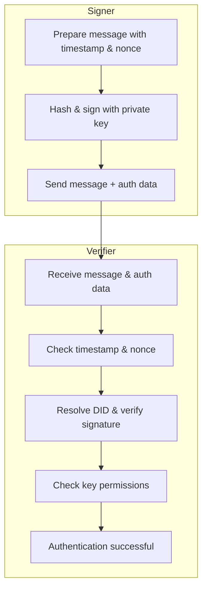

## Abstract

This specification defines a general-purpose, decentralized authentication protocol based on NIP-1 DIDs. It enables any entity with a DID to prove its identity and the integrity of a message or request. The protocol leverages cryptographic signatures generated using keys associated with a DID, as registered in the corresponding DID document. It outlines a core authentication mechanism and then details its application across various communication patterns, including Agent-to-Agent (A2A) messaging, JSON-RPC services, and RESTful APIs, primarily utilizing the standard HTTP `Authorization` header or embedded authentication structures for non-HTTP contexts.

## Motivation

As decentralized systems and agent-based architectures evolve, a standardized, flexible, and secure authentication mechanism is crucial. NIP-1 provides a foundational DID key model. This NIP builds upon that by specifying how these DIDs and their associated keys can be used for robust authentication across diverse interaction protocols. The goal is to provide a unified approach to verifying the origin and integrity of communications, whether between autonomous agents, clients and servers, or other interacting components. This NIP addresses the need for a common authentication layer adaptable to HTTP-based interactions (like REST APIs and RPC over HTTP using the standard `Authorization` header) as well as other message-oriented protocols.

## Specification

### Core DID Authentication Mechanism

This section describes the fundamental components and processes common to all applications of this DID-based authentication protocol.

#### 1. Authentication Data Structure

At its core, the authentication information relies on the following data elements, typically serialized as a JSON object:

```json
{
  "signer_did": "did:example:...",
  "key_id": "did:example:...#key-id",
  "signature_value": "..."
}
```
Where:
*   `signer_did`: DID of the entity performing the authentication.
*   `key_id`: Full key ID (verificationMethod id from DID doc) used for signing.
*   `signature_value`: Cryptographic signature (Base64 or Hex encoded).

#### 2. Signed Content and Hashing

The `signature_value` is a cryptographic signature calculated over a hash of the content being authenticated.

**Hashing Process:**
`hash = HASH_ALGORITHM(domainSeparator + contentToSign)`

*   `HASH_ALGORITHM`: A strong cryptographic hash function (e.g., SHA256). The specific algorithm should be implied by the key type or explicitly defined by the application protocol.
*   `domainSeparator`: A protocol-specific string that clearly identifies the context of the signature. To prevent cross-protocol replay attacks, this value should be unique for each protocol (e.g., `"DIDAuthV1:"` for this NIP). **For all HTTP-based implementations of this NIP (REST, JSON-RPC over HTTP, etc.), the `domainSeparator` is fixed to `"DIDAuthV1:"`.**
*   `contentToSign`: The actual data whose integrity and origin are being authenticated. For this protocol, it is a JSON object which is then canonicalized into a string. The object **must** include a `timestamp` (e.g., Unix timestamp in seconds) and a `nonce` (a unique random string) to prevent replay attacks.
    When used in contexts like HTTP APIs where a signature could be replayed to a different service that also uses this protocol, the `contentToSign` payload **must** also include an `audience` field. The value of this field should be a unique identifier for the service, typically its canonical URL (e.g., `https://api.example.com`). This serves as a critical defense against cross-service replay attacks.
    An example of the JSON object before canonicalization:
    ```json
    {
      "operation": "transfer",
      "params": { "to": "did:example:bob", "amount": "100" },
      "audience": "https://service-a.com/api",
      "nonce": "random_nonce_123",
      "timestamp": 1715600000
    }
    ```
*   Application-specific data can be included, such as `operation` and `params`.

#### 3. General Authentication Flow (Conceptual)

The flow involves a **Signer** (the entity authenticating) and a **Verifier** (the entity validating the authentication).



**Simplified Steps:**

1. **Prepare & Sign (Signer):** Build the message containing `timestamp`, `nonce`, **and (for HTTP scenarios) an `audience` field identifying the target service**, hash it with the fixed `domainSeparator`, and sign the hash.
2. **Transmit (Signer):** Send the message together with `{signer_did, key_id, signature_value}` (e.g., in an HTTP header or embedded field).
3. **Replay Protection (Verifier):** Ensure `timestamp` is fresh, `nonce` is unique for the `signer_did`, **and (if present) that `audience` matches this service's canonical URL**.
4. **Signature Verification (Verifier):** Resolve the signer's DID, locate the public key for `key_id`, and verify the signature.
5. **Permission Check & Result (Verifier):** Confirm the key is authorised for `authentication`; if everything checks out, accept the request.

### Application: HTTP-based Authentication (REST APIs, RPC over HTTP)

For services communicating over HTTP (e.g., RESTful APIs, JSON-RPC over HTTP), authentication is conveyed via the standard `Authorization` HTTP header.

#### 1. HTTP Header

The `Authorization` HTTP header is used with the `DIDAuthV1` scheme. The header is constructed as follows:

`Authorization: DIDAuthV1 <credentials>`

Where `<credentials>` **must** be the **Base64url encoding** of the UTF-8 encoded JSON string representing the Core Authentication Data Structure.

#### 2. Signed Content (`contentToSign`)

For HTTP-based authentication, `contentToSign` typically includes:
*   The **full HTTP request body**.
*   Optionally, other parts of the HTTP request (e.g., method, path, relevant headers) can be canonicalized and included if they need to be part of the integrity check. The exact definition of `contentToSign` must be specified by the API or service.
*   Crucially, the `timestamp` and `nonce` values used in the hashing process **must** be present in the request body or headers, as defined by the service, to allow the verifier to perform replay protection.
*   The `domainSeparator` is `"DIDAuthV1:"`, the payload MUST include an `audience` field (as defined in the Core Mechanism) whose value is this service's canonical URL. This enables the verifier to reject signatures that were created for a different service instance.


#### 3. Error Handling

Failures should result in standard HTTP error responses (e.g., `401 Unauthorized`, `400 Bad Request`), potentially with a JSON body detailing the specific error based on NIP-2 codes (see "General Error Codes" below).

### Application: Agent-to-Agent (A2A) Communication

For Agent-to-Agent (A2A) communication:
*   If the A2A communication occurs over HTTP, the HTTP-based authentication method described above (using the `Authorization: DIDAuthV1 <credentials>` header) **should** be used.
*   If A2A communication uses a non-HTTP transport, or if direct embedding of authentication data within the message payload is preferred for specific protocol reasons, the following embedded mechanism can be used.

> **Note**: While `@nuwa-ai/identity-kit` provides the core cryptographic primitives (`createSignature`) required for this flow, the reference implementation for the full A2A embedded authentication structure and protocol will be provided in a separate, specialized A2A SDK.

#### 1. Protocol Identifier (for embedded method)

The scheme is identified by `did-auth-v1`.

#### 2. Embedded Authentication Structure (for non-HTTP or preferred embedding)

An A2A message requiring authentication (when not using the HTTP `Authorization` header method) would include a field (e.g., `authentication`) structured as:

```json
{
  "schemes": ["did-auth-v1"],
  "credentials": "<json_string_of_core_auth_data>"
}
```
Where `credentials` is the JSON string of the Core Authentication Data Structure.

#### 3. Signed Content (`contentToSign`) (for embedded method)

For A2A using the embedded method, `contentToSign` is typically the `message.parts` object (or a similar well-defined part of the A2A message payload), which **must** include `timestamp` and `nonce`.

**Example `domainSeparator` for A2A (embedded method):** `"EXAMPLE_A2A_EMBEDDED_AUTH_V1:"`

#### 4. Error Handling (for embedded method)

Errors are typically handled according to the A2A protocol's error reporting mechanisms, using NIP-2 error codes (see "General Error Codes" below).

### General Error Codes

These error codes can be adapted for use in HTTP responses or embedded error structures.

*   **DID Resolution Failed**: Could not resolve `signer_did` or fetch the DID document. (e.g., JSON-RPC: `-32004`)
*   **Key Not Found**: `key_id` not found in the DID document. (e.g., JSON-RPC: part of `-32001`)
*   **Permission Denied**: `key_id` not present in the required verification relationship (e.g., `authentication`). (e.g., JSON-RPC: part of `-32001`)
*   **Invalid Signature**: Signature verification failed. (e.g., JSON-RPC: part of `-32001`)
*   **Replay Attack Detected**: `nonce` reused or invalid `timestamp`. (e.g., JSON-RPC: `-32005`)
*   **Invalid Authentication Format**: Authentication data (e.g., `Authorization` header with `DIDAuthV1` scheme, or `credentials` field in embedded A2A) is missing, malformed, or fails decoding/parsing. (e.g., HTTP: `400 Bad Request`; JSON-RPC: `-32602 Invalid Params`)
*   **Authentication Required**: Authentication information was not provided. (e.g., HTTP: `401 Unauthorized`; JSON-RPC: `-32002`)
*   **Unsupported Scheme**: The authentication scheme is not supported (relevant if multiple schemes can be indicated, or if `DIDAuthV1` is not supported by the verifier). (e.g., JSON-RPC: `-32003`)

## Rationale

*(Placeholder: Detailed rationale to be added. Key design choices include: a general core mechanism for broad applicability, use of domain separators for security, inclusion of timestamp/nonce (and `audience`) for replay protection, specific adaptations for HTTP and A2A common patterns.)*

Using the standard `Authorization` HTTP header with a custom scheme (`DIDAuthV1`) for REST/RPC APIs aligns with common HTTP practices (e.g., `Bearer`, `Basic` schemes) and avoids proliferation of custom headers. This makes it easier for existing HTTP infrastructure and libraries to handle.
For A2A communication, prioritizing the HTTP `Authorization` header method when A2A occurs over HTTP promotes consistency. The embedded authentication data structure is provided for scenarios where A2A does not run over HTTP or where direct message-level security is preferred.
The JSON structure for authentication data is chosen for its widespread support and ease of parsing. Base64url encoding for the credentials in the `Authorization` header is standard for such use cases.

## Backwards Compatibility

*(Placeholder: Details on backwards compatibility to be added. This NIP defines new authentication mechanisms. Systems not implementing it will not understand the `Authorization` header with the `DIDAuthV1` scheme or the `did-auth-v1` scheme in embedded A2A messages. Services can choose to support multiple authentication schemes for transition periods.)*

## Test Cases

*(Placeholder: Test cases to be added, covering: valid/invalid signatures for HTTP and A2A, replay attempts, DID resolution failures, key permission issues, malformed headers/credentials.)*

## Reference Implementation

The official reference implementation for this protocol is part of the [`@nuwa-ai/identity-kit`](https://github.com/nuwa-protocol/nuwa/tree/main/nuwa-kit/typescript/packages/identity-kit) SDK. Specifically, its `auth/v1` module provides a complete implementation of the HTTP-based authentication flow:
-   `DIDAuth.v1.createSignature`: Creates a NIP-2 compliant signature object over a given payload.
-   `DIDAuth.v1.toAuthorizationHeader`: Encodes the signature object into the required `Authorization: DIDAuthV1 <credentials>` HTTP header format.
-   `DIDAuth.v1.verifyAuthHeader`: A server-side utility that parses an incoming `Authorization` header, performs replay protection (`timestamp`, `nonce`, **and `audience`**) checks, and verifies the signature's cryptographic validity against the signer's DID document.

These tools provide a robust foundation for services wishing to secure their APIs using this NIP.

## Security Considerations

*   **Inherited from NIP-1:** Security relies heavily on NIP-1's DID method security, key management, and DID document integrity.
*   **Replay Attacks:** Strict validation of `timestamp`, `nonce`, and (where applicable) `audience` is critical. Verifiers **must** maintain stateful nonce storage scoped by `signer_did` and `domainSeparator`. The nonce storage should be cleaned up periodically to prevent unbounded growth.
*   **Service Provider Identification:** Each service provider implementing the same protocol should use a unique identifier in its `domainSeparator` to prevent cross-service replay attacks. This is especially important when multiple services implement the same protocol.
*   **Nonce Management:**
    - Nonces should be generated using cryptographically secure random number generators.
    - Nonce storage should be implemented using distributed caching solutions for distributed service architectures.
    - Nonce validation should be scoped by both `signer_did` and `domainSeparator`.
    - Nonce storage should be cleaned up after the timestamp validation window expires.
*   **Transport Security:** Communication channels (e.g., HTTP, A2A transport) **must** use TLS/HTTPS or equivalent transport-layer security to protect confidentiality and integrity of the entire exchange, including authentication data.
*   **DID Resolver Security:** Verifiers must use a trusted DID resolver.
*   **Verification Relationship Check:** Verifiers **must** check that the signing key (`key_id`) is present in the appropriate verification relationship (usually `authentication`) in the DID document.
*   **Domain Separator:** The `domainSeparator` is crucial to prevent cross-protocol or cross-application signature replay. It must be unique and well-defined for each application of this NIP.
*   **Signature Scope (`contentToSign`):** The definition of `contentToSign` must be precise and cover all security-relevant parts of the message/request. Ambiguity can lead to vulnerabilities.
*   **Header/Credential Integrity:** For HTTP, ensure infrastructure (proxies, gateways) doesn't unintentionally modify or strip the `Authorization` header. For embedded credentials, ensure they are part of the overall message integrity protection if available.
*   **Key Compromise:** Revocation mechanisms for compromised keys (as defined by the DID method and NIP-1) are essential. Verifiers should fetch fresh DID documents or use a resolver that respects DID document caching and update rules.

## Copyright

Copyright and related rights waived via [CC0](https://creativecommons.org/publicdomain/zero/1.0/).