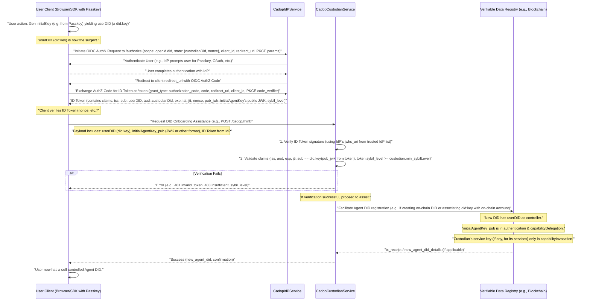

## Abstract

This Custodian-Assisted DID Onboarding Protocol (CADOP) specifies an off-chain protocol enabling Web2 users to easily create AI Agent DIDs (as defined in NIP-1). Users typically start by generating a `did:key` via a WebAuthn Passkey client-side. They then authenticate with a `CadopIdPService` (Identity Provider), which issues a token (e.g., ID Token or Verifiable Credential) attesting to the user's `did:key`, public key, and a Sybil resistance level. A `CadopCustodianService` (Custodian) consumes this token, verifies it, and then assists the user in registering their DID (e.g., by facilitating on-chain transactions if needed), ensuring the user is the `controller` of their Agent DID from inception with full `capabilityDelegation` rights. The Custodian's operational keys are only granted `capabilityInvocation` for its specific services within the user's DID document. Optional `Web2ProofServiceCADOP` instances can provide further Web2 claim verifications.

## Motivation

The primary goal of CADOP is to significantly lower the barrier for Web2 users to enter Web3 and AI Agent ecosystems. It achieves this by:
1.  Leveraging familiar client-side key generation (e.g., WebAuthn Passkeys for an initial `did:key`).
2.  Utilizing `CadopIdPService` (Identity Providers) to bridge Web2 authentication methods (like Passkeys, OAuth) with verifiable attestations about the user's client-generated DID and Sybil resistance level.
3.  Employing `CadopCustodianService` (Custodians) to consume these attestations and assist with the complexities of DID registration (e.g., gas payment), while ensuring user sovereignty from day one.

| Pain point                                            | Effect                                                                      | Solution offered by CADOP (with IdP and Custodian roles)                                                                                                                                                                                                                                                           |
| ----------------------------------------------------- | --------------------------------------------------------------------------- | ------------------------------------------------------------------------------------------------------------------------------------------------------------------------------------------------------------------------------------------------------------------------------------------------------------ |
| Web2 users often **lack crypto wallets/knowledge**      | High friction for DID creation/management; cannot sign initial transactions.  | User generates `did:key` via Passkey. `CadopIdPService` attests to this `did:key` + `sybil_level` after user auth. `CadopCustodianService` consumes attestation and assists with DID registration, ensuring user's initial key has `capabilityDelegation`.                                                               | 
| Need for **user-controlled identity** from start        | Concerns about vendor lock-in or custodian/IdP overreach.                   | User is `controller` of their DID from inception. IdP provides attestations. Custodian assists based on attestations. Both IdP and Custodian service keys (if in user's DID doc) only get `capabilityInvocation`. User can revoke access or migrate DID at any time.                                               |
| Need for **verifiable Sybil resistance** for new DIDs | Risk of anonymous DID spam or abuse if onboarding is too easy.              | `CadopIdPService` authenticates user and issues a verifiable `sybil_level` claim. `CadopCustodianService` uses this claim to apply policies (e.g., for gas sponsorship or access to certain features), mitigating Sybil attacks.                                                                             |
| Desire for **progressive decentralization**           | Users might start with `did:key` but want to upgrade or use other services. | User's full control (`capabilityDelegation`) allows them to update their DID (e.g., to an on-chain DID), manage keys, and grant/revoke capabilities to any service (including IdPs or Custodians) according to NIP-1.                                                                                     |
| Need for **verifiable Web2 links** (optional)         | DIDs alone don't prove linkage to existing Web2 identities or attributes.     | `Web2ProofServiceCADOP` (which could be part of an IdP or a separate entity) allows verification of specific Web2 information, issuing VCs that can be associated with the user's DID for enhanced trust.                                                                                                   |
| Discoverability of **onboarding & related services**  | How to find trusted IdPs, Custodians, or Proof services?                      | `CadopIdPService`, `CadopCustodianService`, and `Web2ProofServiceCADOP` are discoverable via their NIP-1 compliant DID documents, enabling a competitive and decentralized ecosystem of providers.                                                                                                  |

## Specification

### Custodian Service Declaration in DID Document

Custodians declare their services as part of their DID document (NIP-1) using the `service` property. This allows clients to discover and interact with Custodian services in a decentralized manner.

Each Custodian service endpoint in the DID document's `service` array for a `CadopCustodianService` (formerly `CustodianServiceNIP3`) MUST include:
*   `id`: A URI that conforms to the DID Core specification, typically a fragment identifier relative to the Custodian's DID (e.g., `did:example:custodian123#cadop-service`).
*   `type`: A string identifying the type of service. For CADOP Custodian services, this MUST be `CadopCustodianService`.
*   `serviceEndpoint`: A URI specifying the HTTPS base URL for the Custodian's API related to DID onboarding.
*   `metadata`: An optional JSON object containing additional information about the service, such as:
    *   `name`: (String) A human-readable name for the Custodian service.
    *   `auth_methods`: (array of u16) An array of numeric codes representing the Web2 login methods supported by the Custodian for DID onboarding assistance (see `auth_methods` enumeration below).
    *   `sybilLevel`: (Integer, 0-3) An optional integer indicating the general level of Sybil resistance or proof-of-uniqueness associated with DIDs minted via this custodian. Level 0 indicates no specific measures, while higher levels (1-3) indicate increasing stringency (e.g., Level 1: email uniqueness; Level 2: phone uniqueness; Level 3: biometric or strong government ID based proof). Specifics of these levels are informative and may be further defined by community standards or the custodian's policy.
    *   `maxDailyMints`: (Integer) An optional integer indicating a suggested or enforced maximum number of DIDs this custodian service instance might assist in minting per day, as a general operational parameter or rate-limiting indicator.

**Example DID Document Snippet for a Custodian (Illustrating `CadopCustodianService`):**

```json
{
  "@context": "https://www.w3.org/ns/did/v1",
  "id": "did:example:custodian123",
  "service": [
    {
      "id": "did:example:custodian123#cadop-service",
      "type": "CadopCustodianService",
      "serviceEndpoint": "https://custodian.example.com/api/cadop",
      "metadata": {
        "name": "Example Custodian Inc.",
        "auth_methods": [1, 7],
        "sybilLevel": 1,
        "maxDailyMints": 1000
      }
    },
  ]
}
```

Clients discover Custodians by resolving their DIDs and looking for service entries with `type: "CadopCustodianService"`. The `serviceEndpoint` URI is then used to interact with the Custodian's API as defined in the "Custodian-Assisted DID Onboarding Protocol".

### Web2 Proof Service Declaration (`Web2ProofServiceCADOP`)

A Custodian or other entity MAY also offer a `Web2ProofServiceCADOP`. This service is distinct from, but complementary to, the `CadopIdPService`. While the `CadopIdPService` is primarily responsible for issuing the core ID Token or VC that attests to the user's client-generated `did:key` and `sybil_level` to drive the CADOP onboarding flow, a `Web2ProofServiceCADOP` is responsible for verifying more specific Web2 claims and issuing Verifiable Credentials or signed attestations for these particular attributes (e.g., linking a DID to a specific Twitter handle, verifying an email address not used in the primary IdP auth, or attesting to an age group).

These VCs/attestations from a `Web2ProofServiceCADOP` can be:
*   Used by a user to enrich their DID profile independently.
*   Optionally submitted to a `CadopCustodianService` alongside the primary ID Token from a `CadopIdPService`, if the Custodian's policies require or can use such additional proofs for higher assurance levels or specific features.
*   Provided by an IdP that also offers more granular proof services beyond its core OIDC token issuance.

This service is declared in the DID document as follows:

*   `id`: A URI for the service (e.g., `did:example:custodian123#web2proof`).
*   `type`: MUST be `Web2ProofServiceCADOP`.
*   `serviceEndpoint`: A URI specifying the HTTPS base URL for the Web2 Proof Service API.
*   `metadata`: An optional JSON object containing:
    *   `name`: (String) A human-readable name for the proof service.
    *   `accepts`: (Array of Strings) An array of identifiers for the types of Web2 proofs or authentication methods it accepts as input (e.g., `"GoogleOAuthProof"`, `"TwitterOAuthProof"`, `"EmailOTPProof"`, `"PasskeyAssertion"`).
    *   `supportedClaims`: (Array of Strings) An array of claim types or Verifiable Credential types this service can issue or attest to (e.g., `"EmailVerifiedClaim"`, `"TwitterHandleClaim"`, `"AgeOver18Claim"`).

**Example DID Document Snippet for a `Web2ProofServiceCADOP`:**

```json
    {
      "id": "did:example:custodian123#web2proof",
      "type": "Web2ProofServiceCADOP",
      "serviceEndpoint": "https://custodian.example.com/api/web2proof",
      "metadata": {
        "name": "Example Web2 Proof Oracle",
        "accepts": ["GoogleOAuthProof", "PasskeyAssertion"],
        "supportedClaims": ["EmailVerifiedCredential", "PasskeyOwnershipCredential"]
      }
    }
```

### Identity Provider Service Declaration (`CadopIdPService`)

For CADOP to function with an externalized identity assertion mechanism, an Identity Provider (IdP) service is introduced. This IdP is responsible for authenticating the user (potentially via various methods including Passkeys or traditional Web2 OAuth) and issuing a secure token (typically an ID Token or a Verifiable Credential) that attests to key information about the user and their client-generated DID (e.g., a `did:key`).

An entity offering this IdP role MUST declare a `CadopIdPService` in its own DID document (NIP-1). This service endpoint is used by clients to initiate the authentication flow and by Custodians to obtain public keys for token verification.

**`CadopIdPService` Entry Details:**

*   `id`: A URI for the service (e.g., `did:example:idp123#cadop-idp`).
*   `type`: MUST be `CadopIdPService`.
*   `serviceEndpoint`: The base URI of the IdP's OIDC compliant server (e.g., `https://idp.example.com`).
*   `metadata`: An optional JSON object containing:
    *   `name`: (String) A human-readable name for the IdP service.
    *   `jwks_uri`: (String) REQUIRED. The URI where the IdP's JSON Web Key Set (JWKS) can be found, for verifying the signature of ID Tokens issued by this IdP.
    *   `issuer_did`: (String) OPTIONAL but RECOMMENDED. The DID of the IdP itself. This helps Custodians verify that the token issuer matches the expected IdP, especially when validating VCs.
    *   Other standard OIDC discovery metadata elements (e.g., `authorization_endpoint`, `token_endpoint`) MAY be included here, or clients can rely on fetching them from the `/.well-known/openid-configuration` endpoint.

**Example DID Document Snippet for a `CadopIdPService`:**

```json
    {
      "id": "did:example:idp123#cadop-idp",
      "type": "CadopIdPService",
      "serviceEndpoint": "https://id.example.com",
      "metadata": {
        "name": "Example Identity Provider",
        "jwks_uri": "https://id.example.com/.well-known/jwks.json",
        "issuer_did": "did:example:idp123"
      }
    }
```

**Required OIDC Endpoints for `CadopIdPService`:**

The IdP offering `CadopIdPService` MUST expose standard OIDC discovery and operational endpoints.

| HTTP Method | Endpoint                            | Description                                                                                                                               |
| ----------- | ----------------------------------- | ----------------------------------------------------------------------------------------------------------------------------------------- |
| `GET`       | `/.well-known/openid-configuration` | Standard OIDC discovery document. MUST list at least `authorization_endpoint`, `token_endpoint`, `jwks_uri`, and supported `response_types`. |
| `GET`       | (Value of `jwks_uri`)               | The IdP's JSON Web Key Set (JWKS).                                                                                                         |
| `GET`/`POST`| (Authorization Endpoint)            | As defined in OIDC, e.g., `/authorize`.                                                                                                     |
| `POST`      | (Token Endpoint)                    | As defined in OIDC, e.g., `/token`.                                                                                                         |
| `POST`      | `/credential`                       | OPTIONAL. If the IdP supports OIDC4VCI for issuing Verifiable Credentials instead of or in addition to ID Tokens.                         |

**Parameters for OIDC `/authorize` Request:**

When a client application redirects the user to the `CadopIdPService`'s authorization endpoint, it MUST include the following parameters:

| Parameter                                  | Description                                                                                                                                                                                                                                                          |
| ------------------------------------------ | -------------------------------------------------------------------------------------------------------------------------------------------------------------------------------------------------------------------------------------------------------------------- |
| `scope`                                    | MUST include `openid did`. The `did` scope signals that the client is requesting claims related to the user's DID for CADOP. Additional scopes MAY be included.                                                                                                        |
| `state`                                    | REQUIRED. An opaque value used to maintain state between the request and the callback. It MUST be a Base64URL-encoded JSON string containing at least the `custodianDid` (the DID of the target `CadopCustodianService` which will assist in DID minting) and a `nonce` (a random string for replay protection and linking the request to the callback). The client SHOULD store the `nonce` locally to verify it upon callback. Other application-specific state parameters MAY be included in the JSON object before Base64URL encoding. |
| `response_type`                            | MUST be `code` (Authorization Code Flow).                                                                                                                                                                                                                          |
| `client_id`                                | The OIDC client identifier registered with the IdP.                                                                                                                                                                                                                  |
| `redirect_uri`                             | The callback URI where the IdP will redirect the user agent after authorization.                                                                                                                                                                                     |
| `code_challenge`                           | REQUIRED (PKCE). The code challenge generated by the client.                                                                                                                                                                                                         |
| `code_challenge_method`                    | REQUIRED (PKCE). Typically `S256`.                                                                                                                                                                                                                                 |

**Required Claims in ID Token or Verifiable Credential:**

The ID Token (or a Verifiable Credential obtained via OIDC4VCI from the `/credential` endpoint) issued by the `CadopIdPService` MUST contain the following claims. These claims are essential for the `CadopCustodianService` to verify the user's control over the asserted DID and their Sybil resistance level.

| Claim         | Type        | Description                                                                                                                                                                                                                                                                |
| ------------- | --------- | -------------------------------------------------------------------------------------------------------------------------------------------------------------------------------------------------------------------------------------------------------------------------- |
| `iss`         | String    | REQUIRED. Issuer Identifier. This MUST match the `issuer` value expected by the Custodian (e.g., the `serviceEndpoint` or `metadata.issuer_did` of the trusted `CadopIdPService`).                                                                                   |
| `sub`         | String    | REQUIRED. Subject Identifier. This MUST be the user's DID, typically a `did:key` derived from their Passkey's public key, which the user generated on their client before initiating the IdP flow.                                                                         |
| `aud`         | String    | REQUIRED. Audience. This MUST be the DID of the target `CadopCustodianService` (as passed in the `state` parameter during the `/authorize` request) or match a pattern agreed upon by trusted Custodians (e.g., `cadop.*` if the IdP serves multiple Custodians and policies allow). |
| `exp`         | NumericDate | REQUIRED. Expiration time. The lifetime of this token SHOULD be short (e.g., recommended TTL ≤ 5 minutes) to limit its usability window.                                                                                                                                |
| `iat`         | NumericDate | REQUIRED. Issued at time.                                                                                                                                                                                                                                                  |
| `jti`         | String    | REQUIRED. JWT ID. A unique identifier for the token, which can be used by the Custodian to prevent reuse (replay attacks). UUIDs are recommended.                                                                                                                          |
| `nonce`       | String    | REQUIRED. The `nonce` value that was passed in the `state` parameter of the initial `/authorize` request. This helps the client (and potentially the custodian if `state` is relayed) to correlate the token with the initial request and prevent injection.               |
| `pub_jwk`     | Object    | REQUIRED. The public key, in JWK (JSON Web Key) format, corresponding to the private key of the `sub` (user's DID). This allows the Custodian to verify that `did:key(pub_jwk)` matches the `sub` claim, ensuring the IdP is attesting to the correct user-controlled key.      |
| `sybil_level` | Integer   | REQUIRED (0-3). An integer representing the level of Sybil resistance verification performed by the IdP for this user and their `sub` DID. (0=No specific verification; 1=Email or basic Web2 OAuth; 2=Phone number; 3=Government ID or strong biometric, etc.).      |

> If a Verifiable Credential (VC) format (e.g., SD-JWT VC, JSON-LD based VC, or W3C VC Data Model with JWT profile) is used instead of an ID Token, the above claims MUST be mapped to their semantically equivalent properties or claims within the VC structure. The `issuer` of the VC would be the IdP's DID. The `credentialSubject` would contain `id` (user's DID), `pub_jwk`, and `sybil_level`.

### Custodian Validation, Trust, and Operational Logic

When a `CadopCustodianService` receives a request (e.g., at a `/cadop/mint` endpoint) from a client, including an ID Token or VC obtained from a `CadopIdPService`, it MUST perform the following validation steps before assisting with DID registration or other actions:

1.  **Token/VC Signature Verification**: 
    *   Verify the signature of the ID Token or VC. 
    *   For ID Tokens (JWTs), retrieve the IdP's public keys from the `jwks_uri` specified in the trusted IdP's `CadopIdPService` metadata (or a cached version). 
    *   For VCs, verification depends on the VC format (e.g., using the `issuer` DID which should correspond to the IdP's DID).
    *   The Custodian MUST maintain a list of trusted IdP DIDs or their `jwks_uri` endpoints.

2.  **Claim Validity**: Verify standard time-based claims:
    *   `exp`: Ensure the token/VC has not expired.
    *   `iat`: Ensure the token/VC is not used too far in the past (optional, based on policy).
    *   `jti`: Check against a list of recently seen JTIs to prevent replay attacks. This list should be maintained for at least the maximum expected token lifetime.

3.  **Audience (`aud`) Verification**: 
    *   Ensure the `aud` claim in the token/VC matches the Custodian's own DID or a pattern it accepts (e.g., `cadop.*`) according to its policy and its trust relationship with the IdP.

4.  **Subject (`sub`) and Public Key (`pub_jwk`) Consistency**: 
    *   Verify that the `sub` claim (user's DID, e.g., `did:key:z...`) correctly corresponds to the provided `pub_jwk`. This typically involves constructing a `did:key` from the `pub_jwk` and ensuring it matches the `sub` value.

5.  **Sybil Level (`sybil_level`) Check**: 
    *   Compare the `sybil_level` claim from the token/VC against the Custodian's own configured minimum acceptable `sybilLevel` (as might be advertised in its own `CadopCustodianService` metadata).
    *   The request should be rejected if `token.sybil_level < custodian.min_sybilLevel`.

6.  **Nonce Verification (Client-Side)**: While the `nonce` in the token helps the client verify the callback, the Custodian typically doesn't see the initial client-generated `nonce` unless the `state` parameter or parts of it are relayed by the client to the Custodian along with the token. If they are, the Custodian MAY also verify it.

7.  **Operational Quotas & Policies**: 
    *   Check if assisting this request (e.g., for a new DID mint if the Custodian pays gas) complies with the Custodian's operational quotas (e.g., `maxDailyMints` for the IdP or globally) and any other internal risk management policies.

**Error Handling (Recommended HTTP Status Codes and JSON Error Responses):**

| HTTP Status | JSON `error` Value         | Description                                                                 |
| ----------- | -------------------------- | --------------------------------------------------------------------------- |
| `400`       | `invalid_request`          | Malformed request, missing parameters, or client-provided data inconsistent.    |
| `401`       | `invalid_token`            | Token/VC signature validation failed, `iss` is untrusted, `exp` is invalid, or `jti` reuse. |
| `403`       | `permission_denied`        | General permission issue not covered by more specific errors.                 |
| `403`       | `untrusted_issuer`         | The token/VC issuer (`iss`) is not in the Custodian's list of trusted IdPs.   |
| `403`       | `audience_mismatch`        | The `aud` claim does not match the Custodian.                               |
| `403`       | `subject_key_mismatch`     | The `sub` DID does not match the `pub_jwk`.                                   |
| `403`       | `insufficient_sybil_level` | The `sybil_level` from the token/VC is below the Custodian's minimum requirement. |
| `429`       | `quota_exceeded`           | Minting quota (e.g., daily free mints) exceeded for the user, IdP, or globally. |

**Compatibility with Multiple Identity Providers:**

CADOP inherently supports the use of multiple `CadopIdPService` providers.
*   **Client Choice**: Client applications can discover and choose from various IdPs based on user preference, trust, supported `sybil_level`, or other criteria.
*   **Custodian Trust Management**: Custodians MUST maintain a configurable list of trusted IdP DIDs or their JWS verfication endpoints (e.g. `jwks_uri`). Only tokens/VCs from these trusted IdPs will be accepted.
*   This allows for a federated and competitive ecosystem of identity providers serving the CADOP landscape.

### `auth_methods` enumeration

| Code  | Login method     | Protocol reference |
| ----- | ---------------- | ------------------ |
| `1`   | Google OAuth     | OIDC               |
| `2`   | Twitter OAuth    | OAuth 2            |
| `3`   | Apple Sign-In    | JWT                |
| `4`   | GitHub OAuth     | OAuth 2            |
| `5`   | Email OTP        | RFC 6120           |
| `6`   | SMS OTP          | —                  |
| `7`   | WeChat QR        | OAuth 2            |
| `8`   | Discord OAuth    | OAuth 2            |
| `10+` | *Reserved*       | Added in future versions |

### Sybil Resistance, Proof Levels, and Quotas

To address potential Sybil attacks (where a single entity creates numerous DIDs illegitimately) and to provide varying levels of identity assurance, CADOP incorporates the concept of proof levels and operational quotas, often indicated through the Custodian's `CadopCustodianService` metadata.

*   **Proof Levels (`sybilLevel`)**: The `sybilLevel` (e.g., 0-3) in a Custodian's service metadata provides an indication of the strength of Web2 identity verification or uniqueness proofing associated with DIDs onboarded through that custodian.
    *   Level 0 typically implies minimal or no specific Sybil resistance measures beyond basic operational rate limiting.
    *   Higher levels suggest more robust checks, such as verified email (Level 1), verified phone number (Level 2), or linkage to stronger forms of identity like government-issued IDs or biometrics (Level 3, often facilitated via a `Web2ProofServiceCADOP`).
    *   These levels are primarily informative, and the exact requirements and verification methods are determined by the Custodian's policy and the capabilities of any associated `Web2ProofServiceCADOP`.
*   **Operational Quotas (`maxDailyMints`)**: The `maxDailyMints` metadata allows a Custodian to signal suggested or enforced limits on the number of DIDs it will assist in onboarding daily. This serves as a general operational parameter and a basic rate-limiting indicator, contributing to overall system stability and abuse prevention.
*   **`Web2ProofServiceCADOP` for Enhanced Proofs**: For more sophisticated Sybil resistance or to link specific Web2 claims to a DID, the `Web2ProofServiceCADOP` plays a crucial role. It can consume various Web2 authentication outputs (e.g., OAuth tokens, Passkey assertions for specific relying parties) and issue Verifiable Credentials or signed attestations. These credentials can then be associated with the user's DID, providing stronger and more specific assurances about the DID holder's identity or attributes.

While CADOP itself does not mandate specific on-chain contract internals for enforcing these, Custodians are expected to implement appropriate backend logic and policies to support their advertised `sybilLevel` and manage their operational quotas. Client applications can use this metadata to inform users or to select Custodians that meet their required level of trust or assurance.

### Delegated-Control Protocol (off-chain)

This section outlines the off-chain message flow for a client application to assist a user in creating an Agent DID with the help of a `CadopIdPService` and a `CadopCustodianService`.

#### Discovering Services
1.  The user or client application identifies potential `CadopIdPService` (IdP) and `CadopCustodianService` (Custodian) providers. This can be through a curated list, recommendations, prior configuration, or by resolving their DIDs and inspecting their `service` arrays for the respective service types.
2.  The client resolves the DID documents of the chosen IdP and Custodian to obtain their `serviceEndpoint` URIs and other relevant metadata (e.g., IdP's `jwks_uri`, Custodian's supported `sybilLevel`).

#### Create Agent DID (with IdP and Custodian)



**Flow Description and Key Elements:**

1.  **User Key Generation (Client-Side)**: The user, via their client application (browser/SDK), generates an initial cryptographic key pair. If using a WebAuthn Passkey, this key pair is managed by the Passkey provider. The public key is used to derive an initial DID for the user, typically a `did:key` (referred to as `userDID`). This `userDID` will be the subject (`sub`) in the ID Token and the `controller` of the final Agent DID.

2.  **OIDC Authentication with `CadopIdPService`**: 
    *   The client initiates an OIDC Authorization Code Flow with PKCE towards the chosen `CadopIdPService`.
    *   The `/authorize` request includes `scope=openid did`, and a `state` parameter containing the target `custodianDid` and a `nonce`.
    *   The user authenticates with the IdP (e.g., using their Passkey with the IdP, or via another Web2 method brokered by the IdP).
    *   Upon successful authentication, the IdP issues an authorization code.
    *   The client exchanges the authorization code for an ID Token at the IdP's `/token` endpoint.
    *   This ID Token MUST contain the claims specified in the "Required Claims in ID Token or Verifiable Credential" section, notably `sub` (the `userDID`), `pub_jwk` (the public key of `userDID`), `sybil_level`, and `aud` (the target `custodianDid`).

3.  **Request to `CadopCustodianService`**: 
    *   The client sends a request to the `CadopCustodianService` (e.g., to a `/cadop/mint` endpoint). This request includes:
        *   The `userDID` (e.g., the `did:key`).
        *   The public key (`initialAgentKey_pub`) corresponding to `userDID` (e.g., in JWK format or another suitable representation if not already in the token's `pub_jwk`).
        *   The ID Token obtained from the `CadopIdPService`.

4.  **Custodian Validation and Action**: 
    *   The Custodian performs rigorous validation of the ID Token as outlined in the "Custodian Validation, Trust, and Operational Logic" section (verifying signature against trusted IdP's JWKS, checking `aud`, `exp`, `jti`, `sub` vs `pub_jwk` consistency, `sybil_level`, etc.).
    *   If validation is successful and policies (like quotas) are met, the Custodian assists in the DID registration process. This might involve:
        *   If `userDID` is a `did:key` and is intended to be the final Agent DID: The Custodian might simply acknowledge and record the successful onboarding if no on-chain action is needed from its side.
        *   If a new on-chain DID is to be created or an existing on-chain account associated: The Custodian facilitates this (e.g., by paying gas fees for a transaction that establishes the new on-chain DID with `userDID` or `initialAgentKey_pub` as its controller and primary authenticator/delegator).
    *   The resulting Agent DID MUST have the `userDID` (or the user themselves via `initialAgentKey_pub`) as its `controller`.
    *   The `initialAgentKey_pub` MUST be registered in the Agent DID's `verificationMethod` and included in both `authentication` and `capabilityDelegation` verification relationships.
    *   Any keys belonging to the Custodian (for its `CadopCustodianService` or `Web2ProofServiceCADOP`) that are added to the user's Agent DID document MUST only be in `capabilityInvocation`.

5.  **Confirmation**: The Custodian returns a success confirmation to the client, including the finalized Agent DID if it was newly created or registered on-chain.

*   `initialAgentKey_pub`: As described in the diagram notes, this is the user's client-generated public key.
*   `web2_proof_attestation` (Optional, from `Web2ProofServiceCADOP`): If a higher `sybil_level` or specific claims are needed beyond what the IdP's ID Token provides, additional VCs from a `Web2ProofServiceCADOP` could be submitted to the Custodian. The Custodian would then also validate these VCs. This flow can be layered on top of the primary IdP flow.

### Permission Rules and Controller Management

This protocol establishes a user-centric permission model from the inception of the DID, diverging from scenarios where a custodian might initially hold full control.

**Key Principles for CADOP-minted DIDs:**

1.  **User as Initial Controller**: For DIDs created via CADOP, the `controller` field of the new Agent DID (which may initially be a `did:key` representation) MUST point to the Agent's own DID. The user, through their initial key (e.g., derived from a Passkey), effectively controls their own DID from the start.

2.  **User's Initial Key Permissions**: The user's initial key (e.g., the one associated with their Passkey if starting with `did:key`, or the first device key registered during the CADOP flow) MUST be added to the `verificationMethod` array of the Agent's DID document and MUST be included in both the `authentication` AND `capabilityDelegation` verification relationships.
    *   **Rationale**: This grants the user full and ultimate control over their DID, including the ability to manage other keys, services, and even change the DID's `controller` (e.g., when upgrading from a `did:key` to a different DID method or rotating their primary controlling key).

3.  **Custodian Key Permissions**: Any `verificationMethod` entries associated with the Custodian (i.e., keys controlled by the Custodian service itself, used for interacting with its declared services like `CadopCustodianService` or `Web2ProofServiceCADOP`) MUST **only** be included in the `capabilityInvocation` verification relationship in the user's Agent DID document. 
    *   **Rationale**: This strictly limits the Custodian's abilities to only invoking the specific service capabilities it has declared (e.g., responding to API calls at its `serviceEndpoint`). The Custodian CANNOT manage the user's other keys, change other verification relationships, or modify the `controller` of the user's DID.
    *   The Custodian MAY use the `expires` property for its `verificationMethod` entries in the user's DID document if its operational keys are intended to be short-lived or rotated.

4.  **Changing the `controller`**: 
    *   Since the user's key already possesses `capabilityDelegation` rights (as per point 2), any change to the `controller` field of the Agent's DID document (e.g., if migrating from a `did:key` to a different on-chain DID method that the user will control) is authorized by the user's own key, following the standard NIP-1 rules for such operations.
    *   There is no special exception needed for `authentication` keys to change the `controller` in this model, as the controlling `authentication` key is already designated with `capabilityDelegation`.

5.  **Removing Custodian Service Keys**: If a user wishes to stop using a Custodian's services, they can, using their `capabilityDelegation` rights, remove the Custodian's `verificationMethod` entry (and its reference in `capabilityInvocation`) from their DID document. This effectively revokes the Custodian's ability to interact with the user's DID via those specific service interfaces.

This model ensures that the user retains self-sovereignty over their DID at all times, while the Custodian acts as an assistant for onboarding and a provider of callable services, without holding ultimate control over the user's identity.

#### Switch controller (migrate)

Given the permission model above, where the user's primary key (e.g., derived from a Passkey) holds `capabilityDelegation` rights from the outset, the process for a user to change the `controller` of their Agent DID (for instance, when migrating from an initial `did:key` to a different DID method like `did:rooch` or another on-chain DID) follows the standard NIP-1 procedure for controller updates. This operation would be authorized by a signature from the user's key that possesses `capabilityDelegation`.

1.  The user, using their key with `capabilityDelegation` rights, decides to change the `controller` of their Agent DID to a new DID or entity they control.
2.  The user's client/SDK prepares the DID document update operation to change the `controller` field.
3.  The operation is signed by the user's key that is listed in `capabilityDelegation` (and also typically `authentication`).
4.  The signed operation is submitted to the relevant Verifiable Data Registry (VDR).
5.  The VDR verifies the signature against the current DID document. Since the key has `capabilityDelegation`, the update is authorized.
6.  The `controller` field of the Agent's DID document is updated.

If the user is also disassociating from a Custodian whose service keys were previously in `capabilityInvocation`, the user would, in a separate or combined update (authorized by their `capabilityDelegation` key), remove those service-specific `verificationMethod` entries and their references from `capabilityInvocation`.

## Rationale

The primary motivation for this NIP (now CADOP) is to lower the barrier to entry for Web2 users into the AI Agent ecosystem by abstracting away the immediate need for a crypto wallet, while ensuring user sovereignty from the outset.

**DID-based Service Discovery:**
Custodian and Web2 Proof services are declared within their own DID documents (NIP-1). This approach aligns with the decentralized ethos of DIDs and offers:
*   **Consistency:** Uses standard NIP-1 service discovery.
*   **Decentralization:** Avoids a single point of failure for service listing.
*   **Flexibility:** Service providers control their descriptions via their DID documents.
*   **Richness:** DID documents allow for extensive metadata.

**User-Centric Onboarding:**
CADOP enables users to obtain a fully self-controlled Agent DID (potentially a `did:key` initially) with assistance from a Custodian.
*   **User Control from Inception**: The user's initial key (e.g., from a Passkey) is registered with both `authentication` and `capabilityDelegation` rights, making the user the DID's `controller`.
*   **Custodian as Assistant**: The Custodian facilitates DID creation and may offer Web2 proof services. Its operational keys are only granted `capabilityInvocation` for its specific services within the user's DID document.
*   **No Vendor Lock-in**: Users fully control their DIDs and can disassociate from custodian services at any time using their `capabilityDelegation` rights.

> *This protocol focuses on custodian-assisted DID onboarding, service discovery via DID, and Web2 proof service declaration. Gas-relay, specific fee structures, and detailed SLA mechanics can be defined in separate, layered NIPs or by service providers.*

## Backwards Compatibility

This NIP defines a new protocol and service discovery mechanism. Systems not aware of `CadopCustodianService` in DID documents will not be able to discover these Custodians.

## Test Cases

Test cases are highly recommended for all NIPs.
*   **Custodian Service Discovery (`CadopCustodianService`):**
    *   Client resolves a Custodian's DID.
    *   Client successfully finds the `CadopCustodianService` entry in the `service` array.
    *   Client correctly parses `serviceEndpoint`, `auth_methods`, `sybilLevel`, and `maxDailyMints`.
    *   Client handles cases where the service entry is missing or malformed.
*   **Web2 Proof Service Discovery (`Web2ProofServiceCADOP`):**
    *   Client resolves a DID of a `Web2ProofServiceCADOP` provider.
    *   Client successfully finds the `Web2ProofServiceCADOP` entry in the `service` array.
    *   Client correctly parses `serviceEndpoint`, `accepts`, and `supportedClaims`.
*   **Identity Provider Service Discovery (`CadopIdPService`):**
    *   Client resolves an IdP's DID.
    *   Client successfully finds the `CadopIdPService` entry in the `service` array.
    *   Client correctly parses `serviceEndpoint`, `jwks_uri`, and `issuer_did`.
    *   Client successfully fetches OIDC configuration from `/.well-known/openid-configuration`.
*   **Agent DID Creation (via CADOP with IdP):**
    *   User client generates an initial `did:key` (`userDID`).
    *   Client successfully initiates OIDC flow with `CadopIdPService` using correct parameters (`scope`, `state` with `custodianDid` and `nonce`, PKCE).
    *   IdP authenticates user and issues an ID Token with all required claims (`iss`, `sub`=`userDID`, `aud`=`custodianDid`, `exp`, `iat`, `jti`, `nonce`, `pub_jwk`, `sybil_level`).
    *   Client successfully verifies the `nonce` in the ID Token.
    *   Client submits `userDID`, `pub_jwk`, and ID Token to `CadopCustodianService`.
    *   Custodian successfully validates the ID Token (signature against IdP's JWKS, `aud`, `exp`, `jti`, `sub` vs `pub_jwk`, `sybil_level` against its policy).
    *   Custodian assists in minting/registering the Agent DID.
    *   The new Agent DID's `controller` field correctly points to the `userDID`.
    *   User's `initialAgentKey_pub` (from `pub_jwk`) is listed in `verificationMethod` and included in both `authentication` AND `capabilityDelegation` relationships in the new Agent's DID document.
    *   Custodian service key (if any) ONLY appears in `capabilityInvocation`.
*   **ID Token/VC Validation Failures by Custodian:**
    *   Test cases for each validation step in "Custodian Validation, Trust, and Operational Logic" (e.g., expired token, invalid signature, `aud` mismatch, insufficient `sybil_level`, JTI replay).
    *   Verify Custodian returns appropriate error codes as recommended.
*   **Controller Update (User-initiated DID upgrade/key rotation):**
    *   Test cases for standard NIP-1 controller update procedure.
*   **Revoking Custodian Service Access:**
    *   Test cases for user revoking access to a Custodian's services.

## Reference Implementation

<!-- TODO: Add Reference Implementation link -->

## Security Considerations

*   **User's Initial Key Security (`did:key` / Passkey):**
    *   The security of the user's `deviceKey` is paramount. If compromised, an attacker could impersonate the user's Agent or attempt to change the controller. Implementations should ensure robust local key management.
*   **`CadopIdPService` Trust and Security:**
    *   **Compromise of IdP:** If an IdP is compromised, it could issue fraudulent ID Tokens/VCs, potentially leading to unauthorized DID registrations or false attestations. Custodians MUST carefully manage their list of trusted IdPs.
    *   **IdP's Authentication Strength:** The security of the DIDs onboarded via CADOP heavily relies on the strength of the user authentication methods enforced by the IdP for a given `sybil_level`.
    *   **Secure OIDC Implementation:** IdPs MUST follow OIDC security best practices (e.g., proper handling of `redirect_uri`, PKCE enforcement, secure token issuance).
    *   **JWKS Management:** IdPs must securely manage their signing keys and promptly update their `jwks_uri` upon key rotation.
*   **ID Token / VC Security:**
    *   **Transport Security:** All communication involving tokens/VCs (client to IdP, IdP to client, client to Custodian) MUST use TLS.
    *   **Short Expiry (`exp`):** Short-lived tokens (as recommended for ID Tokens used in this flow) limit the window for misuse if intercepted.
    *   **JTI Replay Prevention:** Custodians MUST implement JTI replay prevention for tokens/VCs.
    *   **Audience Restriction (`aud`):** Proper `aud` validation by Custodians is crucial to ensure tokens are used only for their intended purpose/recipient.
    *   **`sub` and `pub_jwk` Binding:** The Custodian's verification that `did:key(token.pub_jwk) == token.sub` is critical to ensure the token attests to the user-controlled key.
*   **OIDC Client-Side Security (User Client):**
    *   **PKCE Implementation:** Clients MUST correctly implement PKCE to prevent authorization code interception attacks.
    *   **`state` and `nonce` Handling:** Clients MUST use `state` for CSRF protection during the OIDC flow and verify the `nonce` in the ID Token to prevent token injection.
    *   **Secure Storage of Keys:** The client application must ensure the private key for the initial `did:key` (if not hardware-bound like a Passkey) is securely managed.
*   **`CadopCustodianService` Trust and Security:**
    *   **Trusted IdP List Management:** Custodians MUST securely manage their list of trusted IdPs and their corresponding JWKS URIs or issuer DIDs.
    *   **Validation Logic:** Correct and comprehensive implementation of all token/VC validation steps by the Custodian is critical.
    *   **Policy Enforcement:** Custodians must reliably enforce policies based on `sybil_level` and operational quotas.
*   **Custodian's DID Document Integrity:**
    *   The integrity of the Custodian's DID document is crucial for discovery. Custodians must secure their DID's `controller` keys to prevent malicious modification of their service endpoints.
*   **Web2 Proof Service Security:**
    *   The security of the `Web2ProofServiceCADOP` is crucial for verifying Web2 claims and issuing Verifiable Credentials. Custodians must ensure that their service endpoints are secure and that they properly validate incoming requests.
*   **Privacy:**
    *   Data shared with the IdP during authentication is subject to the IdP's privacy policy.
    *   ID Tokens/VCs contain PII (user's DID, potentially linked to Web2 identity via IdP). Secure handling and transmission are essential. Consider if `sub` (user's `did:key`) is itself considered sensitive.
*   **Phishing of IdP, Custodian, or Proof Services:**
    *   Malicious actors could set up DIDs claiming to be Custodians or IdPs. Client applications may need to implement warning systems or rely on curated lists of reputable providers, alongside user vigilance.
*   **Sybil Resistance of Onboarding:**
    *   The success of CADOP relies on the sybil_level mechanism provided by the IdP. The effectiveness of the onboarding process is directly tied to the sybil_level provided by the IdP for a given user.
*   **Monitoring Agent DID Document:**
    *   The ability to monitor the Agent DID document is crucial for detecting unauthorized changes or suspicious activity. Custodians and users should be able to track and audit the verification relationships in the Agent's DID document.

## References

1.  **DID Core 1.0**, W3C Recommendation
2.  **OpenID Connect Core 1.0**
3.  **WebAuthn Level 2**, W3C Recommendation
4.  **NIP-1: Agent Single DID Multi-Key Model** (Defines the DID structure and core principles)
5.  **CADOP (this document): Custodian-Assisted DID Onboarding Protocol**

## Copyright

Copyright and related rights waived via [CC0](https://creativecommons.org/publicdomain/zero/1.0/).