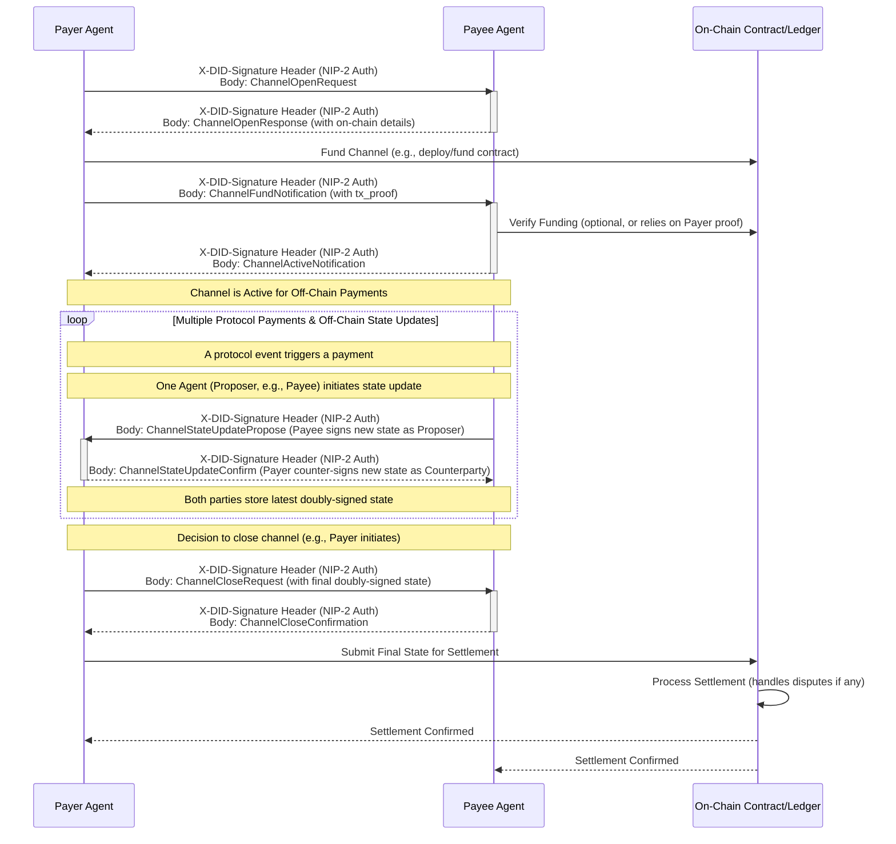

## Abstract

This NIP defines a general-purpose A2A (Agent-to-Agent) Payment Channel protocol. It provides a mechanism for establishing, managing, and settling bilateral payment channels between participants in the AI Agent ecosystem. These channels are designed to facilitate efficient, low-cost, off-chain micropayments, particularly suited for automated or high-frequency protocol-level payments, such as fees for A2A message routing, API gateway access (e.g., as per NIP-9), or other foundational agent interactions. This protocol aims to provide a core infrastructure component that can be leveraged by various higher-level NIPs or applications requiring a standardized off-chain payment solution.

## Motivation

Many interactions within a decentralized agent ecosystem, especially at the protocol or infrastructure level, involve frequent, small-value exchanges. Performing each of these as a separate on-chain transaction would be prohibitively expensive and slow. A standardized A2A Payment Channel protocol is needed to:
*   Enable scalable and cost-effective micropayments between agents.
*   Support automated economic incentives for protocol participation (e.g., paying relay nodes or API gateways).
*   Provide a foundational building block for more complex payment scenarios, including application-level service payments that might opt to use these channels for settlement.
*   Ensure interoperability for off-chain payment solutions within the agent ecosystem.

## Specification

### Scope of this NIP

This NIP specifies:
1.  The messages and procedures for establishing, funding, cooperatively updating, and closing bilateral A2A payment channels.
2.  How these payment channels can be utilized for protocol-level payments, where User Agents or other Agents make automated or semi-automated payments for underlying infrastructure services (e.g., A2A message delivery fees, NIP-9 API Gateway usage fees).

The detailed mechanisms for application-level service payments (e.g., a User Agent paying an AI Agent for a specific skill like content generation or data analysis, which typically involves service discovery, quotation, and explicit user confirmation) are considered out of scope for this NIP. Such application-specific payment flows will be defined in a separate NIP (e.g., a future NIP-X for Agent Service Payments). However, that NIP-X may optionally reference and utilize the payment channel mechanisms defined herein for settling payments for those services, especially for recurring or high-frequency service interactions with the same provider.

**Interfacing with Non-A2A Services**: While this NIP defines an A2A protocol, it is recognized that payment channels may be desired with services that are not native A2A agents (e.g., traditional HTTP services). For such services to participate in NIP-4 payment channels, they would need to interact via an A2A-compatible interface. This could be achieved by the service provider running a dedicated A2A agent (or a lightweight adapter component) or by utilizing a trusted intermediary A2A gateway. The core NIP-4 protocol messages remain A2A; the specific architecture of such an interface or gateway is an implementation choice or can be further detailed in complementary documents.

This protocol relies on NIP-1 for Agent identity and NIP-2 for secure authenticated communication channels for exchanging payment channel messages. It is assumed that for a given payment channel, both the Payer and Payee Agents operate with respect to a common, pre-agreed underlying blockchain or ledger system where the channel is anchored and settled. The specific on-chain mechanism (e.g., smart contract type) used on this common system is also assumed to be known or discoverable by participating agents.

### Roles

*   **Payer Agent**: The entity initiating payments and funding the channel. This can be any type of AI Agent (User Agent, AI Agent, etc.).
*   **Payee Agent**: The entity receiving payments. This can also be any type of AI Agent.

### Payment Channel Lifecycle

The protocol supports one primary model for managing payments:

#### Payment Channel Model

This model is suited for frequent, low-value interactions, minimizing on-chain transactions by conducting most payment updates off-chain.

1.  **Channel Negotiation & Opening**:
    *   One Agent (henceforth "Payer") requests to open a payment channel with another Agent (henceforth "Payee") via `ChannelOpenRequest`.
    *   The Payee Agent responds with `ChannelOpenResponse`, agreeing to terms or proposing alternatives. This includes on-chain channel contract details or multi-sig setup.
2.  **Channel Funding**:
    *   The Payer Agent funds the channel by interacting with the agreed on-chain mechanism (e.g., deploying/funding a smart contract).
    *   The Payer Agent sends `ChannelFundNotification` with proof of funding.
    *   The Payee Agent verifies funding and sends `ChannelActiveNotification` to confirm the channel is ready for off-chain transactions.
3.  **Off-Chain Micro-payments**:
    *   A Payer Agent (or an entity/user it represents) consumes a service or triggers a payable event from a Payee Agent (or a service it represents).
    *   The mechanism by which this specific service consumption or event is identified as payable via the established channel depends on the nature of the service and its integration:
        *   For native A2A protocol interactions (e.g., paying for A2A message routing or NIP-9 API gateway access), the protocol defining that interaction would specify how payment intent is signaled or implicitly understood. The Payee Agent would then initiate a `ChannelStateUpdatePropose` A2A message.
        *   For non-A2A services (e.g., an HTTP API) interfaced via an A2A adapter/gateway, the interaction leverages HTTP headers as defined in the "HTTP Interface for Channel Payments" section below. The client's adapter sends payment channel details in the HTTP request header. The service's adapter includes the proposed channel state update (new balances, sequence number, and its signature) in the HTTP response header. This signed proposal in the HTTP response serves the role of `ChannelStateUpdatePropose` for this specific transaction.
    *   Upon receiving the proposal (either as a direct `ChannelStateUpdatePropose` A2A message or within an HTTP response header):
        *   The Payer Agent (or its adapter) verifies the proposed state update (e.g., confirming service delivery, amount, and the Proposer's signature).
        *   If valid, the Payer Agent counter-signs the state. 
            *   For direct A2A interactions, it sends a `ChannelStateUpdateConfirm` A2A message back to the Proposing Agent.
            *   For HTTP interactions (where the proposal was received in an HTTP response header), this counter-signed state (including the Payer's signature) is included as `confirmation_data` within the `X-Payment-Channel-Data` header of the subsequent HTTP request to the service (see "HTTP Interface for Channel Payments" section).
    *   This doubly-signed state, once the Proposing Agent receives and validates the Payer's confirmation (either via `ChannelStateUpdateConfirm` A2A message or the `confirmation_data` in a subsequent HTTP request), constitutes the off-chain micro-payment. Both parties retain this latest agreed state.
4.  **Channel Top-up (Optional)**:
    *   If funds are low, the Payer Agent can add more funds on-chain to the channel contract/address.
    *   The Payer Agent then sends a `ChannelFundNotification` to the Payee Agent, with `funded_amount` specifying the amount of the top-up. The `funding_transaction_proof` would point to this new top-up transaction.
    *   The Payee Agent verifies this additional funding on-chain.
    *   This top-up increases the total on-chain collateral. The topped-up amount is initially considered part of the Payer's balance. Subsequent `ChannelStateUpdatePropose` messages will reflect balances based on this new, larger total collateral (see note under `ChannelStateUpdatePropose` balances).
5.  **Channel Closure & Final Settlement**:
    *   Either party can initiate closure by sending a `ChannelCloseRequest` containing the latest mutually signed channel state.
    *   The other party acknowledges with `ChannelCloseConfirmation`.
    *   The party initiating closure (or a pre-agreed party) submits the final mutually signed state to the on-chain channel contract for settlement. Dispute mechanisms (e.g., challenge periods) apply if there are disagreements or non-cooperation, relying on the on-chain contract logic.

### Message Types

#### 1. `ChannelOpenRequest` (Payer Agent -> Payee Agent)

*   **Purpose**: Payer Agent proposes to open a payment channel.
*   **Structure** (`message.parts` content):
    ```json
    {
      "type": "ChannelOpenRequest",
      "proposed_channel_id": "unique_proposed_id_by_payer", // Temporary ID for negotiation
      "payer_did": "did:example:payer_agent_did",
      "payee_did": "did:example:payee_agent_did",
      "initial_funding_amount": { "amount": "1000", "currency": "USD" } // Currency as token symbol
    }
    ```

#### 2. `ChannelOpenResponse` (Payee Agent -> Payer Agent)

*   **Purpose**: Payee Agent responds to the channel open request.
*   **Structure** (`message.parts` content):
    ```json
    {
      "type": "ChannelOpenResponse",
      "proposed_channel_id": "unique_proposed_id_by_payer", // From request
      "channel_id": "confirmed_channel_id_by_payee", // Payee confirms or assigns a new persistent ID
      "status": "accepted" | "rejected" | "alternative_proposed",
      "payer_did": "did:example:payer_agent_did",
      "payee_did": "did:example:payee_agent_did",
      "agreed_funding_amount": { "amount": "1000", "currency": "USD" }, // Currency as token symbol
      "rejection_reason": "...", // If rejected
      "alternative_terms": { ... } // If alternative proposed
    }
    ```

#### 3. `ChannelFundNotification` (Payer Agent -> Payee Agent)

*   **Purpose**: Payer Agent notifies that it has funded its side of the channel.
*   **Structure** (`message.parts` content):
    ```json
    {
      "type": "ChannelFundNotification",
      "channel_id": "confirmed_channel_id_by_payee",
      "funding_transaction_proof": {
        "transaction_hash": "0x_funding_tx_hash",
      },
      "funded_amount": { "amount": "1000", "currency": "USD" } // Currency as token symbol
    }
    ```

#### 4. `ChannelActiveNotification` (Payee Agent -> Payer Agent)

*   **Purpose**: Payee Agent confirms channel funding verification and channel activation.
*   **Structure** (`message.parts` content):
    ```json
    {
      "type": "ChannelActiveNotification",
      "channel_id": "confirmed_channel_id_by_payee",
      "status": "active" | "funding_issue",
      "message": "Channel is now active." // Or error message
    }
    ```
#### 5. `ChannelStateUpdatePropose` (Proposing Agent -> Counterparty Agent)

*   **Purpose**: One agent (Proposer) proposes an off-chain state update to the other agent (Counterparty), e.g., after a metered service unit or a payment event.
*   **Structure** (`message.parts` content):
    ```json
    {
      "type": "ChannelStateUpdatePropose",
      "channel_id": "confirmed_channel_id_by_payee", // Should be the agreed channel_id
      "sequence_number": 123, // Monotonically increasing
      "balances": { // Balances from the perspective of the Payer. These balances should always sum to the total acknowledged on-chain collateral (initial funding plus any acknowledged top-ups).
        "payer_balance": "990", // Remaining balance for Payer
        "payee_earned_total": "10" // Total amount earned by Payee in this channel up to this state
      },
      "signature_proposer": "signature_of_hash(channel_id, sequence_number, balances)_by_proposing_agent"
    }
    ```

#### 6. `ChannelStateUpdateConfirm` (Counterparty Agent -> Proposing Agent)

*   **Purpose**: The Counterparty Agent confirms and counter-signs the state update proposed by the Proposing Agent.
*   **Structure** (`message.parts` content):
    ```json
    {
      "type": "ChannelStateUpdateConfirm",
      "channel_id": "confirmed_channel_id_by_payee",
      "sequence_number": 123, 
      "balances": { 
        "payer_balance": "990",
        "payee_earned_total": "10"
      },
      "signature_confirmer": "signature_of_hash(channel_id, sequence_number, balances)_by_counterparty_agent"
      // Both agents now have a doubly-signed state.
    }
    ```

#### 7. `ChannelCloseRequest` (Initiating Agent -> Other Agent)

*   **Purpose**: To initiate the closure of the payment channel by either agent.
*   **Structure** (`message.parts` content):
    ```json
    {
      "type": "ChannelCloseRequest",
      "channel_id": "confirmed_channel_id_by_payee", // Should be the agreed channel_id
      "final_signed_state": { // The latest mutually agreed and signed state
        "sequence_number": 150,
        "balances": {
          "payer_balance": "850",
          "payee_earned_total": "150"
        },
        "signature_proposer": "signature_of_proposer_on_this_state", // Generalized signature
        "signature_confirmer": "signature_of_confirmer_on_this_state" // Generalized signature
      },
      "reason": "User request" // Optional
    }
    ```

#### 8. `ChannelCloseConfirmation` (Responding Agent -> Initiating Agent)

*   **Purpose**: To acknowledge the channel close request.
*   **Structure** (`message.parts` content):
    ```json
    {
      "type": "ChannelCloseConfirmation",
      "channel_id": "confirmed_channel_id_by_payee", // Should be the agreed channel_id
      "status": "acknowledged" | "disputed",
      "message": "Acknowledged. Proceeding with on-chain settlement." // Or dispute reason
    }
    ```

### HTTP Interface for Channel Payments

While NIP-4 itself defines A2A messages for payment channel management, services (e.g., traditional HTTP APIs) that are not native A2A agents can participate in these payment channels via A2A-compatible interfaces (adapters/gateways). When a client interacts with such an HTTP service and wishes to pay for a specific request using an established NIP-4 payment channel, a single HTTP header, `X-Payment-Channel-Data`, is used to carry Base64 encoded JSON payloads for coordinating the payment.

The A2A adapter on the client's side typically constructs and adds the request header. This header includes details for the current request and may also include confirmation data for a payment proposal received from a previous HTTP response. The A2A adapter on the service's side interprets the request header, processes any confirmation data, and after the service logic determines the outcome and cost for the current request, constructs and adds the response header containing a new payment proposal.

#### `X-Payment-Channel-Data` Header

*   **Direction**: Request (Client to Service) and Response (Service to Client)
*   **Format**: Base64 encoded JSON string.

#### Request Payload (Client to Service)

The JSON object, once Base64 decoded from the `X-Payment-Channel-Data` request header, has the following structure:

```json
{
  "channel_id": "confirmed_channel_id_by_payee", // Required: The NIP-4 payment channel ID.
  "max_amount": "50",                           // Optional: Max amount client authorizes for this request.
  "currency": "USD",                           // Optional: Currency (as token symbol) for max_amount. Assumed channel currency if omitted.
  "client_tx_ref": "client-ref-001",             // Optional: Client-generated reference for this HTTP transaction.
  "confirmation_data": {                      // Optional: Data to confirm a previous payment proposal from the service.
    "confirmed_sequence_number": 123,         // Required: The sequence_number of the state update being confirmed.
    "confirmed_balances": {                   // Required: The balances being confirmed.
      "payer_balance": "990",
      "payee_earned_total": "10"
    },
    "signature_confirmer": "signature_of_hash(channel_id, confirmed_sequence_number, confirmed_balances)_by_payer_adapter" 
                                            // Required: Payer's signature over the confirmed state.
  }
}
```

#### Response Payload (Service to Client)

The JSON object, once Base64 decoded from the `X-Payment-Channel-Data` response header, has the following structure. This payload contains the core elements of a `ChannelStateUpdatePropose`.

```json
{
  "channel_id": "confirmed_channel_id_by_payee", // Required: The NIP-4 payment channel ID.
  "sequence_number": 124,                       // Required: The new sequence number for this channel state update.
  "balances": {                                 // Required: The new proposed balances.
    "payer_balance": "990",
    "payee_earned_total": "10"
  },
  "amount_debited": "5",                        // Required: Actual amount debited for this HTTP transaction.
  "currency_debited": "USD",                   // Required: Currency (as token symbol) for amount_debited.
  "service_tx_ref": "service-ref-abc",          // Optional: Service-generated reference for this transaction.
  "signature_proposer": "signature_of_hash(channel_id, sequence_number, balances)_by_payee_adapter" 
                                                // Required: Signature from the Payee\'s A2A adapter/gateway.
                                                // The signature is over the canonical form of channel_id, 
                                                // sequence_number, and balances, identical to how it\'s
                                                // done for the ChannelStateUpdatePropose A2A message.
}
```

**Example Flow:**

1.  A User Agent wants to call an HTTP API that charges per request. An NIP-4 payment channel `channel-123` is open with the service's A2A gateway. Current agreed `sequence_number` is 123, `payer_balance` is "1000", `payee_earned_total` is "0".
2.  The User Agent's A2A adapter prepares the request payload for the first call:
    `{"channel_id": "channel-123", "client_tx_ref": "user-req-007"}`
    It Base64 encodes this JSON and adds it to the `X-Payment-Channel-Data` header of the HTTP GET request to `https://api.service.com/data`.
3.  The service's A2A gateway receives the request, decodes the `X-Payment-Channel-Data` header. The HTTP API processes the request and determines the cost is 5 units.
4.  The service's A2A gateway prepares the response payload, including the new proposed channel state (`sequence_number: 124`, `balances: {payer_balance: "995", payee_earned_total: "5"}`), signs it to get `signature_proposer`, and other details:
    `{"channel_id": "channel-123", "sequence_number": 124, "balances": {"payer_balance": "995", "payee_earned_total": "5"}, "amount_debited": "5", "currency_debited": "USD", "service_tx_ref": "srv-tx-456", "signature_proposer": "..."}`
    It Base64 encodes this JSON and adds it to the `X-Payment-Channel-Data` header of the HTTP 200 OK response.
5.  The User Agent's A2A adapter receives the HTTP response, decodes the `X-Payment-Channel-Data` header. It now has the signed proposal for state 124.
6.  The adapter verifies `signature_proposer` against the received `channel_id`, `sequence_number` (124), and `balances`. It also checks if `amount_debited` is acceptable.
7.  If all checks pass, the User Agent's A2A adapter prepares for the *next* HTTP request. It constructs the `confirmation_data` for state 124, including its own `signature_confirmer` for that state.
    Let's say the next request is for another 7 units of service.
    The request payload for the second call would be:
    `{"channel_id": "channel-123", "client_tx_ref": "user-req-008", "confirmation_data": {"confirmed_sequence_number": 124, "confirmed_balances": {"payer_balance": "995", "payee_earned_total": "5"}, "signature_confirmer": "payer_sig_for_state_124"}}`
    This is Base64 encoded and sent in the `X-Payment-Channel-Data` header of the next HTTP request.
8.  The service's A2A gateway receives this second request. It first processes the `confirmation_data`:
    *   Verifies `signature_confirmer` for state 124.
    *   If valid, it now considers state 124 (balances: payer "995", payee "5") as mutually agreed.
    Then, it processes the new service request (e.g., for 7 units). It prepares a new proposal for state 125:
    `{"channel_id": "channel-123", "sequence_number": 125, "balances": {"payer_balance": "988", "payee_earned_total": "12"}, "amount_debited": "7", "currency_debited": "USD", "service_tx_ref": "srv-tx-457", "signature_proposer": "..."}`
    This is Base64 encoded and returned in the `X-Payment-Channel-Data` header of the HTTP response.

This mechanism allows HTTP services to participate in NIP-4 payment channels by embedding the payment proposal and confirmation directly within the HTTP exchange, followed by a standard A2A confirmation.

### Detailed Flow with A2A Authentication

#### Payment Channel Model Flow


### Payment Methods

This protocol is designed to be extensible to various payment methods for funding and settling channels. The initial focus is on on-chain transactions. Other methods like Layer-2 payments (Lightning Network) or even traditional payment gateways (with appropriate tokenization of proof for funding/settlement) could be integrated by defining new `on_chain_details` for `ChannelOpenResponse` and `funding_transaction_proof` structures for `ChannelFundNotification`.

## Rationale

The design choices in this NIP aim to provide a flexible and secure payment channel framework for A2A interactions.
*   **Focused Payment Channel Model**: Concentrating on a payment channel model caters to use cases requiring frequent, low-latency, and low-cost micropayments, particularly for protocol-level interactions.
*   **Extensibility**: The `on_chain_details` and `funding_transaction_proof` structures are designed to be adaptable to future payment technologies and methods for channel operations.
*   **DID-Based**: Leveraging DIDs (NIP-1) and A2A authentication (NIP-2) ensures that all payment channel communications are between authenticated parties, enhancing security and trust.
*   **Clear Message Flow**: The defined message types and sequences aim for clarity and ease of implementation for payment channel management.

Alternative designs considered:
*   **Including Multiple Payment Models**: While a pre-payment model is simpler for one-off transactions, separating it into a different NIP allows this NIP to focus on the complexities of payment channels and keeps each NIP more targeted.

## Backwards Compatibility

This NIP introduces a new protocol for A2A payment channels. It does not alter or replace any existing NIPs in a way that would cause backwards incompatibility. Agents not implementing this NIP will simply be unable to participate in these specific payment channel flows.

## Test Cases

Test cases are highly recommended and should cover:
*   Successful payment channel lifecycle (open, fund, multiple off-chain payments, close, settle).
*   Handling of invalid messages (e.g., incorrect signatures, malformed JSON).
*   Error conditions (e.g., funding verification failure, insufficient funds in channel for a proposed update).
*   Dispute scenarios in channel closure (e.g., one party submitting an old state, unresponsive party).
*   Channel top-up scenarios.

(Specific test vectors and scenarios to be detailed in a companion document or repository.)

## Reference Implementation

A reference implementation is planned to demonstrate the protocol in action.
*   Links to the reference implementation(s) will be added here once available.

## Security Considerations

*   **Authentication**: All payment channel protocol messages are wrapped within the A2A communication framework (NIP-2), ensuring that both participating Agents can verify the authenticity and integrity of messages.
*   **Replay Attacks**: The `nonce` and `timestamp` mechanisms in NIP-2 protect against replay attacks for the payment messages themselves. Channel state updates rely on monotonically increasing sequence numbers to prevent replay of old states.
*   **Payment Verification**: For channel operations, on-chain verification of funding and settlement is critical.
*   **Dispute Resolution**: This NIP relies on the underlying on-chain channel mechanism's dispute resolution capabilities (e.g., challenge periods).
*   **Price Fluctuation**: Long-lived channels with volatile assets may require off-chain agreement or on-chain contract mechanisms to handle significant price changes, which is outside the direct scope of this NIP but important for implementers to consider based on the chosen on-chain system.
*   **Payment Channel Security**:
    *   **Liveness**: Participants must be online to process state updates and respond to closure requests. On-chain mechanisms are needed to handle unresponsive parties (e.g., allowing unilateral closure with the latest signed state after a challenge period).
    *   **Funding & Settlement Security**: Relies on the security of the underlying blockchain and the correctness of the channel smart contract. Audits of channel contracts are essential.
    *   **Data Integrity**: Signatures on state updates ensure that only mutually agreed states can be settled, but parties must securely store the latest doubly-signed state. Loss of this state by one party can be detrimental.

## 🚀 Future Considerations

*   **Multi-hop Payments**: Extending channels to support multi-hop payments through intermediaries.
*   **Channel Factories**: Standardizing channel factory contracts for easier deployment.
*   **Conditional Payments**: Integrating more complex conditional payments within channels (e.g., hash-time-locked contracts for atomic swaps via channels).
*   **Automated Market Makers for Channel Liquidity**: Mechanisms to facilitate finding channel partners or leasing liquidity.
*   **Cross-Chain Channels**: Specifications for payment channels that span multiple distinct blockchains.

This NIP provides a foundational layer for A2A payment channels. Further enhancements and specific on-chain mechanism integrations can be proposed in subsequent NIPs or extensions.

## Copyright

Copyright and related rights waived via [CC0](https://creativecommons.org/publicdomain/zero/1.0/).
