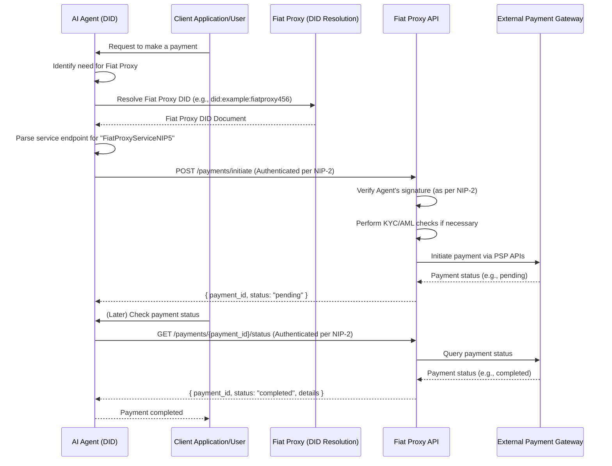

## Abstract

*NIP-5* defines a **Fiat Proxy Service** that enables AI Agents (identified by DIDs as per NIP-1) to interact with fiat payment systems. This service acts as a bridge, allowing agents to perform actions like initiating payments or verifying payment status through a standardized API. Fiat Proxy services are discoverable via their DID documents, and all API interactions are authenticated using NIP-2.

## Motivation

AI Agents often need to interact with traditional financial systems, which typically require authenticated API access, KYC/AML compliance, and handling of sensitive payment information. Directly embedding these capabilities into every agent is impractical and insecure. A Fiat Proxy Service provides a secure and standardized way for agents to access these systems.

| Pain point | Effect | Solution offered by NIP-5 |
|------------|--------|---------------------------|
| Agents need to **trigger fiat payments** | Complex integration with diverse payment gateways | Standardized API via Fiat Proxy |
| Agents need to **verify payment status** | Requires polling or webhooks | Standardized API for status checks |
| **Security and Compliance** | Agents handling raw payment credentials is risky | Proxy handles credentials and compliance; Agent interacts via DID authentication |
| **Service Discovery** | How do agents find a suitable Fiat Proxy? | Proxies declare their services in their DID documents (NIP-1) |

## Specification

### Fiat Proxy Service Declaration in DID Document

Fiat Proxy services declare their offerings as part of their DID document (NIP-1) using the `service` property. This allows AI Agents and their clients to discover and interact with Fiat Proxy services in a decentralized manner.

Each Fiat Proxy service endpoint in the DID document's `service` array MUST include:
*   `id`: A URI that conforms to the DID Core specification, typically a fragment identifier relative to the Proxy's DID (e.g., `did:example:fiatproxy123#fiat-proxy-service`).
*   `type`: A string identifying the type of service. For NIP-5 Fiat Proxy services, this MUST be `FiatProxyServiceNIP5`.
*   `serviceEndpoint`: A URI specifying the HTTPS base URL for the Fiat Proxy's API.
*   `metadata`: An optional JSON object containing additional information about the service, such as:
    *   `name`: (String) A human-readable name for the Fiat Proxy service.
    *   `supported_currencies`: (array of String) A list of ISO 4217 currency codes supported (e.g., `["USD", "EUR"]`).
    *   `supported_payment_methods`: (array of String) A list of payment methods supported (e.g., `["credit_card", "paypal"]`).
    *   `regions_served`: (array of String) A list of ISO 3166-1 alpha-2 country codes where the service is available.
    *   `fee_structure_url`: (String) A URL pointing to documentation about the proxy's fee structure.

**Example DID Document Snippet for a Fiat Proxy:**

```json
{
  "@context": "https://www.w3.org/ns/did/v1",
  "id": "did:example:fiatproxy456",
  // ... other DID document properties like verificationMethod, authentication, etc. ...
  "service": [
    {
      "id": "did:example:fiatproxy456#fiat-proxy",
      "type": "FiatProxyServiceNIP5",
      "serviceEndpoint": "https://proxy.example.com/api/v1",
      "metadata": {
        "name": "Example Global Fiat Proxy",
        "supported_currencies": ["USD", "EUR", "JPY"],
        "supported_payment_methods": ["credit_card", "bank_transfer"],
        "regions_served": ["US", "CA", "GB"],
        "fee_structure_url": "https://proxy.example.com/fees"
      }
    }
    // ... other services offered by the DID subject ...
  ]
}
```

Clients discover Fiat Proxy services by resolving their DIDs and looking for service entries with `type: "FiatProxyServiceNIP5"`. The `serviceEndpoint` URI is then used to interact with the Proxy's API.

### Fiat Proxy API (off-chain)

All API requests to the Fiat Proxy `serviceEndpoint` MUST be authenticated according to the **NIP-2: DID-Based Authentication Protocol**. Specifically, clients (AI Agents) MUST use the HTTP-based authentication mechanism defined in NIP-2, which involves sending an `Authorization` header with the `DIDAuthV1 <credentials>` scheme. The `<credentials>` are a Base64url encoded JSON string containing the `signer_did`, `key_id`, and `signature_value` over the relevant parts of the request, as detailed in NIP-2.

The `contentToSign` for NIP-2 authentication in the context of NIP-5 API calls MUST include the full HTTP request body and a `timestamp` and `nonce` as specified in NIP-2 to prevent replay attacks. The `domainSeparator` for NIP-5 should be a clearly defined string like `"NUWA_FIAT_PROXY_NIP5_V1:"`.

#### Endpoints

*(Note: The following API endpoints are illustrative. Specific implementations may vary but should cover these core functionalities. Fiat Proxy providers should publish detailed API documentation. All endpoints require NIP-2 authentication.)*

1.  **`POST /payments/initiate`**
    *   Allows an AI Agent to request the initiation of a fiat payment.
    *   **Request Body (example):**
        ```json
        {
          "agent_did": "did:example:agent:xyz", // This is implicitly verified by NIP-2's signer_did
          "recipient_details": {
            "type": "bank_account", // or "paypal_email", "crypto_address_for_stablecoin", etc.
            "account_number": "...",
            "routing_number": "...",
            "beneficiary_name": "..."
          },
          "amount": "100.00",
          "currency": "USD",
          "memo": "Payment for services rendered by Agent XYZ",
          "timestamp": 1678886400, // Unix timestamp, part of contentToSign for NIP-2
          "nonce": "a1b2c3d4e5f67890" // Unique random string, part of contentToSign for NIP-2
        }
        ```
    *   **Response Body (example - success):**
        ```json
        {
          "payment_id": "txn_123abc",
          "status": "pending", // or "processing", "requires_action"
          "details": "Payment initiated successfully."
        }
        ```

2.  **`GET /payments/{payment_id}/status`**
    *   Allows an AI Agent to check the status of a previously initiated payment.
    *   **Path Parameter:**
        *   `payment_id`: The ID of the payment returned by the initiate endpoint.
    *   **Request Construction for NIP-2:** The `contentToSign` for NIP-2 would include relevant request parameters like `payment_id`, a `timestamp`, and a `nonce`. These might be passed as query parameters or in the body if applicable, or constructed as per NIP-2 guidelines for GET requests.
    *   **Response Body (example - success):**
        ```json
        {
          "payment_id": "txn_123abc",
          "status": "completed", // or "pending", "failed", "refunded"
          "timestamp": "2025-05-15T10:30:00Z",
          "transaction_details": { /* ... specific details from payment processor ... */ }
        }
        ```

### Discovery and Interaction Flow



## Rationale

**DID-based Service Discovery:**
Using DID documents for service discovery aligns NIP-5 with NIP-1 and NIP-3, promoting a consistent, decentralized approach. Fiat Proxy providers can advertise their capabilities (supported currencies, regions, etc.) directly within their DIDs, allowing agents or their users to select appropriate proxies.

**Agent-Centric Authentication (via NIP-2):**
By mandating NIP-2 for authentication, NIP-5 ensures that actions are authorized by the AI Agent's DID in a standardized and secure manner. This leverages the general-purpose DID authentication mechanism, enhancing security and accountability.

**Abstraction of Complexity:**
The Fiat Proxy handles the complexities of interacting with various payment gateways, managing credentials, and dealing with compliance requirements. This simplifies the development of AI Agents that need fiat payment capabilities.

## Backwards Compatibility

This NIP defines a new service type and discovery mechanism. Systems not aware of `FiatProxyServiceNIP5` in DID documents will not be able to discover or interact with these services. Authentication relies on NIP-2; clients and services must implement NIP-2.

## Test Cases

*   **Fiat Proxy Discovery:**
    *   Client resolves a Fiat Proxy's DID.
    *   Client successfully finds the `FiatProxyServiceNIP5` entry in the `service` array.
    *   Client correctly parses `serviceEndpoint` and `metadata` (e.g., `supported_currencies`).
*   **Payment Initiation (NIP-2 Auth):**
    *   Agent successfully authenticates (per NIP-2) and initiates a payment request to the Proxy.
    *   Proxy validates the NIP-2 authentication and the request, then returns a `payment_id` with `pending` status.
    *   Proxy correctly rejects requests with invalid NIP-2 authentication or malformed payment requests.
*   **Payment Status Check (NIP-2 Auth):**
    *   Agent successfully authenticates (per NIP-2) and queries the status of a payment using `payment_id`.
    *   Proxy returns the correct status (e.g., `completed`, `failed`).

<!-- TODO: Add more detailed Test Cases or link to a test suite -->

## Reference Implementation

<!-- TODO: Add Reference Implementation link -->

## Security Considerations

*   **Authentication Security:** All security considerations from NIP-2 regarding DID resolution, key management, signature verification, replay attack prevention (timestamps, nonces), domain separation, and transport security (TLS/HTTPS) are directly applicable and critical for NIP-5.
*   **Agent Key Security:** The AI Agent's private key used for signing requests (as per NIP-2) must be securely managed. Compromise of this key could lead to unauthorized payment initiations.
*   **Fiat Proxy Trust:** Users and agents trust the Fiat Proxy to:
    *   Securely handle payment information.
    *   Accurately process payments and report status.
    *   Comply with relevant financial regulations.
    The selection of a reputable Fiat Proxy is crucial. DID-based discovery allows for transparency, but due diligence is still required.
*   **Replay Attacks:** API designs should incorporate measures to prevent replay attacks (e.g., nonces, timestamps in signed payloads).
*   **Data Privacy:** Fiat Proxies will handle sensitive data. Their privacy policies and data protection measures should be clearly communicated and robust.
*   **Compliance:** Fiat Proxy services operate in a regulated space. They are responsible for adhering to KYC/AML and other financial regulations. Agents using these proxies indirectly benefit from this compliance layer.

## References

1.  **NIP-1: Decentralized Identifiers for AI Agents**
2.  **NIP-2: DID-Based Authentication Protocol**
3.  **NIP-3: Custodian Delegated Control Protocol** (Agents might be created via NIP-3, then use NIP-5 services)
4.  **ISO 4217 Currency Codes**
5.  **ISO 3166-1 Alpha-2 Country Codes**
6.  **JSON Web Signature (JWS) - RFC 7515**
7.  **HTTP Signatures (IETF Draft)**

## Copyright

Copyright and related rights waived via [CC0](https://creativecommons.org/publicdomain/zero/1.0/).