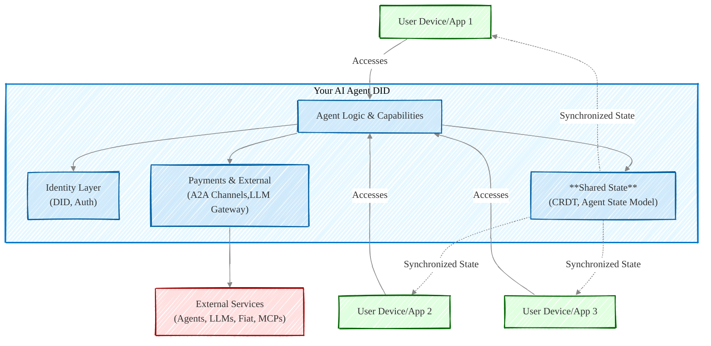

# NIPs - Nuwa Improvement Proposals

Welcome to the Nuwa Improvement Proposal (NIP) repository. NIPs are the primary way to propose new features, collect community input on issues, and document design decisions for the Nuwa Protocol and its ecosystem.

## Nuwa Protocol Overview

The Nuwa Protocol aims to establish a comprehensive and decentralized framework for AI Agents. It focuses on enabling secure and interoperable interactions, flexible payment mechanisms, robust state management, and extensible capabilities for these agents. The protocol is designed to foster a rich ecosystem where AI Agents can operate autonomously, provide services, and interact seamlessly with users and other agents.

**Core Goals & Components defined by NIPs:**

- **Decentralized Identity & Authentication:**

  - Nuwa provides a foundational decentralized identity model for AI Agents using a single master DID to manage multiple operational keys and standardize service discovery (NIP-1).
  - This is supported by a general-purpose DID-based authentication protocol for proving identity and message integrity (NIP-2).
  - To facilitate user adoption, the Custodian-Assisted DID Onboarding Protocol (CADOP) (NIP-3) enables Web2 users to easily create and initialize their Agent DIDs (often starting with a `did:key` from a Passkey) with the help of an Identity Provider (IdP) and a Custodian, ensuring users retain full control over their DIDs from inception.

- **Flexible Payment & Monetization:**

  - The protocol incorporates efficient off-chain micropayments between agents via A2A payment channels, particularly for protocol-level fees (NIP-4).
  - It enables AI Agents to interact with traditional fiat payment systems through a standardized and discoverable Fiat Proxy service (NIP-5).
  - A dedicated protocol allows for on-demand payment for application-level services provided by AI Agents to User Agents, using direct pre-payment or NIP-4 channels (NIP-11).

- **Unified Agent State & Capabilities:**

  - Nuwa ensures consistent agent state synchronization across multiple devices and applications using a P2P protocol based on CRDTs (NIP-6).
  - Agent capabilities are designed to be modular and discoverable, defined by a standardized capability package specification (NIP-7).
  - A unified Agent State Model (ASM) extends JSON-Schema with `x-asm` annotations for describing, merging (using CRDTs), querying, and managing persistent agent states (NIP-8).

- **Interoperable Service Interaction & Gateways:**
  - The protocol defines how AI Agents can access Large Language Model (LLM) services through verifiable, identity-bound gateways with standardized request/response formats and payment integration (NIP-9).
  - It also extends the Model Context Protocol (MCP) by integrating standard mechanisms for identity authentication (based on NIP-1 and NIP-2) and payment (based on NIP-4), enhancing interoperability (NIP-10).

The Nuwa Improvement Proposals (NIPs) detailed in this repository represent the individual standards and components that collectively form the Nuwa Protocol. The NIP process itself (NIP-0) governs the proposal, discussion, and adoption of these standards, ensuring the protocol evolves in a transparent and community-driven manner.

## Process

The NIP process is intended to provide a consistent and controlled path for new features, standards, and protocols to be proposed, debated, and adopted. For details on the NIP process, including how to submit a NIP, please refer to [NIP-0: NIP Process](./nips/nip-0.md) and use the [nip-template.md](./nip-template.md) for submissions.

## Current NIPs

Below is a list of current Nuwa Improvement Proposals. Each NIP has a status indicating its current stage in the process (e.g., Draft, Proposed, Accepted, Final, Rejected).

| NIP Number             | Title                                                         | Summary                                                                                                                                                                                                                                                                  | Status |
| ---------------------- | ------------------------------------------------------------- | ------------------------------------------------------------------------------------------------------------------------------------------------------------------------------------------------------------------------------------------------------------------------ | ------ |
| [0](./nips/nip-0.md)   | NIP Process                                                   | Defines the Nuwa Improvement Proposal (NIP) process, outlining stages, roles, and criteria for proposing, discussing, and integrating changes.                                                                                                                           | Living |
| [1](./nips/nip-1.md)   | Agent Single DID Multi-Key Model                              | Proposes a decentralized identity model for Agents using a single master DID to manage multiple operational keys and standardizes service discovery.                                                                                                                     | Draft  |
| [2](./nips/nip-2.md)   | DID-Based Authentication Protocol                             | Defines a general-purpose authentication protocol based on NIP-1 DIDs for proving identity and message integrity.                                                                                                                                                        | Draft  |
| [3](./nips/nip-3.md)   | Custodian-Assisted DID Onboarding Protocol (CADOP)            | Defines a protocol (CADOP) where Identity Providers attest to a user's client-generated DID (e.g., `did:key` from a Passkey) and Sybil resistance level, enabling a Custodian to assist the user in onboarding to their Agent DID while the user maintains full control. | Draft  |
| [4](./nips/nip-4.md)   | A2A Payment Channel Protocol                                  | Defines a protocol for A2A payment channels for efficient, off-chain micropayments, especially for protocol-level fees.                                                                                                                                                  | Draft  |
| [5](./nips/nip-5.md)   | Fiat Proxy Service for AI Agents                              | Enables AI Agents to interact with fiat payment systems through a standardized, discoverable Fiat Proxy service, authenticated via NIP-2.                                                                                                                                | Draft  |
| [6](./nips/nip-6.md)   | Unified Agent State Synchronization                           | Defines a P2P protocol using CRDTs to synchronize an agent's state across multiple devices/applications, ensuring consistency and offline support.                                                                                                                       | Draft  |
| [7](./nips/nip-7.md)   | Agent Capability Protocol — Capability Package Specification  | Specifies the ".acp.yaml" format for modular Agent Capability Packages, bundling schema, prompts, tools, and metadata.                                                                                                                                                   | Draft  |
| [8](./nips/nip-8.md)   | Agent State Model (ASM): A Unified State Management Framework | Extends JSON-Schema with `x-asm` annotations for describing, merging (CRDTs), querying (ASM-QL), and managing persistent agent states.                                                                                                                                   | Draft  |
| [9](./nips/nip-9.md)   | Agent LLM Gateway Protocol                                    | Defines a protocol for AI Agents to access LLM services through verifiable, identity-bound gateways with standardized request/response and payment integration.                                                                                                          | Draft  |
| [10](./nips/nip-10.md) | MCP Identity Authentication and Payment Extension Protocol    | Extends the Model Context Protocol (MCP) with standard mechanisms for identity authentication (NIP-1/2) and payment (NIP-4).                                                                                                                                             | Draft  |
| [11](./nips/nip-11.md) | A2A Agent Service Payment Protocol                            | Defines a protocol for on-demand payment for application-level services provided by AI Agents to User Agents, using direct pre-payment or NIP-4 channels.                                                                                                                | Draft  |

## How to Contribute

Contributions to NIPs are welcome! Please read [NIP-0: NIP Process](./nips/nip-0.md) for details on how to contribute. New proposals should use the [nip-template.md](./nip-template.md).

Discussions related to NIPs typically occur in the GitHub issues or discussion forums linked within each NIP document.

## Copyright

All NIPs are in the public domain. Copyright and related rights are waived via [CC0](https://creativecommons.org/publicdomain/zero/1.0/).
