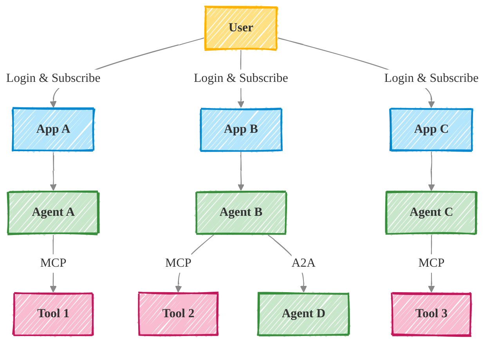
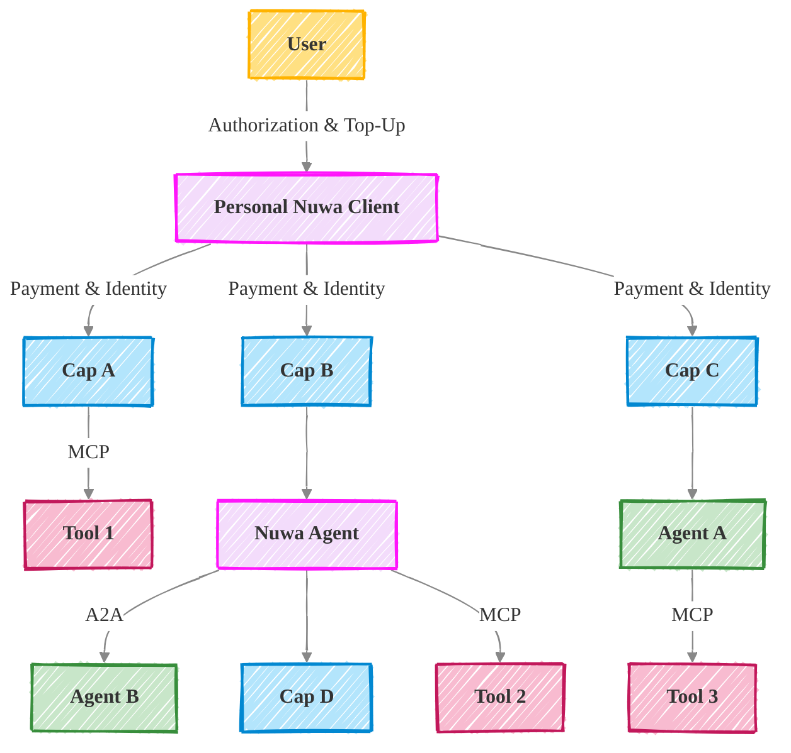

Nuwa is rebuilding traditional app services into AI-accessible functions that agents can securely access, pay for, and operate on behalf of users.

Our mission is to enable personal Super Agents for everyone — AI-powered assistants that understand you, remember your preferences, and take action across digital services on your behalf.

## The Problem: Fragmented AI UX in the App-Centric World

Today's digital experience is app-fragmented and task-redundant. Current digital services are designed to be served to humans, not AI agents. As a result, Users juggle dozens of interfaces to complete what should be single-agent workflows:

- Users jump between apps, repeating login and paying for subscription
- Context are lost when switching apps
- Payments, identity, and permissions are fragmented and inconsistent

With the capable AI today, agents can already understand our intentions and execute across tools and inter-agents via protocols like MCP and A2A. However there's still a gap between what agents _could_ do — and what they _can_ actually do in today's app-centric world.

## Nuwa AI Solution

Nuwa shifts the paradigm to agent-centric, by standardizing how services expose functionality to agents — not through Apps, but through **Caps (Capabilities)**: structured, interoperable service endpoints callable by agents, defined by the **Agent Capability Protocol (ACP)** introduced by Nuwa.

**For users**, Nuwa offers a better AI assistant:

- One interface to express any intent — no more switching apps
- An agent that remembers your preferences and context across tasks
- On-demand, pay-per-use access to powerful capabilities across the internet
- A seamless experience where expression leads directly to results

**For developers**, Nuwa offers a new medium to ship functionality in Caps with direct monetization:

- Build once as a Cap, and let any agent in the ecosystem call it
- Define input/output, permissions, pricing — all via a standard protocol
- Zero platform fees. Your earn 100% value of your Cap.
- Compose or reuse existing Caps to build advanced functions faster

