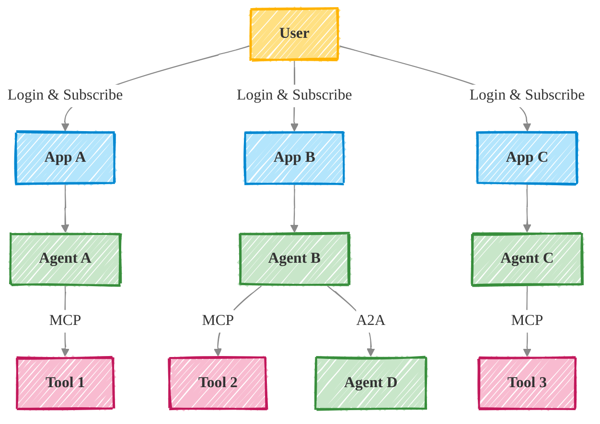
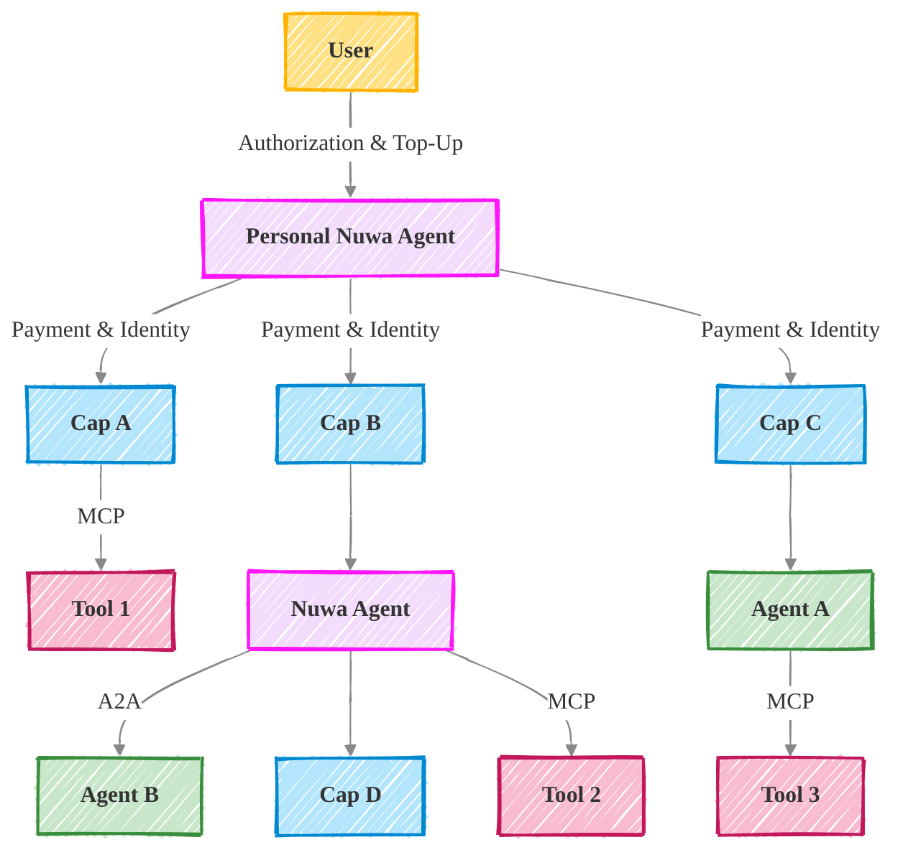
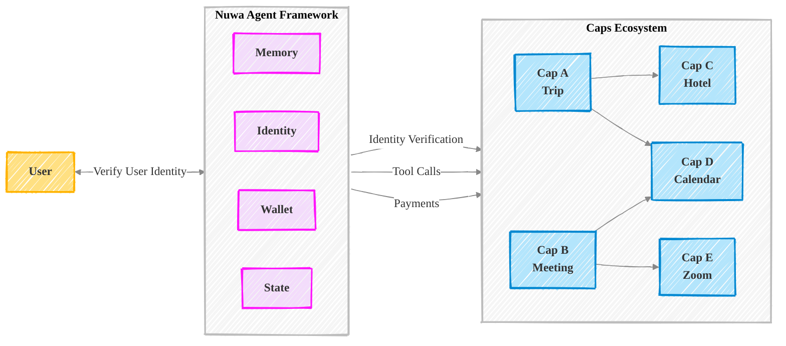

# Overview

---
title: Overview
description: Nuwa Protocol overview
---

Nuwa is an open protocol for building **services that are accessible, payable, and executable by AI agents**.

Our mission is to enable personal Super Agents for everyone — AI-powered assistants that understand you, remember your preferences, and take action across digital services on your behalf.

## The Problem: Fragmented AI UX in the App-Centric World





Today's digital experience is app-fragmented and task-redundant. Current digital services are designed to be served to humans, not AI agents. As a result, Users juggle dozens of interfaces to complete what should be single-agent workflows:

- Users jump between apps, repeating login and paying for subscription
- Context are lost when switching apps
- Payments, identity, and permissions are fragmented and inconsistent

With the capable AI today, agents can already understand our intentions and execute across tools and inter-agents via protocols like MCP and A2A. However there's still a gap between what agents _could_ do — and what they _can_ actually do in today's app-centric world.

## Nuwa AI Solution





Nuwa shifts the paradigm to agent-centric, by standardizing how services expose functionality to agents — not through Apps, but through **Caps (Capabilities)**: structured, interoperable service endpoints callable by agents, defined by the Agent Capability Protocol (ACP) introduced by Nuwa.

**For users**, Nuwa AI product is based on the [Nuwa Agent Framework](/nuwa-agent-framework) :

- One interface to express any intent — no more switching apps
- An agent that remembers your preferences and context across tasks
- On-demand, pay-per-use access to powerful capabilities across the internet
- A seamless experience where expression leads directly to results

**For developers**, Nuwa offers a new medium to ship functionality in Caps with [Agent Capability Protocol](/agent-capability-protocol):

- Build once as a Cap, and let any agent in the ecosystem call it
- Define input/output, permissions, pricing — all via a standard protocol
- Zero platform fees. Your earn 100% value of your Cap.
- Compose or reuse existing Caps to build advanced functions faster


# Use Cases

---
title: Use Cases
description: Some usecases.
---

Nuwa enables a wide range of real-world applications across personal, professional, and developer-focused domains:

- **Productivity Automation**
  "Summarize my inbox, extract important dates, and block calendar time."
- **Finance and Admin**
  "Scan my expenses this month and pay any outstanding bills."
- **Commerce and Shopping**
  "Track the price of this item, and buy it if it drops below $200."
- **Research and Planning**
  "Find the top 3 AI conferences next quarter, generate a report, and book travel."
- **Team Workflows**
  "Sync project updates from Notion, write a progress summary, and send it to Slack."

Each of these tasks requires multiple tools, but with Nuwa, they collapse into one natural command — executed intelligently by your agent through a network of interoperable Caps.


# Architecture

---
title: Architecture
description: Explain the Nuwa architrecture.
---

Nuwa introduces a unified infrastructure for building both the client AI agent with **Nuwa Agent Framework**, and the Caps, based on **Agent Cappability Protocol**.





## Agent Capability Protocol (ACP)

ACP defines the standards on how to build a Cap package.

Learn more:


  <Cards.Card icon={<MdExtension />} title="Cap" href="/docs/cap" />
  <Cards.Card icon={<FaMoneyBillWave />} title="Payment" href="/docs/payment" />
  <Cards.Card
    icon={<MdBuild />}
    title="MCP Compatibility"
    href="/docs/mcp-compatibility"
  />
  <Cards.Card
    icon={<FaRobot />}
    title="A2A Compatibility"
    href="/docs/a2a-compatibility"
  />


## Nuwa Agent Framework

Nuwa Agent Framework provides a reference implmentation on accessing caps. In addition it built-in memory management, cryptographic based identity management and wallet management.

Learn more:


  <Cards.Card
    icon={<FaBrain />}
    title="Memory"
    href="/docs/agent-state#memory"
  />
  <Cards.Card icon={<FaIdCard />} title="Identity" href="/docs/identity" />
  <Cards.Card icon={<FaWallet />} title="Wallet" href="/docs/wallet" />
  <Cards.Card
    icon={<MdOutlineSdStorage />}
    title="Agent State"
    href="/docs/agent-state"
  />


# Cap

---
title: Cap
description: Learn about Cap in Agent Capability Protocol (ACP).
---

**Caps** are modular units of functionality callable by agents, defined using the Agent Capability Protocol (ACP). They replace traditional app interfaces with composable service endpoints. Each Cap represents a discrete skill or function that agents can install, execute, and remove dynamically.

#### Cap Components

Caps are described through `.acp.yaml` files that contain:

- A **JSON schema** specifying expected inputs, outputs, and state structures.
- A **system prompt** guiding the LLM on how to use the capability.
- A **tool manifest** for runtime invocation.
- Metadata including ID, permissions, triggers, and compatibility.

#### Cap Lifecycle

Caps can be registered in a decentralized registry and discovered by agents at runtime. Users can:

- **Install** new capabilities on demand.
- **Compose** multiple Caps for complex workflows.
- **Update** or **remove** them without affecting global agent behavior.

For full specification, refer to [NIP-7](https://nuwa.dev/docs/nips/nip-7).


# Payment

---
title: Payment
description: Explore Nuwa's layered approach to agent-based payments.
---

Nuwa enables automated, transparent payment flows between agents and services through a layered infrastructure.

All payments are settled with **public permissionless blockchain network** to ensure full transparency and security. In order to reduce the on-chain cost and boost the speed, Nuwa incorporates off-chain [state channel technology](https://ethereum.org/en/developers/docs/scaling/state-channels/) for making P2P payments.

#### A2A Payment Channels

These off-chain microtransaction channels are established between agents to facilitate efficient payment for protocol-level services. Once a channel is open, state updates represent payments and are signed by both parties. On-chain settlement occurs only during opening, closing, or top-up events. ([NIP-4](https://nuwa.dev/docs/nips/nip-4))

#### Fiat Proxy Services

Agents can trigger fiat transactions through third-party services. These proxies handle compliance and connect to banks or payment gateways. They expose agent-compatible APIs secured with DID-based authentication. ([NIP-5](https://nuwa.dev/docs/nips/nip-5))

#### Application-Level Payments

Agents offering paid services (e.g., text generation, translation) can request per-use fees. User agents must explicitly authorize each transaction, either via a direct payment or through a NIP-4 channel. ([NIP-11](https://nuwa.dev/docs/nips/nip-11))
``


# Identity

---
title: Identity
description: Learn about decentralized identity and authentication in Nuwa.
---

Identity in Nuwa is decentralized, portable, and cryptographically secure.

#### Single-DID, Multi-Key

Agents manage a master DID linked to multiple operational keys, each with specific scopes and permissions. This allows secure delegation and device-level key isolation. ([NIP-1](https://nuwa.dev/docs/nips/nip-1))

#### Authentication and Verification

All interactions are authenticated via digital signatures over structured content. These signatures are verified using keys in the DID Document. ([NIP-2](https://nuwa.dev/docs/nips/nip-2))

#### Web2 Onboarding via Custodians

Users without a wallet can create a DID through a custodian service. This allows Web2-style login while retaining ownership transferability. ([NIP-3](https://nuwa.dev/docs/nips/nip-3))


# Wallet

---
title: Wallet
description: Explore the Nuwa Client’s integrated wallet and its features.
---

Every Nuwa Client comes with a built-in wallet — a secure, identity-bound module designed to manage both crypto and fiat transactions in the agentic ecosystem.

### What is a Crypto Wallet?

A **crypto wallet** is a tool that allows users to store and manage their cryptographic keys, enabling secure interactions with blockchain networks. It can send and receive digital assets, sign transactions, and verify ownership — all without relying on centralized intermediaries.

Nuwa’s wallet extends this concept by integrating deeply into the agent infrastructure, using decentralized identity (DID) standards to provide enhanced security, interoperability, and automation.

### Payment Initiation

Nuwa wallets empower agents to:

- Trigger crypto or fiat payments
- Approve Cap purchases (agent capabilities)
- Manage payment sessions for complex, multi-step workflows

This enables seamless execution of agent tasks, eliminating the friction of manual payments.

### Channel and Proxy Integration

The wallet seamlessly interfaces with:

- [NIP-4 Payment Channels](https://nuwa.dev/docs/nips/nip-4) — for fast, low-cost, off-chain crypto micropayments between agents
- [NIP-5 Fiat Proxies](https://nuwa.dev/docs/nips/nip-5) — to access traditional financial systems securely via standard APIs

These integrations abstract away the complexity of financial operations, enabling agents to operate across both Web3 and Web2 payment rails.

### Secure Authorization with DIDs

All wallet operations are scoped under the agent’s [Decentralized Identifier (DID)](https://nuwa.dev/docs/nips/nip-1). Transactions and requests are:

- Authenticated using cryptographic keys, as defined in [NIP-2](https://nuwa.dev/docs/nips/nip-2)
- Fully auditable and under user control
- Delegatable to custodians via [NIP-3](https://nuwa.dev/docs/nips/nip-3), supporting Web2 login and wallet-free onboarding

This ensures robust security while maintaining a user-friendly experience.


# FAQ

---
title: FAQ
description: You might ask these
---

To do: the faq content


# Overview

---
title: Overview
description: Overview of the Nuwa Improvement Proposals.
---

Welcome to the Nuwa Improvement Proposal (NIP) repository. NIPs are the primary way to propose new features, collect community input on issues, and document design decisions for the Nuwa Protocol and its ecosystem.

## Nuwa Protocol Overview

The Nuwa Protocol aims to establish a comprehensive and decentralized framework for AI Agents. It focuses on enabling secure and interoperable interactions, flexible payment mechanisms, robust state management, and extensible capabilities for these agents. The protocol is designed to foster a rich ecosystem where AI Agents can operate autonomously, provide services, and interact seamlessly with users and other agents.

**Core Goals & Components defined by NIPs:**

- **Decentralized Identity & Authentication:**

  - Nuwa provides a foundational decentralized identity model for AI Agents using a single master DID to manage multiple operational keys and standardize service discovery (NIP-1).
  - This is supported by a general-purpose DID-based authentication protocol for proving identity and message integrity (NIP-2).
  - To facilitate user adoption, a custodian delegated control protocol allows Web2 users to create and manage Agent DIDs without directly handling crypto wallets (NIP-3).

- **Flexible Payment & Monetization:**

  - The protocol incorporates efficient off-chain micropayments between agents via A2A payment channels, particularly for protocol-level fees (NIP-4).
  - It enables AI Agents to interact with traditional fiat payment systems through a standardized and discoverable Fiat Proxy service (NIP-5).
  - A dedicated protocol allows for on-demand payment for application-level services provided by AI Agents to User Agents, using direct pre-payment or NIP-4 channels (NIP-11).

- **Unified Agent State & Capabilities:**

  - Nuwa ensures consistent agent state synchronization across multiple devices and applications using a P2P protocol based on CRDTs (NIP-6).
  - Agent capabilities are designed to be modular and discoverable, defined by a standardized capability package specification (NIP-7).
  - A unified Agent State Model (ASM) extends JSON-Schema with `x-asm` annotations for describing, merging (using CRDTs), querying, and managing persistent agent states (NIP-8).

- **Interoperable Service Interaction & Gateways:**
  - The protocol defines how AI Agents can access Large Language Model (LLM) services through verifiable, identity-bound gateways with standardized request/response formats and payment integration (NIP-9).
  - It also extends the Model Context Protocol (MCP) by integrating standard mechanisms for identity authentication (based on NIP-1 and NIP-2) and payment (based on NIP-4), enhancing interoperability (NIP-10).

The Nuwa Improvement Proposals (NIPs) detailed in this repository represent the individual standards and components that collectively form the Nuwa Protocol. The NIP process itself (NIP-0) governs the proposal, discussion, and adoption of these standards, ensuring the protocol evolves in a transparent and community-driven manner.


## Process

The NIP process is intended to provide a consistent and controlled path for new features, standards, and protocols to be proposed, debated, and adopted. For details on the NIP process, including how to submit a NIP, please refer to [NIP-0: NIP Process](./nip-0.md) and use the [nip-template.md](https://github.com/nuwa-protocol/NIPs/blob/main/nip-template.md) for submissions.

## Current NIPs

Below is a list of current Nuwa Improvement Proposals. Each NIP has a status indicating its current stage in the process (e.g., Draft, Proposed, Accepted, Final, Rejected).

| NIP Number        | Title                                                         | Summary                                                                                                                                                         | Status |
| ----------------- | ------------------------------------------------------------- | --------------------------------------------------------------------------------------------------------------------------------------------------------------- | ------ |
| [0](./nip-0.md)   | NIP Process                                                   | Defines the Nuwa Improvement Proposal (NIP) process, outlining stages, roles, and criteria for proposing, discussing, and integrating changes.                  | Living |
| [1](./nip-1.md)   | Agent Single DID Multi-Key Model                              | Proposes a decentralized identity model for Agents using a single master DID to manage multiple operational keys and standardizes service discovery.            | Draft  |
| [2](./nip-2.md)   | DID-Based Authentication Protocol                             | Defines a general-purpose authentication protocol based on NIP-1 DIDs for proving identity and message integrity.                                               | Draft  |
| [3](./nip-3.md)   | Custodian Delegated Control Protocol                          | Allows Web2 users to create Agent DIDs via a Custodian service without directly managing crypto wallets.                                                        | Draft  |
| [4](./nip-4.md)   | A2A Payment Channel Protocol                                  | Defines a protocol for A2A payment channels for efficient, off-chain micropayments, especially for protocol-level fees.                                         | Draft  |
| [5](./nip-5.md)   | Fiat Proxy Service for AI Agents                              | Enables AI Agents to interact with fiat payment systems through a standardized, discoverable Fiat Proxy service, authenticated via NIP-2.                       | Draft  |
| [6](./nip-6.md)   | Unified Agent State Synchronization                           | Defines a P2P protocol using CRDTs to synchronize an agent's state across multiple devices/applications, ensuring consistency and offline support.              | Draft  |
| [7](./nip-7.md)   | Agent Capability Protocol — Capability Package Specification  | Specifies the ".acp.yaml" format for modular Agent Capability Packages, bundling schema, prompts, tools, and metadata.                                          | Draft  |
| [8](./nip-8.md)   | Agent State Model (ASM): A Unified State Management Framework | Extends JSON-Schema with `x-asm` annotations for describing, merging (CRDTs), querying (ASM-QL), and managing persistent agent states.                          | Draft  |
| [9](./nip-9.md)   | Agent LLM Gateway Protocol                                    | Defines a protocol for AI Agents to access LLM services through verifiable, identity-bound gateways with standardized request/response and payment integration. | Draft  |
| [10](./nip-10.md) | MCP Identity Authentication and Payment Extension Protocol    | Extends the Model Context Protocol (MCP) with standard mechanisms for identity authentication (NIP-1/2) and payment (NIP-4).                                    | Draft  |
| [11](./nip-11.md) | A2A Agent Service Payment Protocol                            | Defines a protocol for on-demand payment for application-level services provided by AI Agents to User Agents, using direct pre-payment or NIP-4 channels.       | Draft  |

## How to Contribute

Contributions to NIPs are welcome! Please read [NIP-0: NIP Process](./nip-0.md) for details on how to contribute. New proposals should use the [nip-template.md](https://github.com/nuwa-protocol/NIPs/blob/main/nip-template.md).

Discussions related to NIPs typically occur in the GitHub issues or discussion forums linked within each NIP document.

## Copyright

All NIPs are in the public domain. Copyright and related rights are waived via [CC0](https://creativecommons.org/publicdomain/zero/1.0/).


# NIP Process

---
nip: 0
title: NIP Process
author: Nuwa community
discussions-to: <URL of the NIPs discussion forum or GitHub issues>
status: Living
type: Meta
category: Process
created: 2025-05-13
---

## Abstract

This NIP defines the Nuwa Improvement Proposal (NIP) process. It outlines the stages a NIP goes through, the roles and responsibilities of participants, and the criteria for moving a NIP forward. The goal is to provide a clear, transparent, and community-driven framework for proposing, discussing, and integrating changes to the Nuwa Protocol and its ecosystem.

## Motivation

A well-defined process for managing improvement proposals is crucial for the healthy evolution of the Nuwa Protocol. It ensures that:
*   Proposals are thoroughly vetted by the community.
*   Decisions are made transparently.
*   The history of design choices is documented.
*   All stakeholders have an opportunity to contribute.
This NIP aims to establish such a process, drawing inspiration from successful improvement proposal systems in other open-source projects.

## Specification

### NIP Types

NIPs are categorized into the following types:

*   **Standards Track:** Describes any change that affects most or all Nuwa implementations, such as a change to the network protocol, a change in block or transaction validity rules, or any change or addition that affects the interoperability of applications using Nuwa. Standards Track NIPs consist of two parts, a design document and a reference implementation.
*   **Informational:** Describes a Nuwa design issue, or provides general guidelines or information to the Nuwa community, but does not propose a new feature. Informational NIPs do not necessarily represent a Nuwa community consensus or recommendation, so users and implementers are free to ignore Informational NIPs or follow their advice.
*   **Meta:** Describes a process surrounding Nuwa or proposes a change to (or an event in) a process. Meta NIPs, like Standards Track NIPs, consist of two parts, a design document and a reference implementation. They require community consensus and should not be ignored once adopted.

### NIP Statuses

A NIP progresses through the following statuses:

1.  **Draft:** The initial state of a NIP. A NIP is merged by NIP editors into the NIP repository when it is properly formatted and meets the basic requirements.
2.  **Proposed:** A NIP that is under active consideration by the community. This status indicates that the NIP is well-formed, the idea is clear, and it is ready for broader discussion and review.
3.  **Active:** A NIP that has been accepted for implementation. This means the core concepts have been approved, and a reference implementation is being developed or is already available.
4.  **Final:** A Standards Track NIP that has been implemented and adopted by the community. For a NIP to reach "Final" status, it must have a reference implementation and have been adopted by major clients or components of the Nuwa ecosystem.
5.  **Living:** A NIP that is continuously updated and maintained (e.g., NIP-0 itself, or NIPs defining core interfaces that may evolve).
6.  **Stagnant:** A NIP that has been inactive for a significant period (e.g., 6+ months) without progressing. It may be moved back to Draft or Withdrawn.
7.  **Withdrawn:** A NIP that has been withdrawn by its author(s).
8.  **Rejected:** A NIP that has been formally rejected by the NIP editors or community consensus after discussion.

### NIP Workflow

1.  **Idea:** Propose your idea and discuss it with the Nuwa community (e.g., on a designated forum, mailing list, or GitHub discussions). This helps gauge interest and gather initial feedback.
2.  **Drafting:**
    *   Fork the NIP repository.
    *   Copy `nip-template.md` to `NIPs/nip-XXXX.md` (where `XXXX` is a number you will be assigned later).
    *   Fill in the NIP. Pay attention to the NIP header fields.
    *   Ensure the NIP is well-motivated, clearly specified, and considers backwards compatibility and security.
3.  **Submission:**
    *   Submit a Pull Request (PR) to the NIPs repository.
    *   The NIP editors will review the PR for formatting, clarity, and completeness. They will assign a NIP number.
    *   The NIP editors may request revisions before merging the PR.
    *   Once merged, the NIP is in **Draft** status.
4.  **Discussion & Review:**
    *   The NIP author (or a champion) should actively solicit feedback and lead discussions.
    *   The NIP may be updated based on community feedback.
    *   If the NIP gains traction and addresses feedback appropriately, it can be moved to **Proposed** status by the NIP editors.
5.  **Implementation (for Standards Track & relevant Meta NIPs):**
    *   A reference implementation should be developed.
    *   Test cases are crucial.
    *   Once a stable implementation exists and community consensus is strong, the NIP can be moved to **Active**.
6.  **Adoption & Finalization (for Standards Track):**
    *   For a NIP to become **Final**, it must be adopted by the Nuwa ecosystem and demonstrate real-world use.
    *   This typically involves inclusion in official releases or widespread usage.
7.  **Maintenance (for Living NIPs):**
    *   Living NIPs are updated as needed to reflect the current state of the process or standard they define.

### NIP Editors

NIP Editors are individuals responsible for the administrative and editorial aspects of the NIP process. Their responsibilities include:
*   Assigning NIP numbers and merging NIPs.
*   Ensuring NIPs are well-formatted and readable.
*   Facilitating discussions and ensuring the process is followed.
*   Updating NIP statuses based on community consensus and NIP progress.
*   Maintaining the NIP repository.

The current NIP editors are:
*   [List NIP Editor Names/GitHub Handles Here]

### NIP Template

All NIPs should follow the structure defined in `nip-template.md`. Key sections include:
*   Preamble (header with metadata)
*   Abstract
*   Motivation
*   Specification
*   Rationale
*   Backwards Compatibility
*   Test Cases
*   Reference Implementation
*   Security Considerations
*   Copyright

## Rationale

This NIP process is designed to be:
*   **Transparent:** All discussions and decisions are public.
*   **Community-driven:** Success depends on community participation and consensus.
*   **Structured:** Provides a clear path for proposals.
*   **Documented:** Creates a historical record of design choices.

The roles and statuses are adapted from common practices in other successful open-source projects (e.g., Ethereum EIPs, Bitcoin BIPs, Python PEPs) to provide a familiar and effective framework.

## Backwards Compatibility

This NIP defines a new process and does not directly impact existing protocol components. Therefore, no backwards compatibility issues are anticipated.

## Security Considerations

Security considerations for the NIP process itself include:
*   **Authenticity of NIPs:** GitHub PRs and commit histories provide a record of authorship and changes.
*   **Integrity of the process:** NIP editors play a crucial role in maintaining the integrity of the NIP repository and process.
*   **Community Review:** Broad community review is the primary defense against malicious or flawed proposals.

Individual NIPs must address their own specific security implications as per the `nip-template.md`.

## Copyright

Copyright and related rights for this NIP are waived via [CC0](https://creativecommons.org/publicdomain/zero/1.0/).


# Agent Single DID Multi-Key Model

---
nip: 1
title: Agent Single DID Multi-Key Model
author: jolestar(@jolestar)
discussions-to: https://github.com/nuwa-protocol/NIPs/discussions/3
status: Draft
type: Standards Track
category: Core
created: 2024-05-12
updated: 2025-05-22
---

## Abstract

This NIP proposes a foundational decentralized identity model for Agents (representing users, services, or other autonomous entities) within the ecosystem. It enables a single master Decentralized Identifier (DID) to manage multiple operational keys (e.g., device-specific keys, application-specific keys, or service instance keys). The model aims to ensure consistent and verifiable identities, key isolation, permission control, and secure revocability across multiple devices and application contexts. The model supports various DID methods (which could be anchored to different Verifiable Data Registries, including blockchains) presented as potential examples for anchoring DID documents.

## Motivation

To establish a consistent and secure identity framework for all participating entities (Agents, including users and service providers) within the ecosystem, a standardized approach to DID management is needed. This NIP defines a decentralized identity model based on a **"single master identity + multiple operational sub-keys"** concept. This allows an Agent, whether an end-user managing multiple devices and applications, or a service provider managing different operational instances or keys, to operate under a unified DID. It aims to provide a robust and flexible identity foundation for Agents in the ecosystem, enabling secure interactions and verifiable claims without compromising core digital identities or creating identity fragmentation across various devices and application environments.

## Specification

### Core Design Principles

-   **Single Master Identity**: Each Agent possesses a master DID (e.g., any DID compliant with W3C DID specifications, such as `did:example:123`; for implementations on a specific network, like `did:<method>:<entity1>`), representing their unique digital persona or service identity and associated digital assets/memories/configurations. Control over this DID is held by one or more Master Key(s).
-   **Multi-Device/Application/Operational Keys**: Each Agent instance or distinct operational context (e.g., a specific device, a specific application instance on a device, a service replica, a temporary session) generates or is assigned a local Key (referred to broadly as an "Operational Key" or sometimes "Device Key" or "Application Key" in examples for simplicity, but can represent any operational sub-key).
-   **DID Document Registration**: The public key information of each such Key is registered as a `verificationMethod` entry in the DID document associated with the master DID.
-   **Fine-grained Verification Relationships**: By adding the `id` of a `verificationMethod` to different verification relationships (e.g., `authentication`, `assertionMethod`, `capabilityInvocation`, `capabilityDelegation`), the permission scope of each key can be precisely controlled.
-   **Signatures Indicate Origin**: All signature operations initiated by an Agent using one of its keys must clearly indicate which key was used (via the `id` of the `verificationMethod`).
-   **Passkey Boot-strap**: In scenarios where a traditional crypto wallet is not initially present, an Agent MAY begin its lifecycle with a DID based on the `did:key` method, where the key material is derived from a WebAuthn Passkey. This initial key SHOULD be listed in both the `authentication` and `capabilityDelegation` verification relationships of the `did:key` document, granting the user full control from inception.

It is important to distinguish between a `verificationMethod` entry and a verification relationship. A `verificationMethod` entry primarily describes key material (e.g., the public key and its type). The verification relationship arrays (such as `authentication`, `assertionMethod`, `capabilityInvocation`, `capabilityDelegation`) declare the *purpose* or authorized uses of a specific key, referencing the `id` of a `verificationMethod` entry.

To further clarify the common verification relationships used in DID documents (as defined in the W3C DID Core specification) and their relevance within this NIP and related protocols (like CADOP):

*   **`authentication`**:
    *   **Purpose**: Specifies how the DID subject can be authenticated. A `verificationMethod` listed under `authentication` is used to prove that the DID subject is performing an action under their control. Examples include signing a message to log into a service, establishing a secure session, or authorizing operations such as sending messages or initiating general on-chain transactions from an account associated with the DID.
    *   **Relevance in NIP-1/CADOP**: Crucial for Agent login, session establishment, and authorizing operations. In the CADOP context, the user's initial key (e.g., from a Passkey) is placed in `authentication` (and `capabilityDelegation`) to grant them control.

*   **`assertionMethod`**:
    *   **Purpose**: Specifies how the DID subject can make verifiable assertions, such as issuing Verifiable Credentials. A `verificationMethod` listed here is authorized to sign credentials or other statements on behalf of the DID subject.
    *   **Relevance in NIP-1/CADOP**: Enables Agents (users or services) to issue claims or credentials about themselves or other entities, forming a basis for trust and verifiable data exchange.

*   **`keyAgreement`**:
    *   **Purpose**: Specifies how an entity can establish secure encrypted communication channels with the DID subject. Keys listed here are typically used for cryptographic key exchange protocols (e.g., Diffie-Hellman).
    *   **Relevance in NIP-1/CADOP**: Useful for establishing encrypted communication between Agents or between an Agent and a service. While not explicitly detailed in all NIP-1 examples, its inclusion here is for completeness regarding standard DID capabilities.

*   **`capabilityInvocation`**:
    *   **Purpose**: Specifies how the DID subject can invoke capabilities or perform actions, such as interacting with a service endpoint or operating on a resource. A `verificationMethod` listed here authorizes the key to make such invocations, essentially acting on behalf of the DID subject for specific operations.
    *   **Relevance in NIP-1/CADOP**: Essential for authorizing operational keys to interact with services declared in the DID document. For example, a Custodian's service key, when listed in a user's DID document under `capabilityInvocation`, is authorized to call its own service endpoint in the context of that user (as per CADOP). This relationship is also used to authorize keys for managing the `service` entries themselves, as per NIP-1 permission rules.

*   **`capabilityDelegation`**:
    *   **Purpose**: Specifies how the DID subject can delegate its capabilities to another entity or key. A `verificationMethod` listed here is authorized to grant capabilities to other keys or DIDs. This relationship signifies a higher level of authority, often including the ability to manage other verification methods and their relationships within the DID document.
    *   **Relevance in NIP-1/CADOP**: This represents the highest level of control over the DID. It is typically held by the DID's Master Key(s) or, in the CADOP user-centric model, by the user's primary controlling key (e.g., derived from a Passkey). This permission is required for managing keys, updating any verification relationship (including `capabilityDelegation` itself), and, under standard NIP-1 rules, for changing the DID `controller`.

These verification relationships are fundamental for defining the security model and operational semantics of a DID, dictating what actions are permissible with different cryptographic keys associated with the DID.

### General DID Method Support and Considerations for Advanced Functionality

This Agent model is designed to be compatible with any W3C compliant DID method. An Agent's master DID can, in principle, adopt any such method (e.g., `did:key`, `did:web`, `did:ethr`, `did:ion`). The choice of DID method determines how and where the DID document is stored and managed (i.e., the Verifiable Data Registry or VDR).

Crucially, for an Agent to support advanced on-chain functionalities such as payments, state channel creation (e.g., as detailed in NIP-4), or other direct blockchain interactions, its chosen DID method must be one that is anchored to a blockchain (i.e., an "on-chain DID"). This implies that the DID is associated with a specific on-chain account or address that can receive funds, initiate transactions, and interact with smart contracts necessary for these functionalities. The specific on-chain address to be used for a particular interaction (like a payment channel) would then be discoverable or communicated as part of the relevant protocol (e.g., within NIP-4 messages).

However, for these advanced functionalities within the ecosystem, such as on-chain interactions including payments (e.g., as might be detailed in NIP-4 for state channels) or other forms of direct blockchain engagement by an Agent, the underlying VDR (the blockchain to which the on-chain DID is anchored) associated with the chosen DID method (or at least the VDR used for operational keys involved in such transactions) must meet specific requirements:

-   **Transaction Authorization by Operational Keys**: The VDR and its associated transaction system must allow operational keys (sub-keys registered in the Agent's DID document as `verificationMethod` entries) to authorize and initiate transactions on behalf of the Agent's primary on-chain identity or account. This is crucial for enabling an Agent to act through its various operational contexts (devices, services) without directly using its master key(s) for every transaction.
-   **Account Abstraction or Similar Capabilities**: To facilitate the above, the underlying blockchain might need to support concepts like account abstraction. This allows an Agent's on-chain account to be controlled by logic that can recognize and authorize actions initiated by its registered operational keys, rather than solely by a single private key tied directly to the account. This enables an Agent to delegate specific on-chain permissions to different operational keys, enhancing security and flexibility.
-   **Smart Contract Interaction**: The VDR should support the execution of smart contracts if on-chain logic is required for managing DID-related operations, permissions, or interactions with other ecosystem protocols that rely on smart contracts (e.g., state channels, registries).

Therefore, while NIP-1 provides a flexible identity superstructure, the practical choice of DID methods and their underlying VDRs for Agents participating in advanced on-chain operations will be influenced by the technical capabilities of those VDRs to support the required transactional semantics and key management models. Implementers should evaluate VDR capabilities when designing solutions that leverage this NIP for on-chain activities.

### Master Key Management & Recovery

Secure management and reliable recovery of master keys are critical.
-   **Master Key(s)**: Agents must generate and securely back up their master DID's Master Key(s). For user Agents, this often means offline backup. For service Agents, this could involve secure key management systems. These private keys should not be stored on any routinely used operational devices or instances without extreme care.
-   **Controller**: The `controller` field of the DID document must point to the entity holding the Master Key(s), which is typically the DID subject itself.
-   **Recovery Mechanisms**: Robust key recovery mechanisms (e.g., Social Recovery, Multi-signature, Hardware Wallet, M-of-N schemes) are essential and depend on the adopted DID method and the Agent's nature.

### Unified Service Discovery via DID Documents

A core principle for the ecosystem is to enable simple and standardized discovery of services offered by Agents. NIP-1 establishes the use of the `service` property within a DID document as the **standard mechanism for service declaration and discovery**.

-   **Service Declaration**: Any Agent (user or service provider) that offers a service discoverable by other Agents MUST declare these services within the `service` array of its DID document.
-   **Standardized Service Types**: Each NIP that defines a specific service (e.g., a Fiat Proxy service as in NIP-5, an LLM Gateway as in NIP-9) MUST specify a unique `type` string for that service (e.g., `"FiatProxyServiceNIP5"`, `"LLMGatewayNIP9"`, `"CadopCustodianService"`, `"Web2ProofServiceCADOP"`, `"CadopIdPService"`). This `type` is used in the `service.type` field of the service entry.

    To ensure clarity and uniqueness, service types within this ecosystem should follow one of the following naming conventions:
    *   **For services that are integral components of a larger, named protocol (e.g., a protocol defined by a NIP or a set of NIPs)**: The service `type` should be prefixed with an abbreviation or a well-known name of the protocol, followed by the specific role of the service. Example: `CadopCustodianService`, where "Cadop" refers to the Custodian-Assisted DID Onboarding Protocol.
    *   **For services defined by a specific NIP that are more standalone or represent a specific version/instance of a general service concept**: The service `type` should combine a descriptive name of the service concept with a suffix indicating the NIP number that defines it. Example: `FiatProxyServiceNIP5`, indicating a Fiat Proxy service as defined in NIP-5.
    
    This approach ensures that service types are both descriptive and directly linkable to their defining specifications.

-   **Service-Specific Metadata**: The NIP defining the service MUST also specify the structure of any additional metadata required for that service. This metadata should be included as properties within the corresponding `service` entry in the DID document. The `serviceEndpoint` property typically defines the primary interaction endpoint for the service.
-   **Client Discovery**: Client Agents discover services by:
    1.  Obtaining the DID of a potential service provider.
    2.  Resolving the DID document associated with that DID.
    3.  Iterating through the `service` array in the DID document, looking for entries with the desired `service.type`.
    4.  Extracting the `serviceEndpoint` and other service-specific metadata to interact with the service.

This approach ensures a consistent and decentralized way for services to be announced and discovered, leveraging the existing DID infrastructure.

### DID Document Structure Example

Below is an example of a DID document conforming to this NIP. This example uses `did:example` as a placeholder for a concrete DID method.

**Key points illustrated in the example:**
*   The `id` field (e.g., `did:example:alice`) represents the Agent's unique DID. This Agent could be an end-user, a service, or another autonomous entity. The specific nature of the Agent can be further clarified by other properties within the DID document, such as the `service` property.
*   Each entry in `verificationMethod` represents an operational key.
    *   The `id` within a `verificationMethod` entry (e.g., `did:example:alice#key-1`) is a generic identifier for that specific key.
    *   The `type` (e.g., `EcdsaSecp256k1VerificationKey2019`) specifies the cryptographic suite of the key. Other types like `Ed25519VerificationKey2020` are also permissible.
    *   The `expires` property can be used for keys with a defined lifetime, such as session keys.
*   Verification relationships like `authentication`, `assertionMethod`, `capabilityInvocation`, and `capabilityDelegation` link to specific key `id`s from the `verificationMethod` array to define their permissions.
    *   `capabilityDelegation` is typically reserved for Master Keys or other high-privilege keys authorized to delegate capabilities.
*   The `service` array is used to define service endpoints. This is particularly important for service Agents (e.g., custodians, gateways) to declare how they can be interacted with. The `type` property within a service entry (e.g., `"FiatProxyServiceNIP5"`, `"LLMGatewayNIP9"`) should be used to specify the kind of service, as defined by relevant NIPs. The `serviceEndpoint` provides the primary URL for interacting with the service, and other properties within the service entry will contain service-specific metadata as defined by the NIP for that service `type`.

```json
{
  "@context": ["https://www.w3.org/ns/did/v1", "https://w3id.org/security/suites/ed25519-2020/v1"],
  "id": "did:example:alice",
  "controller": "did:example:alice",
  "verificationMethod": [
    {
      "id": "did:example:alice#key-1",
      "type": "Ed25519VerificationKey2020",
      "controller": "did:example:alice",
      "publicKeyMultibase": "zH3C2AVvLMv6gmMNam3uVAjZpfkcJCwDwnZn6z3wXmqPV"
    },
    {
      "id": "did:example:alice#key-2",
      "type": "Ed25519VerificationKey2020",
      "controller": "did:example:alice",
      "publicKeyMultibase": "zH3C2AVvLMv6gmMNam3uVAjZpfkcJCwDwnZn6z3wXmqPZ",
      "expires": "2025-12-31T23:59:59Z"
    }
  ],
  "authentication": [
    "did:example:alice#key-1"
  ],
  "assertionMethod": [
    "did:example:alice#key-1"
  ],
  "capabilityInvocation": [
    "did:example:alice#key-1",
    "did:example:alice#key-2"
  ],
  "capabilityDelegation": [
    "did:example:alice#key-1"
  ],
  "service": [
    {
      "id": "did:example:alice#llm-gateway",
      "type": "LLMGatewayNIP9",
      "serviceEndpoint": "https://alice.example.com/llm",
      "llmCapabilities": {
        "supported_models": ["gpt-4", "claude-3-opus"],
        "pricing_info_url": "https://alice.example.com/llm/pricing"
      }
    },
    {
      "id": "did:example:alice#social-profile",
      "type": "SocialWebProfile",
      "serviceEndpoint": "https://social.example.com/alice"
    }
  ]
}
```

### Signature Structure Specification

Each signature operation initiated by an Agent device or service instance should result in a structure (example uses `did:example` as a placeholder):

```json
{
  "signed_data": {
    "operation": "...",
    "params": { ... },
    "nonce": "random_nonce_123",
    "timestamp": 1715600000
  },
  "signature": {
    "signer_did": "did:example:alice",
    "key_id": "did:example:alice#key-1", 
    "value": "0x...."
  }
}
```
Verification Process:
1.  Verify `timestamp`.
2.  Check `nonce`.
3.  Resolve `signer_did`.
4.  Find `verificationMethod` for `key_id`.
5.  Verify `signature.value` with the public key.
6.  (Optional) Check `key_id` against verification relationships for the specific operation.

### Permission Control Model

Recommended strategies:
1.  **Verification Relationship-Based**: Utilize standard DID Core verification relationships.
2.  **Capability Objects**: Use ZCAP-LD or similar for fine-grained permissions.
3.  **External Policy Service**: DID document `service` endpoint points to a policy service.
4.  **Application-Layer Enforcement**: Relying Party enforces based on business logic.

**Recommendation**: Prioritize Verification Relationship-Based, combinable with Capability Objects.

#### Specific Permissions for DID Document Updates

To ensure clarity and consistent implementation, this NIP specifies the following mapping between DID document update operations and the required verification relationships. Any update to the DID document MUST be authorized by a signature from a key that is listed in the appropriate verification relationship array within the *current* version of the DID document being updated.

*   **Managing Keys and Verification Relationships (`capabilityDelegation`)**:
    *   Adding a new `verificationMethod` entry (i.e., registering a new key).
    *   Removing an existing `verificationMethod` entry (i.e., revoking a key).
    *   Modifying properties of an existing `verificationMethod` entry (e.g., `type`, `publicKeyMultibase`, `expires`).
    *   Modifying the lists of key IDs within any of the verification relationship arrays (`authentication`, `assertionMethod`, `capabilityInvocation`, `capabilityDelegation` itself).
    *   **Rationale**: These operations alter the fundamental security and control structure of the DID. Therefore, they require the highest level of authorization, granted by `capabilityDelegation`. Typically, only Master Key(s) or specifically designated high-privilege keys will possess this capability.

*   **Managing Service Endpoints (`capabilityInvocation`)**:
    *   Adding a new `service` entry to the `service` array.
    *   Removing an existing `service` entry from the `service` array.
    *   Modifying an existing `service` entry (e.g., changing `serviceEndpoint`, `type`, or service-specific metadata).
    *   **Rationale**: These operations define how other Agents interact with the services offered by the DID subject. While significant, they are generally considered less critical than direct key management. `capabilityInvocation` allows designated keys to manage these service declarations.

*   **Changing the DID Controller**:
    *   Modifying the `controller` field of the DID document.
    *   **Rationale**: This operation transfers the ultimate control over the DID document to a new entity. This is the most sensitive update and implicitly requires authorization by a key that is currently designated with `authentication` and `capabilityDelegation` rights and represents the authority of the current `controller`. The specific mechanism for controller updates may also be further defined by the DID method itself.
 
Implementers MUST ensure that any attempt to update the DID document is validated against these permission requirements. An update operation MUST be rejected if the authorizing signature does not originate from a key possessing the necessary verification relationship as defined above.

### Device/Operational Key Registration / Update Protocol (Draft)

This section outlines a high-level protocol for adding a new operational key (for a device, application, or other operational context) to the DID document.

**Participants:** Agent (User or Service Admin), New Instance/Device/Application, Authorizing Instance/Device/Mechanism, Controller/Management Service, VDR.

**Protocol Flow (Example: Authentication via an Authorized Key/Device/Application):**
1.  **[New Instance/Device/Application] Key Generation**: Generates `newPubKey`, `newPrivKey`.
2.  **[New Instance/Device/Application → Controller] Initiate Registration Request**: Sends `targetDid`, `newPubKey`, desired relationships, `requestNonce`, `requestTimestamp`.
3.  **[Controller] Generate Authorization Challenge**: Creates `authChallenge`.
4.  **[Controller → New Instance/Device/Application] Return Authorization Challenge**.
5.  **[New Instance/Device/Application → Agent] Request Agent Authorization**: Presents request (e.g., QR code, admin approval flow).
6.  **[Agent @ Authorizing Instance/Mechanism] Authorize**: Agent confirms (e.g., on an authorized device, via an admin interface).
7.  **[Authorizing Instance/Mechanism → Controller] Sign and Send Authorization Proof**: Signs `authChallenge` with its authorized key, sends `authProof`.
8.  **[Controller] Verify Authorization and Update VDR**: Verifies `authProof`, constructs VDR update transaction, submits to VDR.
9.  **[VDR] Process Transaction**.
10. **[Controller → New Instance/Device/Application] Return Result**.

*(Security considerations for this protocol are detailed in the "Security Considerations" section below).*

## Rationale

-   **Single Master DID**: Chosen to provide a unified digital identity for Agents, preventing fragmentation across services and operational contexts. This aligns with the core principles of self-sovereign identity.
-   **Multi-Operational Sub-Keys**: This approach allows for operational flexibility and enhanced security. If an operational key is compromised, it can be revoked without affecting the master identity or other keys. This is preferable to using the master key for all operations, which would increase its exposure.
-   **DID Method Agnosticism**: The core model is designed to be compatible with any W3C compliant DID method, offering flexibility and future-proofing. A specific method like a potential `did:rooch` (for the Rooch Network) or established methods like `did:ethr` are examples of concrete possibilities for anchoring DIDs.
-   **Verification Relationships for Permissions**: Using standard DID verification relationships (`authentication`, `assertionMethod`, etc.) for basic permissioning is chosen for its standards compliance and interoperability. More complex authorization can be layered on top (e.g., ZCAP-LD).
-   **Explicit Key ID in Signatures**: Including `key_id` in signatures is crucial for verifiers to identify the specific key used, look it up in the DID document, and apply the correct policies.
-   **Challenge-Response for Key Registration**: This mechanism is chosen to ensure that new key registration is explicitly authorized by the Agent through a trusted channel or mechanism, preventing unauthorized additions of keys.

## Backwards Compatibility

This NIP proposes a new identity model.
-   For new Agents and services adopting this NIP, it defines the standard for DID and key management.
-   Existing systems not using this model will not be directly affected but will not be able to interoperate at the identity level described herein without adopting this NIP.
-   No direct backwards incompatibilities are introduced for unrelated protocols, but services wishing to leverage this DID model will need to implement support for it.

## Test Cases

Test cases should cover, at a minimum:
1.  Creation of a master DID and registration of an initial operational key.
2.  Registration of an additional operational key using an existing authorized key/mechanism.
3.  Signature creation by an operational key and successful verification against the DID document.
4.  Verification of a signature where the `key_id` has `authentication` permission.
5.  Verification of a signature where the `key_id` has `capabilityInvocation` but not `authentication` permission.
6.  Revocation of an operational key and subsequent failure of signature verification using the revoked key.
7.  Attempted registration of an operational key without proper authorization (should fail).
8.  Verification of a signature with an expired session key (if `expires` is used).
9.  Replay attack prevention using `nonce` and `timestamp`.

*(Specific test vectors and a test suite are to be developed alongside a reference implementation.)*

### Considerations for Multi-Chain DID Support

While this NIP promotes DID method agnosticism to allow for identity representation across various Verifiable Data Registries (VDRs), including different blockchains, a multi-chain DID strategy introduces several challenges that implementations and the broader ecosystem need to consider:

-   **Resolver Complexity**: Supporting multiple DID methods requires robust DID resolver implementations capable of understanding the syntax and resolution protocols for each method. This can increase the complexity of client-side applications and infrastructure that need to verify DIDs.
-   **VDR Diversity and Characteristics**: Different blockchains or other VDRs have varying characteristics regarding transaction costs, speed, finality, security assumptions, and governance models. The choice of VDR for a DID can impact its usability, security, and cost-effectiveness for different use cases.
-   **Key Management Complexity**: Agents (both users and services) may need to manage multiple types of cryptographic keys if their DIDs or associated `verificationMethod` entries are anchored to different blockchains with distinct cryptographic requirements. This can increase the burden of key generation, storage, backup, and recovery.
-   **Cross-Chain Interoperability and Data Portability**: While a DID provides a universal identifier, achieving true interoperability of associated data or credentials across different blockchain environments remains a significant challenge. Standards for data formats and protocols are crucial but may not be universally adopted or supported.
-   **User Experience (UX)**: Abstracting the complexities of multiple chains and DID methods to provide a seamless and intuitive user experience is critical for adoption. Users should ideally not need to understand the underlying blockchain specifics to manage their digital identity.
-   **Standardization and Consistent Interpretation**: Ensuring that DID documents and the capabilities implied by `verificationMethod` entries are interpreted consistently across different chains and platforms is essential. Lack of such consistency can lead to security vulnerabilities or interoperability failures.
-   **Governance and Trust**: Each DID method and its underlying VDR typically has its own governance model and trust assumptions. Integrating DIDs from various methods requires careful consideration of these differing trust frameworks.

Addressing these challenges will be crucial for realizing the full potential of a flexible, multi-chain identity ecosystem based on this NIP.

## Reference Implementation

A reference implementation is planned but not yet available. It should demonstrate:
-   Libraries for master DID creation and management (for a chosen DID method, e.g., `did:key` for simplicity, or a more specific one like a potential `did:rooch`).
-   Agent-side logic for operational key generation and registration requests.
-   Controller/Management Service logic for handling key registration and VDR updates.
-   Verifier logic for resolving DIDs and validating signatures according to this NIP.

*(Link to repository will be provided here when available.)*

## Security Considerations

This section incorporates and expands upon the "Security Policies" from the original NIP-1.

*   **Master Key Security**:
    *   **Compromise**: Compromise of the Master Key(s) leads to full identity compromise. Secure storage (e.g., offline for users, HSMs for services) and robust recovery mechanisms are paramount.
    *   **Recovery**: The design of recovery mechanisms (social, multi-sig, M-of-N) must itself be secure against collusion or coercion.
*   **Operational Key Security**:
    *   **Compromise**: If an operational key is compromised, it should be promptly revoked by the Controller. The scope of damage is limited by the permissions granted to that key.
    *   **Revocation**: The revocation process must be secure, ensuring only a legitimate Controller can perform it. Delays in VDR updates could mean a compromised key remains valid for a short period.
    *   **Rotation**: Regular rotation of operational keys is recommended to limit the window of opportunity if a key is silently compromised.
*   **Session Keys**:
    *   **Expiration**: Verifiers *must* check the `expires` attribute. Clock synchronization issues could lead to premature or delayed invalidation if not handled carefully (e.g., allowing a small grace period).
*   **Signature Integrity & Anti-Replay**:
    *   **Nonce**: Verifiers must maintain a list of used nonces per `signer_did` (or `key_id`) to prevent replay. This requires stateful verifiers.
    *   **Timestamp**: Timestamps prevent replay of old signatures. A defined, reasonable verification window is needed, balancing security with tolerance for clock skew.
    *   **Signed Payload**: The `signed_data` structure must be canonicalized before signing to prevent ambiguity.
*   **Key Registration Protocol Security**:
    *   **Communication Security**: All communication (New Instance/Device ↔ Controller, Authorizing Instance/Mechanism ↔ Controller) must be over secure channels (e.g., TLS).
    *   **Challenge-Response**: `authChallenge` must be unique, unpredictable, and tied to the specific request.
    *   **Authorization Proof**: The key used by the Authorizing Instance/Mechanism must have explicit permission to authorize new keys.
    *   **Agent Consent/Control**: UI/UX (for users) or admin controls (for services) must clearly present what is being authorized.
    *   **Controller Trust**: If the Controller is a centralized service, its security and the trust model are critical. It becomes a high-value target. For decentralized control, the security of the control mechanism is key.
    *   **Rate Limiting**: The Controller should implement rate limiting on registration attempts.
*   **DID Document Security**:
    *   **VDR Security**: The integrity of the DID document relies on the security of the underlying Verifiable Data Registry.
    *   **Unauthorized Updates**: Only the `controller` of the DID should be able to update it.
*   **Privacy Considerations**:
    *   Avoid storing sensitive instance/device-specific information directly in the public DID document. Use generic `key_id` fragments.
    *   Metadata exchanged during registration should be minimized and potentially encrypted if sensitive.
*   **Passkey-based Sybil Risk**: While using WebAuthn Passkeys (often via `did:key`) for bootstrapping DIDs offers excellent usability, implementers should be aware of the potential for Sybil attacks if Passkey creation is too unconstrained. Pairing Passkey-based DID onboarding with mechanisms like proof-of-uniqueness or resource commitment, such as those that can be indicated by a Custodian-Assisted DID Onboarding Protocol (CADOP) provider (e.g., through its `sybilLevel` metadata or associated `Web2ProofServiceCADOP`), is recommended to mitigate this risk, especially for services sensitive to such attacks.

## Copyright

Copyright and related rights waived via [CC0](https://creativecommons.org/publicdomain/zero/1.0/).


# MCP Identity Authentication and Payment Extension Protocol

---
nip: 10
title: MCP Identity Authentication and Payment Extension Protocol
author: jolestar(@jolestar)
status: Draft
type: Standards Track
category: Core
created: 2025-05-13
updated: 2025-05-18
requires: NIP-1, NIP-2, NIP-4
---

## Abstract

This NIP proposes extensions to the Model Context Protocol (MCP) to include standard mechanisms for identity authentication and payment. This will enable MCP services to be commercialized securely, protect resources, and allow existing MCP clients and servers to more easily integrate these features.

## Motivation

*   The current Model Context Protocol (MCP) primarily focuses on the interaction between models and tools, lacking standard mechanisms for identity authentication and payment.
*   To enable MCP services to be commercialized securely and to protect resources, it is necessary to introduce these capabilities at the protocol level.
*   By directly extending MCP, rather than relying entirely on A2A encapsulation, existing MCP clients and servers can more easily integrate these features, thus better fitting into the MCP ecosystem.

## Specification

This NIP extends MCP with identity authentication and payment capabilities.

### Dependencies

*   **NIP-1: Agent Single DID Multi-Key Model**: Used to define the identity identifiers for MCP clients and servers.
*   **(Conceptual Dependency) NIP-2: DID-Based A2A Authentication**: The authentication principles from NIP-2 (e.g., using DID signatures to verify request origin and integrity) will be adopted and applied to MCP messages.
*   **(Conceptual Dependency) NIP-4: A2A Agent Service Payment Protocol**: The payment flows and message types from NIP-4 will be adapted for payment interactions within MCP.

### MCP Identity Authentication Extension

*   **3.1. Identity Identifiers and Service Declaration**:
    *   Both MCP clients and MCP servers should possess a DID compliant with NIP-1 specifications.
    *   MCP servers must declare their service endpoint(s) and associated DID within their DID Document, following the service endpoint definition guidelines specified in NIP-1. This allows clients to discover MCP services and verify their authenticity.
    *   The service type for MCP services, to be used in the `service.type` field of the DID document, should be `"MCPServiceV1"`. Other service-specific metadata relevant to MCP may also be included as defined by the broader MCP specification.
*   **3.2. Request Signing**:
    *   MCP clients, when initiating tool call requests, must sign critical parts of the request according to the procedures outlined in NIP-2. 
    *   The `contentToSign` (as defined in NIP-2) for an MCP request comprises the canonicalized MCP request payload. This payload **must** include a `timestamp` and a `nonce` as top-level fields for replay protection, adhering to NIP-2 requirements. The specific canonicalization method for the MCP request payload should be defined by the MCP standard.
    *   The `domainSeparator` for NIP-2 signatures in the context of NIP-10 should be `"MCP_NIP10_AUTH_V1:"`.
    *   Signature information (including client DID, `key_id` used, and signature value) can be transmitted via MCP request metadata or as part of the request body. 
    *   When MCP is layered over HTTP, the signature information should be transmitted using the HTTP Header mechanism defined in NIP-2 (e.g., `Authorization: DIDAuthV1 <credentials>`). This NIP does not define a new signature header.
*   **3.3. Server-side Verification**:
    *   Upon receiving a request, the MCP server parses the signature information to obtain the client's DID, following NIP-2.
    *   It resolves the client's DID to retrieve its DID document and the corresponding public key.
    *   It verifies the signature's validity, ensuring the request is untampered and originates from a legitimate client.
    *   (Optional) Access control can be enforced based on the client's DID.

### MCP Payment Extension

*   **4.1. Service Pricing and Quotation**:
    *   MCP servers should be able to declare whether their tools (or specific operations) require payment and their pricing strategy. This can be achieved by extending MCP's tool descriptions.
    *   **MCP Message Extension - `ToolQuotationRequest`**: Client requests a quotation for a specific tool call from the server.
        *   Includes: `tool_id`, `tool_input` (for precise server-side quotation).
    *   **MCP Message Extension - `ToolQuotationResponse`**: Server replies with the quotation.
        *   Includes: `quotation_id`, `price` (amount, currency unit), `payment_instructions`. 
        *   `payment_instructions` should detail the required payment method (e.g., direct on-chain transfer to a specified address, or indication if an NIP-4 payment channel can be used for settlement). If direct payment, it includes necessary details like `chain_id`, `asset_id`, `recipient_address`.
*   **4.2. Payment Confirmation and Service Execution (Pre-payment Model)**:
    *   The client completes the payment according to the `payment_instructions` in the `ToolQuotationResponse`.
    *   **MCP Message Extension - `PaymentConfirmation`**: Client sends payment confirmation to the server.
        *   Includes: `quotation_id`, `payment_proof`. 
        *   `payment_proof` contains evidence of the payment (e.g., for a direct on-chain payment, this would include `transaction_hash`, `block_number`). If an NIP-4 channel is used by agreement after quotation, this message might be superseded or augmented by NIP-4 channel update messages.
    *   The server verifies the payment proof.
    *   Upon successful verification, the server executes the actual MCP tool call and returns the result.
*   **4.3. State Channel Payment Model (Optional, for frequent/streaming interactions)**:
    *   For frequent or streaming interactions, MCP can leverage the state channel payment mechanisms defined in NIP-4. This includes protocols for channel establishment, funding, state updates, and closure.
    *   Implementations should refer to NIP-4 for specific A2A message definitions and flows for channel management. 
    *   If MCP interactions are layered over HTTP, the `X-Payment-Channel-Data` header mechanism defined in NIP-4 should be used to convey channel payment information (proposals and confirmations) within HTTP requests and responses.
    *   Once a payment channel is established according to NIP-4, subsequent MCP tool calls can indicate billing via this specific payment channel in their requests, using a mechanism compatible with both MCP and NIP-4 (e.g., by referencing a channel ID in MCP request metadata or as part of the `X-Payment-Channel-Data` header if over HTTP).

### MCP Protocol Modifications and Message Definitions

*   Detail the structure of the newly introduced MCP message types (e.g., `ToolQuotationRequest`, `PaymentConfirmation`).
*   Specify how existing MCP messages (like tool call requests) need to be extended to carry authentication information or payment intent.
*   Consider how MCP services can discover if a client supports and expects to use these extensions.

## Rationale

This section explains the "why" behind the design choices in the "Specification" section. 
*   Integrating authentication and payment directly into MCP, rather than relying solely on an A2A wrapper, simplifies adoption for existing MCP implementations.
*   The choice of DID-based authentication (NIP-1, NIP-2) provides a decentralized and robust identity layer.
*   Adapting payment flows from NIP-4 ensures consistency within the broader Nuwa ecosystem.
*   Alternative designs, such as using OAuth2 for authentication or a completely separate payment sidecar protocol, were considered but deemed to add more complexity for this specific MCP extension.

## Backwards Compatibility

*   Existing MCP clients and servers will need to be upgraded to support these new authentication and payment fields/messages.
*   Servers implementing these extensions should clearly signal their capabilities.
*   Maintain backward compatibility by allowing clients that do not support these extensions to continue interacting with servers offering only free tools or tools that do not require authentication. Servers can choose to reject unauthenticated/unpaid requests for protected resources.
*   New message types (`ToolQuotationRequest`, etc.) are additive and will be ignored by older clients/servers. Optional fields in existing messages for signature/payment info should not break parsing for implementations unaware of them.

## Test Cases

Test cases are highly recommended for all NIPs, and mandatory for NIPs proposing changes to consensus-critical or core protocol components.
*   **Test Case 1: Successful Authenticated Tool Call (No Payment)**
    *   Client signs request with its DID.
    *   Server verifies signature, executes tool, returns result.
*   **Test Case 2: Failed Authentication (Invalid Signature)**
    *   Client sends request with an invalid signature.
    *   Server rejects request with an authentication error.
*   **Test Case 3: Successful Paid Tool Call (Pre-payment)**
    *   Client requests quotation.
    *   Server provides quotation.
    *   Client makes payment, sends confirmation.
    *   Server verifies payment, executes tool, returns result.
*   **Test Case 4: Failed Payment (Payment Verification Fails)**
    *   Client sends payment confirmation with invalid proof.
    *   Server rejects tool execution due to payment failure.
*   **Test Case 5: Interaction with non-supporting server/client**
    *   Client supporting auth/payment calls a server that does not. Server processes as a normal MCP call if the tool is free/public.
    *   Client not supporting auth/payment calls a server that requires it for a specific tool. Server returns an error indicating authentication/payment is required.

## Reference Implementation


## Security Considerations

All NIPs must include a section discussing security implications.
*   **Authentication Security**:
    *   Relies on the security of the underlying DID infrastructure (NIP-1) and signature schemes (NIP-2). Key management by clients and servers is critical.
    *   Protection against replay attacks for signed requests (e.g., using timestamps and nonces) must be clearly defined in the signature scheme.
*   **Payment Security**:
    *   Relies on the security of the payment mechanisms defined in NIP-4.
    *   Risk of double-spending or payment disputes needs to be handled by the referenced payment protocol.
    *   Quotation and payment confirmation messages must be protected against tampering.
*   **Data Privacy**:
    *   Client DIDs will be exposed to servers. Implications for privacy should be considered.
*   **Denial of Service**:
    *   Servers need to protect against resource exhaustion from unauthenticated clients making quotation requests or attempting signature verification. Rate limiting or other DoS protection mechanisms may be needed.
*   **New Attack Surfaces**:
    *   The new message types and signature verification logic introduce new potential attack surfaces that must be carefully implemented and tested.

## Copyright

Copyright and related rights waived via [CC0](https://creativecommons.org/publicdomain/zero/1.0/).


# A2A Agent Service Payment Protocol

---
nip: 11
title: A2A Agent Service Payment Protocol
author: jolestar(@jolestar)
status: Draft
type: Standards Track
category: Core
created: 2025-05-13
updated: 2025-05-17
requires: NIP-1, NIP-2, NIP-4
---

## Abstract

This NIP defines a protocol for on-demand payment for application-level services provided by AI Agents to User Agents (or other agents acting as clients) within the Nuwa ecosystem. It builds upon NIP-1 (DID Model) and NIP-2 (A2A Authentication) to enable secure and verifiable payment transactions. This protocol outlines mechanisms for User Agents to authorize payments for services, which can be settled either via direct pre-payment (e.g., an on-chain transaction) or by utilizing an existing NIP-4 payment channel. All service payments require explicit user authorization.

## Motivation

As AI Agents offer valuable computational or informational services, a standardized payment mechanism is crucial for incentivizing service provision and enabling a sustainable Agent economy. This protocol aims to provide a secure, transparent, and DID-based method for User Agents to pay AI Agents for their specific skills and services, ensuring that payments are tied to verifiable identities and communication is authenticated. This facilitates a clear economic model for application-level interactions.

## Specification

### Scope of this NIP

This NIP specifically addresses the payment mechanisms for **application-level services or skills rendered by an AI Agent (Service Provider) to a User Agent (Client)**. Examples include an AI Agent performing a computation, providing information, generating content, or executing a task on behalf of the User Agent.

Payments related to the underlying A2A communication protocol itself (e.g., fees for message relay, network participation, or NIP-4 payment channel usage for protocol fees) are considered distinct from the service-level payments defined herein and are out of scope for NIP-11.

NIP-11 focuses on the direct value exchange for the application-level service provided, based on explicit user authorization.

This protocol relies on:
*   **NIP-1: Agent Single DID Multi-Key Model**: Used for identifying User Agents and AI Agents, and for managing cryptographic keys involved in signing payment-related messages.
*   **NIP-2: DID-Based A2A Authentication**: Used for securing the communication channel during payment negotiation and service requests, ensuring message integrity and origin authentication.
*   **NIP-4: A2A Payment Channel Protocol**: If an existing NIP-4 channel is used for payment, NIP-11 relies on NIP-4 for the channel's operational mechanics.

All messages exchanged within this payment protocol **must** be authenticated using the A2A authentication mechanism defined in NIP-2, where the `message.parts` of the A2A message would contain the specific NIP-11 payment protocol messages defined below.

### Relationship to NIP-4

NIP-4 defines a general-purpose A2A Payment Channel protocol. NIP-11 allows for service payments to be made using such a pre-existing NIP-4 payment channel if one is established between the User Agent and the AI Agent, and if the User Agent explicitly authorizes this payment method for a given service via the `ServicePaymentAuthorization` message.

If an NIP-4 channel is used:
*   The User Agent, through the `ServicePaymentAuthorization` message, authorizes the AI Agent to consider a specific service fee as paid from the balance of a specified NIP-4 channel.
*   The subsequent update of the NIP-4 channel state (e.g., via NIP-4's `ChannelStateUpdatePropose` and `ChannelStateUpdateConfirm` messages) to reflect this payment is governed by NIP-4's standard mechanisms.

This approach allows NIP-11 to focus on the application-level agreement and authorization for service payment, while leveraging the generic capabilities of NIP-4 for channel-based settlement without imposing NIP-11-specific constraints on NIP-4 channel operations.

### Roles

*   **User Agent (Client)**: The entity requesting and paying for the AI Agent's service.
*   **AI Agent (Service Provider)**: The entity providing the service and receiving payment.

### Skill Advertisement and Discovery

AI Agents offering services for payment via this protocol should advertise their available skills in the `skills` array of their A2A Agent Card. As per the A2A specification, each element in this array is an `AgentSkill` object. The `skill_id` used in NIP-11 payment protocol messages (e.g., `ServiceQuotationRequest`) **must** correspond to the `id` field of one of the `AgentSkill` objects listed in the AI Agent's A2A Agent Card.

User Agents should fetch and inspect an AI Agent's Agent Card to discover the available skills. For each skill, the User Agent will find an `AgentSkill` object, and the value of its `id` field is what should be used as the `skill_id` in payment protocol messages.

For example, an AI Agent's A2A Agent Card might include a `skills` array like this:

```json
{
  // ... other standard Agent Card fields (id, name, description, capabilities, endpoints, etc.)
  "skills": [
    {
      "id": "text-generation-xl",
      "name": "Text Generation (XL Model)",
      "description": "Generates text using an extra-large language model.",
      "tags": ["text", "llm", "generation"],
      "examples": ["Write a poem about a robot learning to paint."]
    },
    {
      "id": "image-analysis-v2",
      "name": "Image Analysis Service v2",
      "description": "Analyzes images to identify objects and scenes.",
      "tags": ["image", "vision", "ai"],
      "examples": ["What objects are in this picture? {image_url_or_data}"]
    }
    // ... other AgentSkill objects
  ]
  // ...
}
```
A User Agent wishing to pay for the text generation service would use `"text-generation-xl"` as the `skill_id` in its `ServiceQuotationRequest`.

### Payment Flow Overview

The protocol supports two primary approaches for service payment, both requiring explicit authorization from the User Agent via the `ServicePaymentAuthorization` message:

#### 1. Direct Service Payment Model

This model involves a direct payment for a single service instance:
1.  **Service Discovery & Quotation Request**: User Agent discovers an AI Agent (e.g., by resolving its DID and fetching its Agent Card), identifies a desired `skill_id` from the agent's advertised skills, and requests a quotation for that specific skill.
2.  **Quotation Response**: AI Agent provides a signed quotation, including service details, price, and payment instructions for direct payment.
3.  **Payment Authorization & Execution**: User Agent executes the direct payment (e.g., an on-chain transaction) and then sends a `ServicePaymentAuthorization` message to the AI Agent. This message indicates the "direct_transaction" method and includes proof of payment (e.g., transaction hash).
4.  **Service Delivery**: AI Agent verifies the `ServicePaymentAuthorization` and the payment proof, then delivers the requested service.
5.  **Receipt (Optional)**: AI Agent issues a signed receipt for the service rendered and payment received.

#### 2. Service Payment using an Existing NIP-4 Channel

This model allows leveraging an existing NIP-4 payment channel for service payments, if one is already established between the User Agent and AI Agent:
1.  **Service Discovery & Quotation Request**: User Agent discovers an AI Agent, identifies a `skill_id`, and requests a quotation. (It is assumed an NIP-4 channel already exists or is established independently via NIP-4 procedures if this payment method is contemplated).
2.  **Quotation Response**: AI Agent provides a signed quotation.
3.  **Payment Authorization**: User Agent sends a `ServicePaymentAuthorization` message to the AI Agent. This message indicates the "nip4_channel" method, specifies the `channel_id` of the existing NIP-4 channel, and confirms the `authorized_amount` (from the quotation) to be debited.
4.  **Service Delivery**: AI Agent verifies the `ServicePaymentAuthorization` (e.g., confirms the channel exists and the UA is a party) and then delivers the requested service.
5.  **NIP-4 Channel Update**: Subsequent to service delivery, the AI Agent, based on the User Agent's authorization, initiates a standard NIP-4 channel state update (e.g., NIP-4 `ChannelStateUpdatePropose`) to debit the authorized amount from the channel. The User Agent confirms this with a NIP-4 `ChannelStateUpdateConfirm`. This step strictly follows NIP-4 procedures.
6.  **Receipt (Optional)**: AI Agent issues a signed receipt.

The key NIP-11 step in both models is the `ServicePaymentAuthorization`. If an NIP-4 channel is used, the subsequent interactions for channel state update are standard NIP-4 operations triggered by this NIP-11 authorization.

### Message Types

#### 1. `ServiceQuotationRequest` (User Agent -> AI Agent)

*   **Purpose**: To request a price quotation for a specific skill.
*   **Structure** (`message.parts` content):
    ```json
    {
      "type": "ServiceQuotationRequest",
      "skill_id": "unique_identifier_for_the_skill", // E.g., "text-generation-xl", "image-analysis-v2", corresponding to an entry in the Agent's A2A Agent Card skills array
      "request_details": { ... } // Specific parameters for the skill
    }
    ```

#### 2. `ServiceQuotationResponse` (AI Agent -> User Agent)

*   **Purpose**: To provide a quotation for the requested skill. This message **must** be signed by the AI Agent's DID key.
*   **Structure** (`message.parts` content):
    ```json
    {
      "type": "ServiceQuotationResponse",
      "skill_id": "unique_identifier_for_the_skill",
      "quotation_id": "unique_identifier_for_this_quotation", // Generated by AI Agent
      "price": {
        "amount": "100", // Amount as a string to avoid precision issues
        "currency": "USD" // Or other supported currency/token identifier like "USD"
      },
      "payment_instructions": { // Primarily for direct payment
        "method": "on_chain_transfer", // e.g., "on_chain_transfer", "lightning_invoice"
        "memo_required": false // Optional: if a memo is needed for the transaction
      },
      "expires_at": "timestamp_unix_epoch" // Quotation validity
    }
    ```

#### 3. `ServicePaymentAuthorization` (User Agent -> AI Agent)

*   **Purpose**: To convey the end-user\'s explicit authorization, obtained via the User Agent\'s interface, for payment of a quoted service. It also specifies the chosen payment method and provides necessary details. This message **must** be signed by the User Agent\'s DID key, representing the user\'s consent.
*   **Structure** (`message.parts` content):
    ```json
    {
      "type": "ServicePaymentAuthorization",
      "quotation_id": "unique_identifier_for_this_quotation",
      "payment_method": "on_chain_transfer" | "lightning_invoice" | "nip4_channel", // Specific chosen payment method. Extensible for other direct payment types.
      "payment_details": { 
        // Conditional structure based on payment_method
        // Example for "on_chain_transfer":
        // "transaction_hash": "0x...", 
        // "network_id": "rooch_mainnet", // Optional: if specified in quotation or contextually clear
        // "proof_details": { ... } 

        // Example for "lightning_invoice":
        // "payment_hash": "sha256_hash_of_preimage",
        // "preimage": "secret_preimage_if_required_for_proof", // Optional
        // "invoice_id": "lnbc..." // Optional, for reconciliation

        // Example for "nip4_channel":
        // "channel_id": "existing_nip4_channel_id_from_NIP-4_flow",
        // "authorized_amount": { "amount": "100", "currency": "USD" } // Should match quotation price
      }
    }
    ```
    *   **If `payment_method` is `"on_chain_transfer"`**: `payment_details` **must** include `transaction_hash` (string). Optionally, `network_id` (string) if needed for disambiguation (especially if not uniquely defined in the quotation), and `proof_details` (object) for any additional verification data.
    *   **If `payment_method` is `"lightning_invoice"`**: `payment_details` **must** include fields relevant for Lightning payment proof, such as `payment_hash` (string). Optionally, `preimage` (string) if its revelation is part of the agreed proof mechanism, and `invoice_id` (string) for easier reconciliation by the AI Agent.
    *   **If `payment_method` is `"nip4_channel"`**: `payment_details` **must** include `channel_id` (string, the ID of the existing NIP-4 channel to be used) and `authorized_amount` (object, confirming the amount and currency from the quotation to be debited from the channel, e.g., `{"amount": "100", "currency": "USD"}`).

#### 4. `ServiceDeliveryNotification` (AI Agent -> User Agent)

*   **Purpose**: To notify the User Agent that the service is being delivered or to include the service output directly if small. This message **must** be signed by the AI Agent's DID key.
*   **Structure** (`message.parts` content):
    ```json
    {
      "type": "ServiceDeliveryNotification",
      "quotation_id": "unique_identifier_for_this_quotation",
      "status": "success", // or "failure" with an error message
      "service_output": { ... } // Actual service output or a reference to it
    }
    ```

#### 5. `PaymentReceipt` (AI Agent -> User Agent, Optional)

*   **Purpose**: To provide a formal receipt for the payment and service. This message **must** be signed by the AI Agent's DID key.
*   **Structure** (`message.parts` content):
    ```json
    {
      "type": "PaymentReceipt",
      "quotation_id": "unique_identifier_for_this_quotation", // If for single pre-payment
      "payer_did": "did:example:user_agent_did",
      "payee_did": "did:example:ai_agent_did",
      "amount_paid": {
        "amount": "100",
        "currency": "USD" // Or "USD", etc.
      },
      "service_description": "Description of single service rendered",
      "transaction_date": "timestamp_unix_epoch"
    }
    ```

### Detailed Flow with A2A Authentication

#### Direct Service Payment Model Flow


#### Service Payment using Existing NIP-4 Channel Flow


### Payment Methods

*   **Direct Payment**: Payment is made directly from the User Agent to the AI Agent using a method specified in the `ServiceQuotationResponse` (e.g., `"on_chain_transfer"`, `"lightning_invoice"`). The User Agent must provide proof of this transaction in the `ServicePaymentAuthorization` message, with `payment_method` matching the chosen direct method and `payment_details` appropriate for that method.
*   **NIP-4 Channel**: Payment is made by debiting an existing NIP-4 payment channel between the User Agent and the AI Agent. The User Agent authorizes this by specifying `payment_method: "nip4_channel"` and including the `channel_id` and the `authorized_amount` in the `ServicePaymentAuthorization` message.

## Rationale

The design choices in this NIP aim to provide a flexible and secure payment framework for A2A service interactions.
*   **Two Payment Approaches**: Offering both a direct payment model and the ability to leverage existing NIP-4 channels caters to different user preferences and scenarios.
*   **User Authorization**: The `ServicePaymentAuthorization` message is central, ensuring explicit user consent for every service payment and the chosen method.
*   **Modularity and Reusability**: By not defining its own channel mechanics, NIP-11 avoids duplicating NIP-4 functionality. It focuses on the application-level agreement to pay for a service, allowing NIP-4 to handle channel operations if that payment method is chosen.
*   **Extensibility**: The `payment_instructions` in `ServiceQuotationResponse` and `payment_details` in `ServicePaymentAuthorization` can be adapted for various direct payment methods.
*   **DID-Based**: Leveraging DIDs (NIP-1) and A2A authentication (NIP-2) ensures that all payment-related communications are between authenticated parties.
*   **Clear Message Flow**: The defined message types and sequences aim for clarity in both payment approaches.


## Backwards Compatibility

This NIP introduces a new protocol for A2A service payments. It does not alter or replace any existing NIPs in a way that would cause backwards incompatibility. Agents not implementing this NIP will simply be unable to participate in these specific payment flows.

## Test Cases

Test cases are highly recommended and should cover:
*   Successful `ServiceQuotationRequest` and `ServiceQuotationResponse` exchange.
*   Successful `ServicePaymentAuthorization` using the `"direct_transaction"` method, including valid payment proof.
*   Successful `ServicePaymentAuthorization` using the `"nip4_channel"` method, referencing a valid, existing NIP-4 channel.
*   Correct `ServiceDeliveryNotification` after successful payment verification.
*   Optional `PaymentReceipt` generation and validation.
*   AI Agent correctly initiates NIP-4 `ChannelStateUpdatePropose` after service delivery when payment was authorized via `"nip4_channel"`.
*   User Agent correctly responds with NIP-4 `ChannelStateUpdateConfirm` to an AI Agent's proposal.
*   Handling of invalid messages (e.g., incorrect signatures, malformed JSON, mismatched `quotation_id`).
*   Error conditions:
    *   Payment verification failure for `"direct_transaction"`.
    *   `ServicePaymentAuthorization` referencing a non-existent or unauthorized NIP-4 channel.
    *   Quotation expiry.
    *   Insufficient funds in an NIP-4 channel (handled by NIP-4 mechanisms, but NIP-11 interaction should fail gracefully if authorization cannot be acted upon).

(Specific test vectors and scenarios to be detailed in a companion document or repository.)

## Reference Implementation

A reference implementation is planned to demonstrate the protocol in action.
*   Links to the reference implementation(s) will be added here once available.

## Security Considerations

*   **Authentication**: All payment protocol messages are wrapped within the A2A communication framework (NIP-2), ensuring that both the User Agent and AI Agent can verify the authenticity and integrity of messages.
*   **Replay Attacks**: The `nonce` and `timestamp` mechanisms in NIP-2 protect against replay attacks for the payment messages themselves. `quotation_id`s **must** be unique to prevent replay of old quotations. `ServicePaymentAuthorization` messages **must** reference unique `quotation_id`s.
*   **Payment Verification (Direct Transaction)**: For the `"direct_transaction"` method, AI Agents are responsible for robustly verifying the `payment_details` (e.g., confirming transaction finality on the blockchain) before delivering the service.
*   **Dispute Resolution**: This NIP does not define a formal on-protocol dispute resolution mechanism. Disputes arising from service quality or payment discrepancies would need to be handled out-of-band or by future NIPs.
*   **Price Fluctuation**: For volatile cryptocurrencies, the `expires_at` field in `ServiceQuotationResponse` is crucial.

#### Security for NIP-4 Channel Usage
*   **Authorization Integrity**: The `ServicePaymentAuthorization` message, when specifying `payment_method: "nip4_channel"`, **must** be diligently verified by the AI Agent. This includes ensuring the message is authentically signed by the User Agent, the referenced `channel_id` is valid and active, the User Agent is a party to that channel, and the `authorized_amount` matches the quotation.
*   **Channel Security**: The actual security of the payment transfer via an NIP-4 channel (e.g., protection against double-spending, integrity of channel state, dispute resolution during NIP-4 settlement) relies entirely on the mechanisms defined and implemented by NIP-4. NIP-11 assumes a secure and functional NIP-4 channel is being referenced. NIP-11's role is limited to the agreement and authorization to use this channel for a specific service payment.
*   **User Consent and Clarity**: It is critical that the User Agent's interface clearly explains to the user that authorizing payment via an NIP-4 channel will lead to a deduction from that channel's balance. This deduction occurs when the AI Agent initiates, and the User Agent confirms, a standard NIP-4 state update post-service delivery.
*   **No NIP-11 State Management for Channels**: NIP-11 itself does not maintain any payment state related to NIP-4 channels; it only facilitates the one-time authorization to use the channel for a specific service payment. The channel's state, including balances, is managed solely by NIP-4 interactions.
*   **Liveness for NIP-4 Updates**: After service delivery based on a `nip4_channel` authorization, the AI Agent relies on the User Agent's liveness to confirm the NIP-4 `ChannelStateUpdateConfirm`. NIP-4 should define mechanisms to handle unresponsive parties.

## 🚀 Future Considerations

*   **Atomic Swaps/Escrow**: For more trustless interactions, integrating atomic swaps or smart contract-based escrow mechanisms could ensure that payment is only released upon successful service delivery.
*   **Subscription Models**: Extending the protocol to support recurring payments for ongoing services, potentially leveraging state channels or new message types.
*   **Reputation System**: Linking payment success/failure and service quality to a decentralized reputation system for Agents to build trust.
*   **Multi-Currency Support**: Formalizing how multiple currencies can be negotiated and handled, especially in `ServiceQuotationResponse` and state channel agreements.

This NIP provides a foundational layer for A2A payments. Further enhancements and specific payment method integrations can be proposed in subsequent NIPs or extensions.

## Copyright

Copyright and related rights waived via [CC0](https://creativecommons.org/publicdomain/zero/1.0/).


# DID-Based Authentication Protocol

---
nip: 2
title: DID-Based Authentication Protocol
author: jolestar(@jolestar)
discussions-to: https://github.com/nuwa-protocol/NIPs/discussions/4
status: Draft
type: Standards Track
category: Core
created: 2024-05-12
updated: 2025-05-20
requires: NIP-1 (DID Key Model)
---

## Abstract

This specification defines a general-purpose, decentralized authentication protocol based on NIP-1 DIDs. It enables any entity with a DID to prove its identity and the integrity of a message or request. The protocol leverages cryptographic signatures generated using keys associated with a DID, as registered in the corresponding DID document. It outlines a core authentication mechanism and then details its application across various communication patterns, including Agent-to-Agent (A2A) messaging, JSON-RPC services, and RESTful APIs, primarily utilizing the standard HTTP `Authorization` header or embedded authentication structures for non-HTTP contexts.

## Motivation

As decentralized systems and agent-based architectures evolve, a standardized, flexible, and secure authentication mechanism is crucial. NIP-1 provides a foundational DID key model. This NIP builds upon that by specifying how these DIDs and their associated keys can be used for robust authentication across diverse interaction protocols. The goal is to provide a unified approach to verifying the origin and integrity of communications, whether between autonomous agents, clients and servers, or other interacting components. This NIP addresses the need for a common authentication layer adaptable to HTTP-based interactions (like REST APIs and RPC over HTTP using the standard `Authorization` header) as well as other message-oriented protocols.

## Specification

### Core DID Authentication Mechanism

This section describes the fundamental components and processes common to all applications of this DID-based authentication protocol.

#### 1. Authentication Data Structure

At its core, the authentication information relies on the following data elements, typically serialized as a JSON object:

```json
{
  "signer_did": "did:example:...",
  "key_id": "did:example:...#key-id",
  "signature_value": "..."
}
```
Where:
*   `signer_did`: DID of the entity performing the authentication.
*   `key_id`: Full key ID (verificationMethod id from DID doc) used for signing.
*   `signature_value`: Cryptographic signature (Base64 or Hex encoded).

#### 2. Signed Content and Hashing

The `signature_value` is a cryptographic signature calculated over a hash of the content being authenticated.

**Hashing Process:**
`hash = HASH_ALGORITHM(domainSeparator + contentToSign)`

*   `HASH_ALGORITHM`: A strong cryptographic hash function (e.g., SHA256). The specific algorithm should be implied by the key type or explicitly defined by the application protocol.
*   `domainSeparator`: A protocol-specific string that clearly identifies the context of the signature (e.g., `"EXAMPLE_A2A_AUTH_V1:"`, `"MY_RPC_API_V2_SIGNATURE:"`). This prevents replay attacks across different protocols or application domains. For services implementing the same protocol, each service provider should include its unique identifier in the domainSeparator (e.g., `"MY_API_V1_HTTP_AUTH:service-provider-id"`) to prevent cross-service replay attacks.
*   `contentToSign`: The actual data whose integrity and origin are being authenticated. This could be an HTTP request body, specific fields from a message, a JSON-RPC request object, or any other defined payload. This content **must** include a `timestamp` (e.g., Unix timestamp in seconds) and a `nonce` (a unique random string) to prevent replay attacks.

#### 3. General Authentication Flow (Conceptual)

The flow involves a **Signer** (the entity authenticating) and a **Verifier** (the entity validating the authentication).

```mermaid
graph TD
    subgraph Signer
        A[Construct Message/Request with Timestamp & Nonce] --> B{Identify Own DID and Signing Key};
        B --> C[Define Domain Separator and Content to Sign];
        C --> D[Calculate Hash: HASH_ALGORITHM(domainSeparator + contentToSign)];
        D --> E[Sign Hash with Private Key, Obtain signature_value];
        E --> F[Assemble Authentication Data: {signer_did, key_id, signature_value}];
    end
    subgraph Verifier
        G[Receive Message/Request and Authentication Data] --> H{Parse Authentication Data};
        H --> I[Extract Timestamp & Nonce from Message/Request];
        I --> J{Verify Replay Protection (Timestamp window, Nonce uniqueness)};
        J -- Failed --> X[Error: Replay Attack];
        J -- Passed --> K[Reconstruct Content to Sign (using received message parts)];
        K --> L[Calculate HashToVerify: HASH_ALGORITHM(domainSeparator + contentToSign)];
        L --> M{Resolve signer_did to get DID Document};
        M -- Failed --> Y[Error: DID Resolution Failed];
        M -- Passed --> N{Find Public Key for key_id in DID Document};
        N -- Failed --> Z[Error: Key Not Found];
        N -- Passed --> O{Verify Signature using Public Key and HashToVerify};
        O -- Failed --> AA[Error: Invalid Signature];
        O -- Passed --> P{Verify Key Permissions (e.g., 'authentication' relationship)};
        P -- Failed --> BB[Error: Permission Denied];
        P -- Passed --> Q[Authentication Successful: Identity Confirmed];
    end
    F --> G;
```

**Steps:**

1.  **Message/Request Construction (Signer):** The Signer constructs the primary message or request. This payload **must** include a `timestamp` and a `nonce`.
2.  **Identify Identity and Key (Signer):** The Signer identifies its `signer_did` and the specific `key_id` to be used for signing. This key must be listed in the `verificationMethod` section of the `signer_did`'s DID document.
3.  **Define Content and Separator (Signer):** The Signer determines the exact `contentToSign` and the appropriate `domainSeparator`.
4.  **Hash Generation (Signer):** The Signer calculates the hash.
5.  **Signing (Signer):** The Signer signs the hash using the private key corresponding to `key_id`.
6.  **Assemble Authentication Data (Signer):** The Signer creates the JSON structure with `signer_did`, `key_id`, and `signature_value`.
7.  **Transmit (Signer):** The Signer sends the original message/request along with the assembled authentication data (e.g., in an HTTP header or embedded in the message).
8.  **Receive and Parse (Verifier):** The Verifier receives the message/request and the authentication data. It parses the authentication data.
9.  **Verify Replay Protection (Verifier):** The Verifier extracts `timestamp` and `nonce` from the received message/request. It checks if the `timestamp` is within an acceptable window and if the `nonce` has not been used before by this `signer_did`.
10. **Recalculate Hash (Verifier):** The Verifier reconstructs the `contentToSign` from the received message/request and uses the same `domainSeparator` and `HASH_ALGORITHM` to calculate `hashToVerify`.
11. **Resolve DID and Get Public Key (Verifier):** The Verifier resolves `signer_did` to get its DID document, then finds the public key information associated with `key_id`.
12. **Verify Signature (Verifier):** The Verifier uses the public key to validate the `signature_value` against `hashToVerify`.
13. **Verify Permissions (Verifier):** The Verifier checks if the `key_id` is authorized for authentication, typically by checking its presence in the `authentication` verification relationship in the DID document.
14. **Confirmation (Verifier):** If all checks pass, the Verifier confirms the Signer's identity as `signer_did`.

### Application: HTTP-based Authentication (REST APIs, RPC over HTTP)

For services communicating over HTTP (e.g., RESTful APIs, JSON-RPC over HTTP), authentication is conveyed via the standard `Authorization` HTTP header.

#### 1. HTTP Header

The `Authorization` HTTP header is used with the `DIDAuthV1` scheme. The header is constructed as follows:

`Authorization: DIDAuthV1 <credentials>`

Where `<credentials>` **must** be the **Base64url encoding** of the UTF-8 encoded JSON string representing the Core Authentication Data Structure.

#### 2. Signed Content (`contentToSign`)

For HTTP-based authentication, `contentToSign` typically includes:
*   The **full HTTP request body**.
*   Optionally, other parts of the HTTP request (e.g., method, path, relevant headers) can be canonicalized and included if they need to be part of the integrity check. The exact definition of `contentToSign` must be specified by the API or service.
*   Crucially, the `timestamp` and `nonce` values used in the hashing process **must** be present in the request body or headers, as defined by the service, to allow the verifier to perform replay protection.

**Example `domainSeparator` for an HTTP API:** `"MY_API_V1_HTTP_AUTH:"`

#### 3. Error Handling

Failures should result in standard HTTP error responses (e.g., `401 Unauthorized`, `400 Bad Request`), potentially with a JSON body detailing the specific error based on NIP-2 codes (see "General Error Codes" below).

### Application: Agent-to-Agent (A2A) Communication

For Agent-to-Agent (A2A) communication:
*   If the A2A communication occurs over HTTP, the HTTP-based authentication method described above (using the `Authorization: DIDAuthV1 <credentials>` header) **should** be used.
*   If A2A communication uses a non-HTTP transport, or if direct embedding of authentication data within the message payload is preferred for specific protocol reasons, the following embedded mechanism can be used.

#### 1. Protocol Identifier (for embedded method)

The scheme is identified by `did-auth-v1`.

#### 2. Embedded Authentication Structure (for non-HTTP or preferred embedding)

An A2A message requiring authentication (when not using the HTTP `Authorization` header method) would include a field (e.g., `authentication`) structured as:

```json
{
  "schemes": ["did-auth-v1"],
  "credentials": "<json_string_of_core_auth_data>"
}
```
Where `credentials` is the JSON string of the Core Authentication Data Structure.

#### 3. Signed Content (`contentToSign`) (for embedded method)

For A2A using the embedded method, `contentToSign` is typically the `message.parts` object (or a similar well-defined part of the A2A message payload), which **must** include `timestamp` and `nonce`.

**Example `domainSeparator` for A2A (embedded method):** `"EXAMPLE_A2A_EMBEDDED_AUTH_V1:"`

#### 4. Error Handling (for embedded method)

Errors are typically handled according to the A2A protocol's error reporting mechanisms, using NIP-2 error codes (see "General Error Codes" below).

### General Error Codes

These error codes can be adapted for use in HTTP responses or embedded error structures.

*   **DID Resolution Failed**: Could not resolve `signer_did` or fetch the DID document. (e.g., JSON-RPC: `-32004`)
*   **Key Not Found**: `key_id` not found in the DID document. (e.g., JSON-RPC: part of `-32001`)
*   **Permission Denied**: `key_id` not present in the required verification relationship (e.g., `authentication`). (e.g., JSON-RPC: part of `-32001`)
*   **Invalid Signature**: Signature verification failed. (e.g., JSON-RPC: part of `-32001`)
*   **Replay Attack Detected**: `nonce` reused or invalid `timestamp`. (e.g., JSON-RPC: `-32005`)
*   **Invalid Authentication Format**: Authentication data (e.g., `Authorization` header with `DIDAuthV1` scheme, or `credentials` field in embedded A2A) is missing, malformed, or fails decoding/parsing. (e.g., HTTP: `400 Bad Request`; JSON-RPC: `-32602 Invalid Params`)
*   **Authentication Required**: Authentication information was not provided. (e.g., HTTP: `401 Unauthorized`; JSON-RPC: `-32002`)
*   **Unsupported Scheme**: The authentication scheme is not supported (relevant if multiple schemes can be indicated, or if `DIDAuthV1` is not supported by the verifier). (e.g., JSON-RPC: `-32003`)

## Rationale

*(Placeholder: Detailed rationale to be added. Key design choices include: a general core mechanism for broad applicability, use of domain separators for security, inclusion of timestamp/nonce for replay protection, specific adaptations for HTTP and A2A common patterns.)*
Using the standard `Authorization` HTTP header with a custom scheme (`DIDAuthV1`) for REST/RPC APIs aligns with common HTTP practices (e.g., `Bearer`, `Basic` schemes) and avoids proliferation of custom headers. This makes it easier for existing HTTP infrastructure and libraries to handle.
For A2A communication, prioritizing the HTTP `Authorization` header method when A2A occurs over HTTP promotes consistency. The embedded authentication data structure is provided for scenarios where A2A does not run over HTTP or where direct message-level security is preferred.
The JSON structure for authentication data is chosen for its widespread support and ease of parsing. Base64url encoding for the credentials in the `Authorization` header is standard for such use cases.

## Backwards Compatibility

*(Placeholder: Details on backwards compatibility to be added. This NIP defines new authentication mechanisms. Systems not implementing it will not understand the `Authorization` header with the `DIDAuthV1` scheme or the `did-auth-v1` scheme in embedded A2A messages. Services can choose to support multiple authentication schemes for transition periods.)*

## Test Cases

*(Placeholder: Test cases to be added, covering: valid/invalid signatures for HTTP and A2A, replay attempts, DID resolution failures, key permission issues, malformed headers/credentials.)*

## Reference Implementation

*(Placeholder: Link to reference implementation to be added.)*

## Security Considerations

*   **Inherited from NIP-1:** Security relies heavily on NIP-1's DID method security, key management, and DID document integrity.
*   **Replay Attacks:** Strict validation of `timestamp` and `nonce` is critical. Verifiers **must** maintain stateful nonce storage scoped by `signer_did` and `domainSeparator`. The nonce storage should be cleaned up periodically to prevent unbounded growth.
*   **Service Provider Identification:** Each service provider implementing the same protocol should use a unique identifier in its `domainSeparator` to prevent cross-service replay attacks. This is especially important when multiple services implement the same protocol.
*   **Nonce Management:** 
    - Nonces should be generated using cryptographically secure random number generators
    - Nonce storage should be implemented using distributed caching solutions for distributed service architectures
    - Nonce validation should be scoped by both `signer_did` and `domainSeparator`
    - Nonce storage should be cleaned up after the timestamp validation window expires
*   **Transport Security:** Communication channels (e.g., HTTP, A2A transport) **must** use TLS/HTTPS or equivalent transport-layer security to protect confidentiality and integrity of the entire exchange, including authentication data.
*   **DID Resolver Security:** Verifiers must use a trusted DID resolver.
*   **Verification Relationship Check:** Verifiers **must** check that the signing key (`key_id`) is present in the appropriate verification relationship (usually `authentication`) in the DID document.
*   **Domain Separator:** The `domainSeparator` is crucial to prevent cross-protocol or cross-application signature replay. It must be unique and well-defined for each application of this NIP.
*   **Signature Scope (`contentToSign`):** The definition of `contentToSign` must be precise and cover all security-relevant parts of the message/request. Ambiguity can lead to vulnerabilities.
*   **Header/Credential Integrity:** For HTTP, ensure infrastructure (proxies, gateways) doesn't unintentionally modify or strip the `Authorization` header. For embedded credentials, ensure they are part of the overall message integrity protection if available.
*   **Key Compromise:** Revocation mechanisms for compromised keys (as defined by the DID method and NIP-1) are essential. Verifiers should fetch fresh DID documents or use a resolver that respects DID document caching and update rules.

## Copyright

Copyright and related rights waived via [CC0](https://creativecommons.org/publicdomain/zero/1.0/).


# Custodian-Assisted DID Onboarding Protocol (CADOP)

---
nip: 3
title: Custodian-Assisted DID Onboarding Protocol (CADOP)
author: jolestar(@jolestar)
status: Draft
type: Standards Track
category: Core
created: 2025-05-15
updated: 2025-05-22
requires: NIP-1
---

## Abstract

This Custodian-Assisted DID Onboarding Protocol (CADOP) specifies an off-chain protocol enabling Web2 users to easily create AI Agent DIDs (as defined in NIP-1). Users typically start by generating a `did:key` via a WebAuthn Passkey client-side. They then authenticate with a `CadopIdPService` (Identity Provider), which issues a token (e.g., ID Token or Verifiable Credential) attesting to the user's `did:key`, public key, and a Sybil resistance level. A `CadopCustodianService` (Custodian) consumes this token, verifies it, and then assists the user in registering their DID (e.g., by facilitating on-chain transactions if needed), ensuring the user is the `controller` of their Agent DID from inception with full `capabilityDelegation` rights. The Custodian's operational keys are only granted `capabilityInvocation` for its specific services within the user's DID document. Optional `Web2ProofServiceCADOP` instances can provide further Web2 claim verifications.

## Motivation

The primary goal of CADOP is to significantly lower the barrier for Web2 users to enter Web3 and AI Agent ecosystems. It achieves this by:
1.  Leveraging familiar client-side key generation (e.g., WebAuthn Passkeys for an initial `did:key`).
2.  Utilizing `CadopIdPService` (Identity Providers) to bridge Web2 authentication methods (like Passkeys, OAuth) with verifiable attestations about the user's client-generated DID and Sybil resistance level.
3.  Employing `CadopCustodianService` (Custodians) to consume these attestations and assist with the complexities of DID registration (e.g., gas payment), while ensuring user sovereignty from day one.

| Pain point                                            | Effect                                                                      | Solution offered by CADOP (with IdP and Custodian roles)                                                                                                                                                                                                                                                           |
| ----------------------------------------------------- | --------------------------------------------------------------------------- | ------------------------------------------------------------------------------------------------------------------------------------------------------------------------------------------------------------------------------------------------------------------------------------------------------------ |
| Web2 users often **lack crypto wallets/knowledge**      | High friction for DID creation/management; cannot sign initial transactions.  | User generates `did:key` via Passkey. `CadopIdPService` attests to this `did:key` + `sybil_level` after user auth. `CadopCustodianService` consumes attestation and assists with DID registration, ensuring user's initial key has `capabilityDelegation`.                                                               | 
| Need for **user-controlled identity** from start        | Concerns about vendor lock-in or custodian/IdP overreach.                   | User is `controller` of their DID from inception. IdP provides attestations. Custodian assists based on attestations. Both IdP and Custodian service keys (if in user's DID doc) only get `capabilityInvocation`. User can revoke access or migrate DID at any time.                                               |
| Need for **verifiable Sybil resistance** for new DIDs | Risk of anonymous DID spam or abuse if onboarding is too easy.              | `CadopIdPService` authenticates user and issues a verifiable `sybil_level` claim. `CadopCustodianService` uses this claim to apply policies (e.g., for gas sponsorship or access to certain features), mitigating Sybil attacks.                                                                             |
| Desire for **progressive decentralization**           | Users might start with `did:key` but want to upgrade or use other services. | User's full control (`capabilityDelegation`) allows them to update their DID (e.g., to an on-chain DID), manage keys, and grant/revoke capabilities to any service (including IdPs or Custodians) according to NIP-1.                                                                                     |
| Need for **verifiable Web2 links** (optional)         | DIDs alone don't prove linkage to existing Web2 identities or attributes.     | `Web2ProofServiceCADOP` (which could be part of an IdP or a separate entity) allows verification of specific Web2 information, issuing VCs that can be associated with the user's DID for enhanced trust.                                                                                                   |
| Discoverability of **onboarding & related services**  | How to find trusted IdPs, Custodians, or Proof services?                      | `CadopIdPService`, `CadopCustodianService`, and `Web2ProofServiceCADOP` are discoverable via their NIP-1 compliant DID documents, enabling a competitive and decentralized ecosystem of providers.                                                                                                  |

## Specification

### Custodian Service Declaration in DID Document

Custodians declare their services as part of their DID document (NIP-1) using the `service` property. This allows clients to discover and interact with Custodian services in a decentralized manner.

Each Custodian service endpoint in the DID document's `service` array for a `CadopCustodianService` (formerly `CustodianServiceNIP3`) MUST include:
*   `id`: A URI that conforms to the DID Core specification, typically a fragment identifier relative to the Custodian's DID (e.g., `did:example:custodian123#cadop-service`).
*   `type`: A string identifying the type of service. For CADOP Custodian services, this MUST be `CadopCustodianService`.
*   `serviceEndpoint`: A URI specifying the HTTPS base URL for the Custodian's API related to DID onboarding.
*   `metadata`: An optional JSON object containing additional information about the service, such as:
    *   `name`: (String) A human-readable name for the Custodian service.
    *   `auth_methods`: (array of u16) An array of numeric codes representing the Web2 login methods supported by the Custodian for DID onboarding assistance (see `auth_methods` enumeration below).
    *   `sybilLevel`: (Integer, 0-3) An optional integer indicating the general level of Sybil resistance or proof-of-uniqueness associated with DIDs minted via this custodian. Level 0 indicates no specific measures, while higher levels (1-3) indicate increasing stringency (e.g., Level 1: email uniqueness; Level 2: phone uniqueness; Level 3: biometric or strong government ID based proof). Specifics of these levels are informative and may be further defined by community standards or the custodian's policy.
    *   `maxDailyMints`: (Integer) An optional integer indicating a suggested or enforced maximum number of DIDs this custodian service instance might assist in minting per day, as a general operational parameter or rate-limiting indicator.

**Example DID Document Snippet for a Custodian (Illustrating `CadopCustodianService`):**

```json
{
  "@context": "https://www.w3.org/ns/did/v1",
  "id": "did:example:custodian123",
  "service": [
    {
      "id": "did:example:custodian123#cadop-service",
      "type": "CadopCustodianService",
      "serviceEndpoint": "https://custodian.example.com/api/cadop",
      "metadata": {
        "name": "Example Custodian Inc.",
        "auth_methods": [1, 7],
        "sybilLevel": 1,
        "maxDailyMints": 1000
      }
    },
  ]
}
```

Clients discover Custodians by resolving their DIDs and looking for service entries with `type: "CadopCustodianService"`. The `serviceEndpoint` URI is then used to interact with the Custodian's API as defined in the "Custodian-Assisted DID Onboarding Protocol".

### Web2 Proof Service Declaration (`Web2ProofServiceCADOP`)

A Custodian or other entity MAY also offer a `Web2ProofServiceCADOP`. This service is distinct from, but complementary to, the `CadopIdPService`. While the `CadopIdPService` is primarily responsible for issuing the core ID Token or VC that attests to the user's client-generated `did:key` and `sybil_level` to drive the CADOP onboarding flow, a `Web2ProofServiceCADOP` is responsible for verifying more specific Web2 claims and issuing Verifiable Credentials or signed attestations for these particular attributes (e.g., linking a DID to a specific Twitter handle, verifying an email address not used in the primary IdP auth, or attesting to an age group).

These VCs/attestations from a `Web2ProofServiceCADOP` can be:
*   Used by a user to enrich their DID profile independently.
*   Optionally submitted to a `CadopCustodianService` alongside the primary ID Token from a `CadopIdPService`, if the Custodian's policies require or can use such additional proofs for higher assurance levels or specific features.
*   Provided by an IdP that also offers more granular proof services beyond its core OIDC token issuance.

This service is declared in the DID document as follows:

*   `id`: A URI for the service (e.g., `did:example:custodian123#web2proof`).
*   `type`: MUST be `Web2ProofServiceCADOP`.
*   `serviceEndpoint`: A URI specifying the HTTPS base URL for the Web2 Proof Service API.
*   `metadata`: An optional JSON object containing:
    *   `name`: (String) A human-readable name for the proof service.
    *   `accepts`: (Array of Strings) An array of identifiers for the types of Web2 proofs or authentication methods it accepts as input (e.g., `"GoogleOAuthProof"`, `"TwitterOAuthProof"`, `"EmailOTPProof"`, `"PasskeyAssertion"`).
    *   `supportedClaims`: (Array of Strings) An array of claim types or Verifiable Credential types this service can issue or attest to (e.g., `"EmailVerifiedClaim"`, `"TwitterHandleClaim"`, `"AgeOver18Claim"`).

**Example DID Document Snippet for a `Web2ProofServiceCADOP`:**

```json
    {
      "id": "did:example:custodian123#web2proof",
      "type": "Web2ProofServiceCADOP",
      "serviceEndpoint": "https://custodian.example.com/api/web2proof",
      "metadata": {
        "name": "Example Web2 Proof Oracle",
        "accepts": ["GoogleOAuthProof", "PasskeyAssertion"],
        "supportedClaims": ["EmailVerifiedCredential", "PasskeyOwnershipCredential"]
      }
    }
```

### Identity Provider Service Declaration (`CadopIdPService`)

For CADOP to function with an externalized identity assertion mechanism, an Identity Provider (IdP) service is introduced. This IdP is responsible for authenticating the user (potentially via various methods including Passkeys or traditional Web2 OAuth) and issuing a secure token (typically an ID Token or a Verifiable Credential) that attests to key information about the user and their client-generated DID (e.g., a `did:key`).

An entity offering this IdP role MUST declare a `CadopIdPService` in its own DID document (NIP-1). This service endpoint is used by clients to initiate the authentication flow and by Custodians to obtain public keys for token verification.

**`CadopIdPService` Entry Details:**

*   `id`: A URI for the service (e.g., `did:example:idp123#cadop-idp`).
*   `type`: MUST be `CadopIdPService`.
*   `serviceEndpoint`: The base URI of the IdP's OIDC compliant server (e.g., `https://idp.example.com`).
*   `metadata`: An optional JSON object containing:
    *   `name`: (String) A human-readable name for the IdP service.
    *   `jwks_uri`: (String) REQUIRED. The URI where the IdP's JSON Web Key Set (JWKS) can be found, for verifying the signature of ID Tokens issued by this IdP.
    *   `issuer_did`: (String) OPTIONAL but RECOMMENDED. The DID of the IdP itself. This helps Custodians verify that the token issuer matches the expected IdP, especially when validating VCs.
    *   Other standard OIDC discovery metadata elements (e.g., `authorization_endpoint`, `token_endpoint`) MAY be included here, or clients can rely on fetching them from the `/.well-known/openid-configuration` endpoint.

**Example DID Document Snippet for a `CadopIdPService`:**

```json
    {
      "id": "did:example:idp123#cadop-idp",
      "type": "CadopIdPService",
      "serviceEndpoint": "https://id.example.com",
      "metadata": {
        "name": "Example Identity Provider",
        "jwks_uri": "https://id.example.com/.well-known/jwks.json",
        "issuer_did": "did:example:idp123"
      }
    }
```

**Required OIDC Endpoints for `CadopIdPService`:**

The IdP offering `CadopIdPService` MUST expose standard OIDC discovery and operational endpoints.

| HTTP Method | Endpoint                            | Description                                                                                                                               |
| ----------- | ----------------------------------- | ----------------------------------------------------------------------------------------------------------------------------------------- |
| `GET`       | `/.well-known/openid-configuration` | Standard OIDC discovery document. MUST list at least `authorization_endpoint`, `token_endpoint`, `jwks_uri`, and supported `response_types`. |
| `GET`       | (Value of `jwks_uri`)               | The IdP's JSON Web Key Set (JWKS).                                                                                                         |
| `GET`/`POST`| (Authorization Endpoint)            | As defined in OIDC, e.g., `/authorize`.                                                                                                     |
| `POST`      | (Token Endpoint)                    | As defined in OIDC, e.g., `/token`.                                                                                                         |
| `POST`      | `/credential`                       | OPTIONAL. If the IdP supports OIDC4VCI for issuing Verifiable Credentials instead of or in addition to ID Tokens.                         |

**Parameters for OIDC `/authorize` Request:**

When a client application redirects the user to the `CadopIdPService`'s authorization endpoint, it MUST include the following parameters:

| Parameter                                  | Description                                                                                                                                                                                                                                                          |
| ------------------------------------------ | -------------------------------------------------------------------------------------------------------------------------------------------------------------------------------------------------------------------------------------------------------------------- |
| `scope`                                    | MUST include `openid did`. The `did` scope signals that the client is requesting claims related to the user's DID for CADOP. Additional scopes MAY be included.                                                                                                        |
| `state`                                    | REQUIRED. An opaque value used to maintain state between the request and the callback. It MUST be a Base64URL-encoded JSON string containing at least the `custodianDid` (the DID of the target `CadopCustodianService` which will assist in DID minting) and a `nonce` (a random string for replay protection and linking the request to the callback). The client SHOULD store the `nonce` locally to verify it upon callback. Other application-specific state parameters MAY be included in the JSON object before Base64URL encoding. |
| `response_type`                            | MUST be `code` (Authorization Code Flow).                                                                                                                                                                                                                          |
| `client_id`                                | The OIDC client identifier registered with the IdP.                                                                                                                                                                                                                  |
| `redirect_uri`                             | The callback URI where the IdP will redirect the user agent after authorization.                                                                                                                                                                                     |
| `code_challenge`                           | REQUIRED (PKCE). The code challenge generated by the client.                                                                                                                                                                                                         |
| `code_challenge_method`                    | REQUIRED (PKCE). Typically `S256`.                                                                                                                                                                                                                                 |

**Required Claims in ID Token or Verifiable Credential:**

The ID Token (or a Verifiable Credential obtained via OIDC4VCI from the `/credential` endpoint) issued by the `CadopIdPService` MUST contain the following claims. These claims are essential for the `CadopCustodianService` to verify the user's control over the asserted DID and their Sybil resistance level.

| Claim         | Type        | Description                                                                                                                                                                                                                                                                |
| ------------- | --------- | -------------------------------------------------------------------------------------------------------------------------------------------------------------------------------------------------------------------------------------------------------------------------- |
| `iss`         | String    | REQUIRED. Issuer Identifier. This MUST match the `issuer` value expected by the Custodian (e.g., the `serviceEndpoint` or `metadata.issuer_did` of the trusted `CadopIdPService`).                                                                                   |
| `sub`         | String    | REQUIRED. Subject Identifier. This MUST be the user's DID, typically a `did:key` derived from their Passkey's public key, which the user generated on their client before initiating the IdP flow.                                                                         |
| `aud`         | String    | REQUIRED. Audience. This MUST be the DID of the target `CadopCustodianService` (as passed in the `state` parameter during the `/authorize` request) or match a pattern agreed upon by trusted Custodians (e.g., `cadop.*` if the IdP serves multiple Custodians and policies allow). |
| `exp`         | NumericDate | REQUIRED. Expiration time. The lifetime of this token SHOULD be short (e.g., recommended TTL ≤ 5 minutes) to limit its usability window.                                                                                                                                |
| `iat`         | NumericDate | REQUIRED. Issued at time.                                                                                                                                                                                                                                                  |
| `jti`         | String    | REQUIRED. JWT ID. A unique identifier for the token, which can be used by the Custodian to prevent reuse (replay attacks). UUIDs are recommended.                                                                                                                          |
| `nonce`       | String    | REQUIRED. The `nonce` value that was passed in the `state` parameter of the initial `/authorize` request. This helps the client (and potentially the custodian if `state` is relayed) to correlate the token with the initial request and prevent injection.               |
| `pub_jwk`     | Object    | REQUIRED. The public key, in JWK (JSON Web Key) format, corresponding to the private key of the `sub` (user's DID). This allows the Custodian to verify that `did:key(pub_jwk)` matches the `sub` claim, ensuring the IdP is attesting to the correct user-controlled key.      |
| `sybil_level` | Integer   | REQUIRED (0-3). An integer representing the level of Sybil resistance verification performed by the IdP for this user and their `sub` DID. (0=No specific verification; 1=Email or basic Web2 OAuth; 2=Phone number; 3=Government ID or strong biometric, etc.).      |

> If a Verifiable Credential (VC) format (e.g., SD-JWT VC, JSON-LD based VC, or W3C VC Data Model with JWT profile) is used instead of an ID Token, the above claims MUST be mapped to their semantically equivalent properties or claims within the VC structure. The `issuer` of the VC would be the IdP's DID. The `credentialSubject` would contain `id` (user's DID), `pub_jwk`, and `sybil_level`.

### Custodian Validation, Trust, and Operational Logic

When a `CadopCustodianService` receives a request (e.g., at a `/cadop/mint` endpoint) from a client, including an ID Token or VC obtained from a `CadopIdPService`, it MUST perform the following validation steps before assisting with DID registration or other actions:

1.  **Token/VC Signature Verification**: 
    *   Verify the signature of the ID Token or VC. 
    *   For ID Tokens (JWTs), retrieve the IdP's public keys from the `jwks_uri` specified in the trusted IdP's `CadopIdPService` metadata (or a cached version). 
    *   For VCs, verification depends on the VC format (e.g., using the `issuer` DID which should correspond to the IdP's DID).
    *   The Custodian MUST maintain a list of trusted IdP DIDs or their `jwks_uri` endpoints.

2.  **Claim Validity**: Verify standard time-based claims:
    *   `exp`: Ensure the token/VC has not expired.
    *   `iat`: Ensure the token/VC is not used too far in the past (optional, based on policy).
    *   `jti`: Check against a list of recently seen JTIs to prevent replay attacks. This list should be maintained for at least the maximum expected token lifetime.

3.  **Audience (`aud`) Verification**: 
    *   Ensure the `aud` claim in the token/VC matches the Custodian's own DID or a pattern it accepts (e.g., `cadop.*`) according to its policy and its trust relationship with the IdP.

4.  **Subject (`sub`) and Public Key (`pub_jwk`) Consistency**: 
    *   Verify that the `sub` claim (user's DID, e.g., `did:key:z...`) correctly corresponds to the provided `pub_jwk`. This typically involves constructing a `did:key` from the `pub_jwk` and ensuring it matches the `sub` value.

5.  **Sybil Level (`sybil_level`) Check**: 
    *   Compare the `sybil_level` claim from the token/VC against the Custodian's own configured minimum acceptable `sybilLevel` (as might be advertised in its own `CadopCustodianService` metadata).
    *   The request should be rejected if `token.sybil_level < custodian.min_sybilLevel`.

6.  **Nonce Verification (Client-Side)**: While the `nonce` in the token helps the client verify the callback, the Custodian typically doesn't see the initial client-generated `nonce` unless the `state` parameter or parts of it are relayed by the client to the Custodian along with the token. If they are, the Custodian MAY also verify it.

7.  **Operational Quotas & Policies**: 
    *   Check if assisting this request (e.g., for a new DID mint if the Custodian pays gas) complies with the Custodian's operational quotas (e.g., `maxDailyMints` for the IdP or globally) and any other internal risk management policies.

**Error Handling (Recommended HTTP Status Codes and JSON Error Responses):**

| HTTP Status | JSON `error` Value         | Description                                                                 |
| ----------- | -------------------------- | --------------------------------------------------------------------------- |
| `400`       | `invalid_request`          | Malformed request, missing parameters, or client-provided data inconsistent.    |
| `401`       | `invalid_token`            | Token/VC signature validation failed, `iss` is untrusted, `exp` is invalid, or `jti` reuse. |
| `403`       | `permission_denied`        | General permission issue not covered by more specific errors.                 |
| `403`       | `untrusted_issuer`         | The token/VC issuer (`iss`) is not in the Custodian's list of trusted IdPs.   |
| `403`       | `audience_mismatch`        | The `aud` claim does not match the Custodian.                               |
| `403`       | `subject_key_mismatch`     | The `sub` DID does not match the `pub_jwk`.                                   |
| `403`       | `insufficient_sybil_level` | The `sybil_level` from the token/VC is below the Custodian's minimum requirement. |
| `429`       | `quota_exceeded`           | Minting quota (e.g., daily free mints) exceeded for the user, IdP, or globally. |

**Compatibility with Multiple Identity Providers:**

CADOP inherently supports the use of multiple `CadopIdPService` providers.
*   **Client Choice**: Client applications can discover and choose from various IdPs based on user preference, trust, supported `sybil_level`, or other criteria.
*   **Custodian Trust Management**: Custodians MUST maintain a configurable list of trusted IdP DIDs or their JWS verfication endpoints (e.g. `jwks_uri`). Only tokens/VCs from these trusted IdPs will be accepted.
*   This allows for a federated and competitive ecosystem of identity providers serving the CADOP landscape.

### `auth_methods` enumeration

| Code  | Login method     | Protocol reference |
| ----- | ---------------- | ------------------ |
| `1`   | Google OAuth     | OIDC               |
| `2`   | Twitter OAuth    | OAuth 2            |
| `3`   | Apple Sign-In    | JWT                |
| `4`   | GitHub OAuth     | OAuth 2            |
| `5`   | Email OTP        | RFC 6120           |
| `6`   | SMS OTP          | —                  |
| `7`   | WeChat QR        | OAuth 2            |
| `8`   | Discord OAuth    | OAuth 2            |
| `10+` | *Reserved*       | Added in future versions |

### Sybil Resistance, Proof Levels, and Quotas

To address potential Sybil attacks (where a single entity creates numerous DIDs illegitimately) and to provide varying levels of identity assurance, CADOP incorporates the concept of proof levels and operational quotas, often indicated through the Custodian's `CadopCustodianService` metadata.

*   **Proof Levels (`sybilLevel`)**: The `sybilLevel` (e.g., 0-3) in a Custodian's service metadata provides an indication of the strength of Web2 identity verification or uniqueness proofing associated with DIDs onboarded through that custodian.
    *   Level 0 typically implies minimal or no specific Sybil resistance measures beyond basic operational rate limiting.
    *   Higher levels suggest more robust checks, such as verified email (Level 1), verified phone number (Level 2), or linkage to stronger forms of identity like government-issued IDs or biometrics (Level 3, often facilitated via a `Web2ProofServiceCADOP`).
    *   These levels are primarily informative, and the exact requirements and verification methods are determined by the Custodian's policy and the capabilities of any associated `Web2ProofServiceCADOP`.
*   **Operational Quotas (`maxDailyMints`)**: The `maxDailyMints` metadata allows a Custodian to signal suggested or enforced limits on the number of DIDs it will assist in onboarding daily. This serves as a general operational parameter and a basic rate-limiting indicator, contributing to overall system stability and abuse prevention.
*   **`Web2ProofServiceCADOP` for Enhanced Proofs**: For more sophisticated Sybil resistance or to link specific Web2 claims to a DID, the `Web2ProofServiceCADOP` plays a crucial role. It can consume various Web2 authentication outputs (e.g., OAuth tokens, Passkey assertions for specific relying parties) and issue Verifiable Credentials or signed attestations. These credentials can then be associated with the user's DID, providing stronger and more specific assurances about the DID holder's identity or attributes.

While CADOP itself does not mandate specific on-chain contract internals for enforcing these, Custodians are expected to implement appropriate backend logic and policies to support their advertised `sybilLevel` and manage their operational quotas. Client applications can use this metadata to inform users or to select Custodians that meet their required level of trust or assurance.

### Delegated-Control Protocol (off-chain)

This section outlines the off-chain message flow for a client application to assist a user in creating an Agent DID with the help of a `CadopIdPService` and a `CadopCustodianService`.

#### Discovering Services
1.  The user or client application identifies potential `CadopIdPService` (IdP) and `CadopCustodianService` (Custodian) providers. This can be through a curated list, recommendations, prior configuration, or by resolving their DIDs and inspecting their `service` arrays for the respective service types.
2.  The client resolves the DID documents of the chosen IdP and Custodian to obtain their `serviceEndpoint` URIs and other relevant metadata (e.g., IdP's `jwks_uri`, Custodian's supported `sybilLevel`).

#### Create Agent DID (with IdP and Custodian)


**Flow Description and Key Elements:**

1.  **User Key Generation (Client-Side)**: The user, via their client application (browser/SDK), generates an initial cryptographic key pair. If using a WebAuthn Passkey, this key pair is managed by the Passkey provider. The public key is used to derive an initial DID for the user, typically a `did:key` (referred to as `userDID`). This `userDID` will be the subject (`sub`) in the ID Token and the `controller` of the final Agent DID.

2.  **OIDC Authentication with `CadopIdPService`**: 
    *   The client initiates an OIDC Authorization Code Flow with PKCE towards the chosen `CadopIdPService`.
    *   The `/authorize` request includes `scope=openid did`, and a `state` parameter containing the target `custodianDid` and a `nonce`.
    *   The user authenticates with the IdP (e.g., using their Passkey with the IdP, or via another Web2 method brokered by the IdP).
    *   Upon successful authentication, the IdP issues an authorization code.
    *   The client exchanges the authorization code for an ID Token at the IdP's `/token` endpoint.
    *   This ID Token MUST contain the claims specified in the "Required Claims in ID Token or Verifiable Credential" section, notably `sub` (the `userDID`), `pub_jwk` (the public key of `userDID`), `sybil_level`, and `aud` (the target `custodianDid`).

3.  **Request to `CadopCustodianService`**: 
    *   The client sends a request to the `CadopCustodianService` (e.g., to a `/cadop/mint` endpoint). This request includes:
        *   The `userDID` (e.g., the `did:key`).
        *   The public key (`initialAgentKey_pub`) corresponding to `userDID` (e.g., in JWK format or another suitable representation if not already in the token's `pub_jwk`).
        *   The ID Token obtained from the `CadopIdPService`.

4.  **Custodian Validation and Action**: 
    *   The Custodian performs rigorous validation of the ID Token as outlined in the "Custodian Validation, Trust, and Operational Logic" section (verifying signature against trusted IdP's JWKS, checking `aud`, `exp`, `jti`, `sub` vs `pub_jwk` consistency, `sybil_level`, etc.).
    *   If validation is successful and policies (like quotas) are met, the Custodian assists in the DID registration process. This might involve:
        *   If `userDID` is a `did:key` and is intended to be the final Agent DID: The Custodian might simply acknowledge and record the successful onboarding if no on-chain action is needed from its side.
        *   If a new on-chain DID is to be created or an existing on-chain account associated: The Custodian facilitates this (e.g., by paying gas fees for a transaction that establishes the new on-chain DID with `userDID` or `initialAgentKey_pub` as its controller and primary authenticator/delegator).
    *   The resulting Agent DID MUST have the `userDID` (or the user themselves via `initialAgentKey_pub`) as its `controller`.
    *   The `initialAgentKey_pub` MUST be registered in the Agent DID's `verificationMethod` and included in both `authentication` and `capabilityDelegation` verification relationships.
    *   Any keys belonging to the Custodian (for its `CadopCustodianService` or `Web2ProofServiceCADOP`) that are added to the user's Agent DID document MUST only be in `capabilityInvocation`.

5.  **Confirmation**: The Custodian returns a success confirmation to the client, including the finalized Agent DID if it was newly created or registered on-chain.

*   `initialAgentKey_pub`: As described in the diagram notes, this is the user's client-generated public key.
*   `web2_proof_attestation` (Optional, from `Web2ProofServiceCADOP`): If a higher `sybil_level` or specific claims are needed beyond what the IdP's ID Token provides, additional VCs from a `Web2ProofServiceCADOP` could be submitted to the Custodian. The Custodian would then also validate these VCs. This flow can be layered on top of the primary IdP flow.

### Permission Rules and Controller Management

This protocol establishes a user-centric permission model from the inception of the DID, diverging from scenarios where a custodian might initially hold full control.

**Key Principles for CADOP-minted DIDs:**

1.  **User as Initial Controller**: For DIDs created via CADOP, the `controller` field of the new Agent DID (which may initially be a `did:key` representation) MUST point to the Agent's own DID. The user, through their initial key (e.g., derived from a Passkey), effectively controls their own DID from the start.

2.  **User's Initial Key Permissions**: The user's initial key (e.g., the one associated with their Passkey if starting with `did:key`, or the first device key registered during the CADOP flow) MUST be added to the `verificationMethod` array of the Agent's DID document and MUST be included in both the `authentication` AND `capabilityDelegation` verification relationships.
    *   **Rationale**: This grants the user full and ultimate control over their DID, including the ability to manage other keys, services, and even change the DID's `controller` (e.g., when upgrading from a `did:key` to a different DID method or rotating their primary controlling key).

3.  **Custodian Key Permissions**: Any `verificationMethod` entries associated with the Custodian (i.e., keys controlled by the Custodian service itself, used for interacting with its declared services like `CadopCustodianService` or `Web2ProofServiceCADOP`) MUST **only** be included in the `capabilityInvocation` verification relationship in the user's Agent DID document. 
    *   **Rationale**: This strictly limits the Custodian's abilities to only invoking the specific service capabilities it has declared (e.g., responding to API calls at its `serviceEndpoint`). The Custodian CANNOT manage the user's other keys, change other verification relationships, or modify the `controller` of the user's DID.
    *   The Custodian MAY use the `expires` property for its `verificationMethod` entries in the user's DID document if its operational keys are intended to be short-lived or rotated.

4.  **Changing the `controller`**: 
    *   Since the user's key already possesses `capabilityDelegation` rights (as per point 2), any change to the `controller` field of the Agent's DID document (e.g., if migrating from a `did:key` to a different on-chain DID method that the user will control) is authorized by the user's own key, following the standard NIP-1 rules for such operations.
    *   There is no special exception needed for `authentication` keys to change the `controller` in this model, as the controlling `authentication` key is already designated with `capabilityDelegation`.

5.  **Removing Custodian Service Keys**: If a user wishes to stop using a Custodian's services, they can, using their `capabilityDelegation` rights, remove the Custodian's `verificationMethod` entry (and its reference in `capabilityInvocation`) from their DID document. This effectively revokes the Custodian's ability to interact with the user's DID via those specific service interfaces.

This model ensures that the user retains self-sovereignty over their DID at all times, while the Custodian acts as an assistant for onboarding and a provider of callable services, without holding ultimate control over the user's identity.

#### Switch controller (migrate)

Given the permission model above, where the user's primary key (e.g., derived from a Passkey) holds `capabilityDelegation` rights from the outset, the process for a user to change the `controller` of their Agent DID (for instance, when migrating from an initial `did:key` to a different DID method like `did:rooch` or another on-chain DID) follows the standard NIP-1 procedure for controller updates. This operation would be authorized by a signature from the user's key that possesses `capabilityDelegation`.

1.  The user, using their key with `capabilityDelegation` rights, decides to change the `controller` of their Agent DID to a new DID or entity they control.
2.  The user's client/SDK prepares the DID document update operation to change the `controller` field.
3.  The operation is signed by the user's key that is listed in `capabilityDelegation` (and also typically `authentication`).
4.  The signed operation is submitted to the relevant Verifiable Data Registry (VDR).
5.  The VDR verifies the signature against the current DID document. Since the key has `capabilityDelegation`, the update is authorized.
6.  The `controller` field of the Agent's DID document is updated.

If the user is also disassociating from a Custodian whose service keys were previously in `capabilityInvocation`, the user would, in a separate or combined update (authorized by their `capabilityDelegation` key), remove those service-specific `verificationMethod` entries and their references from `capabilityInvocation`.

## Rationale

The primary motivation for this NIP (now CADOP) is to lower the barrier to entry for Web2 users into the AI Agent ecosystem by abstracting away the immediate need for a crypto wallet, while ensuring user sovereignty from the outset.

**DID-based Service Discovery:**
Custodian and Web2 Proof services are declared within their own DID documents (NIP-1). This approach aligns with the decentralized ethos of DIDs and offers:
*   **Consistency:** Uses standard NIP-1 service discovery.
*   **Decentralization:** Avoids a single point of failure for service listing.
*   **Flexibility:** Service providers control their descriptions via their DID documents.
*   **Richness:** DID documents allow for extensive metadata.

**User-Centric Onboarding:**
CADOP enables users to obtain a fully self-controlled Agent DID (potentially a `did:key` initially) with assistance from a Custodian.
*   **User Control from Inception**: The user's initial key (e.g., from a Passkey) is registered with both `authentication` and `capabilityDelegation` rights, making the user the DID's `controller`.
*   **Custodian as Assistant**: The Custodian facilitates DID creation and may offer Web2 proof services. Its operational keys are only granted `capabilityInvocation` for its specific services within the user's DID document.
*   **No Vendor Lock-in**: Users fully control their DIDs and can disassociate from custodian services at any time using their `capabilityDelegation` rights.

> *This protocol focuses on custodian-assisted DID onboarding, service discovery via DID, and Web2 proof service declaration. Gas-relay, specific fee structures, and detailed SLA mechanics can be defined in separate, layered NIPs or by service providers.*

## Backwards Compatibility

This NIP defines a new protocol and service discovery mechanism. Systems not aware of `CadopCustodianService` in DID documents will not be able to discover these Custodians.

## Test Cases

Test cases are highly recommended for all NIPs.
*   **Custodian Service Discovery (`CadopCustodianService`):**
    *   Client resolves a Custodian's DID.
    *   Client successfully finds the `CadopCustodianService` entry in the `service` array.
    *   Client correctly parses `serviceEndpoint`, `auth_methods`, `sybilLevel`, and `maxDailyMints`.
    *   Client handles cases where the service entry is missing or malformed.
*   **Web2 Proof Service Discovery (`Web2ProofServiceCADOP`):**
    *   Client resolves a DID of a `Web2ProofServiceCADOP` provider.
    *   Client successfully finds the `Web2ProofServiceCADOP` entry in the `service` array.
    *   Client correctly parses `serviceEndpoint`, `accepts`, and `supportedClaims`.
*   **Identity Provider Service Discovery (`CadopIdPService`):**
    *   Client resolves an IdP's DID.
    *   Client successfully finds the `CadopIdPService` entry in the `service` array.
    *   Client correctly parses `serviceEndpoint`, `jwks_uri`, and `issuer_did`.
    *   Client successfully fetches OIDC configuration from `/.well-known/openid-configuration`.
*   **Agent DID Creation (via CADOP with IdP):**
    *   User client generates an initial `did:key` (`userDID`).
    *   Client successfully initiates OIDC flow with `CadopIdPService` using correct parameters (`scope`, `state` with `custodianDid` and `nonce`, PKCE).
    *   IdP authenticates user and issues an ID Token with all required claims (`iss`, `sub`=`userDID`, `aud`=`custodianDid`, `exp`, `iat`, `jti`, `nonce`, `pub_jwk`, `sybil_level`).
    *   Client successfully verifies the `nonce` in the ID Token.
    *   Client submits `userDID`, `pub_jwk`, and ID Token to `CadopCustodianService`.
    *   Custodian successfully validates the ID Token (signature against IdP's JWKS, `aud`, `exp`, `jti`, `sub` vs `pub_jwk`, `sybil_level` against its policy).
    *   Custodian assists in minting/registering the Agent DID.
    *   The new Agent DID's `controller` field correctly points to the `userDID`.
    *   User's `initialAgentKey_pub` (from `pub_jwk`) is listed in `verificationMethod` and included in both `authentication` AND `capabilityDelegation` relationships in the new Agent's DID document.
    *   Custodian service key (if any) ONLY appears in `capabilityInvocation`.
*   **ID Token/VC Validation Failures by Custodian:**
    *   Test cases for each validation step in "Custodian Validation, Trust, and Operational Logic" (e.g., expired token, invalid signature, `aud` mismatch, insufficient `sybil_level`, JTI replay).
    *   Verify Custodian returns appropriate error codes as recommended.
*   **Controller Update (User-initiated DID upgrade/key rotation):**
    *   Test cases for standard NIP-1 controller update procedure.
*   **Revoking Custodian Service Access:**
    *   Test cases for user revoking access to a Custodian's services.

## Reference Implementation

<!-- TODO: Add Reference Implementation link -->

## Security Considerations

*   **User's Initial Key Security (`did:key` / Passkey):**
    *   The security of the user's `deviceKey` is paramount. If compromised, an attacker could impersonate the user's Agent or attempt to change the controller. Implementations should ensure robust local key management.
*   **`CadopIdPService` Trust and Security:**
    *   **Compromise of IdP:** If an IdP is compromised, it could issue fraudulent ID Tokens/VCs, potentially leading to unauthorized DID registrations or false attestations. Custodians MUST carefully manage their list of trusted IdPs.
    *   **IdP's Authentication Strength:** The security of the DIDs onboarded via CADOP heavily relies on the strength of the user authentication methods enforced by the IdP for a given `sybil_level`.
    *   **Secure OIDC Implementation:** IdPs MUST follow OIDC security best practices (e.g., proper handling of `redirect_uri`, PKCE enforcement, secure token issuance).
    *   **JWKS Management:** IdPs must securely manage their signing keys and promptly update their `jwks_uri` upon key rotation.
*   **ID Token / VC Security:**
    *   **Transport Security:** All communication involving tokens/VCs (client to IdP, IdP to client, client to Custodian) MUST use TLS.
    *   **Short Expiry (`exp`):** Short-lived tokens (as recommended for ID Tokens used in this flow) limit the window for misuse if intercepted.
    *   **JTI Replay Prevention:** Custodians MUST implement JTI replay prevention for tokens/VCs.
    *   **Audience Restriction (`aud`):** Proper `aud` validation by Custodians is crucial to ensure tokens are used only for their intended purpose/recipient.
    *   **`sub` and `pub_jwk` Binding:** The Custodian's verification that `did:key(token.pub_jwk) == token.sub` is critical to ensure the token attests to the user-controlled key.
*   **OIDC Client-Side Security (User Client):**
    *   **PKCE Implementation:** Clients MUST correctly implement PKCE to prevent authorization code interception attacks.
    *   **`state` and `nonce` Handling:** Clients MUST use `state` for CSRF protection during the OIDC flow and verify the `nonce` in the ID Token to prevent token injection.
    *   **Secure Storage of Keys:** The client application must ensure the private key for the initial `did:key` (if not hardware-bound like a Passkey) is securely managed.
*   **`CadopCustodianService` Trust and Security:**
    *   **Trusted IdP List Management:** Custodians MUST securely manage their list of trusted IdPs and their corresponding JWKS URIs or issuer DIDs.
    *   **Validation Logic:** Correct and comprehensive implementation of all token/VC validation steps by the Custodian is critical.
    *   **Policy Enforcement:** Custodians must reliably enforce policies based on `sybil_level` and operational quotas.
*   **Custodian's DID Document Integrity:**
    *   The integrity of the Custodian's DID document is crucial for discovery. Custodians must secure their DID's `controller` keys to prevent malicious modification of their service endpoints.
*   **Web2 Proof Service Security:**
    *   The security of the `Web2ProofServiceCADOP` is crucial for verifying Web2 claims and issuing Verifiable Credentials. Custodians must ensure that their service endpoints are secure and that they properly validate incoming requests.
*   **Privacy:**
    *   Data shared with the IdP during authentication is subject to the IdP's privacy policy.
    *   ID Tokens/VCs contain PII (user's DID, potentially linked to Web2 identity via IdP). Secure handling and transmission are essential. Consider if `sub` (user's `did:key`) is itself considered sensitive.
*   **Phishing of IdP, Custodian, or Proof Services:**
    *   Malicious actors could set up DIDs claiming to be Custodians or IdPs. Client applications may need to implement warning systems or rely on curated lists of reputable providers, alongside user vigilance.
*   **Sybil Resistance of Onboarding:**
    *   The success of CADOP relies on the sybil_level mechanism provided by the IdP. The effectiveness of the onboarding process is directly tied to the sybil_level provided by the IdP for a given user.
*   **Monitoring Agent DID Document:**
    *   The ability to monitor the Agent DID document is crucial for detecting unauthorized changes or suspicious activity. Custodians and users should be able to track and audit the verification relationships in the Agent's DID document.

## References

1.  **DID Core 1.0**, W3C Recommendation
2.  **OpenID Connect Core 1.0**
3.  **WebAuthn Level 2**, W3C Recommendation
4.  **NIP-1: Agent Single DID Multi-Key Model** (Defines the DID structure and core principles)
5.  **CADOP (this document): Custodian-Assisted DID Onboarding Protocol**

## Copyright

Copyright and related rights waived via [CC0](https://creativecommons.org/publicdomain/zero/1.0/).


# A2A Payment Channel Protocol

---
nip: 4
title: A2A Payment Channel Protocol
author: jolestar(@jolestar)
discussions-to: https://github.com/nuwa-protocol/NIPs/discussions/7
status: Draft
type: Standards Track
category: Core
created: 2025-05-13
updated: 2025-05-17
requires: NIP-1, NIP-2
---

## Abstract

This NIP defines a general-purpose A2A (Agent-to-Agent) Payment Channel protocol. It provides a mechanism for establishing, managing, and settling bilateral payment channels between participants in the AI Agent ecosystem. These channels are designed to facilitate efficient, low-cost, off-chain micropayments, particularly suited for automated or high-frequency protocol-level payments, such as fees for A2A message routing, API gateway access (e.g., as per NIP-9), or other foundational agent interactions. This protocol aims to provide a core infrastructure component that can be leveraged by various higher-level NIPs or applications requiring a standardized off-chain payment solution.

## Motivation

Many interactions within a decentralized agent ecosystem, especially at the protocol or infrastructure level, involve frequent, small-value exchanges. Performing each of these as a separate on-chain transaction would be prohibitively expensive and slow. A standardized A2A Payment Channel protocol is needed to:
*   Enable scalable and cost-effective micropayments between agents.
*   Support automated economic incentives for protocol participation (e.g., paying relay nodes or API gateways).
*   Provide a foundational building block for more complex payment scenarios, including application-level service payments that might opt to use these channels for settlement.
*   Ensure interoperability for off-chain payment solutions within the agent ecosystem.

## Specification

### Scope of this NIP

This NIP specifies:
1.  The messages and procedures for establishing, funding, cooperatively updating, and closing bilateral A2A payment channels.
2.  How these payment channels can be utilized for protocol-level payments, where User Agents or other Agents make automated or semi-automated payments for underlying infrastructure services (e.g., A2A message delivery fees, NIP-9 API Gateway usage fees).

The detailed mechanisms for application-level service payments (e.g., a User Agent paying an AI Agent for a specific skill like content generation or data analysis, which typically involves service discovery, quotation, and explicit user confirmation) are considered out of scope for this NIP. Such application-specific payment flows will be defined in a separate NIP (e.g., a future NIP-X for Agent Service Payments). However, that NIP-X may optionally reference and utilize the payment channel mechanisms defined herein for settling payments for those services, especially for recurring or high-frequency service interactions with the same provider.

**Interfacing with Non-A2A Services**: While this NIP defines an A2A protocol, it is recognized that payment channels may be desired with services that are not native A2A agents (e.g., traditional HTTP services). For such services to participate in NIP-4 payment channels, they would need to interact via an A2A-compatible interface. This could be achieved by the service provider running a dedicated A2A agent (or a lightweight adapter component) or by utilizing a trusted intermediary A2A gateway. The core NIP-4 protocol messages remain A2A; the specific architecture of such an interface or gateway is an implementation choice or can be further detailed in complementary documents.

This protocol relies on NIP-1 for Agent identity and NIP-2 for secure authenticated communication channels for exchanging payment channel messages. It is assumed that for a given payment channel, both the Payer and Payee Agents operate with respect to a common, pre-agreed underlying blockchain or ledger system where the channel is anchored and settled. The specific on-chain mechanism (e.g., smart contract type) used on this common system is also assumed to be known or discoverable by participating agents.

### Roles

*   **Payer Agent**: The entity initiating payments and funding the channel. This can be any type of AI Agent (User Agent, AI Agent, etc.).
*   **Payee Agent**: The entity receiving payments. This can also be any type of AI Agent.

### Payment Channel Lifecycle

The protocol supports one primary model for managing payments:

#### Payment Channel Model

This model is suited for frequent, low-value interactions, minimizing on-chain transactions by conducting most payment updates off-chain.

1.  **Channel Negotiation & Opening**:
    *   One Agent (henceforth "Payer") requests to open a payment channel with another Agent (henceforth "Payee") via `ChannelOpenRequest`.
    *   The Payee Agent responds with `ChannelOpenResponse`, agreeing to terms or proposing alternatives. This includes on-chain channel contract details or multi-sig setup.
2.  **Channel Funding**:
    *   The Payer Agent funds the channel by interacting with the agreed on-chain mechanism (e.g., deploying/funding a smart contract).
    *   The Payer Agent sends `ChannelFundNotification` with proof of funding.
    *   The Payee Agent verifies funding and sends `ChannelActiveNotification` to confirm the channel is ready for off-chain transactions.
3.  **Off-Chain Micro-payments**:
    *   A Payer Agent (or an entity/user it represents) consumes a service or triggers a payable event from a Payee Agent (or a service it represents).
    *   The mechanism by which this specific service consumption or event is identified as payable via the established channel depends on the nature of the service and its integration:
        *   For native A2A protocol interactions (e.g., paying for A2A message routing or NIP-9 API gateway access), the protocol defining that interaction would specify how payment intent is signaled or implicitly understood. The Payee Agent would then initiate a `ChannelStateUpdatePropose` A2A message.
        *   For non-A2A services (e.g., an HTTP API) interfaced via an A2A adapter/gateway, the interaction leverages HTTP headers as defined in the "HTTP Interface for Channel Payments" section below. The client's adapter sends payment channel details in the HTTP request header. The service's adapter includes the proposed channel state update (new balances, sequence number, and its signature) in the HTTP response header. This signed proposal in the HTTP response serves the role of `ChannelStateUpdatePropose` for this specific transaction.
    *   Upon receiving the proposal (either as a direct `ChannelStateUpdatePropose` A2A message or within an HTTP response header):
        *   The Payer Agent (or its adapter) verifies the proposed state update (e.g., confirming service delivery, amount, and the Proposer's signature).
        *   If valid, the Payer Agent counter-signs the state. 
            *   For direct A2A interactions, it sends a `ChannelStateUpdateConfirm` A2A message back to the Proposing Agent.
            *   For HTTP interactions (where the proposal was received in an HTTP response header), this counter-signed state (including the Payer's signature) is included as `confirmation_data` within the `X-Payment-Channel-Data` header of the subsequent HTTP request to the service (see "HTTP Interface for Channel Payments" section).
    *   This doubly-signed state, once the Proposing Agent receives and validates the Payer's confirmation (either via `ChannelStateUpdateConfirm` A2A message or the `confirmation_data` in a subsequent HTTP request), constitutes the off-chain micro-payment. Both parties retain this latest agreed state.
4.  **Channel Top-up (Optional)**:
    *   If funds are low, the Payer Agent can add more funds on-chain to the channel contract/address.
    *   The Payer Agent then sends a `ChannelFundNotification` to the Payee Agent, with `funded_amount` specifying the amount of the top-up. The `funding_transaction_proof` would point to this new top-up transaction.
    *   The Payee Agent verifies this additional funding on-chain.
    *   This top-up increases the total on-chain collateral. The topped-up amount is initially considered part of the Payer's balance. Subsequent `ChannelStateUpdatePropose` messages will reflect balances based on this new, larger total collateral (see note under `ChannelStateUpdatePropose` balances).
5.  **Channel Closure & Final Settlement**:
    *   Either party can initiate closure by sending a `ChannelCloseRequest` containing the latest mutually signed channel state.
    *   The other party acknowledges with `ChannelCloseConfirmation`.
    *   The party initiating closure (or a pre-agreed party) submits the final mutually signed state to the on-chain channel contract for settlement. Dispute mechanisms (e.g., challenge periods) apply if there are disagreements or non-cooperation, relying on the on-chain contract logic.

### Message Types

#### 1. `ChannelOpenRequest` (Payer Agent -> Payee Agent)

*   **Purpose**: Payer Agent proposes to open a payment channel.
*   **Structure** (`message.parts` content):
    ```json
    {
      "type": "ChannelOpenRequest",
      "proposed_channel_id": "unique_proposed_id_by_payer", // Temporary ID for negotiation
      "payer_did": "did:example:payer_agent_did",
      "payee_did": "did:example:payee_agent_did",
      "initial_funding_amount": { "amount": "1000", "currency": "USD" } // Currency as token symbol
    }
    ```

#### 2. `ChannelOpenResponse` (Payee Agent -> Payer Agent)

*   **Purpose**: Payee Agent responds to the channel open request.
*   **Structure** (`message.parts` content):
    ```json
    {
      "type": "ChannelOpenResponse",
      "proposed_channel_id": "unique_proposed_id_by_payer", // From request
      "channel_id": "confirmed_channel_id_by_payee", // Payee confirms or assigns a new persistent ID
      "status": "accepted" | "rejected" | "alternative_proposed",
      "payer_did": "did:example:payer_agent_did",
      "payee_did": "did:example:payee_agent_did",
      "agreed_funding_amount": { "amount": "1000", "currency": "USD" }, // Currency as token symbol
      "rejection_reason": "...", // If rejected
      "alternative_terms": { ... } // If alternative proposed
    }
    ```

#### 3. `ChannelFundNotification` (Payer Agent -> Payee Agent)

*   **Purpose**: Payer Agent notifies that it has funded its side of the channel.
*   **Structure** (`message.parts` content):
    ```json
    {
      "type": "ChannelFundNotification",
      "channel_id": "confirmed_channel_id_by_payee",
      "funding_transaction_proof": {
        "transaction_hash": "0x_funding_tx_hash",
      },
      "funded_amount": { "amount": "1000", "currency": "USD" } // Currency as token symbol
    }
    ```

#### 4. `ChannelActiveNotification` (Payee Agent -> Payer Agent)

*   **Purpose**: Payee Agent confirms channel funding verification and channel activation.
*   **Structure** (`message.parts` content):
    ```json
    {
      "type": "ChannelActiveNotification",
      "channel_id": "confirmed_channel_id_by_payee",
      "status": "active" | "funding_issue",
      "message": "Channel is now active." // Or error message
    }
    ```
#### 5. `ChannelStateUpdatePropose` (Proposing Agent -> Counterparty Agent)

*   **Purpose**: One agent (Proposer) proposes an off-chain state update to the other agent (Counterparty), e.g., after a metered service unit or a payment event.
*   **Structure** (`message.parts` content):
    ```json
    {
      "type": "ChannelStateUpdatePropose",
      "channel_id": "confirmed_channel_id_by_payee", // Should be the agreed channel_id
      "sequence_number": 123, // Monotonically increasing
      "balances": { // Balances from the perspective of the Payer. These balances should always sum to the total acknowledged on-chain collateral (initial funding plus any acknowledged top-ups).
        "payer_balance": "990", // Remaining balance for Payer
        "payee_earned_total": "10" // Total amount earned by Payee in this channel up to this state
      },
      "signature_proposer": "signature_of_hash(channel_id, sequence_number, balances)_by_proposing_agent"
    }
    ```

#### 6. `ChannelStateUpdateConfirm` (Counterparty Agent -> Proposing Agent)

*   **Purpose**: The Counterparty Agent confirms and counter-signs the state update proposed by the Proposing Agent.
*   **Structure** (`message.parts` content):
    ```json
    {
      "type": "ChannelStateUpdateConfirm",
      "channel_id": "confirmed_channel_id_by_payee",
      "sequence_number": 123, 
      "balances": { 
        "payer_balance": "990",
        "payee_earned_total": "10"
      },
      "signature_confirmer": "signature_of_hash(channel_id, sequence_number, balances)_by_counterparty_agent"
      // Both agents now have a doubly-signed state.
    }
    ```

#### 7. `ChannelCloseRequest` (Initiating Agent -> Other Agent)

*   **Purpose**: To initiate the closure of the payment channel by either agent.
*   **Structure** (`message.parts` content):
    ```json
    {
      "type": "ChannelCloseRequest",
      "channel_id": "confirmed_channel_id_by_payee", // Should be the agreed channel_id
      "final_signed_state": { // The latest mutually agreed and signed state
        "sequence_number": 150,
        "balances": {
          "payer_balance": "850",
          "payee_earned_total": "150"
        },
        "signature_proposer": "signature_of_proposer_on_this_state", // Generalized signature
        "signature_confirmer": "signature_of_confirmer_on_this_state" // Generalized signature
      },
      "reason": "User request" // Optional
    }
    ```

#### 8. `ChannelCloseConfirmation` (Responding Agent -> Initiating Agent)

*   **Purpose**: To acknowledge the channel close request.
*   **Structure** (`message.parts` content):
    ```json
    {
      "type": "ChannelCloseConfirmation",
      "channel_id": "confirmed_channel_id_by_payee", // Should be the agreed channel_id
      "status": "acknowledged" | "disputed",
      "message": "Acknowledged. Proceeding with on-chain settlement." // Or dispute reason
    }
    ```

### HTTP Interface for Channel Payments

While NIP-4 itself defines A2A messages for payment channel management, services (e.g., traditional HTTP APIs) that are not native A2A agents can participate in these payment channels via A2A-compatible interfaces (adapters/gateways). When a client interacts with such an HTTP service and wishes to pay for a specific request using an established NIP-4 payment channel, a single HTTP header, `X-Payment-Channel-Data`, is used to carry Base64 encoded JSON payloads for coordinating the payment.

The A2A adapter on the client's side typically constructs and adds the request header. This header includes details for the current request and may also include confirmation data for a payment proposal received from a previous HTTP response. The A2A adapter on the service's side interprets the request header, processes any confirmation data, and after the service logic determines the outcome and cost for the current request, constructs and adds the response header containing a new payment proposal.

#### `X-Payment-Channel-Data` Header

*   **Direction**: Request (Client to Service) and Response (Service to Client)
*   **Format**: Base64 encoded JSON string.

#### Request Payload (Client to Service)

The JSON object, once Base64 decoded from the `X-Payment-Channel-Data` request header, has the following structure:

```json
{
  "channel_id": "confirmed_channel_id_by_payee", // Required: The NIP-4 payment channel ID.
  "max_amount": "50",                           // Optional: Max amount client authorizes for this request.
  "currency": "USD",                           // Optional: Currency (as token symbol) for max_amount. Assumed channel currency if omitted.
  "client_tx_ref": "client-ref-001",             // Optional: Client-generated reference for this HTTP transaction.
  "confirmation_data": {                      // Optional: Data to confirm a previous payment proposal from the service.
    "confirmed_sequence_number": 123,         // Required: The sequence_number of the state update being confirmed.
    "confirmed_balances": {                   // Required: The balances being confirmed.
      "payer_balance": "990",
      "payee_earned_total": "10"
    },
    "signature_confirmer": "signature_of_hash(channel_id, confirmed_sequence_number, confirmed_balances)_by_payer_adapter" 
                                            // Required: Payer's signature over the confirmed state.
  }
}
```

#### Response Payload (Service to Client)

The JSON object, once Base64 decoded from the `X-Payment-Channel-Data` response header, has the following structure. This payload contains the core elements of a `ChannelStateUpdatePropose`.

```json
{
  "channel_id": "confirmed_channel_id_by_payee", // Required: The NIP-4 payment channel ID.
  "sequence_number": 124,                       // Required: The new sequence number for this channel state update.
  "balances": {                                 // Required: The new proposed balances.
    "payer_balance": "990",
    "payee_earned_total": "10"
  },
  "amount_debited": "5",                        // Required: Actual amount debited for this HTTP transaction.
  "currency_debited": "USD",                   // Required: Currency (as token symbol) for amount_debited.
  "service_tx_ref": "service-ref-abc",          // Optional: Service-generated reference for this transaction.
  "signature_proposer": "signature_of_hash(channel_id, sequence_number, balances)_by_payee_adapter" 
                                                // Required: Signature from the Payee\'s A2A adapter/gateway.
                                                // The signature is over the canonical form of channel_id, 
                                                // sequence_number, and balances, identical to how it\'s
                                                // done for the ChannelStateUpdatePropose A2A message.
}
```

**Example Flow:**

1.  A User Agent wants to call an HTTP API that charges per request. An NIP-4 payment channel `channel-123` is open with the service's A2A gateway. Current agreed `sequence_number` is 123, `payer_balance` is "1000", `payee_earned_total` is "0".
2.  The User Agent's A2A adapter prepares the request payload for the first call:
    `{"channel_id": "channel-123", "client_tx_ref": "user-req-007"}`
    It Base64 encodes this JSON and adds it to the `X-Payment-Channel-Data` header of the HTTP GET request to `https://api.service.com/data`.
3.  The service's A2A gateway receives the request, decodes the `X-Payment-Channel-Data` header. The HTTP API processes the request and determines the cost is 5 units.
4.  The service's A2A gateway prepares the response payload, including the new proposed channel state (`sequence_number: 124`, `balances: {payer_balance: "995", payee_earned_total: "5"}`), signs it to get `signature_proposer`, and other details:
    `{"channel_id": "channel-123", "sequence_number": 124, "balances": {"payer_balance": "995", "payee_earned_total": "5"}, "amount_debited": "5", "currency_debited": "USD", "service_tx_ref": "srv-tx-456", "signature_proposer": "..."}`
    It Base64 encodes this JSON and adds it to the `X-Payment-Channel-Data` header of the HTTP 200 OK response.
5.  The User Agent's A2A adapter receives the HTTP response, decodes the `X-Payment-Channel-Data` header. It now has the signed proposal for state 124.
6.  The adapter verifies `signature_proposer` against the received `channel_id`, `sequence_number` (124), and `balances`. It also checks if `amount_debited` is acceptable.
7.  If all checks pass, the User Agent's A2A adapter prepares for the *next* HTTP request. It constructs the `confirmation_data` for state 124, including its own `signature_confirmer` for that state.
    Let's say the next request is for another 7 units of service.
    The request payload for the second call would be:
    `{"channel_id": "channel-123", "client_tx_ref": "user-req-008", "confirmation_data": {"confirmed_sequence_number": 124, "confirmed_balances": {"payer_balance": "995", "payee_earned_total": "5"}, "signature_confirmer": "payer_sig_for_state_124"}}`
    This is Base64 encoded and sent in the `X-Payment-Channel-Data` header of the next HTTP request.
8.  The service's A2A gateway receives this second request. It first processes the `confirmation_data`:
    *   Verifies `signature_confirmer` for state 124.
    *   If valid, it now considers state 124 (balances: payer "995", payee "5") as mutually agreed.
    Then, it processes the new service request (e.g., for 7 units). It prepares a new proposal for state 125:
    `{"channel_id": "channel-123", "sequence_number": 125, "balances": {"payer_balance": "988", "payee_earned_total": "12"}, "amount_debited": "7", "currency_debited": "USD", "service_tx_ref": "srv-tx-457", "signature_proposer": "..."}`
    This is Base64 encoded and returned in the `X-Payment-Channel-Data` header of the HTTP response.

This mechanism allows HTTP services to participate in NIP-4 payment channels by embedding the payment proposal and confirmation directly within the HTTP exchange, followed by a standard A2A confirmation.

### Detailed Flow with A2A Authentication

#### Payment Channel Model Flow


### Payment Methods

This protocol is designed to be extensible to various payment methods for funding and settling channels. The initial focus is on on-chain transactions. Other methods like Layer-2 payments (Lightning Network) or even traditional payment gateways (with appropriate tokenization of proof for funding/settlement) could be integrated by defining new `on_chain_details` for `ChannelOpenResponse` and `funding_transaction_proof` structures for `ChannelFundNotification`.

## Rationale

The design choices in this NIP aim to provide a flexible and secure payment channel framework for A2A interactions.
*   **Focused Payment Channel Model**: Concentrating on a payment channel model caters to use cases requiring frequent, low-latency, and low-cost micropayments, particularly for protocol-level interactions.
*   **Extensibility**: The `on_chain_details` and `funding_transaction_proof` structures are designed to be adaptable to future payment technologies and methods for channel operations.
*   **DID-Based**: Leveraging DIDs (NIP-1) and A2A authentication (NIP-2) ensures that all payment channel communications are between authenticated parties, enhancing security and trust.
*   **Clear Message Flow**: The defined message types and sequences aim for clarity and ease of implementation for payment channel management.

Alternative designs considered:
*   **Including Multiple Payment Models**: While a pre-payment model is simpler for one-off transactions, separating it into a different NIP allows this NIP to focus on the complexities of payment channels and keeps each NIP more targeted.

## Backwards Compatibility

This NIP introduces a new protocol for A2A payment channels. It does not alter or replace any existing NIPs in a way that would cause backwards incompatibility. Agents not implementing this NIP will simply be unable to participate in these specific payment channel flows.

## Test Cases

Test cases are highly recommended and should cover:
*   Successful payment channel lifecycle (open, fund, multiple off-chain payments, close, settle).
*   Handling of invalid messages (e.g., incorrect signatures, malformed JSON).
*   Error conditions (e.g., funding verification failure, insufficient funds in channel for a proposed update).
*   Dispute scenarios in channel closure (e.g., one party submitting an old state, unresponsive party).
*   Channel top-up scenarios.

(Specific test vectors and scenarios to be detailed in a companion document or repository.)

## Reference Implementation

A reference implementation is planned to demonstrate the protocol in action.
*   Links to the reference implementation(s) will be added here once available.

## Security Considerations

*   **Authentication**: All payment channel protocol messages are wrapped within the A2A communication framework (NIP-2), ensuring that both participating Agents can verify the authenticity and integrity of messages.
*   **Replay Attacks**: The `nonce` and `timestamp` mechanisms in NIP-2 protect against replay attacks for the payment messages themselves. Channel state updates rely on monotonically increasing sequence numbers to prevent replay of old states.
*   **Payment Verification**: For channel operations, on-chain verification of funding and settlement is critical.
*   **Dispute Resolution**: This NIP relies on the underlying on-chain channel mechanism's dispute resolution capabilities (e.g., challenge periods).
*   **Price Fluctuation**: Long-lived channels with volatile assets may require off-chain agreement or on-chain contract mechanisms to handle significant price changes, which is outside the direct scope of this NIP but important for implementers to consider based on the chosen on-chain system.
*   **Payment Channel Security**:
    *   **Liveness**: Participants must be online to process state updates and respond to closure requests. On-chain mechanisms are needed to handle unresponsive parties (e.g., allowing unilateral closure with the latest signed state after a challenge period).
    *   **Funding & Settlement Security**: Relies on the security of the underlying blockchain and the correctness of the channel smart contract. Audits of channel contracts are essential.
    *   **Data Integrity**: Signatures on state updates ensure that only mutually agreed states can be settled, but parties must securely store the latest doubly-signed state. Loss of this state by one party can be detrimental.

## 🚀 Future Considerations

*   **Multi-hop Payments**: Extending channels to support multi-hop payments through intermediaries.
*   **Channel Factories**: Standardizing channel factory contracts for easier deployment.
*   **Conditional Payments**: Integrating more complex conditional payments within channels (e.g., hash-time-locked contracts for atomic swaps via channels).
*   **Automated Market Makers for Channel Liquidity**: Mechanisms to facilitate finding channel partners or leasing liquidity.
*   **Cross-Chain Channels**: Specifications for payment channels that span multiple distinct blockchains.

This NIP provides a foundational layer for A2A payment channels. Further enhancements and specific on-chain mechanism integrations can be proposed in subsequent NIPs or extensions.

## Copyright

Copyright and related rights waived via [CC0](https://creativecommons.org/publicdomain/zero/1.0/).


# Fiat Proxy Service for AI Agents

---
nip: 5
title: Fiat Proxy Service for AI Agents
author: jolestar(@jolestar)
status: Draft
type: Standards Track
category: Core
created: 2025-05-15
requires: NIP-1, NIP-2, NIP-3
---

## Abstract

*NIP-5* defines a **Fiat Proxy Service** that enables AI Agents (identified by DIDs as per NIP-1) to interact with fiat payment systems. This service acts as a bridge, allowing agents to perform actions like initiating payments or verifying payment status through a standardized API. Fiat Proxy services are discoverable via their DID documents, and all API interactions are authenticated using NIP-2.

## Motivation

AI Agents often need to interact with traditional financial systems, which typically require authenticated API access, KYC/AML compliance, and handling of sensitive payment information. Directly embedding these capabilities into every agent is impractical and insecure. A Fiat Proxy Service provides a secure and standardized way for agents to access these systems.

| Pain point | Effect | Solution offered by NIP-5 |
|------------|--------|---------------------------|
| Agents need to **trigger fiat payments** | Complex integration with diverse payment gateways | Standardized API via Fiat Proxy |
| Agents need to **verify payment status** | Requires polling or webhooks | Standardized API for status checks |
| **Security and Compliance** | Agents handling raw payment credentials is risky | Proxy handles credentials and compliance; Agent interacts via DID authentication |
| **Service Discovery** | How do agents find a suitable Fiat Proxy? | Proxies declare their services in their DID documents (NIP-1) |

## Specification

### Fiat Proxy Service Declaration in DID Document

Fiat Proxy services declare their offerings as part of their DID document (NIP-1) using the `service` property. This allows AI Agents and their clients to discover and interact with Fiat Proxy services in a decentralized manner.

Each Fiat Proxy service endpoint in the DID document's `service` array MUST include:
*   `id`: A URI that conforms to the DID Core specification, typically a fragment identifier relative to the Proxy's DID (e.g., `did:example:fiatproxy123#fiat-proxy-service`).
*   `type`: A string identifying the type of service. For NIP-5 Fiat Proxy services, this MUST be `FiatProxyServiceNIP5`.
*   `serviceEndpoint`: A URI specifying the HTTPS base URL for the Fiat Proxy's API.
*   `metadata`: An optional JSON object containing additional information about the service, such as:
    *   `name`: (String) A human-readable name for the Fiat Proxy service.
    *   `supported_currencies`: (array of String) A list of ISO 4217 currency codes supported (e.g., `["USD", "EUR"]`).
    *   `supported_payment_methods`: (array of String) A list of payment methods supported (e.g., `["credit_card", "paypal"]`).
    *   `regions_served`: (array of String) A list of ISO 3166-1 alpha-2 country codes where the service is available.
    *   `fee_structure_url`: (String) A URL pointing to documentation about the proxy's fee structure.

**Example DID Document Snippet for a Fiat Proxy:**

```json
{
  "@context": "https://www.w3.org/ns/did/v1",
  "id": "did:example:fiatproxy456",
  // ... other DID document properties like verificationMethod, authentication, etc. ...
  "service": [
    {
      "id": "did:example:fiatproxy456#fiat-proxy",
      "type": "FiatProxyServiceNIP5",
      "serviceEndpoint": "https://proxy.example.com/api/v1",
      "metadata": {
        "name": "Example Global Fiat Proxy",
        "supported_currencies": ["USD", "EUR", "JPY"],
        "supported_payment_methods": ["credit_card", "bank_transfer"],
        "regions_served": ["US", "CA", "GB"],
        "fee_structure_url": "https://proxy.example.com/fees"
      }
    }
    // ... other services offered by the DID subject ...
  ]
}
```

Clients discover Fiat Proxy services by resolving their DIDs and looking for service entries with `type: "FiatProxyServiceNIP5"`. The `serviceEndpoint` URI is then used to interact with the Proxy's API.

### Fiat Proxy API (off-chain)

All API requests to the Fiat Proxy `serviceEndpoint` MUST be authenticated according to the **NIP-2: DID-Based Authentication Protocol**. Specifically, clients (AI Agents) MUST use the HTTP-based authentication mechanism defined in NIP-2, which involves sending an `Authorization` header with the `DIDAuthV1 <credentials>` scheme. The `<credentials>` are a Base64url encoded JSON string containing the `signer_did`, `key_id`, and `signature_value` over the relevant parts of the request, as detailed in NIP-2.

The `contentToSign` for NIP-2 authentication in the context of NIP-5 API calls MUST include the full HTTP request body and a `timestamp` and `nonce` as specified in NIP-2 to prevent replay attacks. The `domainSeparator` for NIP-5 should be a clearly defined string like `"NUWA_FIAT_PROXY_NIP5_V1:"`.

#### Endpoints

*(Note: The following API endpoints are illustrative. Specific implementations may vary but should cover these core functionalities. Fiat Proxy providers should publish detailed API documentation. All endpoints require NIP-2 authentication.)*

1.  **`POST /payments/initiate`**
    *   Allows an AI Agent to request the initiation of a fiat payment.
    *   **Request Body (example):**
        ```json
        {
          "agent_did": "did:example:agent:xyz", // This is implicitly verified by NIP-2's signer_did
          "recipient_details": {
            "type": "bank_account", // or "paypal_email", "crypto_address_for_stablecoin", etc.
            "account_number": "...",
            "routing_number": "...",
            "beneficiary_name": "..."
          },
          "amount": "100.00",
          "currency": "USD",
          "memo": "Payment for services rendered by Agent XYZ",
          "timestamp": 1678886400, // Unix timestamp, part of contentToSign for NIP-2
          "nonce": "a1b2c3d4e5f67890" // Unique random string, part of contentToSign for NIP-2
        }
        ```
    *   **Response Body (example - success):**
        ```json
        {
          "payment_id": "txn_123abc",
          "status": "pending", // or "processing", "requires_action"
          "details": "Payment initiated successfully."
        }
        ```

2.  **`GET /payments/{payment_id}/status`**
    *   Allows an AI Agent to check the status of a previously initiated payment.
    *   **Path Parameter:**
        *   `payment_id`: The ID of the payment returned by the initiate endpoint.
    *   **Request Construction for NIP-2:** The `contentToSign` for NIP-2 would include relevant request parameters like `payment_id`, a `timestamp`, and a `nonce`. These might be passed as query parameters or in the body if applicable, or constructed as per NIP-2 guidelines for GET requests.
    *   **Response Body (example - success):**
        ```json
        {
          "payment_id": "txn_123abc",
          "status": "completed", // or "pending", "failed", "refunded"
          "timestamp": "2025-05-15T10:30:00Z",
          "transaction_details": { /* ... specific details from payment processor ... */ }
        }
        ```

### Discovery and Interaction Flow


## Rationale

**DID-based Service Discovery:**
Using DID documents for service discovery aligns NIP-5 with NIP-1 and NIP-3, promoting a consistent, decentralized approach. Fiat Proxy providers can advertise their capabilities (supported currencies, regions, etc.) directly within their DIDs, allowing agents or their users to select appropriate proxies.

**Agent-Centric Authentication (via NIP-2):**
By mandating NIP-2 for authentication, NIP-5 ensures that actions are authorized by the AI Agent's DID in a standardized and secure manner. This leverages the general-purpose DID authentication mechanism, enhancing security and accountability.

**Abstraction of Complexity:**
The Fiat Proxy handles the complexities of interacting with various payment gateways, managing credentials, and dealing with compliance requirements. This simplifies the development of AI Agents that need fiat payment capabilities.

## Backwards Compatibility

This NIP defines a new service type and discovery mechanism. Systems not aware of `FiatProxyServiceNIP5` in DID documents will not be able to discover or interact with these services. Authentication relies on NIP-2; clients and services must implement NIP-2.

## Test Cases

*   **Fiat Proxy Discovery:**
    *   Client resolves a Fiat Proxy's DID.
    *   Client successfully finds the `FiatProxyServiceNIP5` entry in the `service` array.
    *   Client correctly parses `serviceEndpoint` and `metadata` (e.g., `supported_currencies`).
*   **Payment Initiation (NIP-2 Auth):**
    *   Agent successfully authenticates (per NIP-2) and initiates a payment request to the Proxy.
    *   Proxy validates the NIP-2 authentication and the request, then returns a `payment_id` with `pending` status.
    *   Proxy correctly rejects requests with invalid NIP-2 authentication or malformed payment requests.
*   **Payment Status Check (NIP-2 Auth):**
    *   Agent successfully authenticates (per NIP-2) and queries the status of a payment using `payment_id`.
    *   Proxy returns the correct status (e.g., `completed`, `failed`).

<!-- TODO: Add more detailed Test Cases or link to a test suite -->

## Reference Implementation

<!-- TODO: Add Reference Implementation link -->

## Security Considerations

*   **Authentication Security:** All security considerations from NIP-2 regarding DID resolution, key management, signature verification, replay attack prevention (timestamps, nonces), domain separation, and transport security (TLS/HTTPS) are directly applicable and critical for NIP-5.
*   **Agent Key Security:** The AI Agent's private key used for signing requests (as per NIP-2) must be securely managed. Compromise of this key could lead to unauthorized payment initiations.
*   **Fiat Proxy Trust:** Users and agents trust the Fiat Proxy to:
    *   Securely handle payment information.
    *   Accurately process payments and report status.
    *   Comply with relevant financial regulations.
    The selection of a reputable Fiat Proxy is crucial. DID-based discovery allows for transparency, but due diligence is still required.
*   **Replay Attacks:** API designs should incorporate measures to prevent replay attacks (e.g., nonces, timestamps in signed payloads).
*   **Data Privacy:** Fiat Proxies will handle sensitive data. Their privacy policies and data protection measures should be clearly communicated and robust.
*   **Compliance:** Fiat Proxy services operate in a regulated space. They are responsible for adhering to KYC/AML and other financial regulations. Agents using these proxies indirectly benefit from this compliance layer.

## References

1.  **NIP-1: Decentralized Identifiers for AI Agents**
2.  **NIP-2: DID-Based Authentication Protocol**
3.  **NIP-3: Custodian Delegated Control Protocol** (Agents might be created via NIP-3, then use NIP-5 services)
4.  **ISO 4217 Currency Codes**
5.  **ISO 3166-1 Alpha-2 Country Codes**
6.  **JSON Web Signature (JWS) - RFC 7515**
7.  **HTTP Signatures (IETF Draft)**

## Copyright

Copyright and related rights waived via [CC0](https://creativecommons.org/publicdomain/zero/1.0/).


# Unified Agent State Synchronization

---
nip: 6
title: Unified Agent State Synchronization
author: jolestar(@jolestar)
status: Draft
type: Standards Track
category: Core
created: 2025-05-13
updated: 2025-05-18
requires: NIP-1, NIP-2, NIP-3
--- 

## Abstract

This NIP defines a peer-to-peer (P2P) protocol for synchronizing an agent's state across multiple devices and application contexts. This allows an agent to maintain a consistent state and operate seamlessly regardless of which device or application is currently in use. The protocol aims to support nested JSON schema-like data structures, multi-platform compatibility, offline operation with eventual consistency, and optional end-to-end privacy.

## Motivation

Users often interact with agents from various devices (desktop, mobile, web) and through multiple applications on those devices. A robust synchronization mechanism is crucial to ensure that the agent's knowledge, capabilities, and context are consistent across all these devices and applications. This NIP builds upon existing NIPs for identity (NIP-1), authentication (NIP-2), and payments (NIP-3) to provide a comprehensive solution for unified agent state.

## Specification

### Core Concepts

1.  **Agent Identity**: Each agent is uniquely identified by its DID (as defined in NIP-1). All devices and applications associated with an agent share this common identity. The DID document lists authorized operational keys (for devices, applications, etc.), which are crucial for verifying the authenticity of discovery messages and synchronization updates.
2.  **Device/Application Identity & Authorization**:
    *   Each device or application instance will have its own unique cryptographic key pair. Its public key is registered in the Agent's DID document as a `verificationMethod` entry, as per NIP-1.
    *   **OperationalContextID**: Throughout this NIP, `OperationalContextID` (e.g., `DeviceID`, `ApplicationID`) refers to the unique fragment identifier of an operational key's `verificationMethod` entry within the Agent's DID document (e.g., if a `verificationMethod.id` is `did:agent:123#op-key-xyz`, then the `OperationalContextID` is `op-key-xyz`). This `OperationalContextID` is used in discovery and synchronization messages to uniquely identify a device or application instance within the context of its AgentDID.
    *   A device or application instance must be authorized by the agent's primary key (or a designated master device/application) to participate in state synchronization. This authorization can leverage mechanisms similar to those in NIP-2 for A2A authentication.
    *   Consideration for secure key sharing: New devices or applications, once authorized via NIP-1, need to securely obtain a shared secret or a specific decryption key (e.g., an encrypted `epriv` using a master password or temporary authorization token via QR code/OTP) to access and decrypt the agent's synchronized state. This process is detailed in the "Device Authorization Flow".
3.  **State Representation**:
    *   The agent's state will be represented using Conflict-free Replicated Data Types (CRDTs). CRDTs are well-suited for P2P environments as they allow for concurrent updates from multiple devices and guarantee eventual consistency without complex conflict resolution logic.
    *   The state should support nested JSON schema-like data structures.
    *   **Recommended CRDT Libraries**: Libraries like **Automerge** (good for JSON-like nested states) or **Yjs** (performant for fine-grained collaborative editing and rich data types) are strong candidates due to their robust CRDT implementations and support for complex data structures.
4.  **Peer Discovery**:
    *   Devices and application instances belonging to the same agent need to discover each other's current connection information (e.g., IP address, port, transport protocol, or inter-process communication channels). The Agent's DID document (NIP-1) serves as the authoritative source for verifying that a discovered peer (device or application) is legitimate, but not for storing its dynamic connection information.
    *   Possible mechanisms:
        *   **Decentralized Hash Table (DHT)**: See "Detailed Protocol".
        *   **Rendezvous Server**: See "Detailed Protocol".
        *   **Local Network/Inter-Process Discovery (mDNS/DNS-SD, IPC mechanisms)**: See "Detailed Protocol".
        *   **Discovery via Synchronization Layer**: See "Detailed Protocol".
5.  **Communication Protocol & Synchronization Layer**:
    *   Secure P2P communication channels will be established between devices and applications.
    *   Underlying P2P transport: WebRTC (for browser-based agents) or libp2p (for more general applications).
    *   All communication must be end-to-end encrypted using keys derived during the device/application authorization/authentication phase.
    *   **Synchronization Layer Options**:
        *   **GunDB**: Lightweight, easy to deploy, with built-in SEA for identity and encryption. Suitable for simpler state and rapid deployment.
        *   **OrbitDB**: Builds on IPFS and Merkle-CRDTs, offering decentralized and persistent state. Requires IPFS.
        *   **Matrix**: Provides strong E2EE, user identity, and can act as a secure message/state synchronization bus using its event DAG as a form of CRDT.
        *   Custom sync protocol built directly over Yjs or Automerge providers.
6.  **Synchronization Process**:
    *   **Initial Sync**: When a new device or application is authorized or an existing one comes online, it will attempt to connect to known peers and fetch the current state.
    *   **State Exchange**: Once connected, devices and applications will exchange their CRDT state. CRDTs inherently handle the merging of different versions of the state.
    *   **Delta Updates**: After the initial sync, devices and applications will only transmit changes (deltas) to the state to minimize bandwidth usage. Libraries like Yjs and Automerge support this.
    *   **Gossip Protocol**: Updates can be propagated through the network of connected peers using a gossip-like mechanism to ensure all devices and applications eventually receive all updates.
7.  **Offline Support and Resilience**: (Moved to its own sub-section under Specification for clarity, as it's a key feature)
    *   Devices and applications should be able to operate offline and accumulate state changes.
    *   When a device or application reconnects, it will sync its changes with its peers.
    *   The system should be resilient to devices and applications frequently joining and leaving the network.

### Detailed Protocol

*   **Device Authorization Flow**: This flow enables a new device or application instance to participate in state synchronization. It leverages the operational key registration process defined in NIP-1 and adds steps for securely sharing synchronization-specific secrets.
    *   **1. Operational Key Generation & Initial Registration (Leveraging NIP-1)**:
        *   The new device or application instance generates a new cryptographic key pair (public and private key).
        *   The new device or application instance undergoes the "Device/Operational Key Registration / Update Protocol" as outlined in NIP-1. This results in the new operational public key being added as a `verificationMethod` to the agent's DID document, associated with appropriate verification relationships. This step confirms the device/application as a recognized operational context under the agent's DID.
    *   **2. Request for State Synchronization Access**:
        *   Once recognized by the DID document (per NIP-1), the new device/application requests access to the synchronized state from an existing, already authorized device/application or through a mechanism controlled by the agent's master key.
    *   **3. User Authorization for State Access**:
        *   The user authorizes this request on an existing trusted device/application or via the master key. Authorization methods can include QR code scanning, OTP, secure link, or manual approval on an existing device, similar to the methods described in NIP-1 for key registration but specifically for state access.
    *   **4. Secure Transfer of Synchronization Secrets**:
        *   Upon successful authorization for state access, the necessary shared secrets or decryption keys (e.g., an agent-specific `epriv` for CRDT data, potentially encrypted with a temporary key derived from the authorization process or a master password) are securely transferred to the new device/application. This allows the new device/application to decrypt and participate in the shared state.
    *   **5. Confirmation and Sync Initiation**:
        *   The new device/application confirms receipt and successful decryption of the secrets and initiates the state synchronization process with peers.
*   **Peer Discovery Mechanisms (Primary and Fallback)**:
    *   **1. Local Network/Inter-Process Discovery (e.g., mDNS/DNS-SD, IPC mechanisms)**
        *   **Function**: For devices on the same local network or applications on the same device to discover each other directly.
        *   **Mechanism**: A specific service type (e.g., `_nuwa-agent-sync._tcp` for network, or a named pipe/socket for IPC) is advertised/used. TXT records (for network) or equivalent metadata would contain the Agent DID (for filtering), the specific `OperationalContextID` (i.e., the fragment of its `verificationMethod.id` from the Agent's DID document), connection port/path, and supported protocols.
        *   **Verification**: Discovered `OperationalContextID` and its claims should be verifiable against the Agent's DID document using the public key associated with that `OperationalContextID`.
        *   **Advantages**: Low latency, direct P2P/IPC, no internet traversal for local network or on-device communication.
    *   **2. Decentralized Hash Table (DHT)**
        *   **Function**: Global discovery when local/inter-process discovery fails or is not applicable.
        *   **DHT Key**: A stable key (`DHT_Agent_Key`) is derived from the Agent's DID (e.g., `hash(AgentDID)`).
        *   **DHT Value**: The value stored at `DHT_Agent_Key` should point to a dynamic "meeting place".
            *   **Recommended Approach: Pointer to Dynamic Resource**: The DHT value contains a pointer (e.g., a specific IPFS PubSub topic ID like `hash("nuwa-sync-" + AgentDID)`, a well-known Matrix room alias, or a URL to a micro-rendezvous service).
                *   *Device/Application Announcement*: When a device or application comes online, it retrieves this pointer from the DHT. It then joins this resource (e.g., subscribes to the PubSub topic) and broadcasts its connection information: `(OperationalContextID, ConnectionInfo, Timestamp, Signature)`. The `OperationalContextID` is the fragment of its `verificationMethod.id`. The `Signature` is created by the device/application signing its announcement with its private key.
                *   *Peer Discovery*: Devices and applications listen on this resource for announcements from other peers.
        *   **Verification**: All announcements must be signed by the announcing device/application. Discovering peers verify this signature using the public key for the announced `OperationalContextID` (obtained by resolving the Agent DID document and finding the corresponding `verificationMethod`). This ensures authenticity and authorization.
        *   **Bootstrapping DHT Entry**: The initial creation of the `DHT_Agent_Key` and its value (e.g., the PubSub topic) might require a rendezvous server if no device/application has established it yet.
    *   **3. Rendezvous Server(s)**
        *   **Function**: Acts as a fallback, a bootstrapping aid for DHT, or a primary mechanism if DHT is not preferred, especially for inter-device communication over the internet.
        *   **Mechanism**: Devices/applications register their `(AgentDID, OperationalContextID, ConnectionInfo, Timestamp, Signature)` with one or more pre-configured or well-known rendezvous servers. The `OperationalContextID` is the fragment of its `verificationMethod.id`. Devices/applications query the server for peers belonging to the same `AgentDID`.
        *   **Verification**: Signatures on registered information are crucial. The server itself doesn't need to be highly trusted if all exchanged information is self-certified by device/application signatures, verified against the Agent's DID document.
        *   **API**: Simple registration and lookup (by `AgentDID`, returning a list of signed device/application records).
    *   **4. Discovery via Synchronization Layer (If Applicable)**
        *   **Function**: Some chosen synchronization layers (e.g., Matrix, libp2p with specific discovery modules, OrbitDB/IPFS, or local IPC libraries) provide their own peer discovery mechanisms.
        *   **Verification**: Still relies on NIP-1 DIDs to verify that discovered peers are legitimate devices/applications of the agent.
    *   **Order of Operations & Bootstrapping Strategy**:
        *   A device/application typically attempts discovery in the following order:
            1.  **Known Peers**: Try connecting to peers from previous successful sessions (if connection info is cached and still valid).
            2.  **Local Network/Inter-Process Discovery (mDNS/DNS-SD, IPC)**.
            3.  **Synchronization Layer Native Discovery** (if the chosen sync layer has a robust mechanism).
            4.  **Decentralized Hash Table (DHT)**.
            5.  **Rendezvous Server** (especially if DHT fails or for bootstrapping the DHT entry).
        *   The DID document for the AgentDID is resolved early to obtain the list of authorized `OperationalContextID`s and their public keys for verifying any discovered peers.
*   **CRDT Data Structures for Common Agent State**:
    *   Define standard schemas for agent profile, conversation history, learned preferences, available tools/skills, etc.
    *   Utilize Automerge or Yjs to model these as nested JSON-like structures, allowing for rich data types and conflict-free merging.
*   **Message Formats for Synchronization**:
    *   Dependent on the chosen CRDT library (e.g., Yjs update messages, Automerge changesets) and synchronization layer (e.g., Matrix events, GunDB messages).
    *   Messages should include sender operational context ID, signature, and CRDT payload.
*   **Handling of Large State and Efficient Sync**:
    *   Delta updates are crucial.
    *   Lazy loading or partial synchronization for very large states (see Open Questions).

## Rationale

*(Placeholder: To be filled in with design choices, alternatives considered, and community consensus.)*

## Backwards Compatibility

*(Placeholder: To be filled in. This NIP defines a new protocol, so initial implementations would not have backwards compatibility issues with older versions of this specific protocol. Compatibility with other NIPs like NIP-1, NIP-2, NIP-3 is by design.)*

## Test Cases

*(Placeholder: To be filled in with specific test cases for device/application authorization, peer discovery, state synchronization, conflict resolution with CRDTs, offline operation, and security checks.)*

## Reference Implementation

*(Placeholder: To be provided once a reference implementation is available.)*

## Security Considerations

The security of this NIP relies heavily on the underlying NIPs for identity (NIP-1) and authentication (NIP-2).

*   **Data Integrity and Authenticity**:
    *   All state updates should be signed by the originating device or application instance's key (as registered in the Agent's DID document per NIP-1) to ensure authenticity and integrity. This prevents unauthorized modifications and allows peers to verify the source of updates.
    *   CRDTs themselves do not inherently provide authentication, so signatures are a crucial layer on top.
*   **End-to-End Encryption**:
    *   All P2P communication for state synchronization must be end-to-end encrypted using keys derived during the device/application authorization/authentication phase (potentially leveraging NIP-2 mechanisms or a shared secret established during device onboarding).
    *   State data should be encrypted at rest on devices/applications, using device/application-specific encryption or encryption derived from the shared agent secrets.
*   **Device/Application Authorization and Key Management**:
    *   The "Device Authorization Flow" (or more generally, "Operational Context Authorization Flow") is critical. Secure transfer of synchronization secrets (e.g., an agent-specific `epriv` for CRDT data) is paramount. This process must be protected against man-in-the-middle attacks.
    *   Revocation of operational keys (as per NIP-1) must effectively prevent a compromised or decommissioned device/application from participating in synchronization or accessing future state.
*   **Peer Discovery Security**:
    *   In all peer discovery mechanisms (Local, IPC, DHT, Rendezvous Server), announcements and registrations must be signed by the device/application's key.
    *   Peers must verify these signatures against the public keys listed in the Agent's DID document (NIP-1) before establishing a connection or accepting state from them. This prevents impersonation of legitimate operational contexts.
    *   Rendezvous servers, if used, should be treated as untrusted introducers; the trust is established end-to-end between devices/applications via signature verification.
*   **CRDT-Specific Considerations**:
    *   While CRDTs resolve conflicts automatically, malicious or malformed CRDT operations could potentially disrupt state or lead to excessive data growth. Input validation and potentially sandboxing CRDT operations might be necessary depending on the chosen CRDT library and its properties.
*   **Denial of Service**:
    *   Peer discovery mechanisms (especially public ones like DHTs or rendezvous servers) could be susceptible to DoS attacks (e.g., flooding with fake announcements). Rate limiting, verifiable claims, and potentially small proofs-of-work could be considered for mitigation if this becomes an issue.
    *   Synchronization itself could be a vector if a malicious peer attempts to send excessive or malformed data.
*   **Privacy**:
    *   While E2EE protects data in transit, metadata (e.g., which devices/applications are online, frequency of sync) might still be observable by entities facilitating peer discovery if not carefully designed (e.g., a centralized rendezvous server).
    *   The content of the synchronized state itself should be considered sensitive.

## Copyright

Copyright and related rights waived via [CC0](https://creativecommons.org/publicdomain/zero/1.0/).


# Agent Capability Protocol — Capability Package Specification

---
nip: 7
title: Agent Capability Protocol — Capability Package Specification
author: jolestar(@jolestar)
discussions-to: https://github.com/nuwa-protocol/NIPs/discussions/8
status: Draft
type: Standards Track
category: Core
created: 2025-05-13
updated: 2025-05-18
requires: NIP-1
---

## Abstract

*Agent Capability Protocol* (ACP) defines how an **Agent Capability Package** (file suffix **`.acp.yaml`**) bundles:

* a **JSON Schema** that formalises the state objects this capability owns;
* a **canonical prompt** (system/assistant template) that instructs an LLM how to use the capability;
* a **tool manifest** (OpenAI Tools format) that maps user intent to runtime functions;
* descriptive **metadata** (ID, triggers, permissions, signature).

A single ACP file can be published to a decentralised **Capability Registry**, discovered by any Nuwa-compatible Router, installed at runtime, and cleanly removed or upgraded.
State persistence is performed via the standard `state.*` tool family provided by the Nuwa runtime.

## Motivation

Current agents are monolithic: a huge prompt plus ad-hoc tools. Scaling to dozens of tasks explodes context size and tangles memory. ACP makes each task a plug-in that can be:

* **installed / uninstalled on demand**,
* **hot-swapped** inside one chat session via a Router stack,
* **independently versioned & governed**,
* **securely sandboxed** with least-privilege storage calls.

## Specification

### Terminology

| Term               | Meaning                                                                      |
| ------------------ | ---------------------------------------------------------------------------- |
| **ACP file**       | The single YAML document that ships one capability.                          |
| **Capability URI** | `did:nuwa:cap:<name>@<semver>` — globally unique ID for the package. The `<name>` component MUST be unique within the `did:nuwa:cap` namespace to ensure the URI's global uniqueness. |
| **Schema URI**     | `$id` of the JSON Schema, usually `did:nuwa:state:<name>#<ver>`.             |
| **Router**         | Top-level agent component that routes messages to sub-agents (capabilities). |
| **Registry**       | Decentralised index (chain + IPFS) that stores ACP metadata & file CIDs.     |

### File format (`.acp.yaml`)

#### Top-level sections

```yaml
metadata:       | required | ACP & trigger info, including optional LLM requirements
schema:         | required | JSON-Schema 2020-12 (string block)
prompt:         | optional | Markdown or plain-text template (string block)
tools:          | optional | Tool list (YAML array, OpenAI format) - Interface for LLM
tool_bindings:  | optional | Defines execution for non-built-in tools - Implementation for Runtime
```

#### Minimal example

```yaml
# ========= Agent Capability Package =========
metadata:
  id: did:nuwa:cap:note@1.0.0
  name: "Note"
  description: "Create & manage personal notes, optionally fetching content from web pages or describing images."
  triggers:
    - {type: regex, value: "记(.*)笔记|note|add note about"}
  memory_scope: sc:note
  permissions:
    require: ["state.create", "state.update", "state.query"]
  llm_requirements: # Optional: Specify LLM dependencies
    model_family: ["gpt-4", "claude-3"] # Suggests compatibility with these model families
    min_context_window: 16000 # Example: requires at least 16k context window
    # Other potential fields: specific_model_uri, required_features: ["tool_use_json_mode"]
  signature: zDIDSig1xyz…          # sha256 over whole file, signed by author DID key

schema: |
  { "$schema":"https://json-schema.org/draft/2020-12/schema",
    "$id":"did:nuwa:state:note#v1",
    "type":"object",
    "properties":{
      "id":{"type":"string","format":"uuid"},
      "title":{"type":"string","x-crdt":"lww_register"},
      "body":{"type":"string","x-crdt":"rga_text"},
      "source_url":{"type":"string","format":"uri", "description":"Optional URL of the source webpage or image."},
      "tags":{"type":"array","items":{"type":"string"},"x-crdt":"grow_only_set"},
      "createdAt":{"type":"string","format":"date-time"},
      "updatedAt":{"type":"string","format":"date-time"}
    },
    "required":["id","title","body","createdAt","updatedAt"]
  }

prompt: |
  You are Note Assistant.
  Your primary goal is to create a well-structured note object.
  If the user provides a URL, consider using the `fetch_web_content` tool to get its content to include in the note body.
  If the user provides an image URL, consider using the `recognize_image_content` tool to get a description to include in the note body.
  After gathering all necessary information, transform it into a Note object that conforms to the schema.
  Then call `state.create` with:
    schema_uri = "did:nuwa:state:note#v1"
    object     = <the JSON object for the note>
  If you use a tool like `fetch_web_content` or `recognize_image_content`, use its output to enrich the note's body.
  Always set the `source_url` field in the note object if the note is about a specific webpage or image.
  Reply only with the final `state.create` tool call, or an intermediate tool call if you need more information.

tools:
  - type: function
    function:
      name: state.create        # built-in tool
      description: Persist a new state object (a note).
      parameters:
        type: object
        properties:
          schema_uri: {type: string, enum: ["did:nuwa:state:note#v1"]}
          object:     {$ref: "#/schema"}
        required: [schema_uri, object]
  - type: function
    function:
      name: fetch_web_content
      description: "Fetches the main textual content from a given web page URL. Useful for summarizing or taking notes about online articles."
      parameters:
        type: object
        properties:
          url: {type: string, format: uri, description: "The URL of the web page to fetch content from."}
        required: [url]
  - type: function
    function:
      name: recognize_image_content
      description: "Analyzes an image from a given URL and returns a textual description of its content. Useful for adding context about an image to a note."
      parameters:
        type: object
        properties:
          image_url: {type: string, format: uri, description: "The URL of the image to analyze."}
        required: [image_url]

tool_bindings:
  "fetch_web_content":
    type: "mcp_service"
    service_uri: "did:nuwa:mcp:webscraper:version1" # Example MCP service URI
    mcp_action: "extract_text_content"
    # Arguments from LLM tool call (e.g., {url: "..."}) are passed as payload to MCP action.
  "recognize_image_content":
    type: "mcp_service"
    service_uri: "did:nuwa:mcp:visiondescribers:stable" # Example MCP service URI
    mcp_action: "describe_image_from_url"
    # Arguments from LLM tool call (e.g., {image_url: "..."}) are passed as payload.
# ========= End of ACP =========
```

#### Field rules

| Field         | Rule                                                                              |
| ------------- | --------------------------------------------------------------------------------- |
| `metadata.id` | MUST be a `Capability URI` (semantic-versioned DID). The `<name>` part of this URI, in conjunction with the `did:nuwa:cap` prefix, ensures global uniqueness for the capability's identity, managed by the registry contract. |
| `schema.$id`  | MUST be a `Schema URI`; `state.*` calls use it as `schema_uri`.                   |
| `triggers`    | Array of regex / keyword / embedding hashes; Router uses them for intent routing. |
| `metadata.llm_requirements` | Optional. An object specifying dependencies on LLM models or features. Fields can include `model_family` (array of strings, e.g., "gpt-4", "claude-2"), `specific_model_uri` (string, e.g., a DID or URL pointing to a specific model), `min_context_window` (integer), `required_features` (array of strings, e.g., "function_calling_json_mode"). The Router SHOULD attempt to satisfy these requirements if specified. |
| `signature`   | Author signs `sha256(file)` with a key in their DID Document.                     |

#### Tool Bindings (`tool_bindings`)

The optional `tool_bindings` section provides the Nuwa runtime with instructions on how to execute tools declared in the `tools` section that are not built-in (e.g., `state.*` family). If a tool declared in `tools` is not a built-in and does not have a corresponding entry in `tool_bindings`, the runtime may not be able to execute it.

This section is a YAML map where:
*   Each key is a `function.name` exactly as it appears in the `tools` section.
*   Each value is an object specifying the `type` of the binding and type-specific parameters.

Supported `type` values include (but are not limited to):
*   `http_get`: For making HTTP GET requests.
    *   `url`: The target URL. Arguments from the LLM tool call are typically appended as query parameters.
*   `http_post`: For making HTTP POST requests.
    *   `url`: The target URL. Arguments from the LLM tool call are typically sent as a JSON body.
*   `nuwa_a2a`: For making an Agent-to-Agent call using Nuwa's A2A protocols (e.g., NIP-2, NIP-3).
    *   `target_did`: The DID of the target Nuwa agent.
    *   `service_method`: The name of the service or method to invoke on the target agent. Arguments are passed as the payload.
*   `mcp_service`: For interacting with a service using the Model Context Protocol (MCP).
    *   `service_uri`: The URI of the MCP service.
    *   `mcp_action`: The specific action to perform on the MCP service. Arguments are passed as the payload.

**Example `tool_bindings`:**

```yaml
# ========= Agent Capability Package (ACP) Example with Tool Bindings =========
metadata:
  id: did:nuwa:cap:weatherreporter@1.0.0
  name: "Weather Reporter"
  description: "Provides weather forecasts and can message contacts."
  triggers:
    - {type: regex, value: "weather|forecast"}
  memory_scope: sc:weather
  permissions:
    require: [] # This capability might not use state.* tools directly

schema: |
  {
    "$schema": "https://json-schema.org/draft/2020-12/schema",
    "$id": "did:nuwa:state:weatherreporter#v1",
    "type": "object",
    "properties": {
      "lastForecastLocation": {"type": "string"}
    }
  }

prompt: |
  You are a helpful weather assistant.
  Use the available tools to fetch weather information or send messages.

tools:
  - type: function
    function:
      name: "get_current_weather"
      description: "Get the current weather in a given location"
      parameters:
        type: object
        properties:
          location: {type: string, description: "The city and state, e.g., San Francisco, CA"}
          unit: {type: string, enum: [celsius, fahrenheit], default: "celsius"}
        required: [location]
  - type: function
    function:
      name: "send_notification"
      description: "Sends a notification message to a contact."
      parameters:
        type: object
        properties:
          contact_did: {type: string, description: "The DID of the Nuwa agent to notify."}
          message: {type: string, description: "The message content."}
        required: [contact_did, message]

tool_bindings:
  "get_current_weather":
    type: "http_get"
    url: "https://api.open-meteo.com/v1/forecast" # Example public API
    # The runtime would map 'location' (needs geocoding first, or API supports city name)
    # and 'unit' to appropriate query parameters for this specific API.
    # For simplicity, this example assumes direct mapping or runtime intelligence.
    # A more advanced spec might include parameter mapping rules here.

  "send_notification":
    type: "nuwa_a2a"
    target_did: "{contact_did}" # Placeholder, resolved from LLM arguments at runtime
    service_method: "receiveSimpleMessage"
# ========= End of ACP =========
```

### Runtime behaviour

1.  **Install**

   * Router downloads the `.acp.yaml` via CID, verifies `signature`, caches file.
2.  **Route**

   * For each user message, Router:

     * checks explicit `/back`, `/switch`;
     * else tests top-of-stack capability;
     * else classifies message with `triggers` of installed capabilities.
3.  **Execute**

    *   Router passes message + section `prompt` + `tools` (the interface definitions) to LLM.
    *   LLM emits a tool call (e.g., `state.*` or a custom tool name from the `tools` manifest).
    *   **Tool Resolution & Execution**:
        *   If the tool name is a built-in (e.g., `state.create`), the runtime executes it directly. The object is validated against the capability's `schema` if applicable (e.g., for `state.create`).
        *   Else, the runtime looks up the tool name in the `tool_bindings` section of the ACP.
            *   If a binding is found, the runtime uses the specified `type` (e.g., `http_get`, `nuwa_a2a`, `mcp_service`) and associated parameters (e.g., `url`, `target_did`) to execute the tool call, passing the arguments provided by the LLM.
            *   If no binding is found and the tool is not built-in, the tool call cannot be fulfilled (this should be treated as an error or a specific response to the LLM).
    *   For `state.*` tools, runtime persists via CR-SQLite / RocksDB + CRDT log; anchors Merkle root per NIP-6.
4.  **Done / pop**

   * If tool response contains `{"done":true}` *or* Router times out / re-classifies, stack pops.

### Built-in storage tools (`state.*`)

| Tool           | Purpose            | Notes                                |
| -------------- | ------------------ | ------------------------------------ |
| `state.create` | Insert full object | Generates CRDT “create” op.          |
| `state.update` | JSON-Patch diff    | Fields merged per `x-crdt` strategy. |
| `state.query`  | Mongo-like filter  | Returns stream / pageable cursor.    |
| `state.delete` | Soft/Hard delete   | Mode governed by permission scope.   |

A capability MUST declare required CRUD verbs in `metadata.permissions.require`.
The detailed mechanics of state persistence, `memory_scope` isolation, and the issuance of permission tokens (e.g., ZCAP-LD) for these tools may be further elaborated in a dedicated NIP.
State schemas defined within ACPs MUST conform to the Agent State Model (ASM) as specified in NIP-8. This includes the use of `x-asm` annotations for CRDT policies, lifecycle, and visibility where applicable.

### Registry Interaction Model

The Capability Registry system facilitates the discovery and resolution of ACPs.
**Publishing** new capabilities or versions is a **client-side action** involving direct interaction with the underlying blockchain. This action results in on-chain events.
**Discovery and Resolution** are handled by Registry Indexing Services, which listen to these on-chain events, fetch ACP files from IPFS, and build a searchable index. These services SHOULD expose their query functionalities via the **Model Context Protocol (MCP)**.

#### Client-Side Publishing Actions

| Action                | Description                                                                 | Initiator         |
| --------------------- | --------------------------------------------------------------------------- | ----------------- |
| `Publish New Version` | Client-side action: package ACP, sign, upload to IPFS, and submit essential registration data (specifically `cap_uri`, `semver`, `cid` of the ACP file on IPFS, and `sha256` hash of the ACP file) to the blockchain. Requires DID authentication by the author. The full ACP YAML is stored on IPFS, not directly on-chain. | Client (e.g., CLI)|
| `Vote on Capability`  | Client-side action: submit a vote related to a capability\'s governance to a relevant smart contract. (Optional DAO model). | Client (e.g., CLI)|

On-chain implementations (e.g., the `acp-registry-contract`) MUST store at least the `cap_uri`, `semver`, `cid` (Content Identifier for the ACP file on IPFS), and `sha256` (hash of the ACP file for integrity verification). Upon successful publication of a new capability version, the contract MUST emit an event containing these four pieces of information.

#### Registry MCP Service Interface (for Discovery & Resolution)

Registry Indexing Services provide an MCP interface for clients to find and retrieve ACP information. Example MCP actions include:

| MCP Service Action      | Description                                                                 | Input Parameters (example) | Output (example)                                  |
| ----------------------- | --------------------------------------------------------------------------- | -------------------------- | ------------------------------------------------- |
| `resolve_capability`    | Resolves the latest (or specific version) of an ACP, returning its metadata and IPFS CID. | `cap_uri: string`          | `{ acp_metadata: object, ipfs_cid: string }` or error |
| `search_capabilities`   | Performs a full-text or semantic search over indexed ACP metadata.          | `query_string: string`, `filters: map` (optional) | `list_of_results: [{ acp_metadata: object, ipfs_cid: string }, ...]` or error |

Clients would use an SDK to make authenticated (if required by the MCP service, per NIP-6) calls to these MCP actions. The `acp_metadata` in the output would typically be the `metadata` section of the ACP YAML.

## Rationale

This section explains the "why" behind the design choices in the "Specification" section.
*   Alternative designs considered and why they were not chosen.
*   Related work or prior art.
*   Evidence of community consensus or address significant objections.

(To be defined)

## Backwards Compatibility

Monolithic agents (pre-ACP) remain functional: Router falls back when no capability is triggered.
Schema version upgrades follow SemVer; incompatible changes require new `Schema URI`.

## Test Cases


## Reference Implementation

<!-- placeholder for a link to the reference implementation (e.g., a GitHub repository or branch) -->

## Security Considerations

* **Signature validation** — Router MUST reject unsigned or invalid packages.
* **Sand-boxing** — Tool invocations run in WASM / container with least privilege.
* **Permission tokens** — Runtime issues ZCAP-LD (Authorization Capabilities for Linked Data, a decentralized authorization standard) tokens scoped to `memory_scope`.
* **Prompt-injection** — Router SHOULD lint `prompt` for forbidden patterns before mounting.

## Copyright

Copyright and related rights waived via [CC0](https://creativecommons.org/publicdomain/zero/1.0/).


# Agent State Model (ASM) - A Unified State Management Framework

---
nip: 8
title: Agent State Model (ASM) - A Unified State Management Framework
author: jolestar(@jolestar)
status: Draft
type: Standards Track
category: Core
created: 2025-05-15
updated: 2025-05-18
requires: NIP-1, NIP-2, NIP-4, NIP-7
---

# NIP-8: Agent State Model (ASM)

## Abstract

**Agent State Model (ASM)** defines a unified framework for describing, merging, querying, and managing the lifecycle of persistent states in AI agents. It serves as the standard for state definition within Agent Capability Packages (ACPs) as specified in NIP-7.
It extends **JSON-Schema 2020-12** with a minimal set of `x-asm` annotations:

| Area             | Annotation                       | Purpose                                  |
|------------------|----------------------------------|------------------------------------------|
| **Container kind** | `container`                      | `object`, `map`, `list`, `log`           |
| **CRDT policy**  | `crdt` or per-field `x-crdt`     | `lww_register`, `rga_text`, `or_map`, ... |
| **Lifecycle**    | `x-ttl`, `x-retention`, `x-compression` | automated ageing, summarisation, compression |
| **Visibility**   | `x-visibility`                   | `private`, `shared`, `public`            |

Together with a small JSON-AST query language (ASM-QL) and the standard `state.*` tool family, ASM allows routers and runtimes to treat **conversation history, long-term memory, settings, and arbitrary application data** in a unified, verifiable way.

## Motivation

| Need                 | Current pain                       | ASM solution                                       |
|----------------------|------------------------------------|----------------------------------------------------|
| Multiple data shapes | Only record-like objects in NIP-7  | Adds `map`, `list`, `log` containers               |
| Conflict-free merging| Each plugin hand-picks a CRDT      | Policy is declared in schema → runtime acts uniformly |
| Unified querying     | Ad-hoc filters per capability      | ASM-QL: portable, verifiable query AST             |
| Memory & chat history| Not standardised                   | Built-in **ConversationLog** & **MemoryStore** models |
| Data isolation       | Name clashes across ACPs           | **Namespace** rules under DID hierarchy            |

This NIP addresses the need for a standardized and comprehensive state management framework for AI agents. Existing mechanisms (like NIP-7 for record-like objects) are insufficient for handling diverse data shapes, ensuring conflict-free data merging across different agent capabilities (ACPs), providing a unified query language, standardizing common state types like conversation history and memory, and enforcing data isolation. ASM provides these capabilities, leading to more robust, interoperable, and manageable agent states.

## Specification

### Terminology

| Term           | Meaning                                                                 |
|----------------|-------------------------------------------------------------------------|
| **Container**  | Top-level state shape (`object`, `map`, `list`, `log`).                 |
| **CRDT policy**| Conflict-resolution algorithm bound to container / field.                 |
| **Memory Scope**| Named partition (e.g. `sc:note`, `sc:chat`) governed by ASM rules.      |
| **ASM-QL**     | JSON serialisable query language evaluated by runtime and optionally verified on-chain. |

### Built-in Core Models

Nuwa runtimes **MUST** create exactly one instance of each core model for every user on first run.

#### ConversationLog `did:nuwa:core:ConversationLog#v1`
```json
{
  "$id": "did:nuwa:core:ConversationLog#v1",
  "type": "object",
  "x-asm": {
    "container": "log",
    "crdt": "append_only",
    "x-ttl": "P14D",
    "x-compression": "br",
    "x-visibility": "private"
  },
  "properties": {
    "entries": {
      "type": "array",
      "x-crdt": "log_rga",
      "items": {
        "type": "object",
        "properties": {
          "id":        {"type":"string","format":"uuid"},
          "role":      {"type":"string","enum":["user","assistant"]},
          "content":   {"type":"string"},
          "timestamp": {"type":"string","format":"date-time"}
        },
        "required":["id","role","content","timestamp"]
      }
    }
  },
  "required": ["entries"]
}
```

**Note**:
- `"container": "log"`: Specifies that this is an append-only event stream.
- `"crdt": "append_only"`: Conflict-free replicated data type for appending entries.
- `"x-ttl": "P14D"`: Entries older than 14 days may be deleted. This value can be configured.
- `"x-compression": "br"`: Data may be stored using Brotli compression, chosen for its balance of compression ratio and speed.
- `"x-visibility": "private"`: Access is restricted to the owner.

#### MemoryStore `did:nuwa:core:MemoryStore#v1`
```json
{
  "$id": "did:nuwa:core:MemoryStore#v1",
  "type": "object",
  "x-asm": {
    "container": "map",
    "keyType": "string",
    "valueRef": "#/definitions/MemoryItem",
    "x-retention": {
      "window": "P90D",
      "strategy": "evict_low_importance"
    },
    "x-visibility": "private"
  },
  "properties": {
    "items": {
      "type": "object",
      "additionalProperties": { "$ref": "#/definitions/MemoryItem" }
    }
  },
  "definitions": {
    "MemoryItem": {
      "type": "object",
      "properties": {
        "value":     {"type":"string"},
        "importance":{"type":"number"},
        "createdAt": {"type":"string","format":"date-time"}
      },
      "required":["value","importance","createdAt"]
    }
  }
}
```

**Note**:
- `"container": "map"`: Specifies that this is a key-value map.
- `"x-retention": {"window": "P90D", "strategy": "evict_low_importance"}`: Retains data for 90 days and evicts low-importance items. "Low importance" is determined by the `importance` field.
- `"x-visibility": "private"`: Access is restricted to the owner.

#### AgentSettings `did:nuwa:core:AgentSettings#v1`
```json
{
  "$id": "did:nuwa:core:AgentSettings#v1",
  "type": "object",
  "x-asm": {
    "container": "object",
    "x-visibility": "private"
  },
  "properties": {
    "language": {"type":"string","enum":["zh","en","ja","es"]},
    "tone":     {"type":"string","enum":["casual","formal","kids"]},
    "theme":    {"type":"string","enum":["light","dark"]},
    "notifOpt": {"type":"boolean"}
  },
  "required": ["language"]
}
```

**Note**:
- `"container": "object"`: Specifies that this is a structured object.
- `"x-visibility": "private"`: Access is restricted to the owner.
- `"required": ["language"]`: Language is mandatory to ensure proper localization.

### Container Kinds & CRDT Policies

| Kind     | Typical usage             | Default CRDT   |
|----------|---------------------------|----------------|
| `object` | Fixed structured record   | per-field mix  |
| `map`    | Arbitrary key → value     | **OR-Map**     |
| `list`   | Ordered sequence          | **RGA / Y-list**|
| `log`    | Append-only event stream  | Monotonic vector|

The canonical `x-crdt` keywords are:
```
lww_register • mv_register • rga_text • grow_only_set • or_map • counter • flag • log_rga
```

### Lifecycle & Visibility

| Annotation      | Format                  | Semantics                                     |
|-----------------|-------------------------|-----------------------------------------------|
| `x-ttl`         | ISO-8601 duration       | Hard expiry; entries beyond TTL MAY be deleted. |
| `x-retention`   | `{window,strategy}`     | Sliding window & summarisation rules.         |
| `x-compression` | `"br"` / `"zstd"` / `"gzip"` | Runtime MAY store snapshots compressed.       |
| `x-visibility`  | `private` / `shared` / `public` | Router MUST enforce access control.           |

### ASM-QL — Query Language

Example AST:
```json
{
  "select": ["id","title"],
  "from":   "did:nuwa:state:note#v1",
  "where":  {"tags":{"$contains":"meeting"}},
  "order":  [{"field":"updatedAt","direction":"desc"}],
  "limit":  20,
  "cursor": "opaque-base64"
}
```
Runtimes MAY translate to SQL, RocksDB iterators, or CR-SQLite views.
Provers MAY embed the same AST in a Merkle proof for verifiable reads.

### `state.*` Tool Semantics

| Tool           | Required params             | Behaviour                                  |
|----------------|-----------------------------|--------------------------------------------|
| `state.create` | `schema_uri`, `object`      | Validate via ASM, emit **create-op**       |
| `state.update` | `schema_uri`, `id`, `patch` | JSON-Patch / `$inc`, `$push` diff          |
| `state.query`  | `query` (ASM-QL)            | Stream results or single shot              |
| `state.delete` | `schema_uri`, `id`, `mode`  | Tombstone or hard delete                   |

All ops are persisted into the NIP-4 CRDT Event Log; snapshots anchored on-chain by NIP-13.

### Namespace Rules

| Namespace | Pattern                                       | Purpose                                     |
|-----------|-----------------------------------------------|---------------------------------------------|
| **core**  | `did:nuwa:core:<Model>#<ver>`                 | Platform-built-in                           |
| **cap**   | `did:nuwa:cap:<cap_id>:state:<Name>#<ver>`    | Each ACP’s private data                     |
| **app**   | `did:nuwa:app:<app_name>:state:<Name>#<ver>`  | Multi-capability application                |
| **user**  | `did:nuwa:user:<did_suffix>:state:<Name>#<ver>`| Experimental / ad-hoc                     |

*   Storage **MUST** be table-isolated per namespace.
*   Registry **MUST NOT** allow duplicate DID + state path except for version bump.

### Runtime Rules

1.  **Schema resolution** — `$id` MUST resolve via local cache → Registry → DID resolver.
2.  **Container isolation** — Distinct `memory_scope` ↔ distinct CRDT log.
3.  **TTL enforcement** — Background task removes or summarises expired log ranges.
4.  **Compression** — If `x-compression` set, runtime MAY store chunks compressed and anchor CAR hash.

### Integration with NIP-7 (Agent Capability Protocol)

The Agent State Model (ASM) defined in this NIP is the designated framework for specifying the `schema` section within an Agent Capability Package (`.acp.yaml` file) as detailed in NIP-7. Capabilities should define their state objects using ASM-compliant JSON Schemas, leveraging the `x-asm` annotations for CRDT policies, lifecycle management, and visibility controls. The `schema_uri` used in `state.*` tool calls within an ACP context will refer to the `$id` of such an ASM-compliant schema.

## Rationale

The design choices for ASM prioritize extending familiar standards like JSON-Schema with minimal, targeted annotations (`x-asm`) to reduce the learning curve and promote adoption.
*   **Extending JSON-Schema**: Leverages a well-understood validation and description language. The `x-asm` annotations provide the necessary extensions for state-specific concerns like CRDT policies, lifecycle, and visibility without reinventing core schema definition.
*   **Container Kinds**: The selected container kinds (`object`, `map`, `list`, `log`) cover the most common data structures needed for agent state, offering a balance between flexibility and specialized handling (e.g., `log` for append-only streams).
*   **CRDT Policies**: Explicitly declaring CRDT policies in the schema allows runtimes to handle conflict resolution uniformly and predictably, which is crucial for distributed and collaborative agent environments. The chosen CRDTs are well-established options.
*   **ASM-QL**: A dedicated, serializable query language (ASM-QL) provides a standard way to query state, enabling portability and potential for on-chain verification. Its JSON-AST format is designed for ease of parsing and translation.
*   **Built-in Models**: Core models like `ConversationLog`, `MemoryStore`, and `AgentSettings` address common agent needs out-of-the-box, promoting consistency across the ecosystem.
*   **Alternative Designs**: Simpler key-value store approaches were considered but lacked the rich typing, validation, and CRDT integration offered by the JSON-Schema-based approach. A more complex, custom state definition language was avoided to favor simplicity and existing tooling.
*   **Related Work**: This NIP draws inspiration from CRDT research (see References), existing schema languages, and distributed data systems.

## Backwards Compatibility


## Test Cases

Test cases are mandatory for this NIP and will be provided in a separate document or repository. They will cover:
*   Validation of various ASM schemas, including all `x-asm` annotations.
*   Correct application of CRDT policies for each container type under concurrent updates.
*   Execution of ASM-QL queries, including all specified clauses and operators.
*   Lifecycle policy enforcement (TTL, retention).
*   Visibility rule enforcement.
*   `state.*` tool semantics and their interaction with the CRDT event log.
*   Namespace isolation and resolution.
A link to the test suite will be added here once available.

## Reference Implementation

A reference implementation of an ASM-compliant runtime module is planned. This will include:
*   A library for parsing and validating ASM schemas.
*   Implementations of the specified CRDTs for each container type.
*   An ASM-QL query engine (potentially translating to an embedded DB or in-memory operations).
*   Handlers for the `state.*` tool family.
*   Mechanisms for lifecycle management and visibility control.
A link to the reference implementation repository will be added here once available.

## Security Considerations

*   **Signature validation**: Runtime MUST reject unsigned or tampered schemas. Schemas, especially those resolved from external sources, should be verifiable (e.g., via digital signatures tied to the schema's DID or source).
*   **Size limit**: Objects >32 MiB require `storage.large` permission. Runtimes must enforce configured size limits for individual state entries and overall state storage per agent/user to prevent denial-of-service attacks.
*   **Query cost**: ASM-QL execution SHOULD be metered and may tie into NIP-3 payment flow. Complex or inefficient queries could lead to excessive resource consumption. Runtimes should implement query complexity analysis, timeouts, or resource quotas.
*   **Privacy**: `x-visibility` enforced via capability tokens (ZCAP-LD). Runtimes must rigorously enforce these visibility rules to prevent unauthorized data access or leakage between private, shared, and public scopes.
*   **Schema Trust**: Loading schemas from untrusted DIDs or URLs can introduce vulnerabilities if the schema itself contains malicious definitions (e.g., overly permissive validation rules or problematic default values). Schema sources should be configurable and subject to policies.
*   **CRDT Complexity**: While CRDTs handle conflicts, understanding their specific merge behaviors is crucial. Developers must choose appropriate CRDT policies for their data to avoid unexpected outcomes.
*   **Injection in ASM-QL**: If ASM-QL queries are constructed from user inputs, care must be taken to prevent injection attacks, similar to SQL injection. Using parameterized queries or strict input validation for query parameters is recommended.

## Copyright

Copyright and related rights waived via [CC0](https://creativecommons.org/publicdomain/zero/1.0/).

## References

1.  [**JSON-Schema 2020-12**](https://json-schema.org/specification-links.html#2020-12)
2.  [**DIDComm v2**, Decentralized Identity Foundation](https://identity.foundation/didcomm-messaging/spec/)
3.  [**ZCAP-LD**, W3C CCG](https://w3c-ccg.github.io/zcap-ld/)
4.  [**Automerge Binary File Format**](https://github.com/automerge/automerge)
5.  [**Conflict-Free Replicated Data Types** (Shapiro et al.)](https://hal.inria.fr/inria-00555588/document)


# Agent LLM Gateway Protocol

---
nip: 9
title: Agent LLM Gateway Protocol
author: jolestar(@jolestar)
status: Draft
type: Standards Track
category: Agent
created: 2025-05-15
updated: 2025-05-18
requires: NIP-1, NIP-2, NIP-4, NIP-5
---

## Abstract

This proposal defines a unified, decentralized protocol for AI Agents to access large language model (LLM) services through verifiable, identity-bound, and programmable gateways. The goal is to enable agents to dynamically invoke different LLMs without hardcoding keys, while ensuring response authenticity, DID-based access control, and programmable per-call payments.

---

## Motivation

* Users should not be required to manage or rotate LLM API keys manually.
* Agent-to-LLM communication should support verifiability and identity binding.
* Agents should be able to access multiple LLM services (e.g., OpenAI, Claude, Mistral, Local LLMs) via a unified gateway.
* The response must be optionally verifiable (signed or provable).
* Payments for API usage should be programmable and interoperable with NIP-4.


## Specification

### 1. Request Format

The gateway expects an HTTP request where the **body** is compatible with the OpenAI Chat Completions API format. NIP-5 specific parameters are passed in a single HTTP header, `X-Nuwa-Meta`, containing a base64 encoded JSON object.

**HTTP Header:**

*   `X-Nuwa-Meta`: (Required) A base64 encoded JSON string. The JSON object contains the following fields:
    *   `agent_did`: (Required) The DID of the calling agent (per NIP-1/NIP-2).
    *   `timestamp`: (Required) A Unix timestamp indicating when the request was made. Used to prevent replay attacks.
    *   `signature`: (Optional) A signature of the request. The generation and verification of this signature MUST adhere to the authentication mechanisms specified in NIP-2. The signature typically covers a canonical representation of the request body along with the `agent_did` and `timestamp` fields from this `X-Nuwa-Meta` JSON object.
    *   `payment_proof`: (Optional) Payment proof. The structure depends on the chosen settlement mechanism (see `llmCapabilities.settlement_options`).
        *   If using NIP-4 state channels (e.g., type `NIP-4_state_channel`), this field SHOULD contain an object compatible with the NIP-4 `X-Payment-Channel-Data` request payload structure, especially for interactions with HTTP-based LLM Gateways.
        *   If using `x402`, this would be the L402 token.
        *   For other methods, it contains the relevant proof structure.

**Example `X-Nuwa-Meta` JSON (before base64 encoding):**
```json
{
  "agent_did": "did:nuwa:agent123",
  "timestamp": 1715520000,
  "signature": "ed25519:...",
  "payment_proof": { // Example if using NIP-4 state channel with an HTTP Gateway
    "channel_id": "channel-123"
    // Potentially other fields from NIP-4 X-Payment-Channel-Data request payload e.g. client_tx_ref, confirmation_data
  }
  // Or for x402: "payment_proof": "L402 token value"
}
```

**Request Body (Example - OpenAI Compatible):**

```json
{
  "model": "gpt-4",
  "messages": [
    {
      "role": "user",
      "content": "Explain Bitcoin like I\\'m five."
    }
  ],
  "temperature": 0.7,
  "max_tokens": 512
}
```

*   The `model` field in the body specifies the logical name of the model (e.g., gpt-4, claude-3, llama2-7b-local).
*   Other parameters in the body (e.g., `messages`, `temperature`, `max_tokens`) follow the OpenAI Chat Completions API specification.

### 2. Response Format

The gateway returns an HTTP response where the **body** is compatible with the OpenAI Chat Completions API format. NIP-5 specific parameters are returned in a single HTTP header, `X-Nuwa-Response-Meta`, containing a base64 encoded JSON object.

**HTTP Header:**

*   `X-Nuwa-Response-Meta`: (Required) A base64 encoded JSON string. The JSON object contains the following fields:
    *   `provider_did`: (Required) The DID of the Nuwa LLM Gateway that processed the request.
    *   `verification_details`: (Optional) An object detailing how the response's authenticity and origin can be verified. This object MAY contain:
        *   `method`: (Required if `verification_details` is present) A string indicating the verification method. Examples: `"gateway_signature"`, `"zkTLS_proof_of_origin"`.
        *   `signature`: (Conditional, if `method` is `"gateway_signature"`) The gateway's signature over a canonical representation of the response body and relevant metadata (e.g., `provider_did`, `timestamp`).
        *   `origin_proof`: (Conditional, if `method` is `"zkTLS_proof_of_origin"`) The zkTLS proof data or a reference to it. The exact structure of this proof would need further specification (potentially in a dedicated NIP or by referencing an external standard). This proof attests that the response body was faithfully relayed from a specific upstream LLM provider.
        *   `upstream_source_identifier`: (Conditional, if `method` is `"zkTLS_proof_of_origin"`) An identifier for the claimed upstream source, e.g., the domain name like `"api.openai.com"`.
    *   `gateway_signature`: (Deprecated, use `verification_details` with method `"gateway_signature"` instead) An optional signature from the provider over the response.

**Example `X-Nuwa-Response-Meta` JSON (before base64 encoding):**
```json
{
  "provider_did": "did:nuwa:llm:gateway123",
  "verification_details": {
    "method": "zkTLS_proof_of_origin",
    "origin_proof": { "proof_type": "tlsnotary_v1", "data": "...base64_encoded_proof..." },
    "upstream_source_identifier": "api.openai.com"
  }
  // Alternatively, for gateway signature:
  // "verification_details": {
  //   "method": "gateway_signature",
  //   "signature": "ed25519:..."
  // }
}
```

**Response Body (Example - OpenAI Compatible):**

```json
{
  "id": "chatcmpl-xxxxxxxxxxxxxxxxxxxxxx",
  "object": "chat.completion",
  "created": 1715520000,
  "model": "gpt-4-turbo-2024-04",
  "choices": [
    {
      "index": 0,
      "message": {
        "role": "assistant",
        "content": "Bitcoin is like magic internet money..."
      },
      "finish_reason": "stop"
    }
  ],
  "usage": {
    "prompt_tokens": 15,
    "completion_tokens": 50,
    "total_tokens": 65
  }
  // Potentially other OpenAI standard fields
}
```

*   The response body structure (e.g., `choices`, `message`, `usage`) follows the OpenAI Chat Completions API specification.
*   Optional: The gateway might include additional metadata in the `X-Nuwa-Response-Meta` JSON if needed (e.g., latency, specific model version if different from the logical name).

### 3. Provider Declaration (DID Document Extension)

LLM service providers declare their capabilities and endpoints by extending their DID documents, following the service definition guidelines established in NIP-1. An example of such an extension is shown below, including a service entry of type `LLMGateway` and an `llmCapabilities` object:

```json
{
  "@context": "https://w3id.org/did/v1",
  "id": "did:nuwa:llm:openrouter123",
  "service": [
    {
      "id": "#llm-gateway",
      "type": "LLMGateway",
      "serviceEndpoint": "https://api.openrouter.ai/llm"
    }
  ],
  "publicKey": [ ... ],
  "verificationMethod": [...],
  "llmCapabilities": {
    "supported_models": ["gpt-4", "claude-3-opus", "mistral-7b"],
    "pricing": {
      "gpt-4": {
        "currency": "USD",
        "unit": "1k_tokens",
        "prompt_price_per_unit": 0.01,
        "completion_price_per_unit": 0.03
      },
      "claude-3-opus": {
        "currency": "USD",
        "unit": "1k_tokens",
        "prompt_price_per_unit": 0.008,
        "completion_price_per_unit": 0.015
      },
      "mistral-7b": {
        "currency": "USD",
        "unit": "1k_tokens",
        "price_per_unit": 0.001 // Example for models with single rate
      }
    },
    "settlement_options": [
      { "type": "x402" },
      { "type": "NIP-4_state_channel", "details": { "channel_setup_endpoint": "https://provider.example/nip4/channels" } }
    ]
  }
}
```

*   **`llmCapabilities.pricing`**: This object provides structured pricing information for each supported model.
    *   `currency`: ISO 4217 currency code (e.g., "USD").
    *   `unit`: A string defining the billing unit (e.g., "1k_tokens", "token", "request").
    *   `prompt_price_per_unit`: (Optional) The price per unit for prompt/input tokens.
    *   `completion_price_per_unit`: (Optional) The price per unit for completion/output tokens.
    *   `price_per_unit`: (Optional) Used if prompt and completion prices are the same, or if pricing is per request rather than per token.
*   **`llmCapabilities.settlement_options`**: An array detailing settlement mechanisms supported by the gateway, which can include NIP-4 payment channels. This replaces the singular `settlement` field to allow for multiple options.
    *   `type`: Indicates the settlement mechanism (e.g., "x402", "NIP-4_state_channel"). Other types like "prepaid_account" would be defined by relevant NIPs.
    *   `details`: (Optional) An object containing additional information specific to the settlement type, such as an endpoint for setting up a state channel.

### 4. Payment Integration

*   Compatible with **NIP-4** (A2A Payment Channel Protocol). NIP-4 defines the mechanisms for establishing and managing bilateral payment channels, suitable for off-chain micropayments and streaming payments.
*   For streaming payments, such as per-token billing during an LLM interaction, payment channels as defined in **NIP-4** SHOULD be utilized.
*   When using NIP-4 channels with an HTTP-based LLM Gateway, the payment coordination can occur via the `payment_proof` field in `X-Nuwa-Meta` (containing elements of NIP-4's `X-Payment-Channel-Data` request payload) and potentially a corresponding `X-Payment-Channel-Data` header in the gateway's HTTP response (as outlined in NIP-4's HTTP interface section).
*   The `payment_proof` field within the `X-Nuwa-Meta` header is the concrete representation of authorization presented to the LLM Gateway for verification with each request.
*   Gateways may reject unauthenticated or unpaid requests.
*   Request-response pairs can optionally be posted on-chain for audit.


## Rationale

*(Placeholder: To be filled in with design rationale, alternatives considered, etc.)*


## Backwards Compatibility

*(Placeholder: To be filled in with backwards compatibility considerations. This NIP defines a new protocol, so it might be considered as not having direct backwards compatibility issues with a prior version of itself, but interactions with systems relying on older, non-NIP-9 methods should be discussed if applicable.)*


## Test Cases

*(Placeholder: To be filled in with specific test cases for request/response validation, signature verification, payment proof handling, etc.)*
*   Example Request with valid `X-Nuwa-Meta`.
*   Example Response with valid `X-Nuwa-Response-Meta` (including `gateway_signature` and `zkTLS_proof_of_origin` variants).
*   Test case for DID Document `llmCapabilities` validation.
*   Test case for replay attack prevention (timestamp validation).


## Reference Implementation


*(Placeholder: Link to or describe a reference implementation of an LLM Gateway and an Agent client adhering to this NIP.)*


## Security Considerations

* Signature scheme should align with NIP-1 key types (Ed25519, Secp256k1, etc.).
* Gateways should verify Agent identity and timestamp validity to prevent replay attacks.
* Optionally integrate with zkML/TEE proof networks for enhanced verification of the LLM computation itself.
* Multi-gateway fallback allowed (agents may rotate across gateways).
* **Proof of Origin for Relayed Content**: To enhance trust in gateways relaying responses from upstream LLM providers (e.g., OpenAI, Anthropic), mechanisms like zkTLS (or similar TLS-based Notary schemes) can be employed. The gateway can generate a proof that the specific response content was part of a TLS session with the claimed upstream provider. This allows the agent to verify the integrity and origin of the relayed content without requiring the upstream provider to be NIP-aware, and serves as a strong alternative or complement to the gateway's own signature on the response. The `verification_details` field in `X-Nuwa-Response-Meta` is designed to carry such proofs.


## Future Extensions

* Support streaming token-level responses
* Agent-authenticated function calling (`llm.call_tool`)
* Encrypted response mode using Agent's device key (per NIP-1)
* Model fingerprinting proof (commit hash + zk proof)


## Copyright

Copyright and related rights waived via [CC0](https://creativecommons.org/publicdomain/zero/1.0/).


# A2A Compatibility

---
title: A2A Compatibility
description: Secure agent-to-agent communication in Nuwa.
---

Agents in Nuwa use a shared protocol for secure, decentralized messaging and collaboration, extending the Google's [A2A protocol](https://github.com/google/A2A).

#### Identity and Authentication

Each agent is uniquely identified by a DID. Operational keys for devices or instances are listed in the DID Document. Messages are signed and verified using NIP-2. ([NIP-1](https://nuwa.dev/docs/nips/nip-1), [NIP-2](https://nuwa.dev/docs/nips/nip-2))

#### Message Integrity and Routing

Nuwa defines message structures and secure relay mechanisms to ensure delivery and privacy. A2A interactions support structured capabilities like service invocation, negotiation, and response.

#### Payment-Enabled Interactions

Payments for services or message routing can be embedded using NIP-4 (channels) or NIP-11 (per-call).


# Agent State

---
title: Agent State
description: Learn about how agent state is synchronized and structured.
---

Agent state encompasses long-term memory, task context, preferences, and in-progress data.

### Cross-Device Synchronization

Using P2P CRDT protocols, agent state is shared across devices, maintaining consistency without central servers. ([NIP-6](https://nuwa.dev/docs/nips/nip-6))

### JSON-Schema and ASM

The Agent State Model (ASM) provides data modeling tools including:

- Container types (`log`, `map`, `list`)
- Conflict resolution via CRDT policies
- Querying via ASM-QL
- Data aging and compression policies

For full specification, refer to [NIP-8](https://nuwa.dev/docs/nips/nip-8).

### Memory

Agents in Nuwa are memory-aware, enabling continuity and personalization.

#### Persistent Context

Memory stores prior interactions, preferences, decisions, and semantic context. This allows agents to adapt to users over time.

#### Structured State Storage

The Agent State Model (ASM) organizes memory into container types like logs, lists, and maps. Data is synchronized and queried through standardized CRDTs and ASM-QL. ([NIP-8](https://nuwa.dev/docs/nips/nip-8))


# MCP Compatibility

---
title: MCP Compatibility
description: How Nuwa extends MCP with identity and payment protocols.
---

Nuwa extends the [Model Context Protocol (MCP)](https://docs.anthropic.com/en/docs/agents-and-tools/mcp) to enable agent-authenticated and paid model access.

#### DID-Based Authentication

MCP clients and servers are assigned DIDs. Requests include digital signatures derived from DID keys, which are verified to ensure authenticity. ([NIP-10](https://nuwa.dev/docs/nips/nip-10))

#### Payment Integration

Payment proofs—typically based on [NIP-4](https://nuwa.dev/docs/nips/nip-4) state channels—can be embedded in MCP requests. This enables gated model access based on programmable economic rules.
