# Nuwa

Nuwa is a platform for building autonomous Web3 AI Agents that can manage crypto assets. Built on the Rooch Network, it enables AI to participate in the crypto market through decentralized wallets that interact with both on-chain smart contracts and off-chain tools.

## Key Features

### AI-Owned Crypto Wallets
Agents possess their own dedicated crypto wallets with unique addresses, enabling direct control over digital assets and tokens. This allows for secure transaction execution without requiring human intervention for every operation.

### Autonomous Decision-Making
Powered by advanced AI logic guided by customizable prompts, agents exhibit character-driven behavior with consistent decision patterns. Their responses and strategies evolve based on accumulated memory and experience.

### On-Chain/Off-Chain Integration
Agents seamlessly bridge blockchain and traditional systems through direct access to on-chain smart contracts and DeFi protocols while maintaining connections to off-chain data sources and resources.

## Architecture
Nuwa agents consist of several integrated systems:

```mermaid
flowchart TD
    %% Core Components
    User([🧑 User]) -->|Send Message| Chat[💬 Onchain Agent Channel]
    Chat --> Context[🧠 Context Builder]
    Context --> PromptGen[📨 Prompt Generator]
    PromptGen --> LLM[🧠 LLM Oracle]
    LLM --> Decision[🎯 Decision Making]
    Decision --> Profile[🧬 Agent Personality]
    Decision -->|Make Choice| Planner[🛠️ Action Planner]

    %% Styling
    classDef core fill:#fef9c3,stroke:#000,color:#111,font-weight:bold;
    class Profile,Decision,Planner core;
```

```mermaid
flowchart TD
    %% Action System
    Planner[🛠️ Action Planner] --> Resp[💬 Response Action]
    Planner --> Mem[🧠 Memory Action]
    Planner --> Asset[💰 Asset Action]
    Planner --> Task[⏳ Async Task]
    Planner --> Plugin[🧩 Plugin System]

    Resp -->|Send Reply| Chat[💬 Onchain Agent Channel]
    Mem -->|Store or Update| Memory[📚 Agent Memory]
    Asset -->|Transfer Coin| Wallet[👛 Agent Wallet]

    %% Styling
    classDef action fill:#ede9fe,stroke:#444;
    class Resp,Mem,Asset,Task,Plugin action;
```

```mermaid
flowchart TD
    %% External Integration
    Wallet[👛 Agent Wallet] -->|Balance Info| Context[🧠 Context Builder]
    Memory[📚 Agent Memory] -->|Historical Data| Context
    Profile[🧬 Agent Personality] -->|Personality| Context

    subgraph OnchainExecution[⛓️Onchain Execution]
        Wallet
        Contracts[📄 DeFi, Bridge, CrossChain]
    end

    subgraph OffchainServices[☁️ Offchain Services]
        LLM[🧠 LLM Oracle]
        PriceOracle[📈 Price Oracle]
    end

    %% Styling
    classDef exec fill:#dbeafe,stroke:#333,color:#111;
    class Wallet,Contracts exec;
```

```mermaid
flowchart TD
    %% Task System
    Task[⏳ Async Task] -->|Onchain Task| Contracts[📄 DeFi, Bridge, CrossChain]
    Task -->|Offchain Task| TaskEngine[🔁 Task Engine]
    TaskEngine -->|Event Report| Chat[💬 Onchain Agent Channel]

    subgraph Executors["🔌 Executor Adapter"]
        Manus[OpenManus]
        Lang[Langchain]
    end

    subgraph Storage["💾 Storage Adapter"]
        IPFS
        S3
        Arweave
        Walrus
    end

    TaskEngine -->|Execute Task| Executors
    TaskEngine -->|Store Data| Storage

    %% Styling
    classDef adapter fill:#dbeafe,stroke:#333,color:#000;
    class Manus,Lang,IPFS,S3,Arweave,Walrus adapter;
```

The architecture consists of these key components:

- **Memory System**: Stores short-term and long-term information
- **Agent Core**: Contains character profiles and decision-making logic
- **Action System**: Executes memory actions, responses, asset management, and tasks
- **Chat System**: Handles user communication
- **AI Service**: Processes inputs through LLM to generate decisions
- **Task Engine**: Executes off-chain operations

